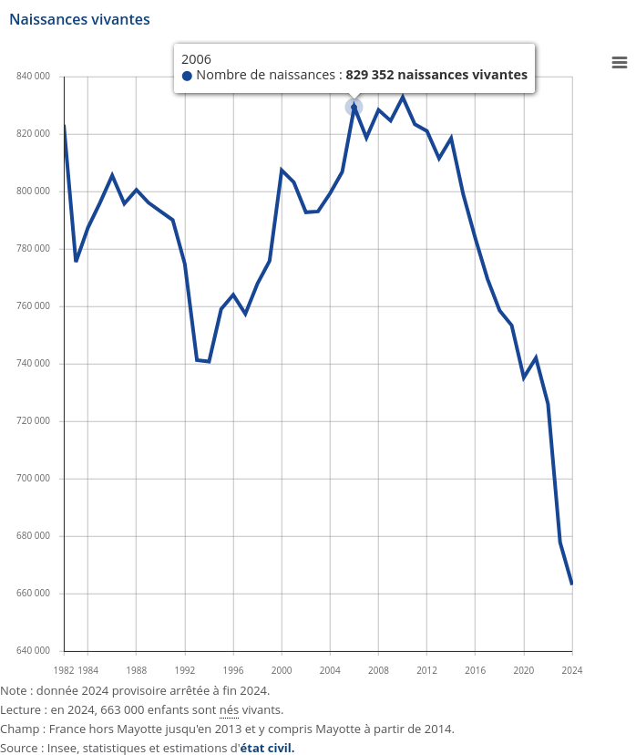
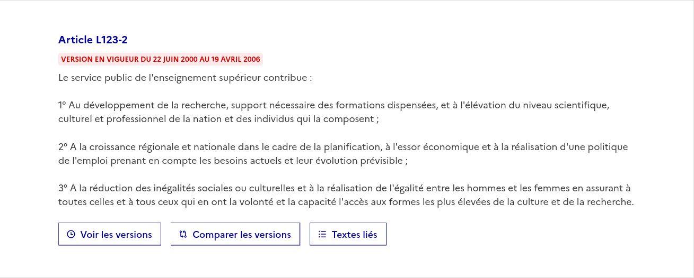
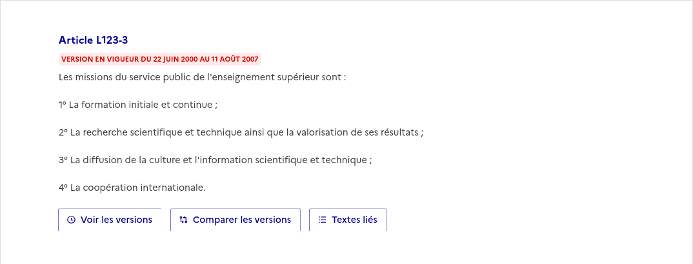
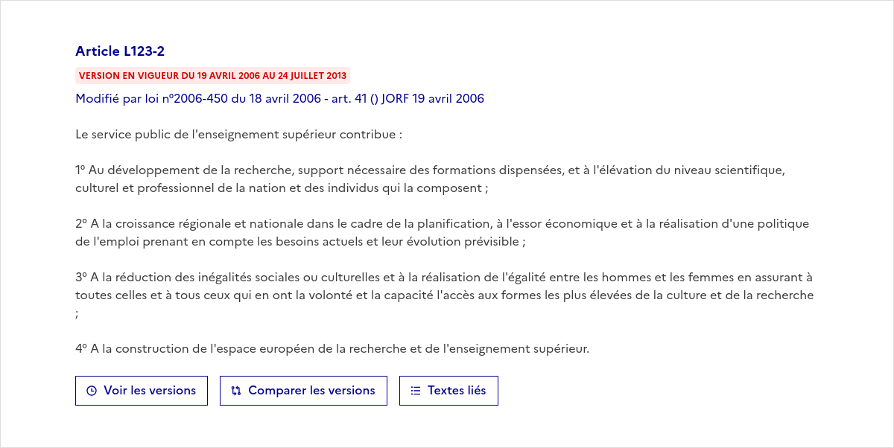
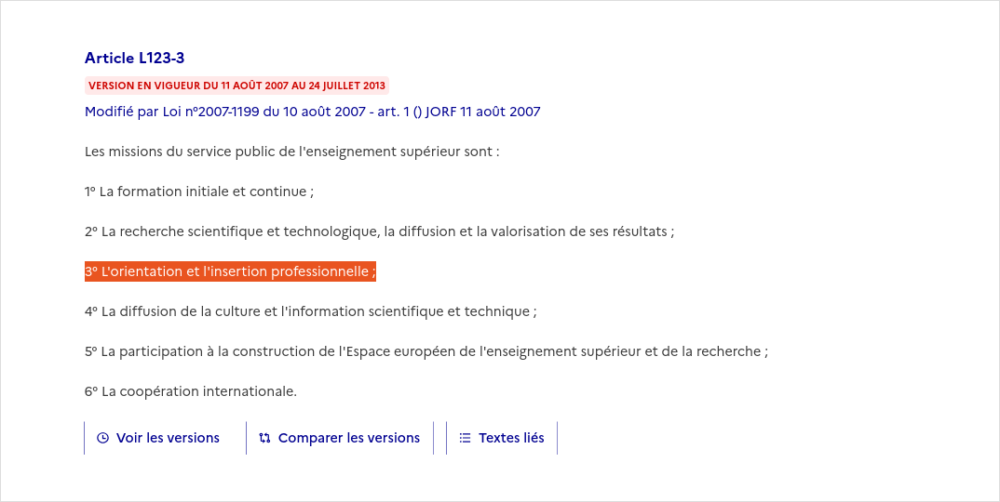
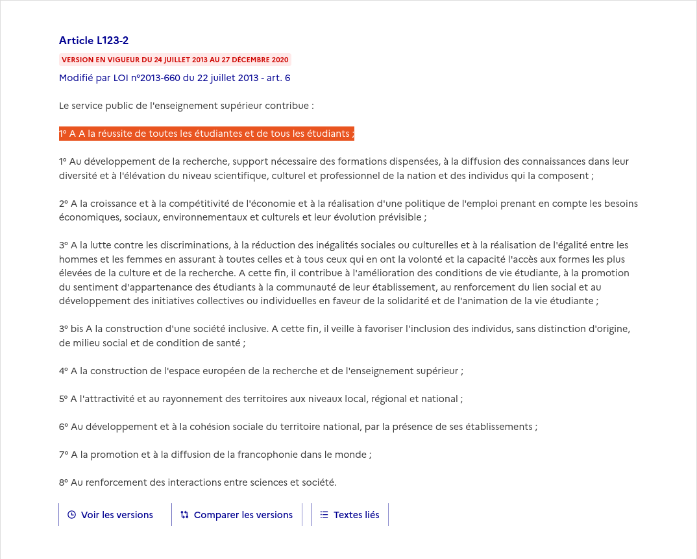
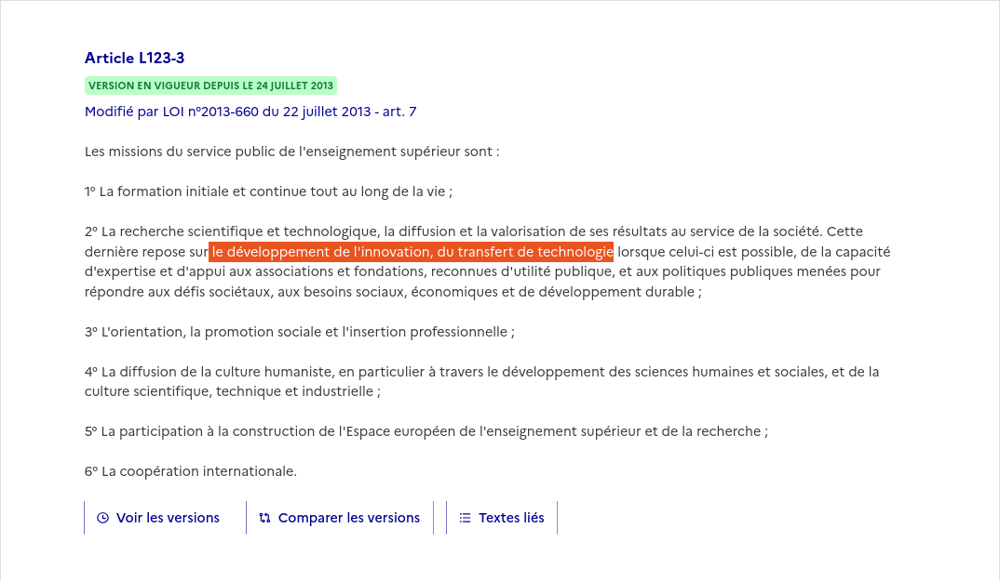
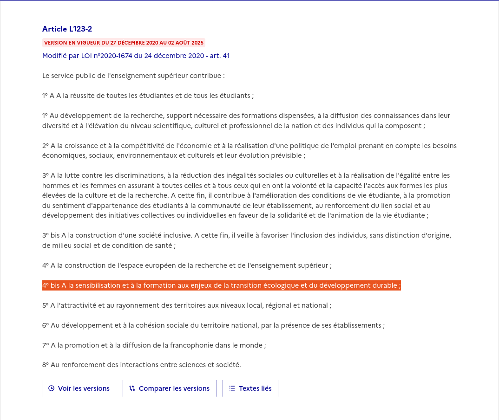
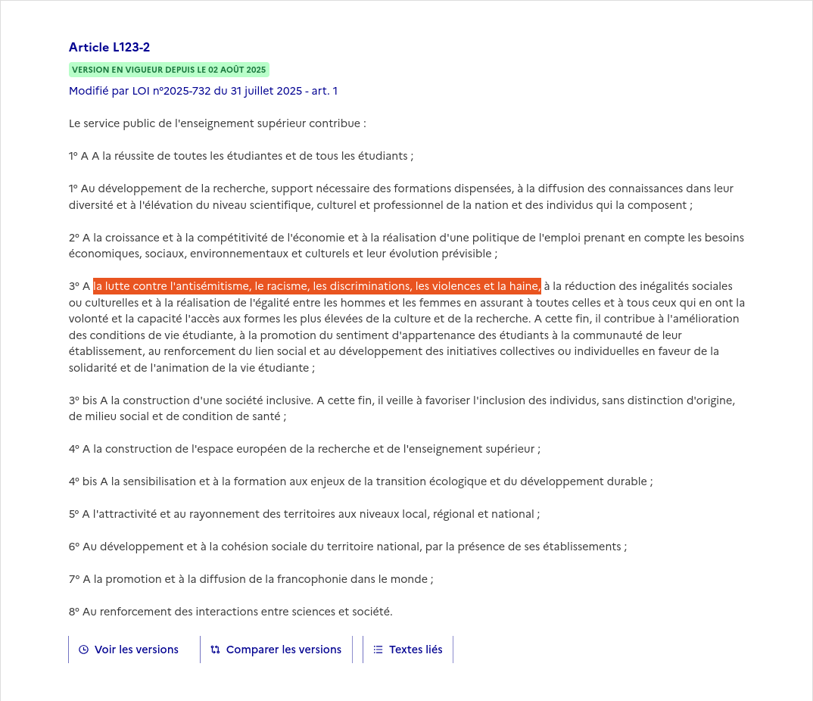
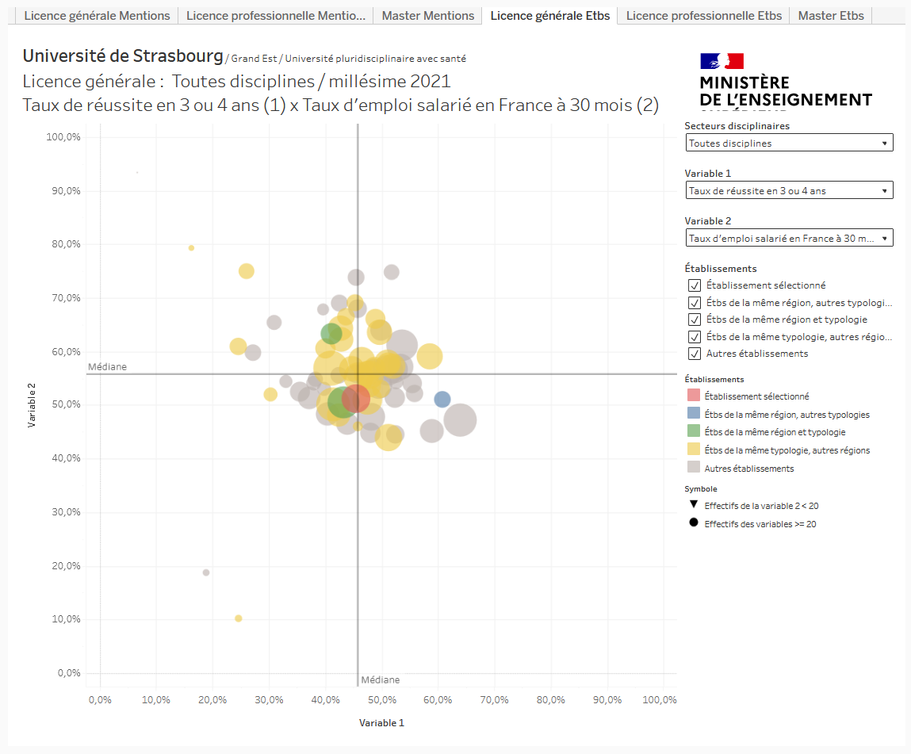

```{r setup, include=FALSE}
knitr::opts_chunk$set(echo = FALSE, warning = FALSE, message = FALSE)
options(dplyr.summarise.inform = FALSE)

knitr::opts_chunk$set(fig.asp=7.5/16, fig.width = 8)

library(tidyverse)
library(ggcpesrthemes)
library(kpiESR)
library(cowplot)

theme_set(theme_cpesr() + theme(legend.position = "right", plot.title = element_text(hjust = 0.5)))

load("../ressources/data/plots.RData")

```

## Un nouveau régime éducatif et scientifique, post-massification.

```{r}
plot_MassificationLong + theme(legend.position="None")
```

## Un nouveau régime éducatif et scientifique, post-massification.

```{r, out.width="40%", fig.align='center'}

```

## Sa principale mission achevée, que deviennent les missions de l'Université ?

Code de l'éducation : L123-2 et L123-3 - 2000

:::::::::::::: {.columns}
::: {.column width="50%"}
```{r, out.width = "100%"}

``` 
:::
::: {.column width="50%"}
```{r, out.width = "100%"}

``` 
:::
:::::::::::::: 


## Sa principale mission achevée, que deviennent les missions de l'Université ?

Code de l'éducation : L123-2 et L123-3 - 2006

:::::::::::::: {.columns}
::: {.column width="50%"}
```{r, out.width = "100%"}

``` 
:::
::: {.column width="50%"}
```{r, out.width = "100%"}

``` 
:::
:::::::::::::: 


## Sa principale mission achevée, que deviennent les missions de l'Université ?

Code de l'éducation : L123-2 et L123-3 - 2007

:::::::::::::: {.columns}
::: {.column width="50%"}
```{r, out.width = "100%"}

``` 
:::
::: {.column width="50%"}
```{r, out.width = "100%"}

``` 
:::
:::::::::::::: 


## Sa principale mission achevée, que deviennent les missions de l'Université ?

Code de l'éducation : L123-2 et L123-3 - 2013

:::::::::::::: {.columns}
::: {.column width="50%"}
```{r, out.width = "100%"}

``` 
:::
::: {.column width="50%"}
```{r, out.width = "100%"}

``` 
:::
:::::::::::::: 


## Sa principale mission achevée, que deviennent les missions de l'Université ?

Code de l'éducation : L123-2 et L123-3 - 2020

:::::::::::::: {.columns}
::: {.column width="50%"}
```{r, out.width = "100%"}

``` 
:::
::: {.column width="50%"}
```{r, out.width = "100%"}

``` 
:::
:::::::::::::: 


## Sa principale mission achevée, que deviennent les missions de l'Université ?

Code de l'éducation : L123-2 et L123-3 - 2025

:::::::::::::: {.columns}
::: {.column width="50%"}
```{r, out.width = "100%"}

``` 
:::
::: {.column width="50%"}
```{r, out.width = "100%"}

``` 
:::
:::::::::::::: 


## Ces missions ne sont pas seulement symboliques : elles légitiment les initiatives et cadrent l’action publique au travers des évaluations.

```{r, out.width = "60%", fig.align='center'}

``` 

## Proposition 

### Première idée : Prioriser
- On ne fait la mission 2. que si la mission 1. est parfaitement effectuée.
- Mauvaise idée à mon avis : priorisation impossible et non contraignante

### Deuxième idée : Simplifier - L123-3 bis

___La mission du service public universitaire est la production et la diffusion de connaissances au bénéfice de toute l'humanité.___

### Avantages : Recentrage et différenciation

- Exclusion des services individuels : réussite, insertion professionnelle...
- Exclusion des services intéressés : innovation purement économiques, pilotage politique 
- Exclusion de la « compétition internationale » et de l'« Excellence »
- Reconfiguration de l'évaluation et du pilotage (plus de Quadrant).


## Proposition 

### Deuxième idée : Simplifier - L123-3 bis

___La mission du service public universitaire est la production et la diffusion de connaissances ayant pour objectif le progrès de toute l’humanité.___

### Questions avec des réponses

- Qui décide ? Les universitaires elleux-mêmes.
- Quel financement ? Gratuité pour les usagers, financement par l'impôt.

### Questions sans réponses

- Devenir des instances internes hors de cette mission ? (Forums, Espaces avenir, IUT...)
- Devenir des instances externes dans cette mission ? (ONR, CNRS, Ecoles...)
- Redistribution et repérimétrage des missions dans tout l'ESR.


## Conclusion

### Deuxième idée : Simplifier - L123-3 bis

___La mission du service public universitaire est la production et la diffusion de connaissances ayant pour objectif le progrès de toute l’humanité.___

### Guide pour les transformations

- Simple, mais très différenciant et potentiellement très transformateur.

### Guide opérationable pendant les réflexions des assises.

- Est-ce bien centré seulement sur la production et la diffusion des connaissances ? 
- Est-ce bien dans l'objectif d'un progrès pour toute l'humanité ?
