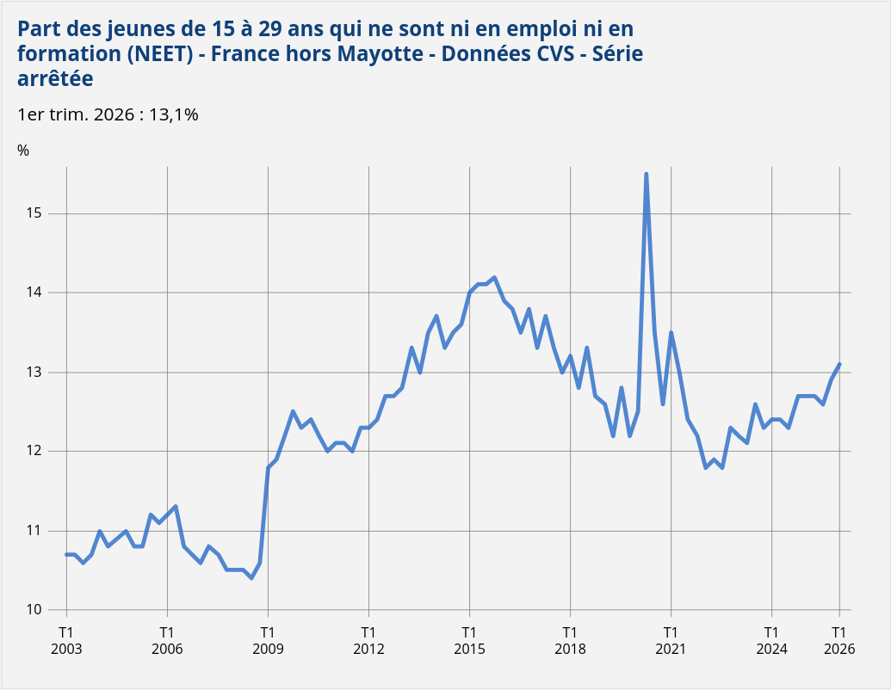

```{r setup, include=FALSE}
knitr::opts_chunk$set(echo = FALSE, warning = FALSE, message = FALSE)
options(dplyr.summarise.inform = FALSE)

knitr::opts_chunk$set(fig.asp=7/16, fig.width = 8)

library(tidyverse)
library(ggcpesrthemes)
library(kpiESR)
library(cowplot)

theme_set(theme_cpesr() + theme(legend.position = "right", plot.title = element_text(hjust = 0.5)))

load("../ressources/data/plots.RData")

```

## Les établissements publics d’enseignement supérieur et de recherche sont volontairement mis en déficit budgétaire par l’Etat, par un transfert de charges

```{r}
plot_SCSPvsMS3
```


## Pendant ce transfert de charges vers le public, l’Etat a transféré les moyens vers le secteur privé, pour la R&D comme pour l'enseignement supérieur


```{r}
plot_depensereformes_mesr
```

## En termes de R&D, les politiques publiques ont échoué à propulser ou même maintenir la place scientifique de la France.

```{r}
plot_dird
```

## En termes de R&D, les politiques publiques ont échoué à propulser ou même maintenir la place scientifique de la France, y compris face aux GAFAMs

```{r}
plot_gafam
```


## En termes d’enseignement supérieur, les politiques publiques ont échoué à améliorer l’insertion professionnelle des jeunes

```{r, out.width="50%", fig.align='center'}

```

\footnotesize
Source : https://www.insee.fr/fr/statistiques/serie/010752067#Graphique


## Conclusion

La politique publique de transfert de charges au secteur public et de transfert de financement au secteur privé n'a pas atteint les objectifs qu'elle s'était fixée :

- Pas de décollage de la R&D grâce au CIR / BPI France
- Pas d'amélioration de l'insertion professionnelle grâce au développement du secteur privé

### Entrée dans un nouveau contexte scientifique mondial 

- À l'est, l'essort fulgurant de la Chine et de l'Inde.
- À l'ouest, l'essort des grandes entreprises.
- En occident, toutes les universités en crise.

### Assises pour l'Université et pour la Recherche

- Dessiner ensemble un avenir souhaitable à un horizon de dix à vingt ans. 
- Tracer, à rebours, la trajectoire stratégique permettant de relier cet horizon idéal à notre présent.


