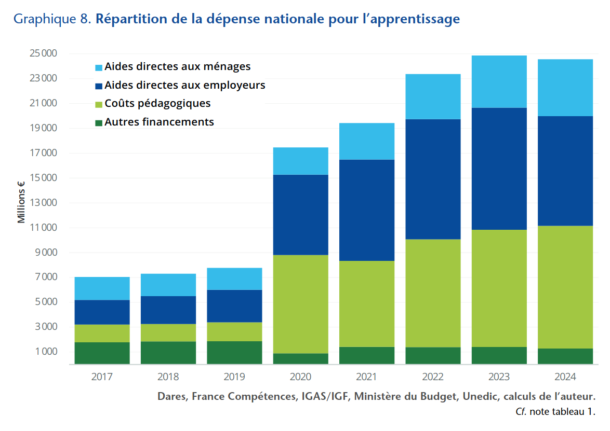
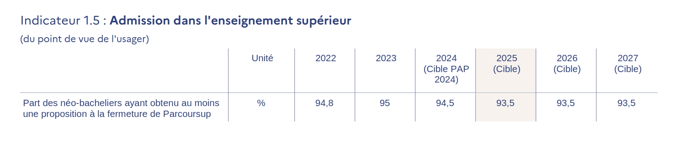

```{r setup, include=FALSE}
knitr::opts_chunk$set(echo = FALSE, warning = FALSE, message = FALSE)
options(dplyr.summarise.inform = FALSE)

knitr::opts_chunk$set(fig.asp=7.5/16, fig.width = 8)

library(tidyverse)
library(ggcpesrthemes)
library(kpiESR)
library(cowplot)

theme_set(theme_cpesr() + theme(legend.position = "right", plot.title = element_text(hjust = 0.5)))

#source("tdbesr-plots.R")
source("../ressources/data/BL/BLViz-map.R",chdir = TRUE)
load("../ressources/data/plots.RData")

```

## A quoi servait l'Enseignement supérieur ?

### Base théorique

#### Des conceptions (plus ou moins conflictuelles) :

- Dimension invividuelle vs. collective
- Dimension économique vs. citoyenne
- Dimension investissement vs. dépense
- __Massification vs. démocratisation__
\newline

__Quel est le retour sur investissement/rendement de l'enseignement supérieur ?__


#### Deux théories économiques (et beaucoup de croyance)

- Théorie du capital humain (Gary Becker, « Human Capital », 1964)
- Théorie du signal (Michael Spence, « Market Signaling » 1973)


### Massification de l'enseignement supérieur : Illusion démographique

```{r}
plot_MassificationRecent
```


### Massification de l'enseignement supérieur : réalité

```{r}
plot_MassificationLong
```


### Massification de l'enseignement supérieur : investissement

```{r, out.width = "65%", fig.align='center'}
knitr::include_graphics("../ressources/img/NSP-campus.png")
``` 


### Massification de l'enseignement supérieur : Formidable réussite

```{r, out.width = "95%", fig.align='center'}
plot_stratification_continu
``` 

### Massification de l'enseignement supérieur : Inversion de la strtification éducative

```{r, out.width = "95%", fig.align='center'}
plot_stratification_ponctuel
``` 


## A quoi sert l'enseignement supérieur ?

### Quelle est la valeur des diplômes ? (donc le rôle de l'ES)

```{r, out.width = "95%", fig.align='center'}
plot_stratification_ponctuel
``` 


### Missions officielles : une inflation incontrôlée. 

:::::::::::::: {.columns}
::: {.column width="50%"}

\centering 2000

```{r, out.width = "100%"}
knitr::include_graphics("../ressources/img/CodeEduc-L123-2-2000.png")
``` 

:::
::: {.column width="50%"}

\centering 2025

```{r, out.width = "100%"}
knitr::include_graphics("../ressources/img/CodeEduc-L123-2-2025.png")
``` 

:::
:::::::::::::: 

### Missions réelles : Insertion professionnelle (et Réussite étudiante)

```{r, out.width = "60%", fig.align="center"}
knitr::include_graphics("../ressources/img/SIES-Quadrant.png")
``` 

### Missions réelles : Insertion professionnelle (et Réussite étudiante)

```{r, out.width = "95%", fig.align='center'}
plot_bmo
``` 


### Investissement dans l'ESR (P150 / nombre total d'étudiants)

```{r, out.width="55%", fig.align="center"}
knitr::include_graphics("../ressources/img/budgetparetu.png")
```

Pour une année-étudiant : si 5 k€ en 2009, 4 k€ en 2025.

\footnotesize
Source : Lucas Chancel, Sciences Po, https://lucaschancel.com/etudiants/


### Productivité de l'ESR (nombre total d'étudiants / P150)

```{r, out.width="55%", fig.align="center"}
knitr::include_graphics("../ressources/img/budgetparetu-flip.png")
```

Pour 1 M€ : si 200 années-étudiant en 2009, 250 années-étudiant en 2025.

\footnotesize
Source : Lucas Chancel, Sciences Po, https://lucaschancel.com/etudiants/


### Développement du privé (sans cahier des charges ni contrôle)

```{r, out.width = "77%", fig.align='center'}
knitr::include_graphics("../ressources/img/EESR-effectifs.png")
``` 

\footnotesize
Source : EESR, SIES, https://publication.enseignementsup-recherche.gouv.fr/eesr/FR/T764/les_etudiants_dans_les_filieres_de_formation_depuis_1960_croissance_et_diversification/

### Développement du privé (sans cahier des charges ni contrôle)

```{r, out.width = "62%", fig.align='center'}

``` 

\footnotesize
Source : Bruno COQUET, OFCE, https://www.ofce.sciences-po.fr/pdf/pbrief/2024/OFCEpbrief135.pdf


## A quoi servira l'Enseignement supérieur ? \newline Un tripe moment civilisationnel

### 1. Après la stagnation éducative, la décroissance est possible

```{r, out.width="80%", fig.align="center"}
knitr::include_graphics("../ressources/img/OWD-tertiary.png")
```

\footnotesize
Source : OurWordInData, https://ourworldindata.org/grapher/gross-enrollment-ratio-in-tertiary-education?tab=line

### 2. La démographie a toujours raison

```{r, out.width="40%", fig.align="center"}
knitr::include_graphics("../ressources/img/INSEE-naissances.png")
```

\footnotesize
Source : INSEE https://www.insee.fr/fr/statistiques/2381380

### 2. La démographie a toujours raison

```{r, fig.align="center", out.width="100%"}
load("../ressources/data/predictions.RData")
predictions
```

### 2. La démographie a toujours raison : un choix politique

```{r, out.width="70%", fig.align="center"}
knitr::include_graphics("../ressources/img/IPP-tailleclasses.png")
```

\footnotesize
Source : IPP, Taille des classes et inégalités territoriales : quelle stratégie face à la baisse démographique ?
https://www.ipp.eu/publication/taille-des-classes-et-inegalites-territoriales-quelle-strategie-face-a-la-baisse-demographique/

### 3. Développement rapide de l'edu-scepticisme

:::::::::::::: {.columns}
::: {.column width="50%"}
```{r, out.width="60%", fig.align="center"}
knitr::include_graphics("../ressources/img/eduscepticisme-LAOB.png")
```
:::
::: {.column width="50%"}
```{r, out.width="80%", fig.align="center"}
knitr::include_graphics("../ressources/img/eduscepticisme-NP.jpg")
```
:::
:::::::::::::: 

### 3. Développement rapide de l'edu-scepticisme

```{r, out.width="80%", fig.align="center"}
knitr::include_graphics("../ressources/img/eduscepticisme-JDV.jpeg")
```

### 3. Développement rapide de l'edu-scepticisme

```{r, out.width="100%", fig.align="center"}
knitr::include_graphics("../ressources/img/eduscepticisme-FV.png")
```

### 3. Développement rapide de l'edu-scepticisme

```{r, out.width="100%", fig.align="center"}
knitr::include_graphics("../ressources/img/eduscepticisme-renaissance.png")
```

\footnotesize
Source: Renaissance/LREM, « Un choc des savoirs pour l'enseignement supérieur et la formation », Pour une nouvelle donne économique et climatique, 2025
https://doc.parti.re/Conventions-thematiques_Nouvelle-donne.pdf

### 3. Développement rapide de l'edu-scepticisme

- 80% d'une classe d'âge au Bac
- 50% d'une classe d'âge diplômée du supérieur


```{r, out.width="100%", fig.align="center"}

```

\tiny

Source : Projet annuel de performances PLF 2025 https://www.budget.gouv.fr/documentation/documents-budgetaires/exercice-2025/projet-loi-finances-les/budget-general-plf-13


### 3. Développement rapide de l'edu-scepticisme

```{r, out.width="60%", fig.align="center"}
knitr::include_graphics("../ressources/img/eduscepticisme-uniworth.png")
```

\footnotesize
Source : David Willetts, 2025, Are universities worth it? 
https://www.kcl.ac.uk/policy-institute/assets/are-universities-worth-it.pdf

### 3. Développement rapide de l'edu-scepticisme

```{r, out.width="60%", fig.align="center"}
knitr::include_graphics("../ressources/img/eduscepticisme-uniworth-plot.png")
```

\footnotesize
Source : David Willetts, 2025, Are universities worth it? 
https://www.kcl.ac.uk/policy-institute/assets/are-universities-worth-it.pdf


### Triple moment-pivot (civilisationnel ?)

- Fin de la massification / début de stagnation éducative
- Chute impressionnante et durable de la démographie
- Développement rapide de l'édu-scepticisme

#### Soit vers la fin du service public d'ES(R)

  - Individualisation et pure professionalisation des études
  - COMP100% + Modèle économique basé sur les frais d'inscription
  - De nombreuses fermetures (régulation d'un marché dysfonctionnel)

#### Soit vers une redéfinition du rôle du service public d'ES(R)
  - Notion de progrès collectif ?
  - Comment faire face aux grands défis ?
  - Abandonner complètement l'insertion professionnelle dans une partie du système.


### Etat des lieux : SCSP vs. Ressources propres

```{r, fig.asp=7/16, fig.width=7, out.width="95%", fig.align='center'}
plot_RessourcesPropres
```

Plus les filliales (fondations, filiales commerciales, écosystème start-ups, etc.).


### Etat des lieux : SCSP vs. dépenses de personnel

```{r, fig.asp=7.5/16, out.width="100%"}
plot_SCSPvsMS
```


### Perspective actuelle : réduire le volume de service

```{r, out.width = "70%", fig.align='center'}
knitr::include_graphics("../ressources/img/Presse-IP-EMacron.png")
``` 

```{r, out.width = "70%", fig.align='center'}
knitr::include_graphics("../ressources/img/Presse-Recherche-EMacron.png")
``` 

- Emmanuel Macron, Présidence de la République, 2023

\tiny
https://www.aefinfo.fr/depeche/698571-pour-etre-plus-efficace-l-universite-doit-faire-davantage-contribuer-ceux-qui-ont-le-plus-de-moyens-emmanuel-macron \newline
https://www.elysee.fr/front/pdf/elysee-module-22053-fr.pdf

### COMP100% : pour augmenter la performance ?

- Principe : conditionner 100% de la SCSP à la « performance »
  - __Notion de « performance » non consensuelle, polymorphe et mutable__
  - Extrêmement risqué dans des mains extrêmes.
- Conditionner y compris le traitement des fonctionnaires 
  - __Pas de transformation stratégique sans licenciements économiques__
  - Nécessite une réforme statutaire d'ampleur, énorme risque pour l'attractivité
- Conditionner y compris les performances cœur de métier 
  - Réussite, Insertion professionnelle (et production scientifique ?) 
  - Calculées par des outils administratifs : InserSup, Fresq, Quadrant, (HAL, OpenAlex), ...
  - __Voué à l'échec : Loi de Goodhart__
  
#### Loi de Goodhart

__« Quand une mesure devient un objectif, elle cesse d'être une bonne mesure »__

- Taux de réussite : On ne va pas mieux enseigner, mais seulement mieux noter.
- Production scientifique : On ne va pas mieux chercher, mais seulement plus publier.


### La valeur des diplômes en question

« Réussite » vs. « exigence » / Capital humain vs. Signal 

```{r, fig.asp=7/16, fig.width=7, out.width="100%", fig.align='center'}
plot_LvsM
```


### Objectifs de la nation : « Excellence scientifique »


```{r, out.width="100%", fig.align="center", fig.show='hold'}
  knitr::include_graphics("../ressources/img/PAP-172-2025.jpeg")
```

\tiny
Source : Projet annuel de performances PLF 2025 https://www.budget.gouv.fr/documentation/documents-budgetaires/exercice-2025


### Discours : Réussite vs. Exigence


:::::::::::::: {.columns}
::: {.column width="60%"}

```{r, out.width = "100%"}
knitr::include_graphics("../ressources/img/Presse-LM-ASBarthez.png")
``` 

- Anne-Sophie Bartez, DGESIP, 2019
- Frédérique Vidal, MESR, 2021
\vfill

\tiny
https://www.aefinfo.fr/depeche/616359

https://www.lefigaro.fr/actualite-france/frederique-vidal-l-enjeu-est-de-preserver-le-taux-d-insertion-professionnelle-20210921

:::
::: {.column width="40%"}

```{r, out.width = "100%"}

``` 

:::
:::::::::::::: 


### Discours : Public/Privé - Qualité

```{r, out.width = "70%", fig.align='center'}
knitr::include_graphics("../ressources/img/Presse-Privé-TCoulhon.png")
``` 

- Thierry Coulhon, Hcéres et Anne-Sophie Barthez, DGESIP, 31/03/2023

\tiny
https://www.aefinfo.fr/depeche/690094-prive-lucratif-nous-n-opposons-aucune-categorie-d-etablissement-a-s-barthez-dgesip


### Discours : Rémunérations vs. dotation

```{r, out.width = "75%", fig.align='center'}
knitr::include_graphics("../ressources/img/SR-SCSPMS.png")
``` 

- Sylvie Retailleau, Ministre ESR en 2023

\tiny
Question orale n°0915S « Situation budgétaire des universités et particulièrement de Le Mans Université »

https://www.senat.fr/questions/base/2023/qSEQ23110915S.html


