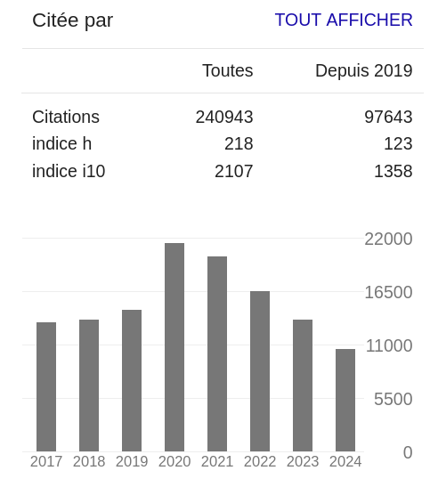

```{r setup, include=FALSE}
knitr::opts_chunk$set(echo = FALSE)
```

## Introduction

A la base, l'évaluation sert à la production de connaissances

- _Disputatio_ : débat entre deux personnes 
  - pour tester et affiner les arguments
- _Peer review_ : évaluation par les pairs
  - pour vérifier la conformité à des normes scientifiques (publication)

### Trop limité pour _manager_ la science

Apparition depuis une vingtaine d'années de nouveaux outils bibliométriques

- Pour évaluer les nations
- Pour évaluer les institutions
- Pour évaluer les chercheurs


# Evaluer la production scientifique des nations

## Evaluer la production scientifique des nations

:::::: {.cols data-latex=""}
::: {.col data-latex="{0.64\textwidth}"}
- Développement d'indicateurs de production scientifique
  - Part de la DIRD(A/E) dans le PIB
  - Nombre de brevets
  - Nombre de publications scientifiques
  
- Développement de grandes bases de données mondiales
  - Notamment par les éditeurs scientifiques

- Effets principaux
  - Politiques d'investissements
  - Politiques d'incitations
  - Politiques de restructurations
  
:::
::: {.col data-latex="{0.01\textwidth}"}
\ 
:::
::: {.col data-latex="{0.35\textwidth}"}
\
:::
::::::

## La grande course scientifique des nations (OST)

```{r out.height="70%", fig.align="center"}

```

\tiny
https://www.hceres.fr/sites/default/files/media/downloads/hceres_ost_dynamics_scientific_production_world_europe_france_june2019.pdf


## La grande course scientifique des nations (Nature-Index)

```{r out.height="70%", fig.align="center"}

```

\tiny 
https://www.nature.com/nature-index/research-leaders/2024/country/all/all

## Le cas de la Chine : incitations

```{r out.height="70%", fig.align='center'}

```

\tiny
Quan, Wei, Bikun Chen, et Fei Shu. « Publish or impoverish: An investigation of the monetary reward system of science in China (1999-2016) ». Aslib Journal of Information Management 69, n5 (18 septembre 2017): 486‑502. https://doi.org/10.1108/AJIM-01-2017-0014.


## Le cas de la Chine : investissements

```{r out.height="70%", fig.align="center"}

```

\tiny
Quan, Wei, Bikun Chen, et Fei Shu. « Publish or impoverish: An investigation of the monetary reward system of science in China (1999-2016) ». Aslib Journal of Information Management 69, n5 (18 septembre 2017): 486‑502. https://doi.org/10.1108/AJIM-01-2017-0014.


## Le cas de l'Italie : chanstique

```{r out.height="70%", fig.align="center"}

```

\tiny
https://www.lemonde.fr/blog/huet/2019/09/25/recherche-scientifique-le-faux-miracle-italien/

## Le cas de la France : restructurations + « Excellence »

:::::: {.cols data-latex=""}
::: {.col data-latex="{0.45\textwidth}"}
\
:::
::: {.col data-latex="{0.2\textwidth}"}
\ 
:::
::: {.col data-latex="{0.35\textwidth}"}
\
:::
::::::

\tiny
https://www.university-mergers.eu/
https://www.eua.eu/downloads/publications/eua%20merger%20brief%202904.pdf

## Le cas de la France : Projet annuel de performances (PAP - PLF2025)

```{r out.height="70%", fig.align="center"}

```

\tiny
https://www.budget.gouv.fr/documentation/file-download/24767

## Le cas de la France : Projet annuel de performances (PAP - PLF2024)

```{r out.height="70%", fig.align="center"}

```


# Evaluer la production scientifique des institutions

## Evaluer la production scientifique des institutions

:::::: {.cols data-latex=""}
::: {.col data-latex="{0.64\textwidth}"}

- Différents outils
  - SIGAPS (CHU, 2007) 
    - Système d’interrogation, de gestion et d’analyse des publications scientifiques
    - Comment affecter les moyens ?
  - AERES/HCERES (2006)
    - Haute Commission de l'évaluation de la recherche et de l'enseignement supérieur
    - Comment améliorer la qualité ?
  - Classements internationaux (2003)
    - Où envoyer les étudiants et qui imiter ?

- Diversification des classements
  - _Classement de Shangai_ (ARWU, 2003)
  - THE, QS, CWUR, etc.
  - Développement de classements thématiques

- Effet principal
  - Politiques d'incitation (Italie/Chine)
  - Isomorphisme (France)

:::
::: {.col data-latex="{0.01\textwidth}"}
\ 
:::
::: {.col data-latex="{0.35\textwidth}"}
\
:::
::::::

## Isomorphisme

```{r out.height="70%", fig.align="center"}

```

## Isomorphisme

```{r out.height="70%", fig.align="center"}

```


## ARWU vs. Unistra (2012 : 102-150)

```{r out.height="70%", fig.align="center"}

```

## ARWU vs. Unistra (2013 : 97)

```{r out.height="70%", fig.align='center'}

```

## ARWU vs. Unistra (2016 : 102-150)

```{r out.height="70%", fig.align="center"}

```

## ARWU vs. Unistra (2017 : 102-150)

```{r out.height="70%", fig.align="center"}

```

## ARWU vs. Unistra (2017 : 102-150)

```{r out.height="70%", fig.align="center"}

```

## ARWU vs. Unistra (2024 : 102-150)

```{r out.height="70%", fig.align="center"}

```

## ARWU vs. Unistra (2024)

```{r out.height="70%", fig.align="center"}

```

## ARWU vs. Unistra (en fait)

```{r out.height="70%", fig.align="center"}

```

## ARWU (au final)

```{r out.height="70%", fig.align="center"}

```


# Evaluer la production scientifique des chercheurs

## Evaluer la production scientifique des chercheurs

:::::: {.cols data-latex=""}
::: {.col data-latex="{0.64\textwidth}"}
- Développement d'_index_ (donc pour _indexer_)
  - _h-index_ (Hirsch, 2005)
    - nombre d'articles H cité au moins H fois chacun
  - _g-index_ (Egghe, 2006)
    - nombre d'articles H cité au moins H² fois chacun
  - _i10-index_ (Google Scholar)
    - nombre d'articles cités au moins 10 fois
  
- Développement d'outils, plus ou moins publics
  - Google Scholar, Web of Science, Scopus, etc.

- Effets principaux
  - Inflation du nombre de publications
  - _Publish or perish_ (Case, 1928)


:::
::: {.col data-latex="{0.01\textwidth}"}
\ 
:::
::: {.col data-latex="{0.35\textwidth}"}
\
:::
::::::

## Inflation du nombre de publications

```{r out.height="70%", fig.align="center"}

```

https://predatory-publishing.com/an-analysis-of-the-number-of-special-issues-from-mdpi/


## _Publish or Perish_

:::::: {.cols data-latex=""}
::: {.col data-latex="{0.35\textwidth}"}
Albert Einstein (300 publications)

\
:::
::: {.col data-latex="{0.30\textwidth}"}
\ 
:::
::: {.col data-latex="{0.35\textwidth}"}
Didier Raoult (3500 publications)

\
:::
::::::

## _Publish or Perish_


\

Différentes techniques de chanstique :

- « Stratégie de publication » (« Saucissonage »)
- Auto-publication / Auto-citation / Détournement du peer-review
- Exagération des résultats / Fabrication de preuves


\tiny
https://www.sciencepresse.qc.ca/actualite/2023/11/02/retractations-didier-raoult

## _Publish or Perish_

:::::: {.cols data-latex=""}
::: {.col data-latex="{0.45\textwidth}"}
\
:::
::: {.col data-latex="{0.10\textwidth}"}
\ 
:::
::: {.col data-latex="{0.45\textwidth}"}
\
:::
::::::

\tiny
https://theconversation.com/paper-mills-the-cartel-like-companies-behind-fraudulent-scientific-journals-230124 \\\\
https://www.nature.com/articles/d41586-024-01672-7


# Conclusion

## Conclusion 

- Beaucoup d'effets pervers et peu d'effets positifs sur la production scientifique

- Deux problèmes fondamentaux

### Loi de Goodhart

« _Lorsqu'une mesure devient un objectif, elle cesse d'être une bonne mesure._ »

### Effet Matthieu

« _Car on donnera à celui qui a, et il sera dans l'abondance, mais à celui qui n'a pas on ôtera même ce qu'il a._ » - Matthieu 13:10-19.

### Au final : développement récent, dérapage rapide

- Production scientifique mondiale sans doute en danger.
- Besoin d'inventer de nouveaux modèles de production scientifique.

