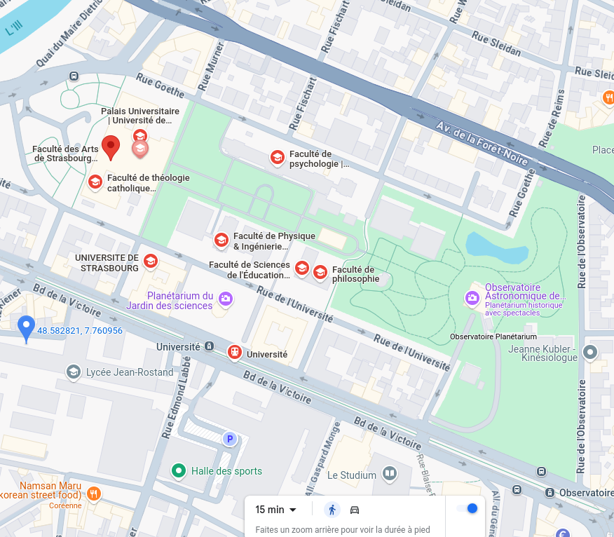

```{r setup, include=FALSE}
knitr::opts_chunk$set(echo = FALSE, warning = FALSE, message = FALSE)
options(dplyr.summarise.inform = FALSE)
knitr::opts_chunk$set(fig.width = 6, fig.height = 4, fig.align = "center", out.width="100%", fig.retina = 2)

knitr::opts_chunk$set(pdf.options(encoding = "CP1250"))
#knitr::opts_chunk$set(dev = "cairo_pdf")


library(tidyverse)
library(ggcpesrthemes)

library(kpiESR)
library(cowplot)

theme_set(theme_cpesr())
theme_cpesr_setup(authors = "Julien Gossa", source = "https://github.com/cpesr/RFC/")
```

## Deux modèles d'établissements

- Modèle Universitaire
  - Toutes les disciplines au même endroit
- Modèle Facultaire (Tour d'ivoire)
  - Chaque discipline dans un établissement différent
  - Collégialité interne proche d'une démocratie directe
  
:::::: {.cols data-latex=""}
::: {.col data-latex="{0.45\textwidth}"}

:::
::: {.col data-latex="{0.1\textwidth}"}
\ 
:::
::: {.col data-latex="{0.45\textwidth}"}

:::
::::::

## Trois modèles d'organisation

:::::: {.cols data-latex=""}
::: {.col data-latex="{0.60\textwidth}"}

- Modèle PI (_Principal Investigator_)
  - Un « génie » + des « esclaves »
- Modèle par équipe
  - Travail en groupe, avec moindre hiérarchie
- Modèle troupeau de chats (_Herd of Cats_)
  - Des individus indépendants

:::
::: {.col data-latex="{0.4\textwidth}"}

:::
::::::

## Trois modèles de carrière

- Modèle du survivant
  - Beaucoup de précaires, accès tardif et rare à la titularisation
- Modèle à tenure
  - Mise à l'épreuve avant titularisation (_tenure track_)
- Modèle pyramidal
  - Titularisation au plus tôt (MCF), mais deuxième étage (PR)

```{r, out.height="60%", fig.align="center"}

```

## Historiquement en France

- Modèle facultaire 
- Troupeau de chats
- Pyramidal

### Question 1

Comment contrôler/diriger/gouverner/piloter l'activité de recherche ?

## Recherche par mission

- Principe : 
  - Au lieu de financer des établissements/équipes/individus, on finance des missions
  - Les missions ont un ou des objectifs, et une temporalité
  
- Avantage :
  - Au lieu de contrôler les individus, on contrôle les missions
  
- Opportunité : 
  - Echec de la loi autonomie de 2004
  - Les Etats Généraux de la Recherche
    - Appellent à un investissement massif
    - Proposent le principe d'une agence pour « dynamiser » la recherche

## PIA : Programme d'Investissement d'Avenir

- Créé en 2009
- 77 Md€ : 35 Md€ (PIA 1), 12 Md€ (PIA 2), 10 Md€ (PIA 3) et 20 Md€ (PIA 4)

« Le Programme d’investissements d’avenir (PIA), piloté par le Secrétariat général pour l’investissement (SGPI), a été mis en place par l’État pour __financer des investissements innovants et prometteurs__ sur le territoire, afin de permettre à la France __d’augmenter son potentiel de croissance et d’emplois.__ »^[https://www.info.gouv.fr/actualite/le-programme-d-investissements-d-avenir] (je mets en gras)
  
## ANR : Agence Nationale de la Recherche

« L’ANR a été créée en 2005 pour __promouvoir la recherche française sur projets__, et pour __stimuler l’innovation__ en favorisant l’émergence de projets collaboratifs pluridisciplinaires et en encourageant les collaborations « publics-privés ». Il s’agit également de __renforcer le positionnement de la recherche française__ au niveau européen et mondial. »^[https://anr.fr/fr/lanr/nous-connaitre/missions/] (gras d'origine)

- Objectif de 1 Md€ de budget

## ANR : Agence Nationale de la Recherche


## ANR : Agence Nationale de la Recherche


## ANR : Agence Nationale de la Recherche

```{r, out.height="90%", fig.align="center"}

```

## Effets sur les carrières 

:::::: {.cols data-latex=""}
::: {.col data-latex="{0.6\textwidth}"}

- Normes exogènes à la recherche (Budgets prévisionnels, GANTT, « retombées socio-économiques », etc.) 
  - Sorte de professionalisation des répondants
  - Montage de « Pôle unique d'ingénieurie »

- Besoin de temps 
  - Chercheurs vs. Enseignants-Chercheurs
  - Différenciation au plus tôt

- « Financements compétitifs »
  - Biais habituels, dont de genre^[https://shs.cairn.info/revue-travail-genre-et-societes-2024-1-page-167?lang=fr]

:::
::: {.col data-latex="{0.4\textwidth}"}
  
```{r, out.width="100%", fig.align="center"}

```

```{r, out.width="100%", fig.align="center"}

```
 
:::
::::::


## Effets sur les disciplines (SHS vs. STEM)

```{r, out.height="70%", fig.align="center"}

```


Rapport groupe de travail 1 pour la LPPR^[https://www.enseignementsup-recherche.gouv.fr/sites/default/files/content_migration/document/RAPPORT_FINAL_GT1_-_Financement_de_la_recherche_1178459.pdf]

## Effets sur les établissements

- Equilibre des budgets récurrents / financement par mission

```{r, out.height="70%", fig.align="center"}
kpiESR::kpiesr_plot_line("Ensemble", c("kpi.FIN.S.SCSP","kpi.FIN.S.recettesRecherche"), val = "evolution") + scale_x_continuous(breaks = seq(2013, 2021, 2), limits = c(2013, 2021))
```

### Problème

- Ces projets coûtent aux établissements (« frais d'environnement »).
- Montée en puissance des « préciputs » (Vidal, LPPR)

## Effets sur les établissements : préciputs

```{r, out.height="80%", fig.align="center"}

```

## Effets sur les établissements : préciputs (effet différenciant)

```{r, out.height="80%", fig.align="center"}

```

## Effets sur la recherche : Quel coût ?

- Cout de réponse évalué à 23 jours-chercheurs / 10k€ en moyenne

```{r, out.height="65%", fig.align="center"}

```
\footnotesize
Sénat, rapport d'information sur l’Agence nationale de la recherche (ANR) et le financement de la recherche sur projets
– https://www.senat.fr/rap/r16-684/r16-6841.pdf


## Effets sur la recherche : Quelle efficacité ?

- Taux de succès très bas : sélection random

```{r, out.height="65%", fig.align="center"}

```
\footnotesize
Sénat, rapport d'information sur l’Agence nationale de la recherche (ANR) et le financement de la recherche sur projets
– https://www.senat.fr/rap/r16-684/r16-6841.pdf

## Effets sur la recherche : Quelle efficacité ? (Covid)

```{r, out.height="70%", fig.align="center"}

```


\footnotesize
Coronavirus : le cri de colère d’un chercheur du CNRS. Bruno Canard, 2020.
– https://mrmondialisation.org/coronavirus-le-cri-de-colere-dun-chercheur-du-cnrs/

## Effets sur la recherche : Quelle efficacité ? (Covid)

```{r, out.height="70%", fig.align="center"}

```

\footnotesize
Le financement de la recherche publique dans la lutte contre la pandémie de Covid-19, Cour des comptes, 2021
– https://www.ccomptes.fr/fr/publications/le-financement-de-la-recherche-publique-dans-la-lutte-contre-la-pandemie-de-covid-19


## Effets sur la recherche : Quel rapport cout/efficacité ?

- « L'ANR : __une ambition à retrouver__ pour le financement de la recherche sur projets »
  - Rapport de la commission des finances du Sénat, 2016

- « Le PIA,  un outil à préserver,  __une ambition à refonder__ »
  - Comité de surveillance des investissements d’avenir, 2019

- « Le CNESER recommande que soit menée une étude dans tous les établissements pour __évaluer les coûts indirects et cachés__ des systèmes de financement par appel à projet. »
  - Financement de la recherche publique par appels à projets, CNESER, 2019
  
- « le __retard de réalisation et de diffusion d’études d’impact__ transverses sont regrettables. En effet, l’évaluation de 2012 avait déjà relevé le caractère prioritaire de ce chantier, lancé alors depuis cinq ans. »
  - Rapport d'évaluation de l'ANR, Hcéres, 2019
  
- « __Do Grant Proposal Texts Matter for Funding Decisions?__ » (spoiler : non)
  - Simsek, Müge, Mathijs de Vaan, et Arnout van de Rijt, 2024

- Et bien sûr, les multiples rapports soutenant les réformes...

## La recherche à mission fait tâche d'huile... Et une défiance nouvelle

- Démultiplication tous les niveaux
  - Européen : H2020, Horizon Europe, ERC
  - Territorial : Régions, Départements, Municipalités
  - Etablissement : IDEx, etc.

- Réduction des outils disponibles
  - Opérateurs de recherche vs. agences de moyens vs. agences de programme (LPR)

- Défiance nouvelle envers la « bureaucratie » (de la part des bureaucrates)
  - PEPR : 3 Md€ pour 36 programmes
  - Néo-mandarinat

```{r, out.height="60%", fig.align="center"}

```

## Qui contrôle l'ANR ?

« La loi de programmation de la recherche devrait être l’occasion de réfléchir à une augmentation des moyens consacrés à des programmes de recherche publique __en contrepartie de leur orientation vers un développement industriel précis.__ » 

– Bruno Le Maire, ministre de l’Economie et des Finances, 15 octobre 2019

```{r, out.height="60%", fig.align="center"}

```


https://www.vie-publique.fr/en-bref/273289-pacte-productif-10-filieres-dinnovation-prioritaires

## Qui contrôle l'ANR ?

« La loi de programmation de la recherche devrait être l’occasion de réfléchir à une augmentation des moyens consacrés à des programmes de recherche publique __en contrepartie de leur orientation vers un développement industriel précis.__ » 

– Bruno Le Maire, ministre de l’Economie et des Finances, 15 octobre 2019

```{r, out.height="60%", fig.align="center"}

```

https://www.economie.gouv.fr/files/files/ESPACE-EVENEMENTIEL/Pacte_Productif/Pacte_Productif_Synth%C3%A8se_des_Contributions.pdf

## Conclusion

- La recherche par mission coute très cher
- Son efficité est fabile __en termes de recherches__ (y compris pour le coeur de cible)
- __Mais__
  - Facilite le contrôle des activités de recherche par la bureaucratie
  - Permet l'émergence d'un néo-mandarinat
  - Facilite la communication des dirigeants
  
### Au final
- Outil de gouvernement à distance
- Pose la question de qui est le mieux placé pour gouverner la recherche ?


## La voix des dauphins, Léo Szilard, 1962

```
— Mais alors pourquoi ne pas faire quelque chose pour retarder le progrès 
scientifique ?

— Cela me plairait beaucoup, dit Mark Gable, mais comment m’y prendre ?

— Eh bien, dis-je, je crois que ce ne serait pas très difficile. Ce serait 
même très facile en fait. Vous pourriez créer une Fondation, dotée de 30 
millions de dollars par an. Les chercheurs impécunieux pourraient demander 
une subvention, à condition que leurs arguments soient convaincants. 
Organisez dix comités, composés chacun de douze savants, et donnez-leur pour 
tâche de transmettre ces demandes. Enlevez à leurs laboratoires les savants 
les plus actifs et nommez-les membres de ces comités. Prenez les plus grands 
savants du moment et faites-en des présidents aux honoraires de 50 mille 
dollars à attribuer aux meilleures publications scientifiques de l’année. 
C’est à peu près tout ce que vous aurez à faire. 
``` 
## La voix des dauphins, Léo Szilard, 1962

```
— Il me semble que vous devriez expliquer à M. Gable comment cette 
fondation retarderait le progrès de la science, 

— Cela me paraît évident, dis-je. D’abord les meilleurs savants seraient 
enlevés à leurs laboratoires, et passeraient leur temps dans les comités 
à transmettre les demandes de subvention. Ensuite, les travailleurs 
scientifiques impécunieux s’appliqueraient à résoudre des problèmes 
fructueux qui leur permettraient presque certainement à des résultats 
publiables. Il est possible que la production scientifique s’accroisse 
énormément pendant quelques années. Mais en ne recherchant que l’évident, 
la science serait bientôt tarie. Elle deviendrait quelque chose comme un 
jeu de société. Certains sujets seraient considérés comme intéressants, 
d’autres non. Il y aurait des modes. Ceux qui suivraient la mode recevraient 
des subventions, les autres, non. Et, ils apprendraient tous bien vite 
à suivre la mode.
```