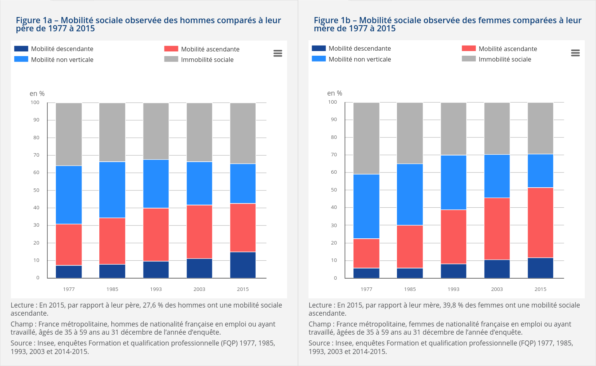
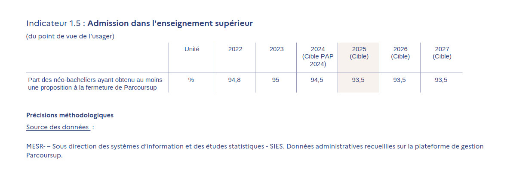

```{r setup, include=FALSE}
knitr::opts_chunk$set(echo = FALSE, warning = FALSE, message = FALSE)
options(dplyr.summarise.inform = FALSE)

knitr::opts_chunk$set(fig.asp=7.5/16, fig.width = 8)

library(tidyverse)
library(ggcpesrthemes)
library(kpiESR)
library(cowplot)

theme_set(theme_cpesr() + theme(legend.position = "right", plot.title = element_text(hjust = 0.5)))

load("../graphiques/emploi.RData")
```

# 50 ans de massification de l'enseignement supérieur

```{r etu.long}
read.csv("../graphiques/data/kh-sl_eleves_sup.csv") %>%
  mutate(champ_geo = factor(champ_geo,levels=unique(champ_geo))) %>%
  filter(champ_geo!="") %>%
  ggplot(aes(x=annee,y=disc_total, color = champ_geo)) +
  geom_line(size = 1) +
  scale_y_continuous(labels = ~ paste(.x/1e6,"M")) +
  labs(
    title = "Evolution des effectifs étudiants du Ministère de l'enseignement supérieur",
    x = "Année",
    y = "Effectifs étudiants",
    color = "Périmètre") +
  theme(legend.position = "bottom") + 
  guides(color=guide_legend(nrow = 1)) +
  cpesr_cap(author = "Julien Gossa et Kévin Hédé", source="Données collectées par Kevin Hédé")
```


# Inversion de la stratification éducative

```{r diplome.2, cache = TRUE}
#Graphique pour connaître le niveau de diplome des jeunes selon l'année civile 
plot_categorie_ponctuel <- function(categorie="Activite", agemin = 15, agemax = 30, anneemin = 1971, anneemax = 2020, fill=TRUE, keep_na=FALSE) {
  if(fill) {
    position_geom <- "fill"
    label_scale <- ~ scales::percent(abs(.x))
    title_y <- "Pourcentage de la population 25-30"
  } else {
    position_geom <- "stack"
    label_scale <- function(x) x/1e6
    title_y <- "Effectif (millions)"
  }
  
  emploi %>%
    filter(Age >= agemin, Age <= agemax, Annee %in% c(anneemin,anneemax)) %>%
        mutate(Diplome = factor(Diplome,
                            levels=c("Bac+5","Bac+3","Bac+2","Bac","CAP-BEP","DNB","Aucun"))) %>%
    mutate(Diplome = fct_recode(Diplome,
                                Tertiaire = "Bac+5",
                                Tertiaire = "Bac+3",
                                Tertiaire = "Bac+2",
                                Secondaire = "Bac",
                                Secondaire = "CAP-BEP",
                                Secondaire = "DNB",
                                Primaire = "Aucun") ) %>% 
    mutate(Diplome = fct_rev(Diplome)) %>%
    group_by(Annee, Sexe, Categorie=!!as.name(categorie)) %>%
    summarise(Population = sum(Population, na.rm=TRUE)) %>%
    { if (!keep_na) na.omit(.) else . } %>%
    { if (fill) group_by(.,Annee) %>% mutate(Population = Population / sum(Population)) else . } %>%
    ungroup() %>%
    complete(Annee, Categorie, fill = list(Population = 0)) %>% 
    mutate(Population = ifelse(Sexe == "H",-Population,Population)) %>%
    ggplot(aes(y=Categorie,x=Population,fill=Sexe, group=Sexe)) +
    geom_col(alpha=0.8, color="white",width = 1) + 
    expand_limits(x=c(-0.28,0.28)) +
    facet_grid(.~Annee) +
    scale_x_continuous(labels = label_scale) +
    scale_fill_brewer(palette = "Set2") +
    labs (y = "Diplôme", x = title_y, caption = "Source :Enquête Emploi (1971 - 2020)")
}


plot_categorie_ponctuel(categorie="Diplome", agemin = 25, agemax = 30) +
  #scale_y_continuous(labels = scales::percent, name = "Part des jeunes de 25 à 30 ans") +
  cpesr_cap(authors = "Camille Schumacher et Julien Gossa", source = "Enquête emploi INSEE") +
  theme_cpesr() + theme(legend.position = "right")
```


# Quelle mobilité sociale (en réalité, professionnelle et non économique) ?

```{r, out.height="85%", fig.align="center"}

```


# Ralentissement de l'ascension de la structure de l'emploi

```{r}
bmo <- read.csv2("Besoins en Main-d’Œuvre_Top 10 en nombre de projets de recrutement non saisonniers en 2024 par Métie.csv", skip = 3) %>%
  mutate(Projets.de.recrutement.non.saisonniers = as.numeric(gsub(" ","",Projets.de.recrutement.non.saisonniers)))

bmo  %>%
  ggplot(aes(x=Projets.de.recrutement.non.saisonniers,y=reorder(Métier,Projets.de.recrutement.non.saisonniers))) +
  geom_col(fill = "steelblue") +
  scale_x_continuous(labels = scales::number) +
  labs(title = "Top 10 des métiers les plus demandés en 2024",
       x = "Nombre de projets de recrutement non saisonniers",
       y = NULL)
```

# Vers une démassification / régression éducative 
- « Passer du siècle de la quantité __au siècle de la qualité__ » - François Bayrou, 1994
- « Nous n'avons plus les moyens d'accueillir tout le monde. __Certains n'ont rien à faire chez nous.__ » - un président d'université, débat Parcoursup 2018
- « On ne pourra pas rester durablement dans un système où __l’enseignement supérieur n’a aucun prix pour la quasi-totalité des étudiants__ » - Emmanuel Macron, 2022
- « Le taux de réussite [au brevet] cette année va __baisser de manière importante__ » - Gabriel Attal, 2024
- « Il nous faut aujourd’hui réfléchir aux moyens d’__inverser la dynamique de massification__ à l’œuvre depuis des décennies » - Eric Ciotti, débat AN 28-11-2024
- « Je souhaite que l’on puisse mieux accueillir les étudiants __que nous décidons d’accueillir__". » - Patrick Hetzel, débat AN 28-11-2024
- « __"Un coup dur pour l’ascenseur social"__ : 17 millions en moins en 2025, l'Université de Montpellier inquiète du désengagement de l'Etat » - AFP, hier


# Vers une démassification / régression éducative ?

```{r, out.width="95%", fig.align='center'}
knitr::include_graphics("../graphiques/bleus2022-1.1.jpg")


```

# Vers une démassification / régression éducative ?

```{r}
load(file="../graphiques/sise.RData")

sise %>%
  group_by(Rentrée,Niveau = paste(LMD, substr(NIVEAU,2,2), sep="")) %>%
  summarise(Etudiants = sum(Etudiants)) %>%
  filter(Niveau %in% c("L3","M1")) %>%
  mutate(Rentrée = ifelse(Niveau == "L3", Rentrée+1,Rentrée)) %>%
  filter(Rentrée != 2012, Rentrée != 2023) %>%
  ggplot(aes(x=Rentrée, y= Etudiants, color=Niveau)) +
  geom_line(linewidth = 1.5) + geom_point(shape = 21, stroke = 2, size = 2, fill="white") + 
  scale_x_continuous(labels = ~ paste0("L3 ", .x-1,"\nM1 ",.x), breaks = seq(2011,2030,2), name="Cohorte") +
  scale_y_continuous(labels = ~ paste0(.x/1e3,"k"), name = "Inscriptions étudiantes") +
  ggtitle("Etudiant⋅e⋅s  inscrit⋅e⋅s en L3 à l'année N et M1 à l'année N+1" )
```


# Finalement...

La nature de « l'ascenseur social » est remise en question.

- En réalité, « ascenseur économique », sauf que :
  - Le progrès éducatif stagne (et on cherche à l'inverser)
  - Le progrès économique stagne (et on échoue à le relancer)
  - Donc un ascenseur mais vers où ?

## Sans doute une impasse, sauf à redéfinir un véritable « ascenseur social »
  - Dont doit découler un nouveau modèle d'enseignement (supérieur)
  - Sans doute avec un découplage de l'emploi
  - Mais un couplage avec les grands enjeux du siècle.
