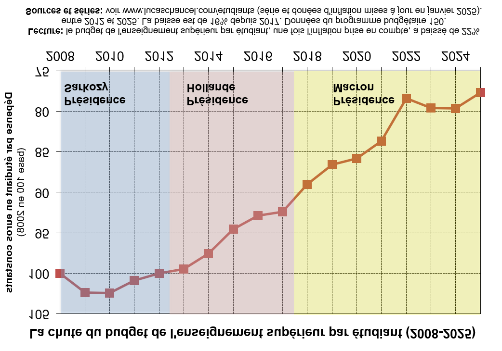

```{r setup, include=FALSE}
knitr::opts_chunk$set(echo = FALSE, warning = FALSE, message = FALSE)
options(dplyr.summarise.inform = FALSE)

knitr::opts_chunk$set(fig.asp=7.5/16, fig.width = 8)

library(tidyverse)
library(ggcpesrthemes)
library(kpiESR)
library(cowplot)

theme_set(theme_cpesr() + theme(legend.position = "right", plot.title = element_text(hjust = 0.5)))

#source("tdbesr-plots.R")
source("../ressources/data/BL/BLViz-map.R",chdir = TRUE)
load("../ressources/data/plots.RData")

```

## Développement rapide de l'edu-scepticisme / obscurantisme aux USA

```{r, out.width="80%", fig.align="center"}
knitr::include_graphics("../ressources/img/eduscepticisme-JDV.jpeg")
```

## Développement rapide de l'edu-scepticisme / obscurantisme aux USA

- Accusations infamantes en « wokisme » puis en anti-sémitisme 
  - « _politically correctness (PC)_» et « _Cancel culture_ » dès les années 1990
- _Gag orders_ sur certains contenus académiques
  - loi _H.B. 377_, 2021 en Idaho, _Stop WOKE Act_, 2022 en Floride
- Suppression des données de la recherche (climat et santé), 2025
  - « _President Donald J. Trump Eliminates Information Silos to Stop Waste, Fraud, and Abuse_ »
- Suppression des programmes de diversité et d’inclusion 
  - _DEI_, 2023 en Floride et au Texas
  - _Students for Fair Admissions c. Harvard/UNC_, 2023 (interdiction des discriminations positives dans les admissions ; avant 2006 au Michigan)
- Restrictions visant les étudiants et universitaires étrangers 
  - _Travel Ban_ en 2017, puis ICE pour les cours en ligne en 2020
- Affaiblissement du statut des professeurs 
  - suppression de la _tenure_ (2021 en Georgie) et augmentation des contrôles (2023 au Texas)
- Mesures financières politiques ou punitives 
  - _Tax Cuts and Jobs Act_ : taxe sur les dotations des universités en 2017
  - Suppression de programmes et de financements

## Développement rapide de l'edu-scepticisme / obscurantisme aux USA

« _Harvard is treating our country with great disrespect. And all they're doing is going deeper and deeper and deeper. They got to behave themselves. [...] I want Harvard to be great again, probably._ » - Trump.


```{r, out.width="55%", fig.align="center"}
knitr::include_graphics("../ressources/img/Presse-LastWeekTonight.png")
```

\footnotesize
Source : [« _Trump vs. Higher Education: Last Week Tonight with John Oliver_ », HBO](https://www.youtube.com/watch?v=xk94il8L820)


## Une vue sur les conséquences

```{r, out.width="80%", fig.align="center"}
knitr::include_graphics("../ressources/img/Presse-Trump.png")
```

\footnotesize
Source : [« _US science after a year of Trump_ », Nature](https://www.nature.com/immersive/d41586-026-00088-9/index.html)

## Peut-on rationaliser le « Trumpisme » ?

- Recentrage sur les secteurs stratégiques : espace, défense, haute technologie
- Suppression des financements sur les secteurs dangereux : désinformation, écologie, wokisme
- Attaque électoraliste sur le secteur de la santé

Mais bon...

```{r, out.width="50%", fig.align="center"}
knitr::include_graphics("../ressources/img/MAHA-chatgpt.png")
```

## Est-ce qu'il existe un mouvement plus profond ?

```{r, out.width="70%", fig.align="center"}
knitr::include_graphics("../ressources/img/Presse-fallingTuitionRevenue.png")
```

\footnotesize
Source : [« Sticker shock: A look at the complicated world of tuition pricing », Ben Unglesbee, highereddive](https://www.highereddive.com/news/college-tuition-sticker-price-discounting-revenue/721847/)

## Taux d'engagement dans l'enseignement supérieur

```{r, out.width="80%", fig.align="center"}
knitr::include_graphics("../ressources/img/OWD-tertiary.png")
```

\footnotesize
Source : [OurWordInData](https://ourworldindata.org/grapher/gross-enrollment-ratio-in-tertiary-education?tab=line)


## Une vision du monde 

```{r}
bl.map.plot(2015,FALSE) + ggtitle("Taux d'engagement", subtitle="dans l'enseignement supérieur")
```

## Une autre vision du monde 

```{r}
bl.map.plot(2015,TRUE) + ggtitle("Nombre absolu d'engagés", subtitle="dans l'enseignement supérieur")
```

## Part mondiale des publications scientifiques

```{r, out.width="70%", fig.align="center"}

```

\footnotesize
Source : [La position scientifique de la France, OST](https://www.hceres.fr/sites/default/files/media/downloads/ost-position-scientifique-france-2024.pdf)


## Une crise occidentale 

```{r, out.width="90%", fig.align="center"}
knitr::include_graphics("../ressources/img/Presse-CriseOccidentale.png")
```

## Une crise occidentale : « La démographie a toujours raison »

```{r, out.width="70%", fig.align="center"}
knitr::include_graphics("../ressources/img/OWD-fertility.png")
```

\footnotesize
Source : [Our World in Data](https://ourworldindata.org/fertility-rate)


## Un scénario catastrophe (possible)

```{r, out.width="85%", fig.align="center"}
knitr::include_graphics("../ressources/img/EUA-TechOligarchy.png")
```

\footnotesize
Source : [Universities and competitiveness, EUA](https://www.eua.eu/publications/reports/universities-and-competitiveness.html)

## En France : Edu-scepticisme 

:::::::::::::: {.columns}
::: {.column width="50%"}
```{r, out.width="60%", fig.align="center"}
knitr::include_graphics("../ressources/img/eduscepticisme-LAOB.png")
```
:::
::: {.column width="50%"}
```{r, out.width="80%", fig.align="center"}
knitr::include_graphics("../ressources/img/eduscepticisme-NP.jpg")
```
:::
:::::::::::::: 

## En France : SCSP vs. dépenses de personnel

```{r, fig.asp=7.5/16, out.width="100%"}
plot_SCSPvsMS
```

## En France : Objectif de la nation - « Excellence scientifique »

```{r, out.width="100%", fig.align="center", fig.show='hold'}
  knitr::include_graphics("../ressources/img/PAP-172-2025.jpeg")
```

\tiny
Source : [Projet annuel de performances PLF 2025](https://www.budget.gouv.fr/documentation/documents-budgetaires/exercice-2025)

## En France : Objectif de la nation - poursuites d'études

```{r, out.width="100%", fig.align="center"}
knitr::include_graphics("../ressources/img/PAP-RES-2026-parcoursup.png")
```

\tiny
Source : [Projet annuel de performances PLF 2026](https://www.budget.gouv.fr/documentation/documents-budgetaires-lois/exercice-2026?docuement_dossier%5B0%5D=mission_nomenclature%3A92269)

## Un « scénario à la Trump » en France (si j'étais le conseiller)

- Dénigrement public : OK
- Gouvernement à distance / Pilotage budgétaire
  - Agencisation : OK
  - ANR : OK (suppression des appels blancs ? pas un montant énorme)
  - Hcéres : juste la tête à changer (possible de l'ignorer complètement)
- Pilotage politique / disciplinaire
  - Autonomie : en principe marge de manoeuvre, en pratique émiettement +
  - Renforcement du pouvoir des rectorats : OK
  - Contractualisation par objectifs apparemment neutres : OK (COMP)
- Politique raciale : KO, mais...
  - filière du Bac + frais d'inscription
- Statut des universitaires / CNU / bastions des ONR : KO, mais...
  - CPJ prêtes à l'emploi + localisation des primes et promotions
  - « Acte 2 de l'autonomie » + « Agences de moyens » 
  - D'une pierre deux coups.

## USA vs. France : Peut-être...

Même dynamique dans des contextes très différents (fédéral vs. central).

Bascule potentiellement très rapide en 2027, mais pas (encore) la perspective actuelle.

```{r, out.width="80%", fig.align="center"}
knitr::include_graphics("ASI.png")
```

\tiny
Source : [« Les Etats-Unis, la France et la police : l'autoritarisme en commun ? », Sébastian Roché et  Frédérique Sandretto, Arrêt sur images](https://www.arretsurimages.net/emissions/arret-sur-images/les-etats-unis-la-france-et-la-police-lautoritarisme-en-commun)


## Conclusion : Triple moment 

- Fin de la massification / début de stagnation éducative
- Chute impressionnante et durable de la démographie
- Développement rapide de l'édu-scepticisme

Probable moment-pivot civilisationnel. « Trumpisation » à la française seulement possible.

### Soit vers la fin du service public d'ES(R)

  - Individualisation et pure professionalisation des études
  - COMP100% + Modèle économique basé sur les frais d'inscription
  - De nombreuses fermetures imprévisibles (régulation d'un marché dysfonctionnel)
  - Contractualisation des universitaires (adapter l'offre à la demande)

### Soit contre-pied idéologique / redéfinition du rôle du service public d'ES(R)
  - Notion de progrès collectif ?
  - Séparation nette et horizontale entre études supérieures et professionalisation 


## Chine : la science visible

```{r, out.width="40%", fig.align="center"}
knitr::include_graphics("../ressources/img/china-train.jpeg")
```

  
## De profondes transformations : SCSP vs. Ressources propres

```{r, fig.asp=7/16, fig.width=7, out.width="95%", fig.align='center'}
plot_RessourcesPropres
```

Plus les filliales (fondations, filiales commerciales, écosystème start-ups, etc.).
  
## Publications vs. Chercheur.ses

```{r, out.width="70%", fig.align="center"}
knitr::include_graphics("../ressources/img/OST-publicationsVSchercheurs.png")
```

\footnotesize
Source : OST, https://www.hceres.fr/sites/default/files/media/downloads/ost-position-scientifique-france-2024.pdf


## En tous cas, pas un problème technique de budget national

```{r, out.width = "62%", fig.align='center'}
knitr::include_graphics("../ressources/img/OFCE-apprentissage.png")
``` 

\footnotesize
Source : Bruno COQUET, OFCE, https://www.ofce.sciences-po.fr/pdf/pbrief/2024/OFCEpbrief135.pdf

## Une solution : la hausse des frais d'inscription

```{r, out.width = "80%", fig.align='center'}
knitr::include_graphics("../ressources/img/Presse-FraisScolarité.png")
``` 

\footnotesize
Source : https://www.lesechos.fr/politique-societe/education/universites-grandes-ecoles-dingenieurs-la-fin-des-tabous-sur-la-hausse-des-droits-dinscription-2189311

## La hausse des frais d'inscription est déjà en cours

```{r, fig.asp=7/16, fig.width=7, out.width="95%", fig.align='center'}
plot_RecettesFormation
```

Plus les filliales (fondations, filiales commerciales, écosystème start-ups, etc.).


## Défi 1 : Décollage du secteur privé (augmentation de l'offre)

```{r, out.width = "77%", fig.align='center'}
knitr::include_graphics("../ressources/img/EESR-effectifs.png")
``` 

\footnotesize
Source : EESR, SIES, https://publication.enseignementsup-recherche.gouv.fr/eesr/FR/T764/les_etudiants_dans_les_filieres_de_formation_depuis_1960_croissance_et_diversification/


## Défi 2 : Développement rapide de l'edu-scepticisme (baisse des tarifs)

```{r, out.width="100%", fig.align="center"}
knitr::include_graphics("../ressources/img/eduscepticisme-FV.png")
```

## Défi 2 : Développement rapide de l'edu-scepticisme (baisse des tarifs)

```{r, out.width="100%", fig.align="center"}
knitr::include_graphics("../ressources/img/eduscepticisme-renaissance.png")
```

\footnotesize
Source: Renaissance/LREM, « Un choc des savoirs pour l'enseignement supérieur et la formation », Pour une nouvelle donne économique et climatique, 2025
https://doc.parti.re/Conventions-thematiques_Nouvelle-donne.pdf


## Défi 3 : Stagnation éducative / Déclin éducatif (baisse de la demande)

```{r}
plot_MassificationRecent
```


## Défi 3 : Stagnation éducative / Déclin éducatif (baisse de la demande)

```{r}
plot_MassificationLong
```


## Défi 3 : Stagnation éducative / Déclin éducatif (baisse de la demande)

```{r, out.width="40%", fig.align="center"}
knitr::include_graphics("../ressources/img/INSEE-naissances.png")
```

\footnotesize
Source : INSEE https://www.insee.fr/fr/statistiques/2381380


## Défi 3 : Stagnation éducative / Déclin éducatif (baisse de la demande)

```{r, fig.align="center", out.width="100%"}
load("../ressources/data/predictions.RData")
predictions
```


## Des missions en inflation et de plus en plus en conflit

:::::::::::::: {.columns}
::: {.column width="50%"}
\centering 2000

```{r, out.width = "100%"}
knitr::include_graphics("../ressources/img/CodeEduc-L123-2-2000.png")
``` 
:::
::: {.column width="50%"}
\centering 2025

```{r, out.width = "100%"}
knitr::include_graphics("../ressources/img/CodeEduc-L123-2-2025.png")
``` 
:::
:::::::::::::: 

\footnotesize
Source: L123-2 du Code de l'éducation https://www.legifrance.gouv.fr/codes/article_lc/LEGIARTI000042815070/

## Constat 5 : Une inégalité par les deux bouts, complexe à mesurer.

```{r, out.width = "60%", fig.align='center'}
knitr::include_graphics("../ressources/img/CAE-coutsdiplomes.png")
``` 

\footnotesize
Source: CAE, https://cae-eco.fr/les-couts-des-formations-dans-lenseignement-superieur-francais-determinants-et-disparites


## Constat 6 : Une territorialisation à l'abandon, et un manque d'intersectionnalité dans les politiques publiques.

```{r, out.width = "60%", fig.align='center'}
knitr::include_graphics("../ressources/img/NSP-campus.png")
``` 


## Etat des lieux : Investissement dans l'ESR (P150 / nombre total d'étudiants)

```{r, out.width="55%", fig.align="center"}
knitr::include_graphics("../ressources/img/budgetparetu.png")
```

Pour une année-étudiant : si 5 k€ en 2009, 4 k€ en 2025.


## Etat des lieux : Productivité de l'ESR (nombre total d'étudiants / P150)

```{r, out.width="55%", fig.align="center"}

```

Pour 1 M€ : si 200 années-étudiant en 2009, 250 années-étudiant en 2025.


## Etat des lieux : SCSP vs. Ressources propres

```{r, fig.asp=7/16, fig.width=7, out.width="95%", fig.align='center'}
plot_RessourcesPropres
```

Plus les filliales (fondations, filiales commerciales, écosystème start-ups, etc.).


## Etat des lieux : SCSP vs. dépenses de personnel

```{r, fig.asp=7.5/16, out.width="100%"}
plot_SCSPvsMS
```

## Perspective actuelle : réduire le volume de service

```{r, out.width = "70%", fig.align='center'}
knitr::include_graphics("../ressources/img/Presse-IP-EMacron.png")
``` 

```{r, out.width = "70%", fig.align='center'}

``` 

- Emmanuel Macron, Présidence de la République, 2023

\tiny
https://www.aefinfo.fr/depeche/698571-pour-etre-plus-efficace-l-universite-doit-faire-davantage-contribuer-ceux-qui-ont-le-plus-de-moyens-emmanuel-macron \newline
https://www.elysee.fr/front/pdf/elysee-module-22053-fr.pdf

## COMP100% : pour augmenter la performance ?

- Principe : conditionner 100% de la SCSP à la « performance »
  - __Notion de « performance » non consensuelle, polymorphe et mutable__
  - Extrêmement risqué dans des mains extrêmes.
- Conditionner y compris le traitement des fonctionnaires 
  - __Pas de transformation stratégique sans licenciements économiques__
  - Nécessite une réforme statutaire d'ampleur, énorme risque pour l'attractivité
- Conditionner y compris les performances cœur de métier 
  - Réussite, Insertion professionnelle (et production scientifique ?) 
  - Calculées par des outils administratifs : InserSup, Fresq, Quadrant, (HAL, OpenAlex), ...
  - __Voué à l'échec : Loi de Goodhart__
  
### Loi de Goodhart

__« Quand une mesure devient un objectif, elle cesse d'être une bonne mesure »__

- Taux de réussite : On ne va pas mieux enseigner, mais seulement mieux noter.
- Production scientifique : On ne va pas mieux chercher, mais seulement plus publier.


## La valeur des diplômes en question

« Réussite » vs. « exigence » / Capital humain vs. Signal 

```{r, fig.asp=7/16, fig.width=7, out.width="100%", fig.align='center'}
plot_LvsM
```


## Objectifs de la nation : Massification éducative

- 80% d'une classe d'âge au Bac
- 50% d'une classe d'âge diplômée du supérieur


```{r, out.width="100%", fig.align="center"}
knitr::include_graphics("../ressources/img/PAP-150-2025-parcoursup.png")
```

\tiny

Source : Projet annuel de performances PLF 2025 https://www.budget.gouv.fr/documentation/documents-budgetaires/exercice-2025/projet-loi-finances-les/budget-general-plf-13


## Discours : Réussite vs. Exigence


:::::::::::::: {.columns}
::: {.column width="60%"}

```{r, out.width = "100%"}
knitr::include_graphics("../ressources/img/Presse-LM-ASBarthez.png")
``` 

- Anne-Sophie Bartez, DGESIP, 2019
- Frédérique Vidal, MESR, 2021
\vfill

\tiny
https://www.aefinfo.fr/depeche/616359

https://www.lefigaro.fr/actualite-france/frederique-vidal-l-enjeu-est-de-preserver-le-taux-d-insertion-professionnelle-20210921

:::
::: {.column width="40%"}

```{r, out.width = "100%"}
knitr::include_graphics("../ressources/img/Presse-LM-FVidal.png")
``` 

:::
:::::::::::::: 


## Discours : Public/Privé - Qualité

```{r, out.width = "70%", fig.align='center'}
knitr::include_graphics("../ressources/img/Presse-Privé-TCoulhon.png")
``` 

- Thierry Coulhon, Hcéres et Anne-Sophie Barthez, DGESIP, 31/03/2023

\tiny
https://www.aefinfo.fr/depeche/690094-prive-lucratif-nous-n-opposons-aucune-categorie-d-etablissement-a-s-barthez-dgesip


## Discours : Rémunérations vs. dotation

```{r, out.width = "75%", fig.align='center'}
knitr::include_graphics("../ressources/img/SR-SCSPMS.png")
``` 

- Sylvie Retailleau, Ministre ESR en 2023

\tiny
Question orale n°0915S « Situation budgétaire des universités et particulièrement de Le Mans Université »

https://www.senat.fr/questions/base/2023/qSEQ23110915S.html


