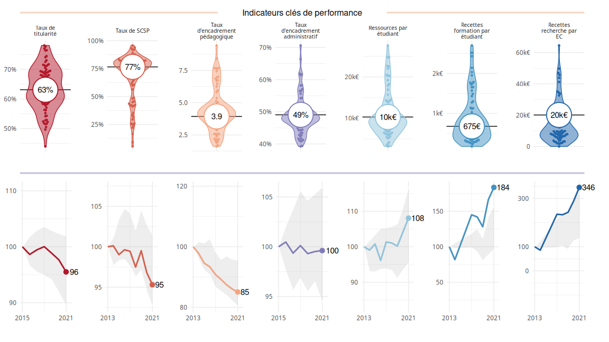
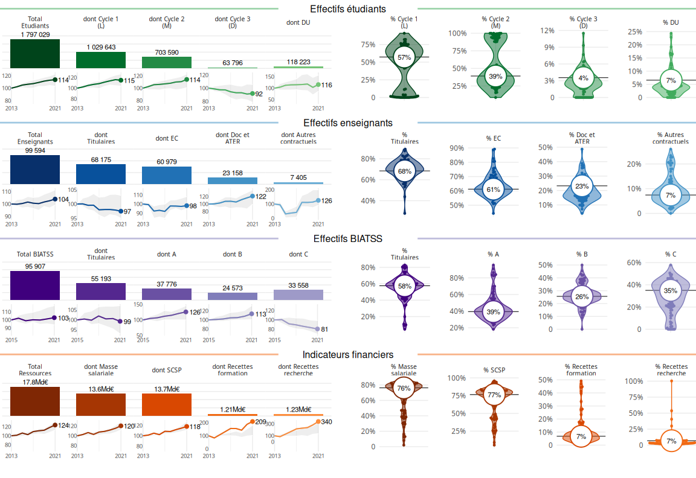
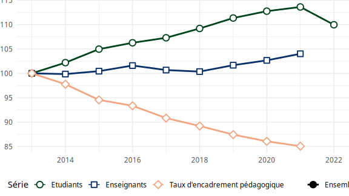
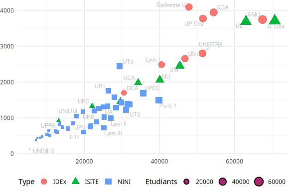

kpiESR : des indicateurs clés de performance pour les établissements de
l’ESR, des données ouvertes aux représentations graphiques
================
Pauline Boyer et Julien Gossa Laboratoire SAGE, Université de
Strasbourg, CPESR
2023-05-04

De profonds changements sont en cours dans l’enseignement supérieur et
la recherche (ESR) en France depuis le début du XXIe siècle. Plusieurs
réformes ont modifié la manière dont les établissements d’enseignement
supérieur sont gérés et évalués. La création de l’Agence Nationale de la
Recherche (ANR) en 2005 a modifié la manière dont les moyens sont
alloués aux établissements, tandis que la Loi libertés et
responsabilités des universités (LRU) en 2007 a amorcé un mouvement
d’autonomisation des universités, les invitant à développer leur propre
politique d’emploi. En 2013, l’Agence d’évaluation de la recherche et de
l’enseignement supérieur (AÉRES) a été remplacée par le Haut Conseil de
l’évaluation de la recherche et de l’enseignement supérieur (Hcéres),
modifiant la manière dont les établissements sont évalués.

L’Initiative d’excellence (IDEX) a également été lancée, sélectionnant
onze universités pour un projet de gouvernance différenciant dans le
cadre du Plan d’investissement d’avenir (PIA). De plus, un grand nombre
de fusions et de regroupements d’établissements d’enseignement supérieur
ont eu lieu, tels que les Pôles de recherche et d’enseignement supérieur
(PRES) et les Communautés d’universités et d’établissements (COMUE), et
plus récemment les Etablissement publics expérimentaux (EPE).

Ces changements ont entraîné des évolutions structurelles locales,
favorisant la différanciation des établissements de l’ESR. Cela a créé
un besoin croissant d’outils de suivi et d’analyse pour comprendre les
caractéristiques et les politiques des établissements de l’ESR, et *in
fine* mieux maitriser les riques, tant un niveau national qu’au niveau
local. Dans le même temps, le ministère de l’ESR puis l’Etat ont
développé une politique d’ouverture des données administratives, dans la
lignée de la Loi pour une république numérique.

L’approche développée au sein de la Conférence des praticien⋅ne⋅s de
l’ESR (CPESR) consiste à exploiter les données administratives ouvertes
par le ministère pour élaborer des indicateurs clés de performances
(kpi) à la fois exhaustifs et synthétiques. Ce travail a représenté un
double défi : en sciences des données, avec l’aggrégation et la
représentation des informations ; et en sciences de l’action publique,
avec la sélection d’un sous-ensemble d’indicateur prioritairement
pertinents, et la conception d’indicateurs clés composites.

## Des données ouvertes aux kpi

Les données ouvertes sont mises à disposition par le
[SIES](https://www.enseignementsup-recherche.gouv.fr/fr/statistiques-et-analyses-50213),
et nous exploitons pour ces travaux les jeux suivants :

- [fr-esr-statistiques-sur-les-effectifs-d-etudiants-inscrits-par-etablissement](https://data.enseignementsup-recherche.gouv.fr/explore/dataset/fr-esr-statistiques-sur-les-effectifs-d-etudiants-inscrits-par-etablissement)
- [fr-esr-personnels-biatss-etablissements-publics](https://data.enseignementsup-recherche.gouv.fr/explore/dataset/fr-esr-personnels-biatss-etablissements-publics)
- [fr-esr-enseignants-titulaires-esr-public](https://data.enseignementsup-recherche.gouv.fr/explore/dataset/fr-esr-enseignants-titulaires-esr-public/)
- [fr-esr-enseignants-nonpermanents-esr-public](https://data.enseignementsup-recherche.gouv.fr/explore/dataset/fr-esr-enseignants-nonpermanents-esr-public/information/)
- [fr-esr-operateurs-indicateurs-financiers](https://data.enseignementsup-recherche.gouv.fr/explore/dataset/fr-esr-operateurs-indicateurs-financiers/information/)
- [fr-esr-principaux-etablissements-enseignement-superieur](https://data.enseignementsup-recherche.gouv.fr/explore/dataset/fr-esr-principaux-etablissements-enseignement-superieur/information/?disjunctive.type_d_etablissement)

Le projet [kpiESR](https://github.com/cpesr/kpiESR) assemble les données
à trois granularités différentes : MESRI, Groupes d’établissements, et
établissement. Les indicateurs retenus sont de quatre ordres : effectifs
étudiants, effectifs BIATSS, effectifs enseignants et données
financières.

Ces indicateurs sont déclinés en deux types :

- **Les indicateurs primaires et secondaires** : au plus proche des jeux
  de données ouvertes, ils présentent les effectifs étudiants et
  personnels, ainsi que les finances.
- **Les indicateurs clés de performance** : combinaisons des précédents,
  plus représentatives des missions.

Trois représentations sont ensuite utilisées :

- **Valeurs absolues** : permettant de connaitre les valeurs à la
  dernière année ;
- **Evolutions normalisées** : permettant de percevoir l’évolution dans
  le temps, en valeur 100 pour une année de référence ;
- **Valeurs normalisées** : permettant connaitre un rapport et de le
  comparer aux autres établissements.

Ces représentations permettent de produire des tableaux de bord, qui
sont produits pour tous les établissements dans un document unique[^1]
mais aussi accessibles par une interface web interactive[^2]. Elles
permettent aussi de visualiser des séries, et de comparer les
établissements, dans l’espace et le temps.

## Résultats

### Tableaux de bord

Les différentes représentations mises ensemble constituent un tableau de
bord en deux volets, d’abord les indicateurs clés de performance, et
ensuite les données primaires. Par exemple, voici les tableaux de bord
pour l’ensemble du MESRI :

### Séries temporelles

Les séries temporelles permettent de percevoir des évolutions,
lesquelles peuvent être utiles au pilotage. Par exemple, voilà la
représentation, en valeur 100 pour 2013 et dans le périmètre MESRI, des
effectifs enseignants et étudiants, ainsi que du taux d’encadrement.
Cette représentation peut être facilement déclinée par établissement.

### Représentations spatiales

Les représentations spatiales permettent de comparer les établissements
entre eux, selon tous les indicateurs du projet. C’est un outil qui peut
s’avérer utile au *benchmarking*. Par exemple, voici les universités en
fonction des effectifs étudiants et enseignants, selon le périmètre
d’excellence, en 2020 :

    ## Joining, by = c("Groupe", "pid", "Etablissement", "Groupe.détaillé",
    ## "Comparable")

## Limites de l’approche et proposition de communication

Bien qu’étant le projet public le plus avancé en matière d’agrégation
des données de l’ESR, kpiESR présente plusieurs limites, essentiellement
dûes à la disponibilité des données ouvertes : les séries temporelles
sont courtes (autour d’une dizaine d’années), des indicateurs qui
seraient souhaitables ne peuvent pas être calculés, et de nombreux
établissements présentent des données partielles ou de mauvaises
qualité, ainsi que des ruptures de séries à l’occasion des réformes et
transformations.

Dans le cadre du colloque AFAIRES, nous proposons une présentation
globale du projet, en portant une attention sur les difficultés
rencontrées et les résultats obtenus. Une démonstration pratique, voire
des ateliers de manipulation sont également envisageables.

[^1]: <https://cpesr.fr/tableau-de-bord-esr/>

[^2]: <https://data.cpesr.fr/tdbesr/>
