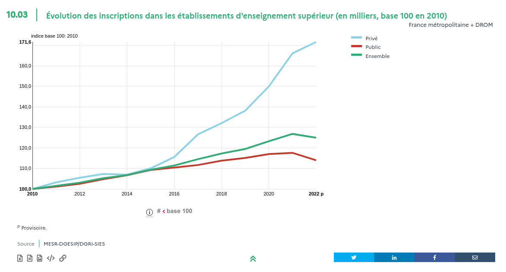
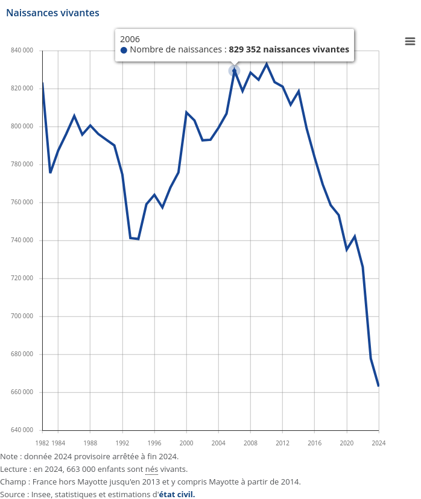

```{r setup, include=FALSE}
knitr::opts_chunk$set(echo = FALSE, warning = FALSE, message = FALSE)
options(dplyr.summarise.inform = FALSE)

knitr::opts_chunk$set(fig.asp=7.5/16, fig.width = 8)

library(tidyverse)
library(ggcpesrthemes)
library(kpiESR)
library(cowplot)

theme_set(theme_cpesr() + theme(legend.position = "right", plot.title = element_text(hjust = 0.5)))

#source("tdbesr-plots.R")
source("../ressources/data/BL/BLViz-map.R",chdir = TRUE)
```

### Contexte : Rythme des réformes

```{r, out.width = "100%"}
knitr::include_graphics("../ressources/data/waffles-bac-1.pdf")
``` 

### Contexte : Rythme des réformes
```{r, out.width = "100%"}
knitr::include_graphics("../ressources/data/waffles-bac-2.pdf")
``` 

### Contexte : Rythme des réformes

```{r, out.width = "100%"}
knitr::include_graphics("../ressources/data/waffles-bac-3.pdf")
``` 

### Contexte : Rythme des réformes

```{r, out.width = "100%"}
knitr::include_graphics("../ressources/data/waffles-bac-4.pdf")
``` 

### Contexte : Rythme des réformes

```{r, out.width = "100%"}
knitr::include_graphics("../ressources/data/waffles-bac-5.pdf")
``` 


### Contexte : Budget - Dépense publique par étudiant

```{r, out.width="65%", fig.align="center"}
knitr::include_graphics("../ressources/img/budgetparetu.png")
```

\tiny
Source : https://lucaschancel.com/etudiants/


### Contexte : Budget - Dotation vs. dépenses de personnel

```{r, fig.asp=7.5/16, out.width="100%"}
kpiESR::esr %>%
  filter(Etablissement == "Universités et assimilés", Rentrée > 2008) %>%
  mutate(diff = kpi.FIN.S.SCSP-kpi.FIN.S.masseSalariale) %>% 
  ggplot(aes(x=Rentrée+1,y=diff, color=diff)) +
  geom_hline(yintercept = 1) +
  geom_line(size=1) + geom_point(shape = 21, stroke=2,size=2,fill="white") +
  scale_x_continuous(breaks = scales::pretty_breaks(12)) +
  scale_y_continuous(labels = ~ paste(.x/1e6,"M€"), name = "SCSP-MS") +
  scale_color_distiller(palette="Reds") +
  theme(legend.position = "None", panel.grid.minor.x = element_blank()) +
  labs(
    title="Différence entre SCSP et masse salariale des universités",
    x="Année") 
```

### Budget : L'hypothèse de la pénurie de moyens

```{r, out.width="65%", fig.align="center"}
knitr::include_graphics("../ressources/img/OFCE-apprentissage.png")
```

\tiny

Source : OFCE, Apprentissage : quatre leviers pour reprendre le contrôle 
https://www.ofce.sciences-po.fr/pdf/pbrief/2024/OFCEpbrief135.pdf

### Objectifs de la nation : Massification vs. stagnation

- 80% d'une classe d'âge au Bac
- 50% d'une classe d'âge diplômée du supérieur

#### Taux d'accès au Bac

```{r, out.width="90%", fig.align="center"}

```

\tiny

Source : Projet annuel de performances PLF 2025 https://www.budget.gouv.fr/documentation/documents-budgetaires/exercice-2025/projet-loi-finances-les/budget-general-plf-13


### Objectifs de la nation : Massification vs. stagnation

::: {.block}
#### Pourcentage diplômé du supérieur

```{r, out.width="90%", fig.align="center"}

```

\tiny

Source : Projet annuel de performances PLF 2025 https://www.budget.gouv.fr/documentation/documents-budgetaires/exercice-2025/projet-loi-finances-les/budget-general-plf-13
:::

```{r, out.width="40%", fig.align="center"}
knitr::include_graphics("../ressources/img/PAP-150-2024-diplomes.png")
```

\tiny

Source : Projet annuel de performances PLF 2024 https://www.budget.gouv.fr/documentation/documents-budgetaires/exercice-2024


### Objectifs de la nation : Massification vs. stagnation

Baisse des propositions de poursuite d'étude aux néo-bacheliers.

#### Parcoursup

```{r, out.width="90%", fig.align="center"}
knitr::include_graphics("../ressources/img/PAP-150-2025-parcoursup.png")
```

\tiny

Source : Projet annuel de performances PLF 2025 https://www.budget.gouv.fr/documentation/documents-budgetaires/exercice-2025/projet-loi-finances-les/budget-general-plf-13


### Parcoursup vs. Poursuites d'études

Baisse des propositions de poursuite d'étude aux néo-bacheliers ?

```{r, out.width="90%", fig.align="center"}
load("../ressources/data/plot-poursuites.RData")
poursuites + ggtitle("Nombre de néo-bacheliers poursuivant des études supérieures") +
  theme(legend.position = "right") 
```

### Parcoursup vs. Poursuites d'études

Baisse des propositions de poursuite d'étude aux néo-bacheliers ?

```{r, out.width="90%", fig.align="center"}
non_poursuites + 
  ggtitle("Nombre de néo-bacheliers non-poursuivant des études supérieures") +
  theme(legend.position = "right") 
```

### Parcoursup vs. Privé

```{r, out.width="80%", fig.align="center"}

```

\tiny
Source : EERS 
https://publication.enseignementsup-recherche.gouv.fr/eesr/FR/EESR17_ES_10/les_etudiants_dans_les_filieres_de_formation_depuis_1960_croissance_et_diversification/


### Parcoursup vs. IUT : Quotas / sillotage ?

```{r, out.width="95%", fig.align="center"}
poursuites_iut
```


### Réussite vs. Insertion Pro. : Bac, Licence, Master ?

La valeur des diplômes en question.

```{r, fig.asp=7/16, fig.width=7, out.width="100%", fig.align='center'}
load(file="../ressources/data/sise.RData")

sise %>%
  group_by(Rentrée,Niveau = paste(LMD, substr(NIVEAU,2,2), sep="")) %>%
  summarise(Etudiants = sum(Etudiants)) %>%
  filter(Niveau %in% c("L3","M1")) %>%
  mutate(Rentrée = ifelse(Niveau == "L3", Rentrée+1,Rentrée)) %>%
  filter(Rentrée != 2012, Rentrée != 2023) %>%
  ggplot(aes(x=Rentrée, y= Etudiants, color=Niveau)) +
  geom_line(linewidth = 1.5) + geom_point(shape = 21, stroke = 2, size = 2, fill="white") + 
  scale_x_continuous(labels = ~ paste0("L3 ", .x-1,"\nM1 ",.x), breaks = seq(2011,2030,2), name="Cohorte") +
  scale_y_continuous(labels = ~ paste0(.x/1e3,"k"), name = "Inscriptions étudiantes") +
  ggtitle("Etudiant⋅e⋅s  inscrit⋅e⋅s en L3 à l'année N et M1 à l'année N+1" )
```


### Enseignement supérieur - Stagnation éducative / Déclin éducatif

```{r}
read.csv("../ressources/data/kh-sl_eleves_sup.csv") %>%
  filter(champ_geo!="") %>%
  filter(annee >= 2000) %>%
  mutate(champ_geo = factor(champ_geo,levels=unique(champ_geo))) %>%
  filter(!is.na(disc_total)) %>%
  ggplot(aes(x=annee,y=disc_total, color = champ_geo)) +
  annotate("rect", xmin = 2000, xmax = 2021, ymin = 1.3e6, ymax = 1.7e6, color="black", fill=NA) +
  geom_line(size = 1) +
  scale_y_continuous(labels = ~ paste(.x/1e6,"M"), name = "Effectif") +
  scale_color_discrete(name = "Périmètre") +
  ggtitle("Evolution des effectifs étudiants du MESR") +
  theme(legend.position = "bottom") + 
  guides(color=guide_legend(nrow = 2)) +
  cpesr_cap(author = "Julien Gossa et Kévin Hédé", source="Données collectées par Kevin Hédé") 
```


### Enseignement supérieur - Stagnation éducative / Déclin éducatif

```{r}
read.csv("../ressources/data/kh-sl_eleves_sup.csv") %>%
  filter(champ_geo!="") %>%
  mutate(champ_geo = factor(champ_geo,levels=rev(unique(champ_geo)))) %>%
  filter(!is.na(disc_total)) %>%
  ggplot(aes(x=annee,y=disc_total, color = champ_geo)) +
  annotate("rect", xmin = 2000, xmax = 2021, ymin = 1.3e6, ymax = 1.7e6, color="black", fill=NA) +
  geom_line(size = 1) +
  scale_y_continuous(labels = ~ paste(.x/1e6,"M"), name = "Effectif") +
  scale_color_discrete(name = "Périmètre") +
  ggtitle("Evolution des effectifs étudiants du MESR") +
  theme(legend.position = "bottom") + 
  guides(color=guide_legend(nrow = 2)) +
  cpesr_cap(author = "Julien Gossa et Kévin Hédé", source="Données collectées par Kevin Hédé") 
```

### Enseignement supérieur - Stagnation éducative / Déclin éducatif

```{r, out.width="40%", fig.align="center"}

```

Source : INSEE https://www.insee.fr/fr/statistiques/2381380


### Enseignement supérieur - Stagnation éducative / Déclin éducatif

```{r, fig.align="center"}
load("../ressources/data/plot-predictions.RData")
predictions
```


### Contexte : Budget - Investissement

```{r, out.width="65%", fig.align="center"}
knitr::include_graphics("../ressources/img/budgetparetu.png")
```

\tiny
Source : https://lucaschancel.com/etudiants/

### Contexte : Budget - Productivité

```{r, out.width="65%", fig.align="center"}
knitr::include_graphics("../ressources/img/budgetparetu-flip.png")
```

\tiny
Source : https://lucaschancel.com/etudiants/


### Conclusion générale

- La crise budgétaire cache une crise de vocation de l'Université.
  - Le rôle historique défini après-guerre (massification + production scientifique) est révolu.
  - Le rôle défini au tournant du XXIe (insertion pro + Excellence) peine à faire sens.
- Les arguments traditionnels sont rendus inopérants 
  - l'augmentation du nombre d'étudiants
  - le retour sur investissement
- En quelques années, le contexte est devenu extrêmement chaotique

#### Besoin urgent d'une refondation

\centering
Remise à plat et hiérarchisation des missions, avec mise en question de la production scientifique et de l'insertion professionnelle.

#### Possible question centrale

\centering
Comment centrer la production et la diffusion des connaissances universitaires sur les grandes crises, notamment écologiques ?

### Réussite vs. Exigence : Le discours


:::::: {.cols data-latex=""}

::: {.col data-latex="{0.60\textwidth}"}

```{r, out.width = "100%"}
knitr::include_graphics("../ressources/img/Presse-LM-ASBarthez.png")
``` 

- Anne-Sophie Bartez, DGESIP, 2019
- Frédérique Vidal, MESR, 2021
\vfill

\tiny
https://www.aefinfo.fr/depeche/616359

https://www.lefigaro.fr/actualite-france/frederique-vidal-l-enjeu-est-de-preserver-le-taux-d-insertion-professionnelle-20210921

:::
::: {.col data-latex="{0.40\textwidth}"}

```{r, out.width = "100%"}
knitr::include_graphics("../ressources/img/Presse-LM-FVidal.png")
``` 

:::
::::::


### Impact sur les universitaires : Le moral des troupes

- Etudiants :
  - 1/4 besoin d’une aide alimentaire, 1/3 rencontre des difficultés financières
  - 1/3 renonce à des soins, 2/3 anxieux, 1/2 déprimé
- Personnels :
  - 160 000 vacataires, +20% de charge d'enseignement des titulaires en 10 ans
  - des taux de pression au concours qui dépassent 30
  - 1/2 conditions de travail en dégradation, 2/3 pessimistes
  - 2/3 absence de soutien, 1/10 se sent soutenu par France Universités, 1/20 par le MESR
  - 1/2 en capacité de faire le même travail jusqu'à la retraite, 1/3 ne le souhaite pas
- Crises :
  - 4/5 inquiétude face aux crises, 9/10 pour la crise écologique 

#### Enquêtes CPESR
- Baromètre : https://cpesr.fr/barometre-de-lesr/
- L'entrée dans la carrière des EC : https://cpesr.fr/lentree-dans-la-carriere-des-enseignants-chercheurs/

### Impact sur les universitaires : Education Nationale

```{r, out.width="90%", fig.align="center"}
knitr::include_graphics("../ressources/img/EN-Démissions.png")
```

### Impact sur les universitaires : Attractivité des carrières

```{r, out.width="90%", fig.align="center"}
emplois.ec <- read.csv2("../ressources/data/cpesr-emplois-ec.csv")

emplois.ec %>% 
  filter(Périmètre.ID %in% c("Ensemble","ST","LLASHS","DEG")) %>%
  mutate(Périmètre.label=factor(Périmètre.label, 
        levels=c("Ensemble","Sciences et techniques","Lettres et sciences humaines","Droit éco gestion"))) %>%
  mutate(Concours.NonPourvus.MCF = Concours.Postes.MCF - Concours.Recrutés.MCF) %>%
  ggplot(aes(x=Année, y=Concours.Postes.MCF, color=Périmètre.label)) +
  geom_line(linewidth = 1) + geom_point(shape = 21, stroke = 1.5, size = 1.5, fill="white") +
  scale_x_continuous(breaks = scales::pretty_breaks(12)) +
  labs(title="Concours MCF : Postes ouverts", 
       y = "Nombre de postes") 
```

### Impact sur les universitaires : Attractivité des carrières

```{r, out.width="90%", fig.align="center"}
emplois.ec %>% 
  filter(Périmètre.ID == "Ensemble") %>%
  mutate(Concours.NonPourvus.MCF = Concours.Postes.MCF - Concours.Recrutés.MCF) %>%
  pivot_longer(cols=c(Concours.Postes.MCF,Concours.Candidats.MCF), names_to = "Série", values_to = "Valeur") %>%
  mutate(Série = factor(Série, 
                        levels=c("Concours.Postes.MCF","Concours.Candidats.MCF"),
                        labels=c("Postes MCF","Candidats") )) %>%
  filter(Année > 2014, Année < 2024) %>%
  mutate(Valeur100 = Valeur/first(Valeur)*100, .by=Série) %>%
  ggplot(aes(x=Année, y=Valeur100, color=Série)) +
  geom_line(linewidth = 1) + geom_point(shape = 21, stroke = 1.5, size = 1.5, fill="white") +
  scale_x_continuous(breaks = scales::pretty_breaks(12)) +
  scale_color_brewer(palette="Set1", direction = -1) +
  labs(title="Concours MCF : Postes ouverts et nombre de candidats", 
       y = "Valeur 100 en 2015") 
```

### Impact sur les universitaires : Attractivité des carrières

```{r, out.width="90%", fig.align="center"}
emplois.ec %>% 
    filter(Année > 2014, Année < 2024) %>%
  filter(Périmètre.ID %in% c("Ensemble","ST","LLASHS","DEG","27")) %>%
  mutate(Périmètre.label=factor(Périmètre.label, 
        levels=c("Ensemble","Sciences et techniques","Lettres et sciences humaines","Droit éco gestion","Informatique"))) %>%
  ggplot(aes(x=Année, y=kpi.MCF.TauxPostesNonPourvus, color=Périmètre.label, linewidth=Périmètre)) +
  geom_line() + geom_point(shape = 21, stroke = 1.5, size = 1.5, fill="white") +
  scale_x_continuous(breaks = scales::pretty_breaks(12)) +
  scale_y_continuous(labels = scales::percent) +
  scale_linewidth_manual(values=c(2,1,0.5)) +
  labs(title="Concours MCF : Taux de postes non pourvus", 
       y = "Taux de postes non pourvus") 
```


### Rémunérations vs. dotation : Le discours

```{r, out.width = "60%", fig.align='center'}
knitr::include_graphics("../ressources/img/SR-SCSPMS.png")
``` 

- Sylvie Retailleau, Ministre ESR en 2023

Question orale n°0915S « Situation budgétaire des universités et particulièrement de Le Mans Université »

https://www.senat.fr/questions/base/2023/qSEQ23110915S.html


