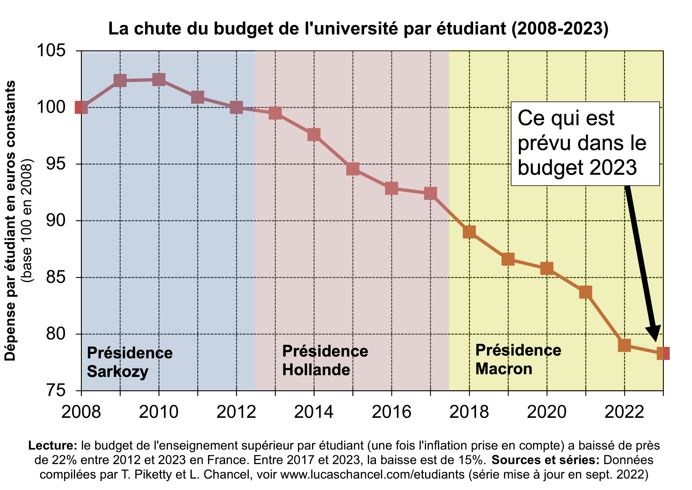

50 ans de massification, et après ?
================
Julien Gossa Université de Strasbourg et CPESR
[@JulienGossa](https://twitter.com/JulienGossa) <gossa@unistra.fr>
02-05-2023

## Massification - Démocratisation - Banalisation

### Le mystère de l’investissement dans l’éducation

Un rendement entre x2 et x4, et pourtant :

### Massification (1960-2000) : Investissements massifs dans l’éducation

<!-- -->

### Massification (1960-2000) : Investissements massifs dans l’éducation

<!-- -->
