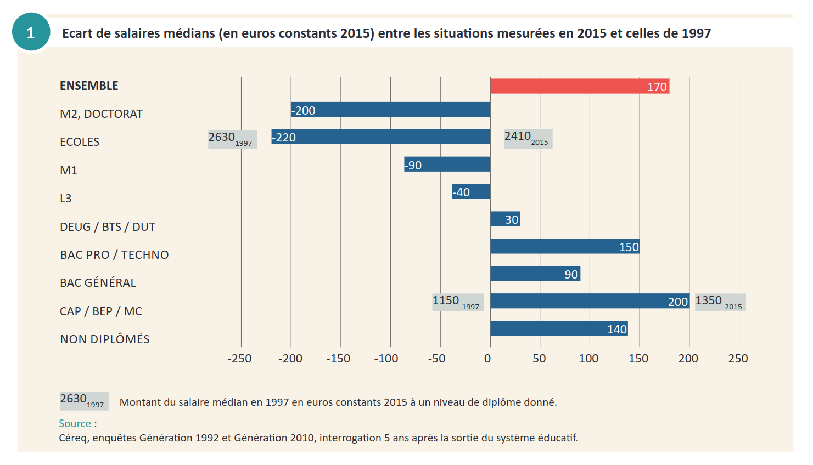
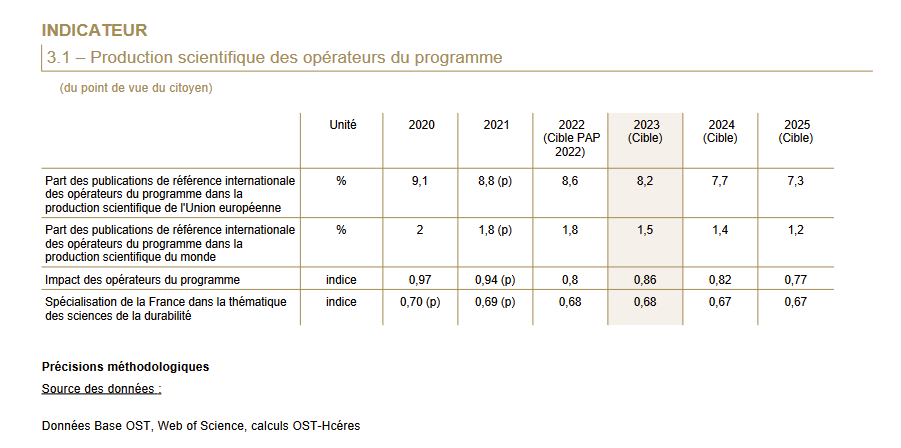

```{r setup, include=FALSE}
knitr::opts_chunk$set(echo = FALSE, warning = FALSE, message = FALSE)
options(dplyr.summarise.inform = FALSE)

knitr::opts_chunk$set(fig.asp=7.5/16, fig.width = 8)

library(tidyverse)
library(ggcpesrthemes)
library(kpiESR)
library(cowplot)
library(geomtextpath)

#theme_set(theme_cpesr() + theme(legend.position = "right", plot.title = element_text(hjust = 0.5)))

load("emploi.RData")
source("tdbesr-plots.R")
source("BL/BLViz-map.R",chdir = TRUE)
```

## Massification - Démocratisation - Banalisation

### Le mystère de l'investissement dans l'éducation

Un rendement entre x2 et x4, et pourtant :

```{r budgetparetu, out.width="60%", fig.align="center"}
knitr::include_graphics("budgetparetu.jpeg")
```

### Massification (1960-2000) : Investissements massifs dans l'éducation

```{r diplome, cache = TRUE}
#Graphique pour connaître le niveau de diplome des jeunes selon l'année civile 
plot_diplome <- function(agemin = 15, agemax = 30, anneemin = 1971, anneemax = 2020) {
  emploi %>%
    filter(Age > agemin, Age < agemax, Annee >= anneemin, Annee <= anneemax) %>%
    mutate(Diplome = factor(Diplome,
                            levels=c("Bac+5","Bac+3","Bac+2","Bac","CAP-BEP","DNB","Aucun"))) %>%
    mutate(Diplome = fct_recode(Diplome,
                                Tertiaire = "Bac+5",
                                Tertiaire = "Bac+3",
                                Tertiaire = "Bac+2",
                                Secondaire = "Bac",
                                Secondaire = "CAP-BEP",
                                Secondaire = "DNB",
                                Primaire = "Aucun") ) %>% 
    group_by(Annee,Diplome) %>%
    summarise(Population = sum(Population)/1e6) %>%
    ungroup() %>%
    na.omit() %>%
    filter(Annee != 1973) %>%
    complete(Annee,Diplome,fill=list(Population = 0)) %>%
    ggplot(aes(x=Annee,y=Population,fill=Diplome,group=Diplome)) +
    geom_area(color="white", alpha=0.6, position = "fill") + 
    geom_vline(xintercept = c(1994,2007)) +
    xlab("Année")
}

plot_diplome(agemin = 25, agemax = 30) +
  scale_y_continuous(labels = scales::percent, name = "Part des jeunes de 25 à 30 ans") +
  cpesr_cap(authors = "Camille Schumacher et Julien Gossa", source = "Enquête emploi INSEE")
```


### Massification (1960-2000) : Investissements massifs dans l'éducation


```{r diplome.2, cache = TRUE}
#Graphique pour connaître le niveau de diplome des jeunes selon l'année civile 
plot_categorie_ponctuel <- function(categorie="Activite", agemin = 15, agemax = 30, anneemin = 1971, anneemax = 2020, fill=TRUE, keep_na=FALSE) {
  if(fill) {
    position_geom <- "fill"
    label_scale <- ~ scales::percent(abs(.x))
    title_y <- "Pourcentage de la population 25-30"
  } else {
    position_geom <- "stack"
    label_scale <- function(x) x/1e6
    title_y <- "Effectif (millions)"
  }
  
  emploi %>%
    filter(Age >= agemin, Age <= agemax, Annee %in% c(anneemin,anneemax)) %>%
        mutate(Diplome = factor(Diplome,
                            levels=c("Bac+5","Bac+3","Bac+2","Bac","CAP-BEP","DNB","Aucun"))) %>%
    mutate(Diplome = fct_recode(Diplome,
                                Tertiaire = "Bac+5",
                                Tertiaire = "Bac+3",
                                Tertiaire = "Bac+2",
                                Secondaire = "Bac",
                                Secondaire = "CAP-BEP",
                                Secondaire = "DNB",
                                Primaire = "Aucun") ) %>% 
    mutate(Diplome = fct_rev(Diplome)) %>%
    group_by(Annee, Sexe, Categorie=!!as.name(categorie)) %>%
    summarise(Population = sum(Population, na.rm=TRUE)) %>%
    { if (!keep_na) na.omit(.) else . } %>%
    { if (fill) group_by(.,Annee) %>% mutate(Population = Population / sum(Population)) else . } %>%
    ungroup() %>%
    complete(Annee, Categorie, fill = list(Population = 0)) %>%
    mutate(Population = ifelse(Sexe == "H",-Population,Population)) %>%
    ggplot(aes(y=Categorie,x=Population,fill=Sexe, group=Sexe)) +
    geom_col(alpha=0.8, color="white",width = 1) + 
    expand_limits(x=c(-0.28,0.28)) +
    facet_grid(.~Annee) +
    scale_x_continuous(labels = label_scale) +
    scale_fill_brewer(palette = "Set2") +
    labs (y = "Diplôme", x = title_y, caption = "Source :Enquête Emploi (1971 - 2020)")
}


plot_categorie_ponctuel(categorie="Diplome", agemin = 25, agemax = 30) +
  #scale_y_continuous(labels = scales::percent, name = "Part des jeunes de 25 à 30 ans") +
  cpesr_cap(authors = "Camille Schumacher et Julien Gossa", source = "Enquête emploi INSEE")
```


### Massification : transformation de la « valeur des diplômes »

```{r cereq, out.width="75%", fig.align="center"}

```

\footnotesize
https://www.cereq.fr/que-gagne-t-se-former-zoom-sur-20-ans-devolution-des-salaires-en-debut-de-vie-active


### Massification (1960-2000) : Investissements massifs dans l'éducation

```{r ens.long}
read.csv("data/sl-ens-sup.csv") %>%
  transmute(Année = as.numeric(annee), 
            EC = statut_ens_chercheurs, 
            Contractuel = statut_total_non_titulaires,
            Total = statut_total) %>%
  pivot_longer(-Année, names_to = "Statut", values_to = "Effectif") %>%
  filter(!is.na(Effectif), Effectif > 0) %>%
  ggplot(aes(x=Année,y=Effectif,color = Statut)) +
  geom_line(size=1) +
  scale_y_continuous(labels = ~ paste(.x/1e3,"k")) +
  ggtitle("Evolution des effectifs enseignants et enseignants-chercheurs du MESR") +
  theme(legend.position = "bottom") +
  cpesr_cap(author = "Julien Gossa et Kévin Hédé", source="https://www.data.gouv.fr/fr/datasets/evolution-du-nombre-de-personnels-enseignants-de-lenseignement-superieur-public/") 
```

### Massification (1960-2000) : Investissements massifs dans l'éducation

```{r etu.long}
read.csv("data/kh-sl_eleves_sup.csv") %>%
  filter(champ_geo!="") %>%
  ggplot(aes(x=annee,y=disc_total, color = champ_geo)) +
  geom_line(size = 1) +
  scale_y_continuous(labels = ~ paste(.x/1e6,"M"), name = "Effectif") +
  scale_color_discrete(name = "Périmètre") +
  ggtitle("Evolution des effectifs étudiants du MESR") +
  theme(legend.position = "bottom") + 
  guides(color=guide_legend(nrow = 2)) +
  cpesr_cap(author = "Julien Gossa et Kévin Hédé", source="Données collectées par Kevin Hédé") 
```

## Tournant vers la « qualité »

### Aujourd'hui : Les objectifs sont atteints, et même dépassés

- 80% d'une classe d'âge au Bac
- 50% d'une classe d'âge diplômée du supérieur


#### Aucun autre objectif n'est fixé : fin de la massification et crise d'utilité

```{r bleus.bac, out.width="75%", fig.align="center"}
knitr::include_graphics("bleus-bac.png")
```

```{r bleus.sup, out.width="75%", fig.align="center"}

```

\tiny

Source : Projet annuel de performances https://www.budget.gouv.fr/documentation/documents-budgetaires/exercice-2022/projet-de-loi-de-finances/budget-general/


### Réussite étudiante : Taux de passage durant le Collège

```{r reu.1, out.height="75%", fig.align="center", fig.show='hold'}
  
```

\tiny
Source : RERS 2022 https://www.education.gouv.fr/reperes-et-references-statistiques-2022-326939

### Réussite étudiante : Taux de passage durant le Lycée

```{r reu.2, out.height="75%", fig.align="center", fig.show='hold'}
  knitr::include_graphics("red-lycee.jpeg")
```

\tiny
Source : RERS 2022 https://www.education.gouv.fr/reperes-et-references-statistiques-2022-326939

### Réussite étudiante : Taux de réussite au Brevet

```{r reu.3, out.height="75%", fig.align="center", fig.show='hold'}
  knitr::include_graphics("reu-brevet.jpeg")
```

\tiny
Source : RERS 2022 https://www.education.gouv.fr/reperes-et-references-statistiques-2022-326939

### Réussite étudiante : Taux de réussite au Baccalauréat

```{r reu.4, out.height="75%", fig.align="center", fig.show='hold'}
  
```

\tiny
Source : RERS 2022 https://www.education.gouv.fr/reperes-et-references-statistiques-2022-326939


### Réussite étudiante : départs des enseignants

```{r dem, out.height="75%", fig.align="center", fig.show='hold'}
  
```

\tiny
Source : BS 2020 https://archives-statistiques-depp.education.gouv.fr/Default/doc/SYRACUSE/51019/bilan-social-2020-2021-du-ministere-de-l-education-nationale-de-la-jeunesse-et-des-sports-partie-1-e


```{r reu, out.width="40%", fig.align="center", fig.show='hold', eval=FALSE}
  knitr::include_graphics(c("red-college.jpeg","red-lycee.jpeg"))
  knitr::include_graphics(c("reu-brevet.jpeg","reu-bac.jpeg"))
```


### Réussite étudiante : Ouverture sociale 

```{r os, out.height="50%", fig.align="center", fig.show='hold'}
  knitr::include_graphics("bleus-ouverture.png")
```

\tiny
Source : Projet annuel de performances https://www.budget.gouv.fr/documentation/documents-budgetaires/exercice-2022/projet-de-loi-de-finances/budget-general/

### Réussite étudiante : Insertion professionnelle

```{r ip, out.height="75%", fig.align="center", fig.show='hold'}
  
```

\tiny
Source : Projet annuel de performances https://www.budget.gouv.fr/documentation/documents-budgetaires/exercice-2022/projet-de-loi-de-finances/budget-general/


### Excellence scientifique : Recherche universitaire

```{r rech.150, out.height="75%", fig.align="center", fig.show='hold'}
  
```

\tiny
Source : Projet annuel de performances https://www.budget.gouv.fr/documentation/documents-budgetaires/exercice-2022/projet-de-loi-de-finances/budget-general/


### Excellence scientifique : Recherche ONR

```{r rech.172, out.height="75%", fig.align="center", fig.show='hold'}
  
```

\tiny
Source : Projet annuel de performances https://www.budget.gouv.fr/documentation/documents-budgetaires/exercice-2022/projet-de-loi-de-finances/budget-general/


### Grands enjeux : Climat 

```{r climat, out.height="75%", fig.align="center", fig.show='hold'}
  knitr::include_graphics("bleus-climat.png")
```

\tiny
Source : Projet annuel de performances https://www.budget.gouv.fr/documentation/documents-budgetaires/exercice-2022/projet-de-loi-de-finances/budget-general/


## Investissement vs. Productivité

### La formation « bouclier contre le chômage » ou « amortisseur » ? Une fuite en avant.

```{r activite, cache = TRUE}
plot_activite <- function(agemin = 15, agemax = 30, anneemin = 1971, anneemax = 2020, pourcent = Population / sum(Population)*100, Pop = Population) {
  emploi %>%
    filter(Age >= agemin, Age <= agemax, Annee >= anneemin, Annee <= anneemax) %>%
    filter(!is.na(Activite)) %>%
    group_by(Annee,Activite) %>%
    summarise(Population = sum(Population, na.rm=TRUE)/1e6) %>%
    filter(Annee > 1974) %>%
    # mutate(Activite = factor(Activite,
    #                          levels=c("Actif occupé","Etudiant","Chômeur ou inactif"))) %>%
    ggplot(aes(x=Annee,y=Population,fill=Activite,color=Activite, group=Activite)) +
    geom_area(alpha=0.7) + labs (x = "Année", y = "Effectif des jeunes de 15 à 30 ans (millions)", caption = "Source :Enquête Emploi (1971 - 2020)")
}

plot_activite(agemin = 15, agemax = 30)  +
  cpesr_cap(authors = "Camille Schumacher et Julien Gossa", source = "Enquête emploi INSEE")
```


### Investissement vs. Productivité : SCSP par étudiant

```{r invest}
kpiESR::esr %>%
  filter(Etablissement %in% c("Université de Strasbourg","Avignon Université"), Rentrée > 2009) %>%
  transmute(
    Etablissement, Rentrée,
    valeur =  kpi.FIN.S.SCSP / kpi.ETU.P.effectif ,
  ) %>%
  mutate(val100 = valeur / first(valeur) * 100) %>%
  ggplot(aes(x=Rentrée, y = valeur, group=Etablissement, color=Etablissement)) +
  geom_line(size=1) + geom_point(size=3, stroke=1, shape=21,fill="white") +
  facet_grid(.~Etablissement) +
  scale_y_continuous(labels = ~ paste0(.x,"€"), name = "SCSP par étudiant", limits = c(6000,8000)) +
  scale_color_brewer(palette = "Dark2") +
  theme(legend.position = "None")

```


### Investissement vs. Productivité : étudiants par SCSP

```{r invest2}
kpiESR::esr %>%
  filter(Etablissement %in% c("Université de Strasbourg","Avignon Université"), Rentrée > 2009) %>%
  transmute(
    Etablissement, Rentrée,
    valeur =  kpi.ETU.P.effectif / kpi.FIN.S.SCSP * 1e6,
  ) %>%
  mutate(val100 = valeur / first(valeur) * 100) %>%
  ggplot(aes(x=Rentrée, y = valeur, group=Etablissement, color=Etablissement)) +
  geom_line(size=1) + geom_point(size=3, stroke=1, shape=21,fill="white") +
  facet_grid(.~Etablissement) +
  scale_y_continuous(name = "Etudiants par M€ SCSP", limits = c(125,166)) +
  scale_color_brewer(palette = "Dark2") +
  theme(legend.position = "None")

```


### Le mystère de l'investissement dans l'éducation : investissement

```{r budgetparetu.1, out.width="60%", fig.align="center"}
knitr::include_graphics("budgetparetu.jpeg")
```

### Le mystère de l'investissement dans l'éducation : productivité

```{r budgetparetu.2, out.width="60%", fig.align="center"}

```


## Situation actuelle

### La fin d'une fuite en avant ?

La politique publique pour la création de places de formation est contradictoire :

- Politique de facilité d'accès à l'enseignement supérieur et de réussite en Licence
- Politique de préservation de la « valeur des diplômes » en Master

```{r LM, fig.asp=9/16, fig.width=7, out.height="65%", fig.align='center'}
load(file="sise.RData")

sise %>%
  group_by(Rentrée,Niveau = paste(LMD, substr(NIVEAU,2,2), sep="")) %>%
  summarise(Etudiants = sum(Etudiants)) %>%
  filter(Niveau %in% c("L3","M1")) %>%
  mutate(Rentrée = ifelse(Niveau == "L3", Rentrée+1,Rentrée)) %>%
  filter(Rentrée != 2012, Rentrée != 2023) %>%
  ggplot(aes(x=Rentrée, y= Etudiants, color=Niveau)) +
  geom_line(linewidth = 1.5) + geom_point(shape = 21, stroke = 2, size = 2, fill="white") + 
  scale_x_continuous(labels = ~ paste0("L3 ", .x-1,"\nM1 ",.x), breaks = seq(2011,2030,2), name="Cohorte") +
  scale_y_continuous(labels = ~ paste0(.x/1e3,"k"), name = "Inscriptions étudiantes") +
  ggtitle("Etudiant⋅e⋅s  inscrit⋅e⋅s en L3 à l'année N et M1 à l'année N+1" )
```

Situation tout à fait unique dans l'histoire de l'humanité... Nous sommes dans l'inconnu.


### RCE et diversification des financements

```{r fin}
kpiESR::kpiesr_plot_line(id = "Universités et assimilés", 
                         vars = c("kpi.FIN.P.ressources", "kpi.FIN.S.SCSP", "kpi.FIN.S.recettesFormation", "kpi.FIN.S.recettesRecherche"), 
                         val = "valeur") +
  #xlim(2013,2021) +
  ylab("Evolution en valeur 100 pour 2013") +
  ggtitle("Effectifs enseignants et étudiants") +
  guides(color = guide_legend(ncol = 1), linetype = FALSE, alpha = FALSE, size = FALSE) +
  theme(legend.position = "right")
```

### « Investissement sans précédent »

```{r fin.sp2}
read.csv2("data/fr-esr-operateurs-indicateurs-financiers.csv", dec='.') %>%
  group_by(Année = exercice) %>%
  summarize(
    Ressources = sum(Produits.de.fonctionnement.encaissables,na.rm=TRUE),
    SCSP = sum(Produits.de.fonctionnement.encaissables,na.rm=TRUE) - sum(Ressources.propres.encaissables,na.rm=TRUE)
    ) %>%
  pivot_longer(-Année, names_to = "Série", values_to = "Valeur") %>%
  filter(Année > 2013) %>%
  ggplot(aes(x=Année,y=Valeur,color=Série)) + 
  geom_smooth(method="lm",se=FALSE, size=0.5) +
  geom_line(linewidth = 1.5) + 
  geom_point(shape=21,size=3,stroke=2, fill="white") +
  scale_y_continuous(labels=~paste(.x/1e9,"Md€")) +
  ggtitle("Resources financières et SCSP des établissements de MESR")
```

```{r fin.sp}
kpiESR::kpiesr_plot_line(id = "Universités et assimilés", 
                         vars = c("kpi.FIN.P.ressources"), 
                         val = "valeur") +
  xlim(2016,2023) + ylim(12e9,16e9) +
  geom_smooth(method = "lm", se=FALSE) +
  ylab("Evolution en valeur 100 pour 2013") +
  ggtitle("Effectifs enseignants et étudiants") +
  guides(color = guide_legend(ncol = 1), linetype = FALSE, alpha = FALSE, size = FALSE) +
  theme(legend.position = "right")
```

### Taux d'encadrement pédagogique des universités

```{r tep}
kpiESR::kpiesr_plot_line(id = "Universités et assimilés", 
                         vars = c("kpi.ENS.P.effectif", "kpi.ENS.S.titulaires", "kpi.ETU.P.effectif", "kpi.K.ensPetu"), 
                         val = "evolution",
                         style = kpiesr_style(legend_wordwrap = 20)) +
  xlim(2013,2020) +
  ylab("Evolution en valeur 100 pour 2013") +
  ggtitle("Effectifs enseignants et étudiants") +
  guides(color = guide_legend(ncol = 1), linetype = FALSE, alpha = FALSE, size = FALSE) +
  theme(legend.position = "right")
```


### Taux d'encadrement administratif des universités

```{r tea}
kpiESR::kpiesr_plot_line(id = "Universités et assimilés", 
                         vars = c("kpi.ENS.P.effectif", "kpi.BIA.P.effectif", "kpi.K.biaPper"), 
                         val = "evolution",
                         style = kpiesr_style(legend_wordwrap = 20)) +
  xlim(2013,2020) +
  ylab("Evolution en valeur 100 pour 2013") +
  ggtitle("Effectifs enseignants et administratifs") +
  guides(color = guide_legend(ncol = 1), linetype = FALSE, alpha = FALSE, size = FALSE) +
  theme(legend.position = "right")
```

### Non poursuites d'études post-bac

```{r nonpoursuites}
read.csv("data/non_poursuites.csv") %>%
  pivot_longer(-Session, names_to = "Filière", values_to = "Non_poursuites") %>%
  mutate(Baccalauréat = factor(Filière, 
                          levels = c("Bac.professionnel","Bac.technologique","Bac.général"),
                          label = c("Professionnel","Technologique","Général"))) %>%
  ggplot(aes(x=Session, y=Non_poursuites, fill = Baccalauréat)) +
  geom_area(color="white", alpha = 0.6) +
  scale_y_continuous(labels = ~ paste(.x/1e3,"k"), name = "Non poursuites post-bac") +
  ggtitle("Nombre de non poursuites d'étude post-bac")
```


### Taux d'engagement dans l'enseignement supérieur (1950)

```{r bl.1950}
bl.map.plot(1950)
```

### Taux d'engagement dans l'enseignement supérieur (2015)

```{r bl.2015}
bl.map.plot(2015)
```

### Population engagée dans l'enseignement supérieur (2015)

```{r bl.2015.abs}
bl.map.plot(2015, abs = TRUE)
```


### IPS / Réussite - Académie de Strasbourg 

```{r college.btb.stras, fig.asp=8/16}
college.ips <- read.csv2("college_ips.csv")

college.ips %>%
  filter(Session == 2021, Libellé.académie == "STRASBOURG") %>%
  mutate(taux.BTB = (Admis.Mention.très.bien+Admis.Mention.bien) / Inscrits) %>%
  mutate(Ville = ifelse(Libellé.commune == "STRASBOURG","Strasbourg","Autre")) %>%
  mutate(Collège = ifelse(Libellé.commune == "STRASBOURG",Patronyme,NA)) %>%
  ggplot(aes(x=IPS,y=taux.BTB,color=Ville, size=Ville)) + 
  geom_point() +
  ggrepel::geom_text_repel(aes(label=Collège), size=2, color = "blue", force = 50) +
  scale_y_continuous(labels = scales::percent, name = "Taux de mention B ou TB au DNB") +
  scale_size_manual(values=(c(1,2))) +
  scale_color_manual(values=(c("grey","blue"))) +
  xlab("Indice de position sociale (IPS)") +
  ggtitle("Collèges de l'académie de Strasbourg", subtitle ="selon leur taux de mention bien ou très bien au DNB et leur indice de position sociale") + 
  cpesr_cap()
```

### IPS - Académie de Strasbourg 

```{r college.ips.stras, out.height="75%", }
knitr::include_graphics("ips-college-strasbourg.png")
```

### ONR et CNRS

```{r onr.load}
onr <- read.csv2("data/fr-esr-tbes-personnels-epst-epic-fondation-par-type-contrat-emploi.csv", dec = ".")
```

```{r onr.cnrs}
onr %>%
  group_by(Année, Statut=Statut.regroupé, ONR = ifelse(Organisme=="CNRS","CNRS","Autre")) %>%
  summarise(ETPT = sum(Effectif.au.31.12..en.ETPT.)) %>%
  group_by(Statut,ONR) %>%
  mutate(val100 = ETPT / first(ETPT) * 100) %>%
  ggplot(aes(x=Année,y=val100,linetype=ONR,color=Statut)) +
  geom_line(linewidth=1.1) + geom_point(shape=21,size=2,stroke=2,fill="white") +
  scale_y_continuous(name="ETPT (valeur 100)") +
  ggtitle("ETPT des ONR en fonction du statut")
```

\footnotesize

https://www.arcgis.com/apps/instant/sidebar/index.html?appid=85b232289e4840fe9e771b79f38cc2b7


