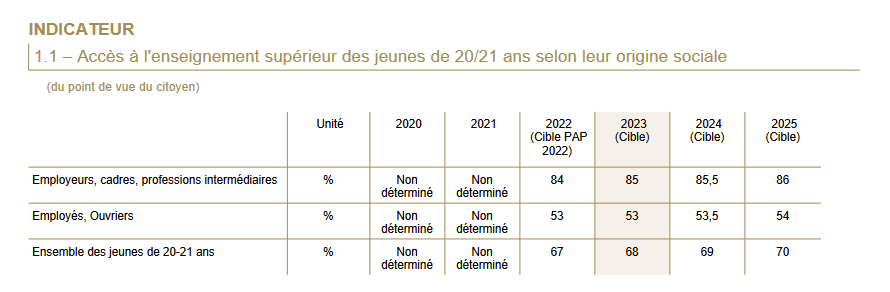
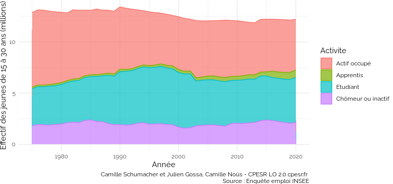
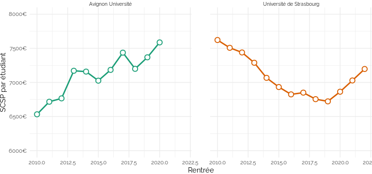
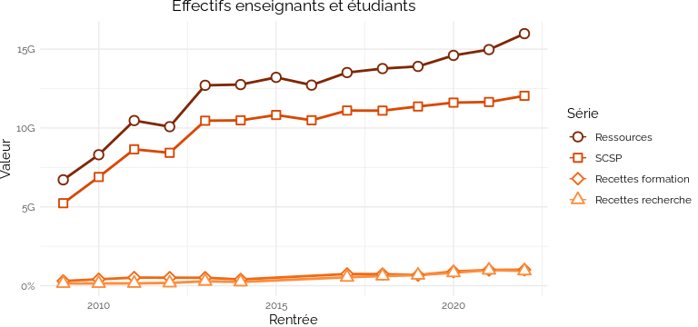
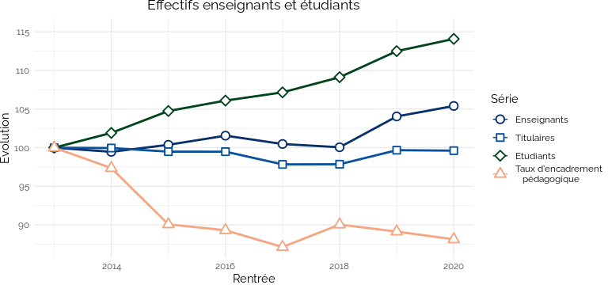
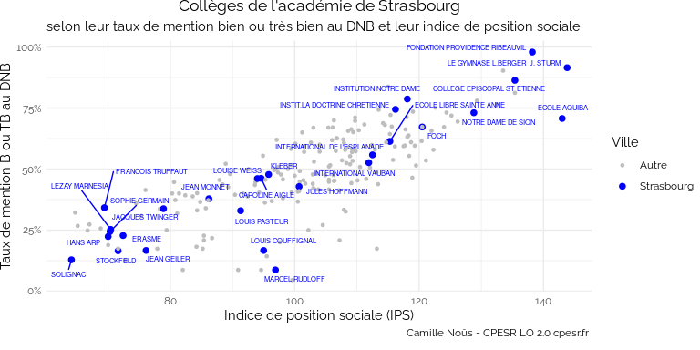
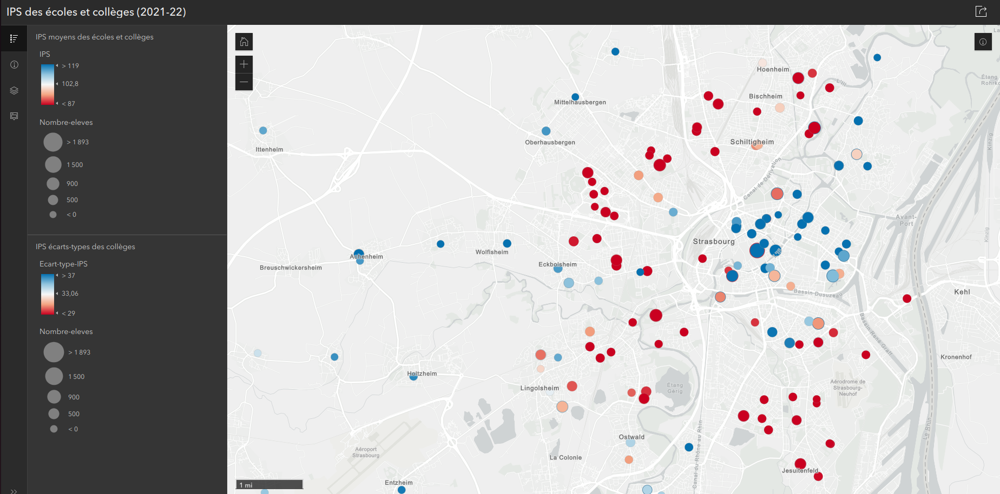

50 ans de massification, et après ?
================
Julien Gossa Université de Strasbourg et CPESR
[@JulienGossa](https://twitter.com/JulienGossa) <gossa@unistra.fr>
02-05-2023

## Massification - Démocratisation - Banalisation

### Le mystère de l’investissement dans l’éducation

Un rendement entre x2 et x4, et pourtant :

### Massification (1960-2000) : Investissements massifs dans l’éducation

<!-- -->

### Massification (1960-2000) : Investissements massifs dans l’éducation

<!-- -->

### Massification (1960-2000) : Investissements massifs dans l’éducation

<!-- -->

### Massification (1960-2000) : Investissements massifs dans l’éducation

<!-- -->

## Tournant vers la « qualité »

### Aujourd’hui : Les objectifs sont atteints, et même dépassés

- 80% d’une classe d’âge au Bac
- 50% d’une classe d’âge diplômée du supérieur

#### Aucun autre objectif n’est fixé : fin de la massification et crise d’utilité

Source : Projet annuel de performances
<https://www.budget.gouv.fr/documentation/documents-budgetaires/exercice-2022/projet-de-loi-de-finances/budget-general/>

### Réussite étudiante : Taux de passage durant le Collège

Source : RERS 2022
<https://www.education.gouv.fr/reperes-et-references-statistiques-2022-326939>

### Réussite étudiante : Taux de passage durant le Lycée

Source : RERS 2022
<https://www.education.gouv.fr/reperes-et-references-statistiques-2022-326939>

### Réussite étudiante : Taux de réussite au Brevet

Source : RERS 2022
<https://www.education.gouv.fr/reperes-et-references-statistiques-2022-326939>

### Réussite étudiante : Taux de réussite au Baccalauréat

Source : RERS 2022
<https://www.education.gouv.fr/reperes-et-references-statistiques-2022-326939>

### Réussite étudiante : départs des enseignants

Source : BS 2020
<https://archives-statistiques-depp.education.gouv.fr/Default/doc/SYRACUSE/51019/bilan-social-2020-2021-du-ministere-de-l-education-nationale-de-la-jeunesse-et-des-sports-partie-1-e>

### Réussite étudiante : Ouverture sociale

Source : Projet annuel de performances
<https://www.budget.gouv.fr/documentation/documents-budgetaires/exercice-2022/projet-de-loi-de-finances/budget-general/>

### Réussite étudiante : Insertion professionnelle

Source : Projet annuel de performances
<https://www.budget.gouv.fr/documentation/documents-budgetaires/exercice-2022/projet-de-loi-de-finances/budget-general/>

### Excellence scientifique : Recherche universitaire

Source : Projet annuel de performances
<https://www.budget.gouv.fr/documentation/documents-budgetaires/exercice-2022/projet-de-loi-de-finances/budget-general/>

### Excellence scientifique : Recherche ONR

Source : Projet annuel de performances
<https://www.budget.gouv.fr/documentation/documents-budgetaires/exercice-2022/projet-de-loi-de-finances/budget-general/>

### Grands enjeux : Climat

Source : Projet annuel de performances
<https://www.budget.gouv.fr/documentation/documents-budgetaires/exercice-2022/projet-de-loi-de-finances/budget-general/>

## Investissement vs. Productivité

### La formation « bouclier contre le chômage » ou « amortisseur » ? Une fuite en avant.

<!-- -->

### Investissement vs. Productivité : SCSP par étudiant

<!-- -->

### Investissement vs. Productivité : étudiants par SCSP

<!-- -->

### Le mystère de l’investissement dans l’éducation : investissement

### Le mystère de l’investissement dans l’éducation : productivité

## Situation actuelle

### La fin d’une fuite en avant ?

La politique publique pour la création de places de formation est
contradictoire :

- Politique de facilité d’accès à l’enseignement supérieur et de
  réussite en Licence
- Politique de préservation de la « valeur des diplômes » en Master

Situation tout à fait unique dans l’histoire de l’humanité… Nous sommes
dans l’inconnu.

### RCE et diversification des financements

<!-- -->

### « Investissement sans précédent »

<!-- -->

<!-- -->

### Taux d’encadrement pédagogique des universités

<!-- -->

### Taux d’encadrement administratif des universités

<!-- -->

### Non poursuites d’études post-bac

<!-- -->

### Taux d’engagement dans l’enseignement supérieur (1950)

<!-- -->

### Taux d’engagement dans l’enseignement supérieur (2015)

<!-- -->

### Population engagée dans l’enseignement supérieur (2015)

<!-- -->

### IPS / Réussite - Académie de Strasbourg

<!-- -->

### IPS - Académie de Strasbourg

### ONR et CNRS

<!-- -->

<https://www.arcgis.com/apps/instant/sidebar/index.html?appid=85b232289e4840fe9e771b79f38cc2b7>
