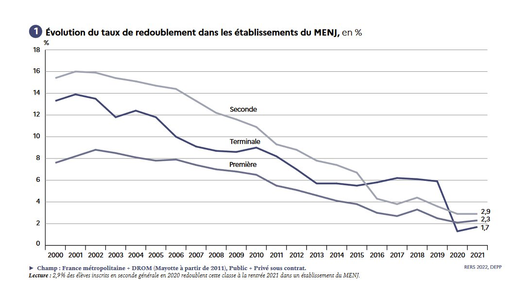
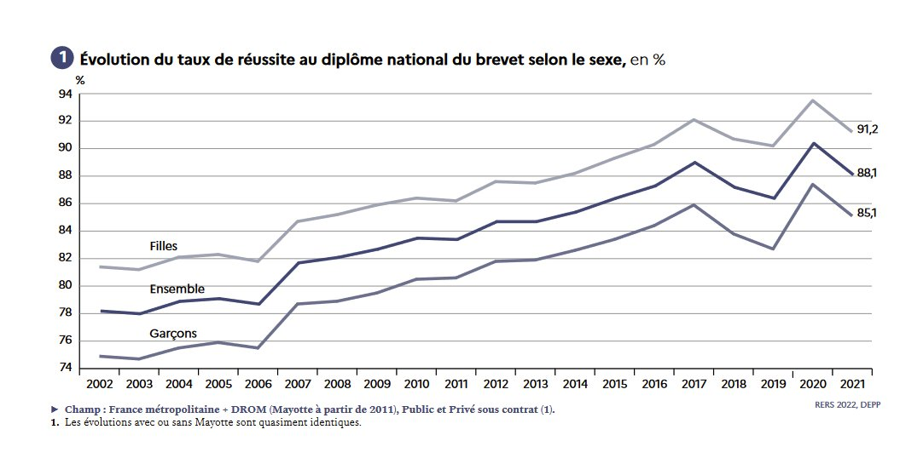
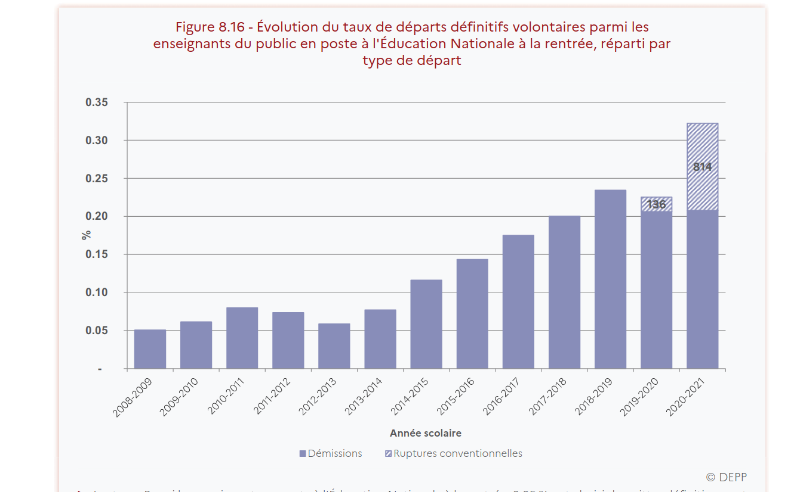

```{r setup, include=FALSE}
knitr::opts_chunk$set(echo = FALSE, warning = FALSE, message = FALSE)
options(dplyr.summarise.inform = FALSE)

knitr::opts_chunk$set(fig.asp=7.5/16, fig.width = 8)

library(tidyverse)
library(ggcpesrthemes)
library(kpiESR)
library(cowplot)

#theme_set(theme_cpesr() + theme(legend.position = "right", plot.title = element_text(hjust = 0.5)))

load("emploi.RData")
source("tdbesr-plots.R")
```


## Le mystère de l'investissement dans l'éducation

Un rendement entre x2 et x4, et pourtant :

```{r budgetparetu, out.width="60%", fig.align="center"}
knitr::include_graphics("budgetparetu.jpeg")
```


# Pré-massification (XII^e^ - XIX^e^) \newline Massification (XIX^e^ - 2000) \newline Post-massification (2000 - )

## Pré-massification : aux racines des universités

- Apparition des universités aux XII^e^ siècle
- En charge de la création des savoirs et de la formation des élites
  - Professionnalisante : Santé, Droit et Théologie
  - Non-professionnalisante : les « Arts » (tout le reste)

### Question de l'autonomie des universitaires aux pouvoirs (et financeurs)

- Religieux
- Municipal
- Politique
- Economique
- Citoyen / Etudiant
- Universités

## Pré-massification : tournant civilisationnel (XVIII^e^ - XIX^e^)
- De la compétition guerrière à la compétition économique
- Mondialisation du commerce et de la production
- Avec de grandes évolutions technologiques et industrielles :
  - Transports
  - Télécommunication
  - Energie
  - Motorisation
  - Agriculture et industrie
  
### Nécessite une montée en qualification de la population
- Des ingénieurs et ouvriers qualifiés plutôt que des prêtres et des soldats
- Moins d'agriculteurs et plus de manufacteurs


## Massification (XIX^e^-1960) : début d'un « Age d'or »

### Après-guerre : de grands débats (Colloques de Caen)
« Massification » (droite) vs. « Démocratisation » (gauche)

### XX^e^ siècle : Cercle vertueux

1. Investissement dans l'éducation
1. Montée en qualification de la main d'œuvre
1. Augmentation de la productivité
1. Croissance économique
1. Investissement dans l'éducation

### Fin XX^e^
Fin de la croyance en ce cercle vertueux


## Massification (1960-2000) : Investissements massifs dans l'éducation

```{r diplome, cache = TRUE}
#Graphique pour connaître le niveau de diplome des jeunes selon l'année civile 
plot_diplome <- function(agemin = 15, agemax = 30, anneemin = 1971, anneemax = 2020) {
  emploi %>%
    filter(Age > agemin, Age < agemax, Annee >= anneemin, Annee <= anneemax) %>%
    mutate(Diplome = factor(Diplome,
                            levels=c("Bac+5","Bac+3","Bac+2","Bac","CAP-BEP","DNB","Aucun"))) %>%
    mutate(Diplome = fct_recode(Diplome,
                                Tertiaire = "Bac+5",
                                Tertiaire = "Bac+3",
                                Tertiaire = "Bac+2",
                                Secondaire = "Bac",
                                Secondaire = "CAP-BEP",
                                Secondaire = "DNB",
                                Primaire = "Aucun") ) %>% 
    group_by(Annee,Diplome) %>%
    summarise(Population = sum(Population)/1e6) %>%
    ungroup() %>%
    na.omit() %>%
    filter(Annee != 1973) %>%
    complete(Annee,Diplome,fill=list(Population = 0)) %>%
    ggplot(aes(x=Annee,y=Population,fill=Diplome,group=Diplome)) +
    geom_area(color="white", alpha=0.6, position = "fill") + 
    geom_vline(xintercept = c(1994,2007)) +
    xlab("Année")
}

plot_diplome(agemin = 25, agemax = 30) +
  scale_y_continuous(labels = scales::percent, name = "Part des jeunes de 25 à 30 ans") +
  cpesr_cap(authors = "Camille Schumacher et Julien Gossa", source = "Enquête emploi INSEE")
```


## Massification (1960-2000) : Investissements massifs dans l'éducation


```{r diplome.2, cache = TRUE}
#Graphique pour connaître le niveau de diplome des jeunes selon l'année civile 
plot_categorie_ponctuel <- function(categorie="Activite", agemin = 15, agemax = 30, anneemin = 1971, anneemax = 2020, fill=TRUE, keep_na=FALSE) {
  if(fill) {
    position_geom <- "fill"
    label_scale <- ~ scales::percent(abs(.x))
    title_y <- "Pourcentage de la population 25-30"
  } else {
    position_geom <- "stack"
    label_scale <- function(x) x/1e6
    title_y <- "Effectif (millions)"
  }
  
  emploi %>%
    filter(Age >= agemin, Age <= agemax, Annee %in% c(anneemin,anneemax)) %>%
        mutate(Diplome = factor(Diplome,
                            levels=c("Bac+5","Bac+3","Bac+2","Bac","CAP-BEP","DNB","Aucun"))) %>%
    mutate(Diplome = fct_recode(Diplome,
                                Tertiaire = "Bac+5",
                                Tertiaire = "Bac+3",
                                Tertiaire = "Bac+2",
                                Secondaire = "Bac",
                                Secondaire = "CAP-BEP",
                                Secondaire = "DNB",
                                Primaire = "Aucun") ) %>% 
    mutate(Diplome = fct_rev(Diplome)) %>%
    group_by(Annee, Sexe, Categorie=!!as.name(categorie)) %>%
    summarise(Population = sum(Population, na.rm=TRUE)) %>%
    { if (!keep_na) na.omit(.) else . } %>%
    { if (fill) group_by(.,Annee) %>% mutate(Population = Population / sum(Population)) else . } %>%
    ungroup() %>%
    complete(Annee, Categorie, fill = list(Population = 0)) %>%
    mutate(Population = ifelse(Sexe == "H",-Population,Population)) %>%
    ggplot(aes(y=Categorie,x=Population,fill=Sexe, group=Sexe)) +
    geom_col(alpha=0.8, color="white",width = 1) + 
    facet_grid(.~Annee) +
    scale_x_continuous(labels = label_scale) +
    scale_fill_brewer(palette = "Set2") +
    labs (y = "Diplôme", x = title_y, caption = "Source :Enquête Emploi (1971 - 2020)")
}


plot_categorie_ponctuel(categorie="Diplome", agemin = 25, agemax = 30) +
  #scale_y_continuous(labels = scales::percent, name = "Part des jeunes de 25 à 30 ans") +
  cpesr_cap(authors = "Camille Schumacher et Julien Gossa", source = "Enquête emploi INSEE")
```


## Aujourd'hui : Les objectifs sont atteints, et même dépassés

- 80% d'une classe d'âge au Bac
- 50% d'une classe d'âge diplômée du supérieur


### Aucun autre objectif n'est fixé : fin de la massification et crise d'utilité

```{r bleus.bac, out.width="75%", fig.align="center"}
knitr::include_graphics("bleus-bac.png")
```

```{r bleus.sup, out.width="75%", fig.align="center"}
knitr::include_graphics("bleus2022-1.1.jpg")
```

\tiny

Source : Projet annuel de performances https://www.budget.gouv.fr/documentation/documents-budgetaires/exercice-2022/projet-de-loi-de-finances/budget-general/

# Post-massification (XXI^e^) \newline Du siècle de la quantité au siècle de la qualité

## XXI^e^ siècle : « Passer du siècle de la quantité au siècle de la qualité »

« _Passer du siècle de la quantité au siècle de la qualité. Passer de la massification à la démocratisation et du même mouvement rendre à notre société les conditions d'une adhésion à l'école sans laquelle il n'y a pas de succès possible_ » - François Bayrou, 1994
\tiny \newline
Source : https://www.vie-publique.fr/discours/137031-declaration-de-m-francois-bayrou-ministre-de-leducation-nationale-su
\normalsize

- Enjeu international / occidental, sans réponse claire jusqu'à présent
- Quantité vs. Qualité


### LOLF : LOI organique n° 2001-692 du 1er août 2001 relative aux lois de finances

- Instaure la « performance » dans l'action publique
- « Nouveau Management Public » (assez faible dans l'ESR)


##  XXI^e^ siècle : « Passer du siècle de la quantité au siècle de la qualité »

:::::: {.cols data-latex=""}
::: {.col data-latex="{0.45\textwidth}"}

Documentation de la performance :

- Rapports sociaux uniques / \newline Bilans sociaux 
- Repères et références statistiques
- Rapports annuels de performances / Bleus budgétaires 

:::
::: {.col data-latex="{0.55\textwidth}"}

```{r bleus, out.height="45%", fig.align="center", fig.show='hold'}
  knitr::include_graphics(c("rsu.png","rers.png","bleus.png"))
```

:::

::::::

### Qualité : trois grands axes, quelques exemples
- Réussite étudiante
- Excellence scientifique
- Grands enjeux : climat, démocratie, émancipation


## Réussite étudiante : Taux de passage durant le Collège

```{r reu.1, out.height="75%", fig.align="center", fig.show='hold'}
  knitr::include_graphics("red-college.jpeg")
```

\tiny
Source : RERS 2022 https://www.education.gouv.fr/reperes-et-references-statistiques-2022-326939

## Réussite étudiante : Taux de passage durant le Lycée

```{r reu.2, out.height="75%", fig.align="center", fig.show='hold'}
  
```

\tiny
Source : RERS 2022 https://www.education.gouv.fr/reperes-et-references-statistiques-2022-326939

## Réussite étudiante : Taux de réussite au Brevet

```{r reu.3, out.height="75%", fig.align="center", fig.show='hold'}
  
```

\tiny
Source : RERS 2022 https://www.education.gouv.fr/reperes-et-references-statistiques-2022-326939

## Réussite étudiante : Taux de réussite au Baccalauréat

```{r reu.4, out.height="75%", fig.align="center", fig.show='hold'}
  knitr::include_graphics("reu-bac.jpeg")
```

\tiny
Source : RERS 2022 https://www.education.gouv.fr/reperes-et-references-statistiques-2022-326939


## Réussite étudiante : départs des enseignants

```{r dem, out.height="75%", fig.align="center", fig.show='hold'}
  
```

\tiny
Source : BS 2020 https://archives-statistiques-depp.education.gouv.fr/Default/doc/SYRACUSE/51019/bilan-social-2020-2021-du-ministere-de-l-education-nationale-de-la-jeunesse-et-des-sports-partie-1-e


```{r reu, out.width="40%", fig.align="center", fig.show='hold', eval=FALSE}
  knitr::include_graphics(c("red-college.jpeg","red-lycee.jpeg"))
  knitr::include_graphics(c("reu-brevet.jpeg","reu-bac.jpeg"))
```


## Réussite étudiante : Ouverture sociale 

```{r os, out.height="50%", fig.align="center", fig.show='hold'}
  knitr::include_graphics("bleus-ouverture.png")
```

\tiny
Source : Projet annuel de performances https://www.budget.gouv.fr/documentation/documents-budgetaires/exercice-2022/projet-de-loi-de-finances/budget-general/

## Réussite étudiante : Insertion professionnelle

```{r ip, out.height="75%", fig.align="center", fig.show='hold'}
  knitr::include_graphics("bleus-ip.png")
```

\tiny
Source : Projet annuel de performances https://www.budget.gouv.fr/documentation/documents-budgetaires/exercice-2022/projet-de-loi-de-finances/budget-general/


## Excellence scientifique : Recherche universitaire

```{r rech.150, out.height="75%", fig.align="center", fig.show='hold'}
  knitr::include_graphics("bleus-rech-150.png")
```

\tiny
Source : Projet annuel de performances https://www.budget.gouv.fr/documentation/documents-budgetaires/exercice-2022/projet-de-loi-de-finances/budget-general/


## Excellence scientifique : Recherche ONR

```{r rech.172, out.height="75%", fig.align="center", fig.show='hold'}
  knitr::include_graphics("bleus-rech-172.png")
```

\tiny
Source : Projet annuel de performances https://www.budget.gouv.fr/documentation/documents-budgetaires/exercice-2022/projet-de-loi-de-finances/budget-general/


## Grands enjeux : Climat 

```{r climat, out.height="75%", fig.align="center", fig.show='hold'}
  knitr::include_graphics("bleus-climat.png")
```

\tiny
Source : Projet annuel de performances https://www.budget.gouv.fr/documentation/documents-budgetaires/exercice-2022/projet-de-loi-de-finances/budget-general/


## Quelle « qualité » pour l'action publique dans l'ESR (selon la LOLF) ?

- Réussite : passer le moins de temps possible dans le système éducatif
- Excellence scientifique : pas trop s'effondrer (ou moins vite que les autres)
- Grands enjeux : rien

### Peu d'ambition : qualité du XX^e^, des indicateurs adaptés à la massification

- Vision optimiste : décision consciente de stagner
- Vision pessimiste : incapacité à adapter la performance à l'époque

### Angles morts / perspectives d'amélioration 

- Aspects qualitatifs : QVT, bonheur, qualité de l'enseignement ou de la recherche, etc.
  - très compliqués à évaluer (presque autant que l'insertion pro.)
- Libertés académiques et conditions d'étude
  - Sans doute des choses à faire

# Conclusion : le mystère est-il éclairci ?

## Le mystère de l'investissement dans l'éducation

Deux éléments de réponse et une inquiétude :

- La formation, bouclier contre le chômage ou amortisseur de flux ?
- La formation, investissement ou productivité ?
- La fin de la fuite en avant ?

```{r budgetparetu2, out.width="50%", fig.align="center"}
knitr::include_graphics("budgetparetu.jpeg")
```


## La formation « bouclier contre le chômage » ou « amortisseur » ? Une fuite en avant.

```{r activite, cache = TRUE}
plot_activite <- function(agemin = 15, agemax = 30, anneemin = 1971, anneemax = 2020, pourcent = Population / sum(Population)*100, Pop = Population) {
  emploi %>%
    filter(Age >= agemin, Age <= agemax, Annee >= anneemin, Annee <= anneemax) %>%
    filter(!is.na(Activite)) %>%
    group_by(Annee,Activite) %>%
    summarise(Population = sum(Population, na.rm=TRUE)/1e6) %>%
    filter(Annee > 1974) %>%
    # mutate(Activite = factor(Activite,
    #                          levels=c("Actif occupé","Etudiant","Chômeur ou inactif"))) %>%
    ggplot(aes(x=Annee,y=Population,fill=Activite,color=Activite, group=Activite)) +
    geom_area(alpha=0.7) + labs (x = "Année", y = "Effectif des jeunes de 15 à 30 ans (millions)", caption = "Source :Enquête Emploi (1971 - 2020)")
}

plot_activite(agemin = 15, agemax = 30)  +
  cpesr_cap(authors = "Camille Schumacher et Julien Gossa", source = "Enquête emploi INSEE")
```


## Investissement vs. Productivité : SCSP par étudiant

```{r invest}
kpiESR::esr %>%
  filter(Etablissement %in% c("Université de Strasbourg","Avignon Université"), Rentrée > 2009) %>%
  transmute(
    Etablissement, Rentrée,
    valeur =  kpi.FIN.S.SCSP / kpi.ETU.P.effectif ,
  ) %>%
  mutate(val100 = valeur / first(valeur) * 100) %>%
  ggplot(aes(x=Rentrée, y = valeur, group=Etablissement, color=Etablissement)) +
  geom_line(size=1) + geom_point(size=3, stroke=1, shape=21,fill="white") +
  facet_grid(.~Etablissement) +
  scale_y_continuous(labels = ~ paste0(.x,"€"), name = "SCSP par étudiant", limits = c(6000,8000)) +
  scale_color_brewer(palette = "Dark2") +
  theme(legend.position = "None")

```


## Investissement vs. Productivité : étudiants par SCSP

```{r invest2}
kpiESR::esr %>%
  filter(Etablissement %in% c("Université de Strasbourg","Avignon Université"), Rentrée > 2009) %>%
  transmute(
    Etablissement, Rentrée,
    valeur =  kpi.ETU.P.effectif / kpi.FIN.S.SCSP * 1e6,
  ) %>%
  mutate(val100 = valeur / first(valeur) * 100) %>%
  ggplot(aes(x=Rentrée, y = valeur, group=Etablissement, color=Etablissement)) +
  geom_line(size=1) + geom_point(size=3, stroke=1, shape=21,fill="white") +
  facet_grid(.~Etablissement) +
  scale_y_continuous(name = "Etudiants par M€ SCSP", limits = c(125,166)) +
  scale_color_brewer(palette = "Dark2") +
  theme(legend.position = "None")

```

## La fin d'une fuite en avant ?

La politique publique pour la création de places de formation est contradictoire :

- Politique de facilité d'accès à l'enseignement supérieur et de réussite en Licence
- Politique de préservation de la « valeur des diplômes » en Master

```{r LM, fig.asp=5/16}
load(file="sise.RData")

sise %>%
  group_by(Rentrée,Niveau = paste(LMD, substr(NIVEAU,2,2), sep="")) %>%
  summarise(Etudiants = sum(Etudiants)) %>%
  filter(Niveau %in% c("L3","M1")) %>%
  mutate(Rentrée = ifelse(Niveau == "L3", Rentrée+1,Rentrée)) %>%
  filter(Rentrée != 2012, Rentrée != 2022) %>%
  ggplot(aes(x=Rentrée, y= Etudiants, color=Niveau)) +
  geom_line(linewidth = 1.5) + geom_point(shape = 21, stroke = 2, size = 2, fill="white") + 
  scale_x_continuous(labels = ~ paste0("L3 ", .x-1,"\nM1 ",.x), breaks = seq(2011,2030,2), name="Cohorte") +
  scale_y_continuous(labels = ~ paste0(.x/1e3,"k"), name = "Inscriptions étudiantes") +
  ggtitle("Etudiant⋅e⋅s  inscrit⋅e⋅s en L3 à l'année N et M1 à l'année N+1" )
```

Situation tout à fait unique dans l'histoire de l'humanité... Nous sommes dans l'inconnu.
