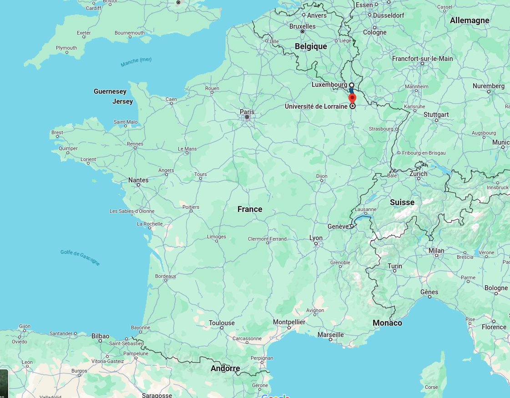

```{r setup, include=FALSE}
knitr::opts_chunk$set(echo = FALSE, warning = FALSE, message = FALSE)
options(dplyr.summarise.inform = FALSE)
knitr::opts_chunk$set(fig.asp=9/16, fig.width = 7, fig.align = "center", out.height = "85%")
  
library(tidyverse)
library(ggcpesrthemes)
theme_set(theme_cpesr() + theme(plot.title = element_text(hjust=1),plot.subtitle = element_text(hjust=1)))
theme_cpesr_setup(authors = "Julien Gossa", source = "https://github.com/cpesr/RFC/")


```

## Contexte : « GPEC de la nation » et « Acte II de l'autonomie »

« _Est-ce que cette formation permet de former des jeunes et de leur fournir un emploi ? [...] Donc on doit réallouer les choses_ » - E. Macron

« _L’enjeu est de préserver le taux d’insertion professionnelle_ » - F. Vidal

```{r l3m1.decal, out.height="60%"}
load("sise.RData")
sise %>%
  group_by(Rentrée,Niveau = paste(LMD, substr(NIVEAU,2,2), sep="")) %>%
  summarise(Etudiants = sum(Etudiants)) %>%
  filter(Niveau %in% c("L3","M1")) %>%
  mutate(Rentrée = ifelse(Niveau == "L3", Rentrée+1,Rentrée)) %>%
  filter(Rentrée != 2012, Rentrée != 2023) %>%
  ggplot(aes(x=Rentrée, y= Etudiants, color=Niveau)) +
  geom_line(linewidth = 1.5) + geom_point(shape = 21, stroke = 2, size = 2, fill="white") + 
  scale_x_continuous(labels = ~ paste0("L3 ", .x-1,"\nM1 ",.x), breaks = seq(2011,2030,2), name="Cohorte") +
  scale_y_continuous(labels = ~ paste0(.x/1e3,"k"), name = "Inscriptions étudiantes") +
  ggtitle("Etudiant⋅e⋅s  inscrit⋅e⋅s en L3 à l'année N et M1 à l'année N+1" )
```


## Insertion pro. vs Taux d'emploi vs. Taux d'emploi salarié en France
 
### Taux d'insertion (Enquête Insert Pro)

Part des diplômés occupant un emploi, quel qu'il soit, sur l'ensemble des diplômés présents sur le marché du travail. Il est calculé sur les diplômés de nationalité française, issus de la formation initiale, entrés immédiatement et durablement sur le marché du travail après l'obtention de leur diplôme. 

### Taux d'emploi (Enquête Insert Pro)

Part des diplômés occupant un emploi, quel qu’il soit, parmi l'ensemble des diplômés actifs (en emploi ou en recherche) **ou inactifs**. 

### Taux d'emploi salarié en France (InserSup)

Part des diplômés en emploi **salarié en France** parmi l'ensemble des diplômés actifs (en emploi ou en recherche) **ou inactifs**.

## Concrètement : par grand secteur disciplinaire

```{r tdx.dom}
load("insertion-pro.RData")
ipmn %>%
  filter(str_detect(Secteur.disciplinaire,"Ensemble")) %>% 
  mutate(Ensemble=str_detect(Domaine,"Ensemble")) %>%
  mutate(diff=Taux.d.emploi.salarié.en.France-Taux.d.insertion) %>%
  pivot_taux() %>%
  ggplot(aes(x=Code.du.domaine,y=Valeur,fill=Domaine, color=Ensemble)) +
  geom_col(alpha=0.8) +
  scale_x_discrete(name="") +
  scale_y_continuous(labels = ~ scales::percent(.x/100), name="Taux") +
  scale_color_manual(values=c("white","black")) +
  facet_grid(.~Indicateur) +
  expand_limits(y=100) +
  theme(legend.position = "None") +
  ggtitle("Comparaison des trois taux des diplômés de Master","Diplômés de la session 2020, à 30 mois, hors Master d'enseignement") 
```

## Concrètement : par disciplines

```{r tdx.disc}
df <- ipmn %>%
  mutate(Ensemble=str_detect(Secteur.disciplinaire,"Ensemble")) %>%
  filter(!is.na(Taux.d.insertion)) %>%
  arrange(desc(Taux.d.emploi.salarié.en.France))

  bind_rows(
    slice_head(df,n=5),
    slice_tail(df,n=5),
  ) %>%
  group_by(Secteur.disciplinaire) %>%
  pivot_taux() %>%
  ungroup() %>%
  ggplot(aes(x=Valeur,y=reorder(Secteur.disciplinaire,-Valeur, FUN=max),color=Indicateur)) +
  geom_line(color="grey",size=2) + geom_point(aes(shape=Indicateur),size=4) +
  scale_x_continuous(name="Taux",label=~scales::percent(.x/100)) +
  scale_y_discrete(name="",limits=rev) +
  scale_color_discrete(guide = guide_legend(reverse = TRUE)) +
  scale_shape_discrete(guide = guide_legend(reverse = TRUE)) +
  ggtitle("Comparaison des trois taux des diplômés de Master pas discipline","Diplômés de la session 2020, à 30 mois, hors Master d'enseignement") 

```


## Concrètement : par établissement

```{r tds.vs.tip3}
df <- ipm %>%
  filter(!is.na(Taux.de.chômage.régional), !is.na(Taux.d.insertion)) %>%
  filter(str_detect(Discipline,"Ensemble")) %>%
  arrange(desc(Taux.d.emploi.salarié.en.France))

  bind_rows(
    slice_head(df,n=5),
    slice_tail(df,n=5),
  ) %>%
  group_by(Établissement) %>%
  summarise_taux() %>%
  ggplot(aes(x=Valeur,y=reorder(Établissement,Valeur,FUN = min),color=Indicateur)) +
  geom_line(color="grey",size=2) + geom_point(aes(shape=Indicateur),size=4) +
  scale_x_continuous(name="Taux",label=~scales::percent(.x/100)) +
  ylab("") +
  scale_color_discrete(guide = guide_legend(reverse = TRUE)) +
  scale_shape_discrete(guide = guide_legend(reverse = TRUE)) +
  ggtitle("Comparaison des trois taux des diplômés de Master par établissement","Diplômés de la session 2020, à 30 mois, hors Master d'enseignement") 
```

## Concrètement : en Lorraine

```{r lorraine2}
ipm %>%
  filter(Établissement == "Lorraine") %>%
  mutate(Ensemble = str_detect(Discipline,"Ensemble")) %>%
  filter(!is.na(Taux.d.insertion)) %>%
  group_by(Discipline) %>%
  summarise_taux() %>%
  ggplot(aes(x=Valeur,y=reorder(Discipline,Valeur,FUN = min),color=Indicateur)) +
  geom_line(color="grey",size=2) + geom_point(aes(shape=Indicateur),size=4) +
  scale_x_continuous(name="Taux",label=~scales::percent(.x/100)) +
  ylab("") +
  scale_color_discrete(guide = guide_legend(reverse = TRUE)) +
  scale_shape_discrete(guide = guide_legend(reverse = TRUE)) +
  ggtitle("Comparaison des trois taux des diplômés de Master à l'Université de Lorraine","Diplômés de la session 2020, à 30 mois, hors Master d'enseignement")
```

## Concrètement : en Lorraine




## Concrètement : Besançon

```{r BFC}
ipm %>%
  filter(Établissement == "Besançon - Franche-Comté") %>%
  mutate(Ensemble = str_detect(Discipline,"Ensemble")) %>%
  filter(!is.na(Taux.d.insertion)) %>%
  group_by(Discipline) %>%
  summarise_taux() %>%
  ggplot(aes(x=Valeur,y=reorder(Discipline,Valeur,FUN = min),color=Indicateur)) +
  geom_line(color="grey",size=2) + geom_point(aes(shape=Indicateur),size=4) +
  scale_x_continuous(name="Taux",label=~scales::percent(.x/100)) +
  ylab("") +
  scale_color_discrete(guide = guide_legend(reverse = TRUE)) +
  scale_shape_discrete(guide = guide_legend(reverse = TRUE)) +
  ggtitle("Comparaison des trois taux des diplômés de Master à l'Université de Besançon - Franche-Comté","Diplômés de la session 2020, à 30 mois, hors Master d'enseignement")
```


## Biais Enquête vs. Techno

- Enquête
  - Imperfections (taux et qualité des réponses)
  - Chanstique
  
- Techno
  - Aveugle à des pans entiers du problème (généralement l'humain)

- Incontournable
  - localisation géographique
  - nature des activités dans le secteur économique
  - nature des étudiants

### Diversité de situations
Possibilité que *toutes* les formations aient une explication légitime.

### Supposons
Que les biais soient contrôlés et les indicateurs parfaits.


## Concrètement : Taux de féminité

```{r}
load("ipmn_taux.RData")
ipmn.taux %>%
  ggplot(aes(x=Taux.Féminité,y=Taux.d.emploi.salarié.en.France)) + 
  geom_smooth(method = "lm", size=0.1) + geom_point(size=2) +
  ggrepel::geom_text_repel(aes(label=Secteur.disciplinaire), size=2) +
  scale_x_continuous(labels = scales::percent, name = "Taux de féminité") +
  scale_y_continuous(labels = ~ scales::percent(.x,scale=1), name= "Taux d'emploi salarié en France")
```


## Concrètement : Taux de bacheliers non-généraux

```{r}
ipmn.taux %>%
  mutate(Taux.NonBacGénéral = 1 - Taux.BacGénéral) %>%
  ggplot(aes(x=Taux.NonBacGénéral,y=Taux.d.emploi.salarié.en.France)) + 
  geom_smooth(method = "lm", size=0.1) + geom_point(size=2) +
  ggrepel::geom_text_repel(aes(label=Secteur.disciplinaire), size=2) +
  scale_x_continuous(labels = scales::percent, name = "Taux de bacheliers non généraux") +
  scale_y_continuous(labels = ~ scales::percent(.x,scale=1), name= "Taux d'emploi salarié en France")
```

## Conclusion : Loi de Goodhart

\centering 
« _lorsqu'une mesure devient un objectif, elle cesse d'être une bonne mesure_ »

