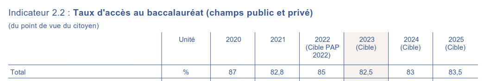
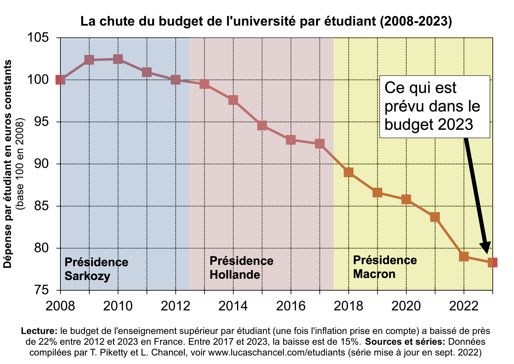
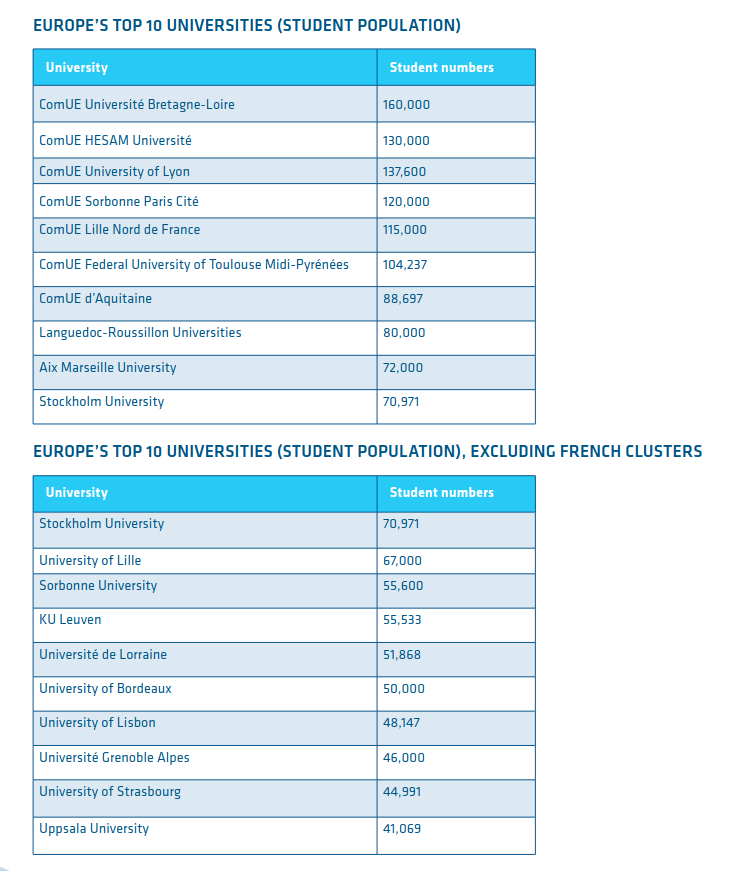

```{r setup, include=FALSE}
knitr::opts_chunk$set(echo = FALSE, warning = FALSE, message = FALSE)
options(dplyr.summarise.inform = FALSE)

knitr::opts_chunk$set(fig.asp=8/16)

library(tidyverse)
library(ggcpesrthemes)
library(kpiESR)

theme_set(theme_cpesr() + theme(legend.position = "right"))

load("emploi.RData")
```

# Pré-massification (XIIe - XIXe)

## Aux racines des universités

- Apparition des universités aux XIIe siècle
- Professionnalisante : Santé, Droit et Théologie
- Non-professionnalisante : les « Arts » (tout le reste)

### Question de l'autonomie des universitaires aux pouvoirs (et financeurs)

- Religieux
- Municipal
- Politique
- Economique
- Citoyen / Etudiant


## Tournant civilisationnel 
- De la compétition guerrière à la compétition économique
- Mondialisation du commerce et de la production
- Avec de grandes évolutions technologiques et industrielles :
  - Transports
  - Télécommunication
  - Energie
  - Motorisation
  - Agriculture et industrie
  
### Nécessite une montée en qualification de la population
- Des ingénieurs et ouvrier qualifiés plutôt que des généraux et des soldats
- Moins d'agriculteurs et plus d'ouvriers


# Massification (XIXe-1960, 1960-2000)

## Investissements massifs dans l'éducation : « Age d'or »

```{r diplome, cache = TRUE}
#Graphique pour connaître le niveau de diplome des jeunes selon l'année civile 
plot_diplome <- function(agemin = 15, agemax = 30, anneemin = 1971, anneemax = 2020) {
  emploi %>%
    filter(Age > agemin, Age < agemax, Annee >= anneemin, Annee <= anneemax) %>%
    group_by(Annee,Diplome) %>%
    summarise(Population = sum(Population)/1e6) %>%
    mutate(Diplome = factor(Diplome,
                            levels=c("Bac+5","Bac+3","Bac+2","Bac","CAP-BEP","DNB","Aucun"))) %>%
    ungroup() %>%
    na.omit() %>%
    filter(Annee != 1973) %>%
    complete(Annee,Diplome,fill=list(Population = 0)) %>%
    ggplot(aes(x=Annee,y=Population,fill=Diplome,group=Diplome)) +
    geom_area(color="white", alpha=0.6, position = "fill") + 
    xlab("Année")
}

plot_diplome(agemin = 25, agemax = 30) +
  scale_y_continuous(labels = scales::percent, name = "Part des jeunes de 25 à 30 ans") +
  cpesr_cap(authors = "Camille Schumacher et Julien Gossa", source = "Enquête emploi INSEE")
```

## La formation « bouclier contre le chômage » ?

```{r activite, cache = TRUE}
plot_activite <- function(agemin = 15, agemax = 30, anneemin = 1971, anneemax = 2020, pourcent = Population / sum(Population)*100, Pop = Population) {
  emploi %>%
    filter(Age >= agemin, Age <= agemax, Annee >= anneemin, Annee <= anneemax) %>%
    filter(!is.na(Activite)) %>%
    group_by(Annee,Activite) %>%
    summarise(Population = sum(Population, na.rm=TRUE)/1e6) %>%
    filter(Annee > 1974) %>%
    # mutate(Activite = factor(Activite,
    #                          levels=c("Actif occupé","Etudiant","Chômeur ou inactif"))) %>%
    ggplot(aes(x=Annee,y=Population,fill=Activite,color=Activite, group=Activite)) +
    geom_area(alpha=0.7) + labs (x = "Année", y = "Effectif des jeunes de 15 à 30 ans (millions)", caption = "Source :Enquête Emploi (1971 - 2020)")
}

plot_activite(agemin = 15, agemax = 30)  +
  cpesr_cap(authors = "Camille Schumacher et Julien Gossa", source = "Enquête emploi INSEE")
```

## Les objectifs sont atteints, et même dépassés

- 80% d'une classe d'âge au Bac
- 50% d'une classe d'âge diplômée du supérieur

### Aucun autre objectif n'est fixé : fin de la massification et crise d'utilité

```{r bleus.bac, out.width="80%", fig.align="center"}

```

```{r bleus.sup, out.width="80%", fig.align="center"}
knitr::include_graphics("bleus2022-1.1.jpg")
```

\tiny

Source : Bleus budgétaires https://www.budget.gouv.fr/documentation/documents-budgetaires/exercice-2022/projet-de-loi-de-finances/budget-general/

# Post-massification (XXIe)

## Passer du siècle de la quantité au siècle de la qualité.

« _Passer du siècle de la quantité au siècle de la qualité. Passer de la massification à la démocratisation et du même mouvement rendre à notre société les conditions d'une adhésion à l'école sans laquelle il n'y a pas de succès possible_ » - François Bayrou, 1994

- Enjeu international / occidental, sans réponse claire jusqu'à présent
- Quantité vs. Qualité

### Qualité
- Réussite étudiante
- Autonomie
- Politiques d'Excellence
- Budget et statuts

## Réussite étudiante : d'un contrôle pédagogique à un contrôle administratif

```{r reu, out.width="40%", fig.align="center", fig.show='hold'}
  knitr::include_graphics(c("red-college.jpeg","red-lycee.jpeg"))
  knitr::include_graphics(c("reu-brevet.jpeg","reu-bac.jpeg"))
```

\tiny
Source : RERS 2022 https://www.education.gouv.fr/reperes-et-references-statistiques-2022-326939

## Autonomie : plus de liberté de recrutement pour les présidences d'université

- Loi LRU (2007) et RCE (Responsabilités et compétences élargies)
- Transfer de la masse salariale aux universités
  - Développement (coûteux) de compétences internes

```{r rce, fig.asp=6/16}
kpiESR::esr.pnl %>%
  filter(pid == "Ensemble", kpi %in% c("kpi.FIN.P.ressources","kpi.FIN.S.masseSalariale")) %>%
  filter(!is.na(valeur)) %>%
  ggplot(aes(x=Rentrée,y=valeur,color=kpi,group=kpi)) +
  geom_line(size=1) + geom_point(shape=21, size=3, fill="white", stroke=1) +
  expand_limits(y=0) +
  scale_y_continuous(labels = ~ paste(.x / 1e9,"Md€"), name = "Budget des établissements") +
  scale_color_discrete(labels = c("Budget total","Masse salariale")) +
  cpesr_cap(authors = "Julien Gossa", source = "SIES https://data.enseignementsup-recherche.gouv.fr/explore/dataset/fr-esr-operateurs-indicateurs-financiers/export/")
  
```


## Autonomie : plus de responsabilités des universités

- Loi LRU (2007) et RCE (Responsabilités et compétences élargies)
- Transfer de la masse salariale aux universités
  - Inflation des coûts de fonctionnement et de main d'œuvre
  
```{r inflation, out.height="70%", fig.align='center'}
  
```


## Autonomie : moins de responsabilité de l'Etat

- Loi LRU (2007) et RCE (Responsabilités et compétences élargies)
- Transfer de la masse salariale aux universités
  - Déresponsabilisation de l'Etat face à la démographie
  
```{r tda, fig.asp=5.5/16, fig.align='center'}
kpiESR::esr.pnl %>%
  filter(pid == "Ensemble", kpi %in% c("kpi.ETU.P.effectif","kpi.ENS.P.effectif","kpi.K.ensPetu")) %>%
  filter(!is.na(evolution), Rentrée <= 2020) %>%
  ggplot(aes(x=Rentrée,y=evolution,color=kpi,group=kpi)) +
  geom_line(size=1) + geom_point(shape=21, size=3, fill="white", stroke=1) +
  scale_y_continuous(name = "Evolution (valeur 100 en 2013)") +
  scale_color_discrete(labels = c("Enseignants","Etudiants","Taux d'encadrement")) +
  cpesr_cap(authors = "Julien Gossa", source = "SIES")
  
```


## Politiques d'Excellence

PIA : Le Programme Investissements d'Avenir (4 éditions, ~ 50Md€ pour l'ESR)

:::::: {.cols data-latex=""}

::: {.col data-latex="{0.7\textwidth}"}

- __ANR (Agence Nationale de la Recherche)__
  - Financement par projet, mais trop faible 
  - Chronophage, injuste et __sans preuve d'efficacité__
- __AERES / Hcéres : Évaluation__
  - Chronophage, juste, mais toujours __sans preuve d'efficacité__
- __IDEX (Initiative d'Excellence)__
  - « 10 pôles pluridisciplinaires d’excellence de rang mondial »
  - Politique de différenciation des établissements 
    - Différenciation en réalité interne
    - En fait, surtout encourager les transformations (fusions) 
    - Et diminuer la voilure du service public
  - __Pas de preuve d'efficacité en terme d'enseignement et de recherche__
  
:::

::: {.col data-latex="{0.3\textwidth}"}

:::

::::::


## Budget et statuts : transformation de fond


```{r rp, fig.asp=7/16, fig.align='center'}
kpiESR::esr.pnl %>%
  filter(pid == "Universités et assimilés", kpi %in% c("kpi.K.titPper","kpi.K.dotPres")) %>%
  filter(!is.na(evolution), Rentrée <= 2021) %>%
  ggplot(aes(x=Rentrée,y=valeur,color=kpi,group=kpi)) +
  geom_line(size=1) + geom_point(shape=21, size=3, fill="white", stroke=1) +
  scale_y_continuous(name = "Valeur", labels=scales::percent) +
  expand_limits(y=c(0.6,0.85)) +
  scale_color_discrete(labels = c("Taux de SCSP","Taux de titularité"), name="Indicateur") +
  cpesr_cap(authors = "Julien Gossa", source = "SIES")
  
```

## Perspectives politiques : Recherche

### Loi de programmation de la recherche (2020)
- Un « investissement historique » discutable
- Pas de rééquilibrage des budgets récurrents / performants
- Une fragilisation des régulations de la profession 
- Rien sur la structuration de la recherche

### Structuration de la recherche
- Équilibre fondamental / innovation
- Rapport universités / ONR
- Une réforme du CNRS ?


## Perspectives politiques : Formation

### Parcoursup (2018)
- « Meilleure » orientation (quantité vs. qualité)
- Meilleur contrôle _de l'Etat_ sur les flux de jeunes entre le Lycée et le supérieur
- Suppression du DUT et réforme des études de santé
- Développement rapide du secteur privé, financé par la BPI
- Sinon pas de modifications substantielles jusqu'à présent

### Parcoursup-Master (2022)
- Trop d'accès en Master = baisse de la valeur du diplôme
- Pas assez d'accès = des « jeunes sur le carreau »
- Pas de solution

### Apprentissage / alternance (2019)
- Développement sans précédent, probablement incontrôlé, inefficace pour l'emploi
- Réel risque de casser le dispositif


# Saint-Etienne

## Université Jean-Monnet : Budget et Personnels

```{r se, cache = TRUE}
kpiesr_plot_map(2020,"tIJ02","Université","kpi.FIN.P.ressources","kpi.ENS.P.effectif+kpi.BIA.P.effectif", ylabel = 6000) +
  scale_x_continuous(labels = ~ paste(.x/1e6,"M€")) +
  xlab("Budget") + ylab("Personnels")
```

## Université Jean-Monnet : Budget par étudiant et Taux d'encadrement

```{r se2, cache = TRUE}
kpiesr_plot_map(2020,"tIJ02","Université","kpi.K.resPetu","kpi.K.ensPetu", xlabel = 4000, ylabel = 5) +
  xlab("Budget par étudiant") + ylab("Taux d'encadrement")
```


## Université Jean-Monnet : Ressources propres formation et recherche

```{r rprf, cache = TRUE}
kpiesr_plot_map(2019,"tIJ02","Université","kpi.K.recPect","kpi.K.forPetu", xlabel = 20000, ylabel = 600) +
  xlab("Ressources propres recherche") + ylab("Ressources propres formation")
```
