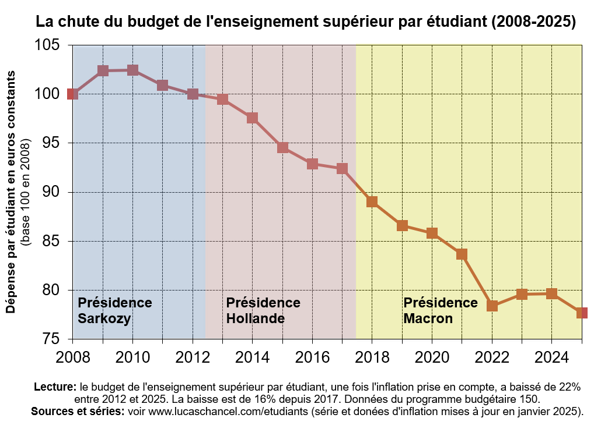

```{r setup, include=FALSE}
knitr::opts_chunk$set(echo = TRUE)

knitr::opts_chunk$set(echo = FALSE, warning = FALSE, message = FALSE)
options(dplyr.summarise.inform = FALSE)

knitr::opts_chunk$set(fig.asp=7.5/16, fig.width = 8)

library(tidyverse)
library(ggcpesrthemes)
library(kpiESR)
library(cowplot)

theme_set(theme_cpesr() + theme(legend.position = "right", plot.title = element_text(hjust = 0.5)))

load("../ressources/data/plots.RData")
load("../ressources/data/predictions.RData")
```


__« À bout de souffle » est une expression fréquente [@micheldenekenModeleEconomiqueFrancais2017] pour qualifier le modèle économique de l’enseignement supérieur et des universités, qui s’enlisent actuellement dans de très sérieuses difficultés budgétaires. Ces difficultés ravivent les vieux débats, dont notamment celui à propos de la hausse des frais d’inscription. La transformation du modèle économique est déjà en cours, mais de façon fragmentée et non concertée, sans orientation nationale claire.__

__Cette note tente d’analyser l’opportunité d’un changement de modèle économique des universités françaises, en mettant de côté les questions idéologiques - notamment celle de l'égal accès aux études supérieures - et au prisme d’un triple constat : la probable stagnation éducative, le développement de l’édu-scepticisme, et l’état prévisible de l’offre et de la demande.__

Après la massification des décennies passées, la France semble entrée dans une phase de stagnation : la durée moyenne des études ne progresse plus et les taux d'éducation supérieure commencent à stagner. L’essor de l’alternance traduit davantage un déplacement qu’une expansion de la formation. __Il faut désormais choisir entre relancer la massification, accepter la stagnation ou risquer une régression éducative déjà perceptible.__

Depuis quelques années, un discours édusceptique se répand, contestant la valeur et la rentabilité des études supérieures. L’investissement public par étudiant chute, signe d’un désengagement masqué. __Si l’enseignement supérieur n’est plus perçu comme un investissement d’avenir, une réforme par les frais d’inscription riquerait l’échec politique et social, mais surtout économique.__

Au final, le système combine une inflation de l’offre (surtout privée) et une déflation de la demande (baisse démographique et éduscepticisme). Pour l'instant, les établissements réagissent individuellement, sans stratégie collective. __Dans ce contexte de contraction, le financement par les frais d’inscription est inadapté car il ne pourrait que décroitre, ce qui risquerait donc d’affaiblir durablement l'enseignement supérieur.__

__Un contexte éducatif appelant une refondation collective.__ Si le modèle économique de l’enseignement supérieur français est effectivement « à bout de souffle », un basculement vers les frais d’inscription serait une réponse probablement trop tardive pour être productive. Une réflexion nationale sur le rôle des universités, semblable à celle d’après-guerre, est devenue indispensable. __Avant toute réforme économique, il faut une refondation concertée — un « troisième colloque de Caen » — pour repenser les missions et leur hiérarchie, condition nécessaire pour concevoir un modèle économique accepté et soutenable.__

\newpage
\tableofcontents
\newpage

# Le modèle économique de l'enseignement supérieur est une question fréquente, abordée en débat sous l'angle politique, mais traitée sur le terrain en termes techniques.

## Le débat est polarisé depuis toujours entre les promoteurs et les détracteurs du financement par les frais d'inscription.

La question de l'augmentation des frais d'inscription dans l'enseignement supérieur est récurrente tout au long de l'histoire de l'éducation. Dans certains cas, elle se pose pour des raisons avant tout budgétaires, visant à compenser un sous-investissement de l'État [@sauvageProjetFoiFinances1983]. Dans d'autres cas, elle se pose pour des raisons politiques[@crouilleboisLoiDevaquetRaisons2020], visant à modifier le modèle économique, et en particulier l'équilibre entre le financement direct par des dotations d'État (donc la solidarité nationale) et le financement par les étudiants[@allegreFinancementSuperieurEtudiants2016]. Parmis les pays ayant un système éducatif développé, certains optent pour la gratuité ou la quasi-gratuité, mais aucun n'opte pour un financement intégral par les ménages : il existe toujours des mécanismes de bourses ou de prêts bancaires garantis ou à remboursement contingents (donc avec une part de solidarité nationale, mais indirecte et moins redistributive[@allegrePretsRemboursementContingent2016]). Les changements de modèle économique doivent être décidés consciencieusement, car ils peuvent s'avérer difficilement réversibles [@belleiPrivatisationParMarche2019].

D'après ses promoteurs [@gary-boboFautilAugmenterDroits2005] [@alaintrannoyFaireAccepterCommunaute2018], la vertu principale du modèle de financement basé sur les frais d'inscription est un « tournant du système vers la qualité »[@thierrycoulhonWikiLeaksMacronCampaign2017] : en agents rationnels et informés, les jeunes investissent en fonction de leurs capacités à réussir et dans les meilleures formations. Cette double concurrence, entre étudiants pour intégrer les meilleures formations et entre formations pour attirer les meilleurs étudiants, entraînerait tout le système vers le haut grâce à une sélection naturelle des "meilleurs", c'est-à-dire la fermeture des formations et l'éviction des étudiants en fonction de leurs performances. Plus rarement, les frais d'inscription sont présentés comme un moyent d'obtenir une diminution des effectifs étudiants afin d'augmenter la qualité à budget constant[@charlesInvestirDansLinternationalisation2015].

D'après ses détracteurs [@flacherFautilVraimentAugmenter2012] [@davidflacherEnseignementSuperieurLaugmentation2025] [@snesup-fsuDossierDroitsDinscription2025], l'organisation en marché de l'enseignement supérieur[@louisetourretQuandLeducationDevient2023] aurait pour conséquence l'augmentation de la ségrégation économique et sociales des étudiants comme des établissements, la modification des choix d'orientation sans forcément de rapport avec les besoins de la nation, l'endettement étudiant, mais aussi une reconfiguration du travail universitaire[@harari-kermadecDualiteConventionsValeur2020].

Les avis ne semblent pas figées, puisqu'on a pu observer quelques changements de position, comme par exemple le Conseil d'analyse economique (CAE), qui a édité un rapport favorable aux droits d'inscription en 2016[@garcia-penalosaPreparerFranceMobilite2016], mais un rapport prônant plutôt l'investissement public en 2021[@gabriellefackEnseignementSuperieurPour2021], ou encore Philippe Aghion, professeur notamment au Collège de France et récent prix de la Banque de Suède (dit prix Nobel d'économie),
qui a changé d'avis entre 2004 [@philippeaghionEducationCroissance2004] et 2018 [@philippeaghionCeQueRapporte2018]. 

L'objet de cette note n'est pas de se positionner dans ce débat, mais d'apporter un éclairage sur l'opportunité d'une modification du modèle économique dans le contexte actuel.


## La vivacité du débat politique est en augmentation depuis 2023, mais les transformations conservent une apparence technique

En 2023, M. Macron déclarait « _On ne pourra pas rester durablement dans un système où l’enseignement supérieur n’a aucun prix pour les étudiants_ » [@hugodecrypte-grandsformatsLinterviewDEmmanuelMacron2023], 
Début 2025, le Conseil économique social et environnemental (CESE) a été chargé d'une saisine sur « Quel modèle de financement pour répondre aux ambitions de l'enseignement supérieur ? »[@kenzaoccanseyQuelModeleFinancement2025], qui a abouti au rapport « Investir dans l’avenir: rebâtir un service public de l’enseignement supérieur »[@kenzaoccanseyInvestirDansLavenir2025]. En mai 2025, l'Institut Montaigne recommandait une « _Augmentation ciblée des frais de scolarité_ »[@aimanezzatMetiersLingenieurDemultiplier2025]. En octobre 2025, après un détournement de son objectif initial ayant conduit à ce qu'un sénateur en retire son nom[@carolinelairestavaresUniversitesSenatPreconise2025], un rapport d'information du Sénat recommandait d'« _ouvrir la réflexion sur les conditions d'un rehaussement national des droits d'inscription_ ». La lettre de mission d'un récent rapport IGF-IGESR est très explicite : « _identifier les leviers de développement de ces ressources propres, en formulant en particulier des pistes d’évolution relatives aux droits d’inscription en formation initiale_ » [@camillecordonnierRessourcesPropresDroits2025]. Ce rapport, rendu en janvier 2025, est pour l'instant tenu confidentiel. 

Augmenter les frais d'inscription est sans doute perçu par les établissements d'abord comme une manière d'éviter la faillite, symbolisée par la mise sous tutelle rectorale. Les règles de cette mise sous tutelle viennent d'être révisées[@DecretNdeg202411082024]. Dans une récente audition[@commissiondelaculturedeleducationdelacommunicationetdusportAuditionPhilippeBaptiste2025], le ministre de l'enseignement supérieur explique que la mise sous tutelle, ou sa menace, permettent de « _remettre un peu les choses dans le bon sens, dans le bon ordre_ »^[_ibid._ à 42:06], mais aussi que les rectorats sont mobilisables pour « _mener à bien [une] transformation profonde_ »^[_ibid._ à 18:48]. Ainsi, il y a un _continuum_ du technique au politique : rechercher des ressources propres pour avoir un budget à l'équilibre est un geste technique, perçu comme gestionnaire, mais qui peut en réalité conduire à des transformations politiques, plus profondes.

Après une réduction de ses subventions, le directeur des Mines Saint-Etienne déclare « _Les crises sont aussi des moments qui permettent de faire évoluer les systèmes_ »[@annemascretMinesSaintEtienneCrises2025]. Il défend un modèle de financement public-privé « _plus affirmé_ »[@julielaniqueMinesSaintEtienneDefend2025] et une « _mutation profonde du modèle économique_ », c'est-à-dire à « _faire payer les familles_ » comme dans les écoles Centrales[@perroudEcolesDingenieursPubliques2025]. Le réseau INSA-Polytech s'apprête faire de même[@julielaniqueDroitsDinscriptionEcoles2025]. Les ENS ont augmenté leurs frais d'inscription[@julietteburnelLENSPSLDecideSon2025], avec un argumentaire différent, basé sur un rattrapage de l'inflation, le fait que les étudiants sont rémunérés et l'exonération des boursiers. A l'heure actuelle, toutes les formations d'ingénieur sont concernées, au moins par le questionnement[@davidflacherFraisDinscriptionPrivatisation2025]. 

__Ainsi, sans décision ni concertation globale, de nombreuses formations transforment leur modèle économique. Prenant des décisions en apparence technique, en réaction aux pressions budgétaires, elles se positionnent en réalité sur une question politique. L'État n'assume ni déléguer ce positionnement dans une logique de subsidiarité, ni utiliser le levier financier dans une logique de gouvernement à distance.__


## La défaillance de l'État gestionnaire et stratège se confirme, alors que les efforts des universités sont largement ignorés

En 2013, un rapport d'information du Sénat « Financement des universités : l'équité au service de la réussite de tous » [@gillotdominiqueFinancementUniversitesLequite2013] décrivait les défaillances du modèle d'allocation des moyens SYMPA, l'incapacité de l'État à établir une juste allocation des moyens et à arbitrer entre service public et performance. Il estimait que « _dans un contexte de stagnation des financements publics, et d'impossibilité d'accroître fortement les prélèvements obligatoires, porter les droits de scolarité au niveau moyen en Europe est une piste qui mérite d'être explorée_ ». Douze ans plus tard, en 2025, la mission d'information sur « la stratégie universitaire de l’État »[@laurencegarnierRelationsStrategiquesEntre2025] formule exactement les mêmes constats.

La France est désormais, avec le Luxembourg (qui n'a qu'une université), le seul pays européen sans modèle d'allocation des moyens [@pruvotAllocatingCorePublic2022]. Dans ce contexte, les efforts de transformation des universités sont souvent ignorés. Le rapport de la Commission des finances du Sénat « Améliorer la performance de l’enseignement supérieur : un contrat qui reste à honorer »[@paoli-gaginAmeliorerPerformanceLenseignement2025] estime que « _les ressources propres augmentent en réalité suivant un rythme proche de celui de la SCSP_ » et que « _les droits d’inscription demeurent extrêmement minoritaires dans les ressources des établissements d’enseignement supérieur_ », et en tire en conclusion que « _la progressivité des droits d’inscription irait dans le sens d’une plus grande justice sociale_ ».

Cette analyse se limite aux droits d'inscription de base des universités^[
MESR. Droits d'inscription. https://www.etudiant.gouv.fr/fr/droits-d-inscription-1489], dont le volume ne dépend que du nombre d'étudiants non boursiers puisqu'ils sont figés par les gouvernements depuis plusieurs années. Cependant, l'État encourage en même temps l'accroissement des ressources propres, par exemple en formalisant un objectif dans les COMP[@camillecordonnierNouveauxCOMPSeront2025]. On peut observer le résultat d'une politique volontariste de développement des recettes propres formation, qui proviennent des droits d'inscription, mais aussi des DU, de la formation continue, de la taxe d'apprentissage et de la VAE : __entre 2013-2014 et 2023-2024, alors que la SCSP augmentait d'environ 20 % (sans prise en compte de l'inflation), les recettes propres formation des établissements du MESR ont été multipliées par plus de trois, passant de 604 M€ à 1 936 M€__ (voir figure ci-après - où on observe clairement une croissance constante hormis en 2019-2020 en raison du COVID).

```{r, fig.asp=9/16}
plot_RecettesFormation + ggtitle("Evolution des recettes formation, de la SCSP et du nombre d'étudiants") + theme(legend.position="bottom")
```

Le Ministre de l'enseignement supérieur explique ce phénomène : « _Il y a énormément d'autres diplômes, qui sont des diplômes universitaires, des diplômes d'ingénieurs, des diplômes divers et variés, où il y a une forme de liberté, plus ou moins contrôlée. Plus ou moins légalement, les tarifs ne sont pas les tarifs du LMD et le tarif de licence que vous avez mentionné ne concerne_ in fine _qu'une petite part des étudiants._ »^[_Op. cit._ à 01:29:04].


Pour résumer, on constate que le débat est particulièrement vif sur le changement de modèle économique des formations supérieures, et que la transformation est déjà en cours dans les écoles, directement par l'augmentation des frais d'inscription de base, mais aussi dans les universités, indirectement par le développement d'autres sources de financement de la formation (DU, FC, VAE et alternance).

__On constate ainsi une transformation, mais progressive et fragmentée, faite d'initiatives locales, impulsées par des incitations nationales mais sans orientation stratégique assumée par le gouvernement ou débattue par la représentation nationale. Cette transformation arrive cependant dans un contexte très particulier, marqué notamment par une possible stagnation éducative.__

 
\newpage
# L'hypothèse d'une stagnation éducative questionne le rôle des universités.

La stagnation éducative désigne un régime où le niveau de qualification de la population cesse de progresser. Après une massification éducative, dans un système où la durée des études est bornée en 3/5/8 par le LMD, la stagnation est une étape inévitable : son maximum théorique est de 100% d'une classe d'âge atteignant le niveau ultime de formation. Cette limite théorique est difficile à atteindre en réalité, et le niveau de stagnation reste une inconnue, bien qu'on constate à l'international des taux stabilisés autour de 80 % d'une classe d'âge au bac et 55 % diplômée du supérieur.

## L'illusion démographique peut masquer le régime de stagnation éducative

Les évolutions récentes de la population étudiante (voir figure ci-après) peuvent entretenir l'illusion d'une progression continue du niveau de qualification de la population.

```{r, out.width="75%", fig.align='center'}
plot_MassificationRecent
```

Mais une vision à plus long terme (voir figure ci-après) fait apparaître clairement les trois régimes : pré-massification, massification à partir des années 1950, et post-massification / stagnation à partir des années 2000.

```{r, out.width="75%", fig.align='center'}
plot_MassificationLong
```

Cette situation est connue depuis longtemps. En 1994, le Ministre de l'éducation, François Bayrou, déclarait qu'il faut « _Passer du siècle de la quantité au siècle de la qualité. Passer de la massification à la démocratisation et du même mouvement rendre à notre société les conditions d'une adhésion à l'école sans laquelle il n'y a pas de succès possible._ » [@francoisbayrouDeclarationFrancoisBayrou1994]. __Dans ce discours, la massification (quantité) est opposée à la démocratisation (qualité) : il ne s'agit plus d'augmenter le nombre d'étudiants, mais d'améliorer le service qui leur est rendu. D'après M. Bayrou, cette amélioration conditionne une adhésion, dont dépend notamment le consentement à l'impôt ou aux frais d'inscription.__

## Depuis 30 ans, notre système éducatif est optimisé, sans réelle progression de la durée des études.

Ainsi, depuis 30 ans, on opère une optimisation du système éducatif : la réforme du bac professionnel en 2010 et la réduction des redoublements ont permis d'augmenter le niveau d'étude moyen sans augmenter l'âge de fin des études. Les jeunes vont ainsi plus loin dans le système éducatif, mais sans y passer plus de temps : l'âge de fin d'étude stagne depuis la génération née au milieu des années 1970[@allegreFauxProcesEtudes2025] (voir figure ci-après). 

```{r, out.width="70%", fig.align = "center"}
knitr::include_graphics("../ressources/img/GA-agefinétudes.png")
```

__Mais, tout comme l'augmentation du niveau d'étude, cette politique d'optimisation est également bornée. Les redoublements étant désormais presque totalement éliminés, il est possible qu'il n'existe plus de marge d'optimisation dans le secondaire__^[RERS 2025. https://rers.depp.education.fr/2025/tableau/04_EL2D/10_FORMGTFLUX] (voir figure ci-après). 

```{r, out.width="70%", fig.align = "center"}
knitr::include_graphics("../ressources/img/RERS-redoublements.png")
```

## Les marges d'optimisation sont sans doute désormais consommées.

Cela peut expliquer pourquoi le discours de « réussite » se concentre désormais sur « l'échec en Licence » :  c'est le dernier niveau d'étude où il existe encore des échecs et redoublements, donc la dernière marge d'optimisation encore disponible. Néanmoins, depuis 2015, le nombre de places en Master ne suit plus celui des diplômés de Licence (voir figure ci-après). Diminuer l'échec en Licence pourrait donc seulement mener à augmenter l'échec à l'admission en Master, sans bénéfice clair en terme d'emploi puisque la Licence est le dernier diplôme non professionalisant.

```{r, out.width="80%", fig.align = "center"}
plot_LvsM
```

On peut également noter que le développement de l'alternance, malgré un coût pour la nation sans précédent et sans comparaison avec d'autres dépenses éducatives[@coquetApprentissageQuatreLeviers2024] (voir graphique ci-après), ne s'est pas fait en augmentant le nombre de jeunes faisant des études supérieures, mais par une substitution des places existantes : entre 2019 et 2024, le nombre d'apprentis du supérieur a augmenté d'environ 450 000 [@Fiche607Lapprentissage2025], quand le nombre d'étudiants n'a augmenté que de 200 000[@Fiche701Effectifs2025] (augmentation qui s'explique notamment par la démographie), et que le taux de néo-bacheliers ayant reçu une proposition dans Parcoursup est en baisse[@bricemoiteauxParcoursup2025Propositions2025]. Cela représente un indice que le système est arrivé à saturation.

```{r, out.width="55%", fig.align = "center"}
knitr::include_graphics("../ressources/img/OFCE-apprentissage.png")
```

__Au final, l'hypothèse d'une stagnation éducative doit être sérieusement envisagée. Cette situation ravive des questions politiques et stratégiques anciennes, face à trois options : a. reprendre la massification selon des modalités nouvelles ; b. entretenir la stagnation en maintenant la stratification actuelle ; c. amorcer une régression éducative.__ 

C'est peut-être cette troisième option que nous sommes en train d'observer aux USA, pays dont la massification est la plus avancée^[@ourworldindataGrossEnrolmentRatio2055].

```{r, out.width="100%", fig.align = "center"}
knitr::include_graphics("../ressources/img/OWD-tertiary.png")
```

__De cette situation découle naturellement un questionnement sur le rôle des études supérieures, et en particulier le rôle des universités. Ces dernières, dans leur forme actuelle, ont été conçues pour porter la massification : si cette massification est achevée, à quoi doivent désormais servir les universités ?__

\newpage

# Le développement de l'éduscepticisme questionne le rôle de l'éducation et de l'enseignement supérieur.

## L'inversion des strates éducatives questionne l'investissement national dans l'éducation.

La massification éducative s'accompagne mécaniquement d'une inversion de la pyramide des strates éducatives. Ainsi, en 50 ans, la France a totalement renversé sa hiérarchie scolaire : alors que la moitié des jeunes n'avaient qu'une éducation primaire au début des années 1970, plus de la moitié ont désormais un niveau d'éducation supérieure (aussi appelé _tertiaire_, puisqu'en prolongement du primaire et du secondaire - voir figure ci-après). 

```{r, out.width="95%", fig.align='center'}
plot_stratification_ponctuel
```

Cette situation nouvelle questionne « la valeur des diplômes ». Pour certains, il s'agit d'une banalisation tout à fait positive [@hugreeLuniversiteQuiVient2022], pour d'autres une inflation scolaire qui menace la méritocratie [@duru-bellatLinflationScolaireDesillusions2006]. La réaction des pouvoirs publics est, pour l'instant, de freiner cette évolution, et peut-être de tenter de la renverser. 

Le projet annuel de performance du programme 150 annexé au Projet de loi des finances (PLF) ^[https://www.budget.gouv.fr/documentation/documents-budgetaires-lois/exercice-2026] présente l'indicateur 1.5 « Admission dans l'enseignement supérieur - Part des néo-bacheliers ayant reçu au moins une proposition dans Parcoursup », dont la valeur est aujourd'hui constatée à 95 %. Ses cibles ont toujours été à l'augmentation jusqu'au PLF2024, mais sont désormais à la réduction, d'abord à 93,5 % au PLF2025, puis 93 % au PLF2026. Fait remarquable, la cible 2025 a été parfaitement atteinte[@bricemoiteauxParcoursup2025Propositions2025]. Ainsi, __la représentation nationale a pris pour objectif de diminuer la part des néo-bacheliers recevant une proposition dans Parcoursup, et cette diminution est déjà effective.__ 

La collision entre la politique de réussite en Licence et la politique de réduction du nombre de diplômés est aussi ce qui se voit dans l'évolution des effectifs de L3 et M1 (voir figure p. 9). Cette volonté de réduire le nombre de diplômés du supérieur s'explique officiellement par « _L’enjeu est de préserver le taux d’insertion professionnelle_ » [@beyerFrederiqueVidalLenjeu2021]. De fait, on constate aujourd'hui un repli brutal, peut-être temporaire, de l'emploi à bac+5[@ericnunesJaiEu152025]. __Le renversement de la dynamique éducative est désormais explicitement assumé dans le programme du parti présidentiel, qui comporte une section « réduire la durée des études initiales » [@renaissanceChocSavoirsPour2025].__

C'est aussi sans doute une clé d'explication du défaut d'investissement public dans l'enseignement supérieur : il n'est peut-être plus vu comme un investissement d'avenir, mais seulement comme un coût actuel, en partie dispensable ou transférable à la sphère privée. Dans le supérieur, on peut effectivement constater que l'investissement par étudiant a baissé de 20% depuis 2017 [@lucaschancelJeuDonneesDepense2025] (figure ci-après).

```{r, out.width="65%", fig.align = "center"}

```

Cependant, une perspective plus positive est que la productivité de l'enseignement supérieur public a dans le même temps été améliorée de 20%, puisque nous formons 20% d'étudiants en plus par euro dépensé. On retrouve là l'idée de l'optimisation de la dépense (lecture renversée ci-après).

```{r, out.width="65%", fig.align = "center"}
knitr::include_graphics("../ressources/img/budgetparetu-flip.png")
```

__La gravité de cette situation ne doit pas être sousestimée, car elle est tout à fait nouvelle : aucune société ne s'est encore confrontée à une stagnation éducative avec une stratification éducative inversée. Il n'y a plus de modèle ou d'horizon sur lequel s'appuyer pour faire des choix politiques. Cette situation est aussi propice à un renouveau du discours édusceptique.__

## Le développement d'un discours édusceptique, défavorable à l'investissement des ménages dans l'éducation

C'est dans cette situation que se développe désormais un discours édusceptique. L’éduscepticisme est une position politique et idéologique hostile à la démocratisation éducative, c’est-à-dire à l’accès du plus grand nombre de jeunes aux études les plus longues possibles et de la meilleure qualité possible pour toutes les classes socio-professionnelles. Elle se traduit généralement par un discours utilitariste, hostile aux savoirs désintéressés et favorable à l’adéquationnisme, c’est-à-dire l’ouverture de places de formation conditionnées à l’existence d’emplois en adéquation.

L’édu-scepticisme est généralement la position conservatrice dans les débats sur les massifications éducatives. Dès 1688, on trouve « _Le commerce des lettres_ [i.e. les études non professionnalisantes] _bannirait absolument celui de la marchandise, qui comble les états de richesses_ », mais aussi « _il remplirait la France de chicaneurs plus propres à ruiner les familles particulières et à troubler l'ordre public qu'à procurer aucun bien aux états_ » [@ExtraitTestamentPolitique1882]. Les deux arguments sont ainsi que les savoirs désintéressés non seulement détourneraient la jeunesse de la production économique, mais seraient en plus facteur d'instabilité politique et sociale. Ce discours n'est pas différent de celui qu'on peut entendre aujourd'hui sur les études en sciences sociales. 

__Portés notamment par l’engouement pour les IA, les éditoriaux édusceptiques ne s'arrêtent plus aux seules sciences sociales, et sont de plus en plus fréquents : « _doit-on en finir avec le bac+5 ?_ »[@NiveauEstChute2025], « _Arrêtons d’enseigner un milliard de conneries aux gamins_ »[@serraNatachaPolonyArretons2025], « _Il ne faut plus cirer trop longtemps les bancs des universités_ »[@juliendamontReduireLenseignementSuperieur2025], « _Ne faites plus d’études_ »[@alexandreNeFaitesDetudes2025]...__

Ce mouvement n'est pas spécifique à la France, mais se retrouve notamment aux États-Unis, où l’éduscepticisme de l’administration Trump est particulièrement vif[@johnoliverTrumpVsHigher2025], et a sans doute participé à sa victoire électorale, en désignant les universités comme l'ennemi de la nation : « _The universities are the enemy_ »[@laurenlassabeshepherdUniversitiesAreEnemy2025]. Aux USA comme en Angleterre, on affirme qu'« _Il est temps de réaliser que l’Université est une arnaque_ »[@bootleItsTimeBritain2025], position relayée en France sans distance dans Le FigaroVox[@emmabeckerJaimaisBeaucoupCharlie2025]. 

La question est prise suffisamment au sérieux pour qu’on produise des rapports sur la question : par exemple, « _Les universités en valent-elles le coût ?_ »[@willettsAreUniversitiesWorth2025], ou très récemment une étude d'impact de l'Initiative[@yannicklhortyLimpactEconomiqueMajeur2025]. L'approche de ces rapports est toujours économique, peinant à aborder la question des bénéfices non marchands des études supérieures : « _Par cette étude, l’objectif est de montrer que nos universités sont à la fois un investissement dans l’avenir, à travers la jeunesse ou les futures innovations, mais aussi un investissement à court terme, rentable et qui permet d’injecter dans les territoires une vraie activité économique_ ».

De fait, une approche purement utilitariste des études supérieures oblige à questionner le retour sur investissement des études face aux révolutions du marché du travail : en ce moment, il faut prédire les secteurs qui seront impactés par l'IA demain pour savoir quelles sont les filières encore rentables aujourd'hui[@murrayAIsRapidEvolution2025] ; certains s'inquiètent même que cela pourrait représenter la fin de l'université de masse[@nicolaifossWirdKIEnde2025].

__Ainsi, la perturbation du marché de l'emploi, alliée au discours public de dénigrement des études supérieures, risque de réduire l'intérêt que les familles portent à la poursuite d'études, et donc réduire l'investissement privé des ménages dans l'éducation, ce qui inclut les frais d'inscription.__


\newpage
# Des conditions d'offre et de demande dangereuses

Si l'investissement public est contesté et qu'un discours édusceptique se développe et menace l'investissement privé, il convient de se demander si l'état de l'offre (les formations) et de la demande (les étudiants) est favorable à un changement de modèle économique vers plus de financement privé, grâce à une hausse des frais d'inscription. 

## La situation internationale montre un marché entre vacillement et écroulement

L'Angleterre a procédé à une mise en quasi-marché[@niklassonQuasimarketsHigherEducationa1996] progressive de son enseignement supérieur dès la fin des années 1990[@joellaillierFailliteMarchandisationEtudes2025]. Progressivement, les frais pour les étudiants britaniques ont été élevé jusqu'au plafond d'environ 11 k€ avant d'être figés. Les frais sont cependant beaucoup plus élevés pour les étudiants étrangers, de 11 k€ à 43 k€, générant une dépendance budgétaire des universités à ce public. Le système britannique est ainsi financé par un facteur extérieur et incertain.

Depuis, une fragilité systémique aux crises a été développée (Covid[@boltonCoronavirusFinancialImpact2025], Brexit[@fazackerleyBrexitCausesCollapse2023] ou économiques[@hayleyclarkeThousandsMoreUniversity2025]). Malgré le développement des frais d'inscription, la situation financière des établissements n'y semble pas meilleure qu'en France : alors que le gouvernement s'apprête à créer un taxe de 680M€ sur les frais d'inscription des étudiants étrangers[@wealeLevyInternationalStudents2025], les universités estiment que le budget par étudiant à fondu d'un tier en 10 ans[@adamsUniversityStudentsEngland2025]. Les conséquences sont concrètes, comme des coupes budgétaires équivalent à 15 000 postes l'an dernier, 4 000 fermetures de formations[@ucuNewAnalysisShows2025], ou encore un quart des départements de physique menacés de fermeture[@adamsQuarterUKUniversity2025]. Une partie de la classe politique estime que l'écroulement des universités serait souhaitable[@deaconCollapseOurUniversities2024], situation qui inquiète les familles : « _Sept Britanniques sur dix seraient inquiets en cas de fermetures massives d’universités, et attribueraient la responsabilité au gouvernement_ »[@thepolicyinstituteMassUniversityClosures2024]. La fragilité est telle qu’on se pose la question : « _Le pari du libre marché : la Covid a-t-elle brisé les universités britanniques ?_ »[@mooreFreemarketGambleHas2021].

Du côté de la dépense publique, la Student Loans Company (SLC) est intégralement financée par les contribuables. Comme seulement 56% des prêts sont intégralement remboursés par les étudiants [@StudentLoanForecasts2025], la SLC doit combler le reste. Mais en raison de l'inflation, la SLC perd de l'argent même sur les prêts qui sont remboursés[@wealeGovernmentLoseMoney2024]. Face à une situation qui risque de devenir incontrôlable, une réforme s’apprête à figer les frais d'inscription, donc le marché, afin de protéger les contribuables du risque de dérapage de la dépense publique dans la SLC, critiquée par ailleurs pour ses difficultés à se faire rembourser[@kirbyIveNotRepaid2024], des trop-perçus non remboursés [@patrickjackGraduatesNotClaiming2023], l'efficacité et le coût de ses outils de gestion[@clarkCapgeminiScoresPS150m2021], son coût de fonctionnement de 335 M€[@ukgovernmentSLCAnnualReport2025], et le financement de formations frauduleuses[@andrerhoden-paulFraudExpertsBrought2025]. 

À minima, il faut constater que le changement de modèle économique n'a pas permis d'éviter les difficultés financières des universités anglaises. L’Australie traverse également une crise sans précédent[@fordeAustraliasUniversitySystem2025], caractérisée par un taux inquiétant d’abandon et une chute de l'engagement dans les études supérieures, que les pouvoirs publics n'arrivent pas à enrayer[@johnrossEconomicChangesSlowing2024]. Aux USA, en plus des atteintes portées par l'administration Trump, y compris sur les plus prestigieuses universités[@americanassociationofcollegesanduniversitiesCallConstructiveEngagement2025], les frais d'inscription sont en réalité en baisse depuis une décennie[@benunglesbeeStickerShockLook2024], ce qui témoigne d'un marché vacillant. Très récemment, et pour des raisons radicalement différentes, les universités américaines Johns Hopkins[@johnshopkinsuniversityJohnsHopkinsBecomes2025] et d'Austin[@universityofaustinUATXEndingTuition2025] ont affiché un tournant vers la gratuité.

Les pays s'en tenant à la quasi-gratuité sont sans doute dans une situation moins périlleuse, sans pour autant être à l'abri des coupes budgétaires, comme en Allemagne[@universityofmannheimHigherEducationBudget2024] ou en Suède[@anne-francoisehivertSuedeUniversitesDifficulte2024]. 

A ces situations nationales difficiles s'ajoutent la situation internationale, et la possibilité de renversements géopolitiques venant durablement perturber les flux d'étudiants internationaux. Par exemple, au-delà du cas des USA, le Canada est en train de réduire drastiquement ses visas étudiants[@nathanm.greenfieldInternationalEnrolmentPlummets2025], le Nigeria a annoncé supprimer ses bourses pour étudier à l'étranger, considérant que son système universitaire est désormais suffisant pour former sa propre population[@le360afriqueNigeriaSupprimeBourses2025] et la démographie chinoise fait craindre un écroulement de la mobilité asiatique[@tashmosheimCollapseChineseStudent2025]. Plus gobalement, l'équilibre entre les politiques traditionnelles que sont « former au meilleur niveau » ou « attirer les meilleurs cerveaux » est fortement impacté par les transformations des rapports de force éducatifs et scientifiques entre l'occident et l'orient, sans qu'on sache encore exactement quelles en seront les conséquences.

__Ainsi, si on n'a pas encore observé de réel écroulement avec des fermetures complètes d'établissements publics, le marché vacille et s'apprête sans doute à connaître des bouleversements. Si les investisseurs -État, ménages, mais aussi groupes financiers- s'en retirent, la situation peut rapidement dégénérer.__ 

## En France, une inflation de l'offre, une déflation de la demande, et une bulle qui explose déjà

En France, la situation du marché de l'enseignement supérieur est dans une phase particulière, sans doute historique, avec d'une part une inflation de l'offre privée, et d'autre part une imminente chute de la démographie étudiante.

### D'une part, l'offre de formation privée connaît un décollage sans précédent, modifiant l'équilibre public-privé historique.

```{r, out.width="80%", fig.align = "center"}
knitr::include_graphics("../ressources/img/EESR-effectifs.png")
```

Cette modification a été impulsée par les politiques gouvernementales [@murielpenicaudLoi5Septembre2018] et le financement de l'alternance. Les premières enquêtes sur l'enseignement supérieur privé exposent de graves problèmes de qualité [@marchalCubeRevelationsDerives2025] [@maylenvillaverdeEnqueteIlsOnt2025] et de légalité [@beatricedescampsConclusionTravauxMission2024]. Bien qu'encore soutenue par des éditorialistes[@judithwaintraubDopeeParDeclin2025], la réputation du secteur privé risque de subir rapidement une baisse aux yeux des familles, pouvant potentiellement entâcher au passage la réputation de tout l'enseignement supérieur, secteur public inclus. __Le futur de l'équilibrage public-privé est donc complètement incertain.__

Or, avec la prédiction de « _65 000 postes d’alternants détruits en six mois_ »[@inseePasConfiancePeu2025] et la contraction des financements de l'apprentissage[@michelabhervePLF2026Recul2014], avant même que les premières données sur l'insertion professionnelle des formations conçues suite à la réforme ne soient disponibles, __l'éclatement d'une bulle est déjà possible__[@herveestampesEnseignementSuperieurPrive2025].

### D'autre part, nous sommes actuellement dans un maximum démographique, qui précède un effondrement sans précédent des natalités et bientôt du nombre de bacheliers.

Dans cinq ans, nous amorcerons une chute mécanique du nombre d'étudiants, dont on ne connaît pas encore l'ampleur ni la durée puisque la natalité continue de baisser en 2025. Les universitaires actuels pourraient bien terminer leur carrière en ne connaissant plus qu'une baisse des effectifs étudiants.

```{r, out.width="50%", fig.align = "center"}
knitr::include_graphics("../ressources/img/INSEE-naissances.png")
```

Des projections très naïves, considérant que les taux de poursuite d'études dans les différents secteurs restent stables, montrent qu'on pourrait passer d'environ 267 000 néobacheliers poursuivant à l'université en 2024, à environ 213 000 en 2042, soit une baisse de 20 %. L'éduscepticisme et la croissance du secteur privé pourraient augmenter ce chiffre.

```{r, out.width="100%", fig.align = "center"}
predictions
```

__Le décollage du secteur privé et la baisse démographique nous plongent donc dans une situation où l'offre augmente mais la demande ne va pouvoir que baisser__, ce qui est la recette de l'éclatement d'une bulle. Face à une baisse démographique, on peut soit augmenter la qualité en diminuant la taille des classes, soit diminuer la dépense en fermant des classes[@paulinecharoussetTailleClassesInegalites2025]. Pour l'instant, l'option choisie est celle de la fermeture, qui se constate déjà dans le primaire, commence à atteindre le secondaire et occupe une place dans les débats seulement sous l'angle budgétaires[@eleapommiersFautilSupprimerPostes2025].

__Les secteurs sur lesquels la demande étudiante va le plus baisser sont tout à fait incertains, mais, globalement, l'attractivité des formations ne va que pouvoir baisser, perturbant leur capacité à sélectionner les étudiants et à assurer leur soutenabilité budgétaire. Dans la logique actuelle, des formations et sans doute des établissements vont devoir fermer. Les établissements les plus dépendants des frais d'inscription seront mécaniquement les plus exposés.__ 

## Les stratégies d'adaptation sont individualistes et la temporalité n'est pas propice à un refinancement par les frais d'inscription.

Le rapport OCDE de 2008 « L'enseignement supérieur à l'horizon 2030 »[@ocdeLenseignementSuperieurLhorizon2008] souligne que « _la contraction des systèmes est un phénomène nouveau, qui correspond à  une saturation ou à une stagnation des taux d’entrée combinée à une décroissance des jeunes cohortes_ ». Les USA semblent entrer dans cette phase de contraction, avec la fermeture de 2% des établissements[@moodyReportFindsHigher2024], mais qui inquiète moins que les fermetures de filières[@dickstartzAreCollegesReally2024]. Sans immigration, la population étudiante américaine pourrait baisser de 30 % à 40 %, ce qui serait « catastrophique pour de nombreuses universités »[@zavodnyImportanceImmigrantsInternational2025]. La Corée du sud a déjà fait face à la rencontre entre une massification éducative et une réduction démographique, « _un problème sérieux pour les institutions, les communautés locales et l'économie_ »[@jungWhenMassifiedHigher2024]. Maintenir le nombre d'institutions et de programmes a été impossible et la diversité du système s'est apauvrie, malgré différentes politiques de restructuration élaborées par l'État coréen pour éviter un écroulement. 

En France, face à la baisse programmée du nombre d'étudiants, les premières stratégies d'adaptation commencent à être établies[@malikabutzbachBaisseDemographiqueComment2025] [@ameliepetitdemangeLISCMiseLinnovation2025]. On peut les classer en trois catégories :

* Faire une transformation préventive de l'offre de formation, en fermant par avance les filières jugées les moins « rentables » ou attractives, dans l'espoir de pouvoir préserver les autres.
* Prendre le plus rapidement possible des parts de marché, c'est-à-dire des étudiants, aux autres établissements publics, dans l'espoir de pouvoir préserver son établissement au détriment des autres.
* Déplacer l'investissement vers d'autres marchés que le marché français. 

Ces stratégies d'adaptation sont invidualistes et basées sur une réduction des effectifs, soit de soi-même, soit des autres établissements. __Aucune stratégie collective n'a encore été proposée soit pour profiter de la baisse du nombre de jeunes, par exemple par une augmentation assumée des filières à faible effectifs, soit pour conserver ou augmenter les effectifs étudiants, par exemple par un accroissement de la formation tout au long de la vie.__ 

Nous ne sommes plus ni dans le contexte des années 1990 avec des politiques massification, ni dans le contexte des années 2010 avec une démographie croissante. À ces époques, un basculement sur un modèle basé sur les frais d'inscription permettait de prévoir un accroissement des ressources. Aujourd'hui, il faut prévoir une décroissance des ressources issues des frais d'inscription, tout simplement en raison de la décroissance du nombre d'étudiants. Cette décroissance est imminente, alors que l'augmentation des frais d'inscription est un processus long : par exemple, une clause du grand-père (exonération des étudiants déjà inscrits) retarderait de 5 ans leur monté en charge. 

Dans ce contexte, augmenter la part des frais d'inscription dans les ressources ne permettra pas d'augmenter durablement les budgets. Ce basculement pourrait alors seulement devenir un moyen de sélectionner, par le marché, les formations qui devront fermer, faute de l'effectif étudiants suffisant pour assurer leur soutenabilité financière. Cette situation pourrait avoir les conséquences suivantes :

- pour le gouvernement : une régulation décentralisée de l'offre de formation, et donc la réduction du besoin d'établir une stratégie et d'assurer une bonne gestion ;
- pour les entreprises : la diminution du nombre de jeunes diplômés, en particulier dans les secteurs perçus comme les moins rentables ;
- pour l'enseignement supérieur privé : la fermeture des formations les plus fragiles financièrement (qui ne sont pas nécessairement les moins utiles) et le risque d'un retrait des grands groupes d'investissement ;
- pour l'enseignement supérieur public : la réduction de l'offre de formation avec la fermeture des filières les moins attractives (qui ne sont pas non plus nécessairement les moins utiles).

__Tout l'enseignement supérieur, public comme privé, serait aussi en risque d'une diminution générale de la qualité, faute des moyens nécessaires pour la maintenir et l'améliorer, y compris dans les filières les plus utiles et dans les filières les plus attractives.__ 

__En conclusion, sauf si on souhaite réduire de façon incontrôlée notre offre de formation, il est sans doute trop tard pour basculer sur un modèle économique basé sur les frais d'inscription.__

\newpage
# Un contexte éducatif qui invite à une réflexion plus large

Pour conclure, il est tout à fait possible que la France, au même titre que toutes les nations ayant procédé à leur massification éducative, soit désormais face à un nouveau choix, de l'ampleur de celui qui a été fait après-guerre, concernant le rôle que doit jouer son enseignement supérieur et plus particulièrement son Université. Le rapport « _Universities and competitiveness_ » de l'EUA[@anna-lenaclaeys-kulikUniversitiesCompetitiveness2025] estime que, face à la « polycrise », il est devenu prioritaire pour chaque université repenser son rôle et ses missions.
L'idée s'impose progressivement : « _le débat, compliqué et sensible politiquement, sur le périmètre du service public de l’enseignement supérieur en tant que bien collectif ne peut être éludé_ »[@christian-lucienmartinRapportIGFIgesr2025]. 

Pour l'instant, ce débat est mené de façon confidentielle et sectorielle, par exemple pour les universités et la recherche[@michelebargielLancementLAsurReseau2025], par l'Initiative[@linitiativePourNouveauPacte2025] ou pour les écoles d'Art[@valentinchomienneMarseilleEcolesDart2025]. Plus globalement, l'inflation sans priorité des missions officielles de l'enseignement supérieur est de plus en plus remise en cause [@kenzaoccanseyInvestirDansLavenir2025] [@laurencegarnierRelationsStrategiquesEntre2025] [@brunobouchardEstTempsSe2025] . L'évolution du L123.2 du code de l'éducation^[Article L123-2 du Code de l'éducation entre 2000 et 2025. www.legifrance.gouv.fr/codes/article_lc/LEGIARTI000042815070] (voir ci-dessous) est effectivement parlante. __Tôt ou tard, il arrivera le moment où on ne pourra plus faire l'économie d'une révision et d'une hiérarchisation des missions de l'enseignemetn supérieur, et d'une révision de leur ventilation parmis les acteurs existants.__

```{r, out.width = "100%", fig.show='hold',fig.align='center'}
knitr::include_graphics("../ressources/img/CodeEduc-L123-2-20xx.png")
``` 

\newpage

__Depuis 20 ans, l'équilibre entre formation professionnalisante et formation désintéressée a nettement dérivé en faveur de la professionnalisation [@glaymannProfessionnalisationFormationsScolaires2021] [@maillardTempsLongDiplomes2025], se focalisant essentiellement sur les bénéfices individuels et marchands. La formation désintéressée, aujourd'hui, n'est pratiquement plus que perçue en négatif de la formation professionnalisante : elle est supposée être celle qui ne conduit pas à l'emploi et donc condamne au chômage. Elle est parfois même abusivement assimilée aux sciences sociales.__

__Témoin d'un glissement idéologique, les inspections générales adoptent une position explicite sur la question : « _contrairement à l’éducation primaire ou secondaire, l’enseignement supérieur public ne peut être considéré comme un service public bénéficiant effectivement à l’ensemble de la population et devant dès lors être gratuit_ »[@christian-lucienmartinRapportIGFIgesr2025].__

__Cet équilibre nécessite sans doute aujourd'hui d'être rediscuté. Faire face aux crises actuelles, et en particulier la crise informationnelle et la crise écologique, nécessite une population formée le plus largement possible à la méthode scientifique. Nous avons donc besoin d'une formation supérieure qui va au-delà des besoins de l'emploi, pour aussi poursuive des objectifs collectifs et non marchands. Si nous décidons de re-concevoir un enseignement supérieur public considéré comme un service public bénéficiant effectivement à l’ensemble de la population, il devra dès lors être gratuit.__

__Même opérée pour des raisons budgétaires, l'augmentation des frais d'inscription est une réponse à cette discussion : la formation qui augmente ses frais d'inscription entérine qu'elle est avant tout au bénéfice individuel du diplômé, et non plus au bénéfice collectif de toute la société.__

__Concernant l'augmentation des frais dans les universités, le Ministre de l'ESR affirme « _il me semble que les conditions politiques ne sont pas pleinement réunies pour ouvrir cette question_ », évitant ainsi de se positionner sur le fond. Mais il ajoute « _voilà mon opinion personnelle mais qui ne m'engage pas en tant que ministre_ », laissant entendre qu'une décision différente pourrait venir de Bercy ou de l'Élysée. Surtout, il ajoute que « _c'est un sujet pour la prochaine présidentielle_ »[@commissiondelaculturedeleducationdelacommunicationetdusportAuditionPhilippeBaptiste2025].__

__En effet, ce type de choix ne devrait pas reposer sur une multitude de décisions techniques non coordonnées, ni sur des indicateurs de performance connus seulement de l'administration. C'est un choix politique et de société, qui mérite un débat éclairé. Il est donc sans doute plus que nécessaire d'organiser un troisième colloque de Caen [@lesmembresducolloquenationalde1966surlesperspectivesdelenseignementsuperieurscientifiqueetdelarechercheQuinzePointsCaen1966], consacré à la redéfinition des missions de l'enseignement supérieur scientifique public, à leur priorisation et à leur répartition entre les différents acteurs de l'enseignement supérieur. C'est sans doute à cette seule condition, la clarification de nos missions, que l'on pourra rebâtir un modèle économique qui ne soit plus « _à bout de souffle_ ».__

\newpage

# Annexe : Quelques points d'attention s'il était décidé de procéder à une augmentation des frais d'inscription.

Cette partie ne prétend pas être exhaustive ou mature. Il s'agit seulement de quelques pistes de réflexion et points d'attention permettant de mieux appréhender la question de la hausse des frais d'inscription, en la prenant par l'angle de la mise en œuvre concrète.

## Le périmètre et l'homogénéité de la hausse des frais d'inscription est une question hautement stratégique.

La mise en marché sous-jacente à la hausse des frais d'inscription s'appuie essentiellement sur deux théories :

- la théorie du capital humain, qui implique que le juste prix d'un bien dépend de son rendement économique : une formation tarifée 175€ rapporterait en futur salaire moins qu'une formation tarifée 1750€, et un tarif à 17 500€ indiquerait une formation d'une rentabilité exceptionnelle. 

- la théorie du signal-prix, qui implique que le prix reflète la désirabilité d'un bien : une formation tarifée 175€ serait moins désirable qu'une formation tarifée 1750€, et un tarif à 17 500€ indiquerait une formation d'une désirabilité exceptionnelle. 

Si on estime que ces théories fonctionnent dans l'éducation, alors qui contrôle les tarifs des formations contrôle en partie le marché éducatif. Dans un quasi-marché où les écoles privées sont libres de fixer leurs tarifs, mais où l'État encadre ceux des écoles publiques et continue de fixer ceux des universités, l'État contrôle en théorie la hiérarchie d'une majorité des formations. En fixant des frais plus bas aux universités qu'aux écoles, l'État annonce aux familles que l'université est moins désirable/rentable que les écoles, ce qui est une distorsion grave et arbitraire du marché si on prend au sérieux la nécessité d'une concurrence libre et non faussée entre les établissements pour en améliorer la qualité.

Selon la même logique, une augmentation homogène des frais d'inscription, par niveau, dans toutes les universités et toutes les disciplines serait incohérente avec les théories qui supportent les frais d'inscription, et pourrait mener à une situation de mécontentement généralisé : selon la théorie du capital humain, les étudiants des filières peu coûteuses (lettres) pourraient ne pas accepter de financer les formations plus couteuses (sciences expérimentales) ; selon la théorie du signal-prix, les étudiants des filières les plus rentables pourraient ne pas accepter que leur formation soit présentée à la même valeur que les formations les moins rentables.

Seule une augmentation à la discrétion des universités et différenciée par formation permettrait une concurrence non faussée entre les universités et les écoles, publiques comme privées. On peut douter que l'État accorde cette confiance et cette autonomie aux universités. Il faut aussi anticiper une augmentation des tensions internes, en particulier entre composantes et dans les CFVU qui devront fixer ou s'accomoder des tarifs.

__En cas d'augmentation des frais d'inscription, il conviendrait de porter une attention particulière au régime d'encadrement des tarifs, de veiller à ce que ce régime soit identique pour tous les acteurs de l'enseignement supérieur, et que la répartition des recettes soit équitable entre et au sein des établissements.__


## La gestion des frais d'inscription implique un surcoût, largement majoré par une mise en marché, qui peut dépasser les bénéfices.

Le rapport IGESR-IGF propose un chiffrage des coûts administratifs imputables à l'augmentation des frais d'inscription, allant de 3 M€ et 8 M€, ce qui peut paraitre très optimiste face aux 335 M€ de cout de fonctionnement de la SLC anglaise. Ces prédictions doivent donc être prises avec prudence, surtout que cette nouvelle dépense devrait être imputée aux établissements. Il existe un risque de dérive dans les difficultés de gestion financière, particulièrement pour les établissemets qui ne sont pas encore prêts, comme le soupçonne le rapport : « _Développer la comptabilité analytique des établissements est un préalable pour permettre la transition vers un modèle économique où les ressources propres tiennent une place plus importante_ ».

De plus, le rapport fait l'impasse sur la mise en marché, qui impliquerait le développement de nouvelles fonctions (stratégie marketing, études de marché, publicité commerciale, etc.), dont le coût ne doit pas être négligé car il pourrait très facilement dépasser les bénéfices. À cela, il faut ajouter la difficulté de développer des compétences nouvelles, alors que celles nécessitées par la LRU ne sont toujours pas stabilisées et que les établissements traversent une crise de fidélisation des personnels administratifs.

__Avant toute augmentation des frais d'inscription, il conviendrait de réaliser des études prospectives des couts-bénéfices qu'on peut en attendre dans chaque scenario, en intégrant des coûts de gestion réalistes, et en anticipant les risques de dérive et les difficultés de développement des compétences qui seront indispensables.__


## La sélection académique et la sélection économique peuvent mener à des situations conflictuelles dans les universités.

D'une part, Parcoursup et la loi ORE n'ont pas abouti à une réelle mise en œuvre de la sélection académique dans les filières universitaires, puisque les rectorats ont utilisé leur contrôle sur les capacités d'accueil des universités essentiellement pour assurer une poursuite d'étude aux néo-bacheliers, sans attention pour leurs chances de réussite[@laurencegarnierRelationsStrategiquesEntre2025]. 

D'autre part, une augmentation des frais d'inscription représente un surcroit de sélection économique, dont l'ampleur dépend des modalités de cette augmentation (volume de l'augmentation, avec ou sans exonérations, avec ou sans bourses, avec ou sans emprunts, etc.).

On peut prévoir un relatif alignement des sélections académiques et économiques dans les filières élitistes (pour des publics à la fois scolairement performants et économiquement fortunés) ainsi que dans les filières courtes et professionnalisantes (pour des publics à la fois scolairement moins performants et économiquement moins fortunés). En revanche, les universités accueillent le plus grand public de notre système éducatif, en volume et en diversité. Il y a donc, dans les universités, un risque accru de tension entre les sélections économique et scolaire, tension pouvant être exacerbée par la contraction du nombre d'étudiants. 

__L'augmentation des frais d'inscription ne peut se penser sans prendre en compte non seulement la sélection économique, mais aussi la sélection académique. Une situation où l'État contrôle les capacités d'accueil (donc la sélection académique) et les frais d'inscription (donc la sélection économique) pourrait plonger des formations dans d'inextricables difficultés. Il conviendrait donc de réviser aussi le rapport des rectorats aux capacités d'accueil avant toute augmentation des frais d'inscription.__


## La transparence des tarifs et performances peut représenter une profonde distorsion de concurrence entre le public et le privé.

L'obligation de transparence des administrations devrait conduire à une publication en données ouvertes des frais d'inscription des formations publiques. Cela faciliterait le travail marketing des écoles privées, mais, sans réciproque, cela représenterait un handicap massif pour les établissements publics, tenus aveugles des tarifs pratiqués par leurs concurrents.

De même, si les choix d'orientation se font en fonction de la rentabilité des formations, le contrôle strict des performances des formations publiques (Fresq, Quadrant, InserSup) représente un handicap massif face aux établissements privés, qui peuvent afficher librement les informations qui les arrangent sans aucun contrôle. 

__Il conviendrait, avant toute mise en marché, de revoir les conditions de transparence, soit pour étendre le secret des affaires aux tarifs, taux de réussite et taux d'insertion professionnelle des formations publiques, soit pour étendre l'obligation de transparence et de normalisation des données aux formations du secteur privé.__ 

## Les conséquences d'une hausse des frais d'inscription peuvent être très inégales selon les établissements.

Pour fixer des tarifs, les grandes universités de recherche (GUR) fusionnées, généralement pluridisciplinaires avec santé, pourraient faire valoir leur « marque », mais être désavantagées par leur taille, rendant plus difficile l'établissement d'une stratégie globale, ou au moins équitable, de gestion des droits d'inscription. Elles doivent surtout se préparer au soupçon de faire financer leur recherche par leurs étudiants.

Les universités de l'AUREF^[Alliance des Universités de Recherche et de Formation. https://www.auref.fr/] pourraient être désavantagées par leur bassin, généralement constitué de familles moins fortunées et d'industries moins nombreuses que celles autour des grands centres universitaires. Elles pourraient aussi avoir des difficultés à imposer une marque visible face aux GUR.

Par ailleurs, tant pour la fixation des tarifs que pour les conséquences d'une diminution du nombre d'étudiants, les phénomènes pourraient s'exprimer très différemment dans la concentration francillienne et dans les territoires ne comportant qu'une ou aucune université. 

De plus, la concurrence du secteur privée est particulièrement forte à Paris, parfois intense dans les grandes métropoles, mais généralement moindre dans les petites villes et les territoires ruraux.

Enfin, la démographie est différente selon les territoires, ainsi que la contribution des collectivités territoriales à l'enseignement supérieur, pouvant conduire à des situations très différentes dans les prochaines années.

__Il conviendrait de concevoir des projections prospectives des effectifs étudiants et des bénéfices attendus par les frais d'inscription, selon les différents scenarios de hausse, pour chaque établissement en tenant compte de sa typologie, de son territoire, des concurrences locales, de la démographie locale et des contributions des collectivités territoriales.__


## Les exemples actuels de « tarification sociale » ne sont pas représentatifs et ne passent pas à l'échelle. 

Les modèles économiques généralement mis en avant (Sciences Po et Dauphine), parfois appelés « tarification sociale », concernent des établissements qui ne sont absolument pas représentatifs de la majorité des universités. Ils ne sauraient servir sérieusement de modèle généralisable. En particulier, la non-compensation par l’État de l'exonération des boursiers pourrait peser bien plus lourdement sur les universités ordinaires que sur ces établissements. 

Cette tarification est souvent présentée comme une mesure de justice sociale. Pourtant, par nature, elle pénalise les établissements et les formations qui reçoivent le plus de boursiers, et différencie donc les conditions d'étude en fonction des revenus des familles des étudiants : elle dégrade celles des moins fortunés et améliore celles des plus fortunés. Le rapport IGESR-IGF le confirme : « _Le produit serait donc différencié pour les établissements en fonction des caractéristiques sociales de leurs étudiants : il serait alors envisageable de réaliser une compensation de l’État ou une péréquation,_ __si le MESR souhaitait assurer une égalité de financement entre établissements__ ».

De plus, cette tarification pourrait ne pas présenter de réels bénéfices budgétaires. Parmi les quatre options présentées dans le rapport IGESR-IGF, les droits d’inscription modulés selon les revenus du foyer auraient le plus faible rendement, avec seulement 500 M€ à partager entre tous les établissements. Ce montant se situe dans la marge d'incertitude habituelle des PLF du programme 150, et peut donc sembler négligeable. Les options les plus rentables s'appuient toutes sur l'endettement des ménages. 

Si on retient cette hypothèse, alors la vertu principale de la « tarification sociale » serait de faire accepter les principes de différenciation et de hausse des frais d'inscription, mais n'aurait une réelle efficacité budgétaire seulement dans la perspective de hausses plus substantielles et moins sociales. 

__Il conviendrait d'étudier précisément les conséquences d'une différenciation des tarifs en fonction du revenu des ménages, non plus seulement dans les rares établissements qui les pratiquent déjà, mais sur l'ensemble du système d'enseignement supérieur. Si les bénéfices budgétaires sont négligeables ou inégalitaires, alors il faudrait envisager d'écarter cette option.__


## L'État doit clarifier sa politique de garantie des prêts étudiants et des modèles économiques.

Si une hausse des frais d'inscription ne peut se faire sans endettement étudiant, alors l'État doit d'abord clarifier ses garanties auprès des ménages, et sa stratégie pour éviter les travers constatés dans le système anglais : surcoût lié à la gestion des emprunts, protection contre les non-remboursements frauduleux et protection contre les emprunts frauduleux.

Concernant les établissements qui décident de basculer sur un modèle économique basé sur les frais d'inscription : 

- si l’État établit un principe de responsabilité, en refusant par avance de renflouer les établissements qui rencontreraient ensuite des difficultés, alors ce basculement est particulièrement risquée ; 
- mais si l’État n'établit pas de principe de responsabilité, alors des établissements peuvent être tentés de prendre de trop grands risques, comptant sur la solidarité pour surmonter les conséquences d'un échec, ce qui représente sans doute un danger encore plus grand. 

De plus, l'État pourrait décider que les frais d'inscription se substituent aux subventions, et donc d'accélérer la réduction de la SCSP par étudiant. Cela ruinerait les avantages budgétaires du changement de modèle économique.

__Au préalable à toute décision de hausse des frais d'inscription, les établissements devraient contractualiser avec l’État les conditions de maintien de la SCSP et les conditions d'un renflouement en cas d'échec de la transition du modèle économique. Cette contractualisation doit être transparente, afin d'assurer qu'aucun établissement ne fasse porter de risques à l'ensemble des établissements publics.__


## Les raisons des difficultés financières justifient mal l'augmentation des frais d'inscription.

Les difficultés financières actuelles des universités s'expliquent par un transfert de charges de l'État vers les universités, qui prend notamment la forme de la non-compensation des mesures Guérini, du GVT, du CAS Pensions, et bientôt de la complémentaire santé obligatoire. 

Contrairement à des frais permettant d'obtenir un meilleur service (réel ou supposé), les ménages pourraient interpréter une augmentation de leur participation comme un transfert de ces charges sur leurs épaules, et ne pas y consentir. Le privé pourrait alors apparaître comme un moyen d'éviter ce transfert (le taux de cotisation des pension est par exemple de 78 % dans le public, contre seulement 16 % dans le privé[@catinCASPensionsPour2025]). 

__Pour écarter tout soupçon et ne pas désavantager les établissements publics dans la concurrence avec le secteur privé, il conviendrait que toutes les mesures obligatoires décidées par l'Etat soit pleinement compensées avant toute augmentation des frais d'inscription.__


## La hausse des frais d'inscription à l'université est indissociable de la contractualisation des universitaires. 

Si le financement par les ménages implique une adaptation dynamique des effectifs et de l'orientation des étudiants, alors il faut être en mesure d'adapter dynamiquement les effectifs et les disciplines des enseignants. Séparer les deux questions comporte le risque d'arriver à une situation dangereuse, « au milieu de gué », où il serait impossible d'adapter l'offre à la demande, et donc impossible de justifier le tarif demandé aux ménages 

Or, il est possible que la baisse des effectifs étudiants soit beaucoup plus rapide que la hausse des départs à la retraite des enseignants, et que les disciplines touchées soient très différentes. L'adaptation du potentiel enseignant ne pourrait donc pas se faire seulement par des redéploiements, une montée en charge des contrats LRU, ou une mise en extinction des enseignants et enseignants-chercheurs fonctionnaires. À missions et services d'enseignements constants, une partie des recrutements de fonctionnaires ayant eu lieu dix, vingt ou trente ans plus tôt va subitement devenir superflue. La substitution des statuts universitaires nationaux par des contrats locaux résout ce problème, mais en soulève d'autres qui dépassent le cadre de cette note.

__Il conviendrait de concevoir des scénarios prospectifs des taux d'encadrement, en regard de la démographie étudiante et enseignante, pour envisager la soutenabilité financière et pédagogique selon différents scénarios (iso-missions ou non, iso-service ou non, iso-statuts ou non), non seulement par établissement mais aussi par discipline. Pour les scénarios déséquilibrés, un plan de reclassement ou de reconversion des enseignants considérés comme sur-numéraire doit être élaboré.__


# Remerciements et liens utiles {.unlisted .unnumbered}

L'auteur tient à remercier chaleureusement les relecteurs de cette note pour leur aide précieuse.

La bibliographie est librement accessible à cette adresse :

https://www.zotero.org/groups/2348553/cpesr/collections/RVG6N2DC

La source des données et les traitements sont disponibles à cette adresse :

https://github.com/juliengossa/presentations/tree/main/ressources/data


