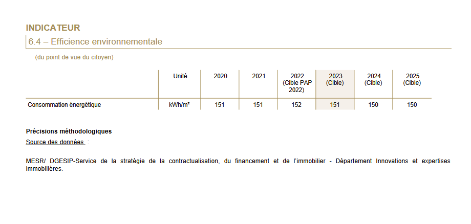

```{r setup, include=FALSE}
knitr::opts_chunk$set(echo = FALSE, warning = FALSE, message = FALSE)
options(dplyr.summarise.inform = FALSE)

knitr::opts_chunk$set(fig.asp=7.5/16, fig.width = 8)

library(tidyverse)
library(ggcpesrthemes)
library(kpiESR)
library(cowplot)

#theme_set(theme_cpesr() + theme(legend.position = "right", plot.title = element_text(hjust = 0.5)))

load("emploi.RData")
source("tdbesr-plots.R")
```

# Pré-massification (XIIe - XIXe) \newline Massification (XIXe - 2000) \newline Post-massification (2000 - )

## Pré-massification : aux racines des universités

- Apparition des universités aux XIIe siècle
- Professionnalisante : Santé, Droit et Théologie
- Non-professionnalisante : les « Arts » (tout le reste)

### Question de l'autonomie des universitaires aux pouvoirs (et financeurs)

- Religieux
- Municipal
- Politique
- Economique
- Citoyen / Etudiant
- Universités

## Pré-massification : tournant civilisationnel (XVIIIe - XIXe)
- De la compétition guerrière à la compétition économique
- Mondialisation du commerce et de la production
- Avec de grandes évolutions technologiques et industrielles :
  - Transports
  - Télécommunication
  - Energie
  - Motorisation
  - Agriculture et industrie
  
### Nécessite une montée en qualification de la population
- Des ingénieurs et ouvriers qualifiés plutôt que des généraux et des soldats
- Moins d'agriculteurs et plus de manufacteurs


## Massification (XIXe-1960) : début d'un « Age d'or »

### XXe siècle : Cercle vertueux

1. Investissement dans l'éducation
1. Montée en qualification de la main d'œuvre
1. Augmentation de la productivité
1. Croissance économique
1. Investissement dans l'éducation

### Fin XXe
Fin de la croyance en ce cercle vertueux


## Massification (1960-2000) : Investissements massifs dans l'éducation

```{r diplome, cache = TRUE}
#Graphique pour connaître le niveau de diplome des jeunes selon l'année civile 
plot_diplome <- function(agemin = 15, agemax = 30, anneemin = 1971, anneemax = 2020) {
  emploi %>%
    filter(Age > agemin, Age < agemax, Annee >= anneemin, Annee <= anneemax) %>%
    mutate(Diplome = factor(Diplome,
                            levels=c("Bac+5","Bac+3","Bac+2","Bac","CAP-BEP","DNB","Aucun"))) %>%
    mutate(Diplome = fct_recode(Diplome,
                                Tertiaire = "Bac+5",
                                Tertiaire = "Bac+3",
                                Tertiaire = "Bac+2",
                                Secondaire = "Bac",
                                Secondaire = "CAP-BEP",
                                Secondaire = "DNB",
                                Primaire = "Aucun") ) %>% 
    group_by(Annee,Diplome) %>%
    summarise(Population = sum(Population)/1e6) %>%
    ungroup() %>%
    na.omit() %>%
    filter(Annee != 1973) %>%
    complete(Annee,Diplome,fill=list(Population = 0)) %>%
    ggplot(aes(x=Annee,y=Population,fill=Diplome,group=Diplome)) +
    geom_area(color="white", alpha=0.6, position = "fill") + 
    geom_vline(xintercept = c(1994,2007)) +
    xlab("Année")
}

plot_diplome(agemin = 25, agemax = 30) +
  scale_y_continuous(labels = scales::percent, name = "Part des jeunes de 25 à 30 ans") +
  cpesr_cap(authors = "Camille Schumacher et Julien Gossa", source = "Enquête emploi INSEE")
```


## Massification (1960-2000) : Investissements massifs dans l'éducation


```{r diplome.2, cache = TRUE}
#Graphique pour connaître le niveau de diplome des jeunes selon l'année civile 
plot_categorie_ponctuel <- function(categorie="Activite", agemin = 15, agemax = 30, anneemin = 1971, anneemax = 2020, fill=TRUE, keep_na=FALSE) {
  if(fill) {
    position_geom <- "fill"
    label_scale <- scales::percent
    title_y <- "Pourcentage de la population 25-30"
  } else {
    position_geom <- "stack"
    label_scale <- function(x) x/1e6
    title_y <- "Effectif (millions)"
  }
  
  emploi %>%
    filter(Age >= agemin, Age <= agemax, Annee %in% c(anneemin,anneemax)) %>%
        mutate(Diplome = factor(Diplome,
                            levels=c("Bac+5","Bac+3","Bac+2","Bac","CAP-BEP","DNB","Aucun"))) %>%
    mutate(Diplome = fct_recode(Diplome,
                                Tertiaire = "Bac+5",
                                Tertiaire = "Bac+3",
                                Tertiaire = "Bac+2",
                                Secondaire = "Bac",
                                Secondaire = "CAP-BEP",
                                Secondaire = "DNB",
                                Primaire = "Aucun") ) %>% 
    mutate(Diplome = fct_rev(Diplome)) %>%
    group_by(Annee, Categorie=!!as.name(categorie)) %>%
    summarise(Population = sum(Population, na.rm=TRUE)) %>%
    { if (!keep_na) na.omit(.) else . } %>%
    { if (fill) group_by(.,Annee) %>% mutate(Population = Population / sum(Population)) else . } %>%
    ungroup() %>%
    complete(Annee, Categorie, fill = list(Population = 0)) %>%
    ggplot(aes(x=Categorie,y=Population,fill=Categorie, group=Categorie)) +
    geom_col(alpha=0.7, color="black",width = 1) + 
    facet_grid(.~Annee) +
    scale_y_continuous(labels = label_scale) +
    labs (x = "Diplôme", y = title_y, caption = "Source :Enquête Emploi (1971 - 2020)")
}


plot_categorie_ponctuel(categorie="Diplome", agemin = 25, agemax = 30) +
  #scale_y_continuous(labels = scales::percent, name = "Part des jeunes de 25 à 30 ans") +
  cpesr_cap(authors = "Camille Schumacher et Julien Gossa", source = "Enquête emploi INSEE")
```


## Aujourd'hui : Les objectifs sont atteints, et même dépassés

- 80% d'une classe d'âge au Bac
- 50% d'une classe d'âge diplômée du supérieur


### Aucun autre objectif n'est fixé : fin de la massification et crise d'utilité

```{r bleus.bac, out.width="75%", fig.align="center"}
knitr::include_graphics("bleus-bac.png")
```

```{r bleus.sup, out.width="75%", fig.align="center"}
knitr::include_graphics("bleus2022-1.1.jpg")
```

\tiny

Source : Projet annuel de performances https://www.budget.gouv.fr/documentation/documents-budgetaires/exercice-2022/projet-de-loi-de-finances/budget-general/

# Post-massification (XXIe) \newline Du siècle de la quantité au siècle de la qualité

## XXIe siècle : « Passer du siècle de la quantité au siècle de la qualité »

« _Passer du siècle de la quantité au siècle de la qualité. Passer de la massification à la démocratisation et du même mouvement rendre à notre société les conditions d'une adhésion à l'école sans laquelle il n'y a pas de succès possible_ » - François Bayrou, 1994
\tiny \newline
Source : https://www.vie-publique.fr/discours/137031-declaration-de-m-francois-bayrou-ministre-de-leducation-nationale-su
\normalsize

- Enjeu international / occidental, sans réponse claire jusqu'à présent
- Quantité vs. Qualité


### LOLF : LOI organique n° 2001-692 du 1er août 2001 relative aux lois de finances

- Instaure la « performance » dans l'action publique
- « Nouveau Management Public » (assez faible dans l'ESR)


##  XXIe siècle : « Passer du siècle de la quantité au siècle de la qualité »

:::::: {.cols data-latex=""}
::: {.col data-latex="{0.45\textwidth}"}

Documentation de la performance :

- Rapports sociaux uniques / \newline Bilans sociaux 
- Repères et références statistiques
- Rapports annuels de performances / Bleus budgétaires 

:::
::: {.col data-latex="{0.55\textwidth}"}

```{r bleus, out.height="45%", fig.align="center", fig.show='hold'}
  knitr::include_graphics(c("rsu.png","rers.png","bleus.png"))
```

:::

::::::

### Qualité : trois grands axes, quelques exemples
- Réussite étudiante
- Excellence scientifique
- Grands enjeux : climat, démocratie, émancipation


## Réussite étudiante : Taux de passage au Collège

```{r reu.1, out.height="75%", fig.align="center", fig.show='hold'}
  knitr::include_graphics("red-college.jpeg")
```

\tiny
Source : RERS 2022 https://www.education.gouv.fr/reperes-et-references-statistiques-2022-326939

## Réussite étudiante : Taux de passage au Lycée

```{r reu.2, out.height="75%", fig.align="center", fig.show='hold'}
  knitr::include_graphics("red-lycee.jpeg")
```

\tiny
Source : RERS 2022 https://www.education.gouv.fr/reperes-et-references-statistiques-2022-326939

## Réussite étudiante : Taux de réussite au Brevet

```{r reu.3, out.height="75%", fig.align="center", fig.show='hold'}
  knitr::include_graphics("reu-brevet.jpeg")
```

\tiny
Source : RERS 2022 https://www.education.gouv.fr/reperes-et-references-statistiques-2022-326939

## Réussite étudiante : Taux de réussite au Baccalauréat

```{r reu.4, out.height="75%", fig.align="center", fig.show='hold'}
  knitr::include_graphics("reu-bac.jpeg")
```

\tiny
Source : RERS 2022 https://www.education.gouv.fr/reperes-et-references-statistiques-2022-326939


## Réussite étudiante : départs des enseignants

```{r dem, out.height="75%", fig.align="center", fig.show='hold'}
  knitr::include_graphics("bs-dem.png")
```

\tiny
Source : BS 2020 https://archives-statistiques-depp.education.gouv.fr/Default/doc/SYRACUSE/51019/bilan-social-2020-2021-du-ministere-de-l-education-nationale-de-la-jeunesse-et-des-sports-partie-1-e


```{r reu, out.width="40%", fig.align="center", fig.show='hold', eval=FALSE}
  knitr::include_graphics(c("red-college.jpeg","red-lycee.jpeg"))
  knitr::include_graphics(c("reu-brevet.jpeg","reu-bac.jpeg"))
```


## Réussite étudiante : Ouverture sociale 

```{r os, out.height="50%", fig.align="center", fig.show='hold'}
  knitr::include_graphics("bleus-ouverture.png")
```

\tiny
Source : Projet annuel de performances https://www.budget.gouv.fr/documentation/documents-budgetaires/exercice-2022/projet-de-loi-de-finances/budget-general/

## Réussite étudiante : Insertion professionnelle

```{r ip, out.height="75%", fig.align="center", fig.show='hold'}
  knitr::include_graphics("bleus-ip.png")
```

\tiny
Source : Projet annuel de performances https://www.budget.gouv.fr/documentation/documents-budgetaires/exercice-2022/projet-de-loi-de-finances/budget-general/


## Excellence scientifique : Recherche universitaire

```{r rech.150, out.height="75%", fig.align="center", fig.show='hold'}
  knitr::include_graphics("bleus-rech-150.png")
```

\tiny
Source : Projet annuel de performances https://www.budget.gouv.fr/documentation/documents-budgetaires/exercice-2022/projet-de-loi-de-finances/budget-general/


## Excellence scientifique : Recherche ONR

```{r rech.172, out.height="75%", fig.align="center", fig.show='hold'}
  knitr::include_graphics("bleus-rech-172.png")
```

\tiny
Source : Projet annuel de performances https://www.budget.gouv.fr/documentation/documents-budgetaires/exercice-2022/projet-de-loi-de-finances/budget-general/


## Grands enjeux : Climat 

```{r climat, out.height="75%", fig.align="center", fig.show='hold'}
  
```

\tiny
Source : Projet annuel de performances https://www.budget.gouv.fr/documentation/documents-budgetaires/exercice-2022/projet-de-loi-de-finances/budget-general/


## Quelle « qualité » pour l'action publique dans l'ESR (selon la LOLF) ?

- Réussite : passer le moins de temps possible dans le système éducatif
- Excellence scientifique : pas trop s'effondrer (ou moins vite que les autres)
- Grands enjeux : rien

### Peu d'ambition : qualité du XXe, des indicateurs adaptés à la massification

- Vision optimiste : décision consciente de stagner
- Vision pessimiste : incapacité à adapter la performance à l'époque

### Angles morts / perspectives d'amélioration 

- Aspects qualitatifs : QVT, bonheur, qualité de l'enseignement ou de la recherche, etc.
  - très compliqués à évaluer (presque autant que l'insertion pro.)
- Libertés académiques et conditions d'exercice des missions 
  - Sans doute des choses à faire


# LRU et Gouvernement à distance \newline (par les indicateurs budgétaires de performance)

## LRU et Gouvernement à distance

- _Libertés_ et _Responsabilités_ des Universités (2007, LOLF de l'ESR)
  - « Autonomie » et passage aux Responsabilités et compétences élargies (RCE)
  - « Différenciation » des établissements
  
:::::: {.cols data-latex=""}
::: {.col data-latex="{0.5\textwidth}"}

- Mise en place de dispositifs de contrôle :
  - Financement par projet
  - Évaluation (AERES / Hcéres)
  - « Dialogue stratégique et de gestion »
  - Indicateurs locaux de performances
  
- Deux techniques :
  - Pressions internes
  - Pressions externe
:::
::: {.col data-latex="{0.5\textwidth}"}
```{r rape, out.height="50%", fig.align="center", fig.show='hold'}
  
```
:::
::::::

## Pressions internes : RAPé/PAPé

```{r rape.reu, out.height="75%", fig.align="center", fig.show='hold'}
  
```

\tiny
Source : Projet annuel de performances unistra 2022

## Pressions externes : Tableaux de bord financier des universités

```{r tdbf, out.height="75%", fig.align="center", fig.show='hold'}
  knitr::include_graphics(c("tdbf-garde.png","tdbf-indicateurs.png"))
```

\tiny
Source : https://data.esr.gouv.fr/FR/E810/P844/tableau_de_bord_financier_-_universite

## Un exemple : transformation de l'autonomie 

```{r gad.1, out.height="75%", fig.align="center"}
  kpiESR::kpiesr_plot_line("Universités et assimilés", c("kpi.FIN.S.recettesFormation")) +
  expand_limits(y=0) +
  ggtitle("Recettes propres formation des universités") +
  theme(legend.position = "right")
```

## Un exemple : transformation de l'autonomie 

```{r gad.2, out.height="75%", fig.align="center"}
  kpiESR::kpiesr_plot_line("Universités et assimilés", c("kpi.FIN.S.recettesFormation", "kpi.FIN.S.recettesRecherche")) +
  expand_limits(y=0) +
  ggtitle("Recettes propres formation et recherche des universités") +
  theme(legend.position = "right")
```

## Un exemple : transformation de l'autonomie 

```{r gad.3, out.height="75%", fig.align="center"}
  kpiESR::kpiesr_plot_line("Universités et assimilés", c("kpi.FIN.S.recettesFormation", "kpi.FIN.S.recettesRecherche"), val="evolution") +
  expand_limits(y=0) +
  ggtitle("Recettes propres formation et recherche des universités (valeur 100)") +
  theme(legend.position = "right")
```

## Un exemple : transformation de l'autonomie 

```{r gad.4, out.height="75%", fig.align="center"}
  kpiESR::kpiesr_plot_line("Universités et assimilés", c("kpi.K.dotPres"), val="evolution") +
  ggtitle("Part des SCSP dans les ressources des universités (valeur 100)") +
  theme(legend.position = "right")
```

## Un exemple : transformation de l'autonomie 

```{r gad.5, out.height="75%", fig.align="center"}
  kpiESR::kpiesr_plot_line("Universités et assimilés", c("kpi.K.dotPres","kpi.K.titPper"), val="evolution") +
  ggtitle("Part des SCSP dans les ressources des universités et taux de titularité (valeur 100)") +
  theme(legend.position = "right")
```


## Un exemple : transformation de l'autonomie 

```{r gad.map, out.height="75%", fig.align="center", fig.show='hold'}
  kpiESR::kpiesr_plot_map(2020,"none","Universités et assimilés","1-kpi.K.dotPres","kpi.K.titPper",smooth = TRUE) +
  scale_x_continuous(labels = scales::percent, name="Taux de ressources propres") +
  scale_y_continuous(labels = scales::percent, name="Taux de titularité") +
  ggtitle("Taux de ressources propres et taux de titularité (valeur 100)") +
  theme(legend.position = "right")
```


# Une proposition (inutile) \newline Tableau de bord des établissements de l'ESR

## Tableau de bord des établissements de l'ESR

Construire des indicateurs :

- permettant de percevoir la politique globale et les politiques locales
- plus proches des missions que les indicateurs actuels

### Contraintes
- basés sur les données ouvertes
- faible nombre (7)
- simples à comprendre (ratios)
- comparables, dans l'espace et le temps
- au niveau de détail maximum des établissements
- représentations uniformes


## Tableau de bord des établissements de l'ESR

```{r tdb.norm, fig.asp=7.5/16, out.width="100%", fig.width=11}
ensemble <- kpiesr_plot_all(2020, "Universités et assimilés","Universités et assimilés", style.k = k_style)

combine_plots_groupe(ensemble)

# th <- theme(legend.position = "bottom", axis.title = element_blank())
# 
# cowplot::plot_grid(ncol = 1, align = "hv", axis = "rl", rel_heights = c(3,2),
#   ensemble$k.norm + th,
  # ensemble$k.evol + th + theme(strip.text = element_blank(), plot.margin = margin(r=50)))
```

```{r tdb.make, results='asis', fig.asp=6.5/16, cache = TRUE}
tdb_slide <- function(kpi, scale_y_lim, scale_y_lab) {
  cat("## ", kpiesr_lfc_labels[kpi], "\n\n")
  cat(kpiesr_lfc_desc[kpi],"\n\n")

  print(cowplot::plot_grid(ncol = 2,
  kpiesr_plot_line(id = "Universités et assimilés", vars = kpi) + 
    xlim(2013,2020) +
    scale_y_continuous(limits = scale_y_lim, labels = scale_y_lab) +
    theme(legend.position = "bottom", axis.title.y = element_blank()),
  kpiesr_plot_map(rentrée = 2020, "None", "Universités et assimilés", xvar = "kpi.ETU.P.effectif", yvar = kpi, smooth = TRUE) + 
    scale_x_continuous(name = "Effectif étudiant") +
    scale_y_continuous(labels = scale_y_lab) +
    theme(axis.title.y = element_blank())))
  
  cat("\n\n")
}

tdb_slide("kpi.K.titPper", c(0.65,0.7), scales::percent)
tdb_slide("kpi.K.dotPres", c(0.79,0.83), scales::percent)
tdb_slide("kpi.K.ensPetu", c(4,5), ~ round(.x,2))
tdb_slide("kpi.K.biaPper", c(0.46,0.48), scales::percent)
tdb_slide("kpi.K.resPetu", c(8500,9000), ~ paste(.x/1000,"k€"))
tdb_slide("kpi.K.forPetu", c(250,550), ~ paste(.x,"€"))
tdb_slide("kpi.K.recPect", c(3500,15000), ~ paste(.x/1000,"k€"))

```

## Université Paris 1 - Panthéon Sorbonne

```{r p1, fig.asp=7.5/16, out.width="100%", fig.width=11, cache=TRUE}
univ <- kpiesr_plot_all(2020, "6G2TU","Universités et assimilés", style.k = k_style)
combine_plots_groupe(univ)
```

## Université de Strasbourg

```{r unistra, fig.asp=7.5/16, out.width="100%", fig.width=11, cache=TRUE}
univ <- kpiesr_plot_all(2020, "4k25D","Universités et assimilés", style.k = k_style)
combine_plots_groupe(univ)
```

## Avignon Université

```{r avignon, fig.asp=7.5/16, out.width="100%", fig.width=11, cache=TRUE}
univ <- kpiesr_plot_all(2020, "vxHYt","Universités et assimilés", style.k = k_style)
combine_plots_groupe(univ)
```


# Conclusion \newline L'inutilité des indicateurs

## L'inutilité des indicateurs

### Défaut systémique des données
- Indicateurs discutables et systématiquement mal calculés
- Hautement manipulables
- Facilement discréditables

### Défaut politique des indicateurs
- Non respect de la LOI n° 2016-1321 du 7 octobre 2016 pour une République numérique 
- De simples outils, donc à l'utilité des puissants
- Impuissants à modifier les orientations politiques

### Défaut d'interprétation
- Tous les indicateurs sont paradoxaux


## Investissement vs. Productivité : SCSP par étudiant

```{r invest}
kpiESR::esr %>%
  filter(Etablissement %in% c("Université de Strasbourg","Avignon Université"), Rentrée > 2009) %>%
  transmute(
    Etablissement, Rentrée,
    valeur =  kpi.FIN.S.SCSP / kpi.ETU.P.effectif ,
  ) %>%
  mutate(val100 = valeur / first(valeur) * 100) %>%
  ggplot(aes(x=Rentrée, y = valeur, group=Etablissement, color=Etablissement)) +
  geom_line(size=1) + geom_point(size=3, stroke=1, shape=21,fill="white") +
  facet_grid(.~Etablissement) +
  scale_y_continuous(labels = ~ paste0(.x,"€"), name = "SCSP par étudiant", limits = c(6000,8000)) +
  scale_color_brewer(palette = "Dark2") +
  theme(legend.position = "None")

```


## Investissement vs. Productivité : étudiants par SCSP

```{r invest2}
kpiESR::esr %>%
  filter(Etablissement %in% c("Université de Strasbourg","Avignon Université"), Rentrée > 2009) %>%
  transmute(
    Etablissement, Rentrée,
    valeur =  kpi.ETU.P.effectif / kpi.FIN.S.SCSP * 1e6,
  ) %>%
  mutate(val100 = valeur / first(valeur) * 100) %>%
  ggplot(aes(x=Rentrée, y = valeur, group=Etablissement, color=Etablissement)) +
  geom_line(size=1) + geom_point(size=3, stroke=1, shape=21,fill="white") +
  facet_grid(.~Etablissement) +
  scale_y_continuous(name = "Etudiants par M€ SCSP", limits = c(125,166)) +
  scale_color_brewer(palette = "Dark2") +
  theme(legend.position = "None")

```


## Investissement vs. Productivité : indicateurs de pilotage officiels

```{r invest.ind, out.width="49%", fig.align='center', fig.show='hold'}
knitr::include_graphics(c("dotpres_avignon.png","dotpres_unistra.png"))
```


- Interprétations officielles :
  - Taux de rémunération des permanents
    - _« Un ratio élevé est un indicateur de rigidité. Plus l'indicateur se rapproche de 100% et moins l'établissement dispose de marges de manœuvre. »_
  - Ressources Propres / Produits encaissables
    - _« Degré de dépendance de l'établissement aux subventions de charge de service public versées par l'Etat »_
  - Charges de personnel / Produits encaissables
    - _« Le poids relatif des charges de personnel dans les ressources encaissables, ainsi que son évolution, est significatif. Plus le ratio augmente, moins l'établissement dispose de marge de manœuvre. »_


\tiny
Source : https://data.esr.gouv.fr/FR/E810/P844/tableau_de_bord_financier_-_universite


## Conclusion

20 ans de LOLF, aucune amélioration : quel bilan en tirer ? Echec.

- Dans l'ESR : des indicateurs pré-massification dans un monde post-massification
- __Condamnation à mesurer la stagnation ou la chute__
- __Impossibilité de faire des mesures face aux grands enjeux__

Perspectives :

### 1. Abandonner ou réformer les indicateurs de performance
  - de : _mesurer l'action publique des dirigés dans les contraintes imposées par les dirigeants_.
  - à : _mesurer l'action publique des dirigeants pour les conditions de travail des dirigés_.
  - donc : __libertés académiques et conditions de travail__

### 2. Recruter énormément de jeunes pour les grands enjeux
  - libres et ayant de bonnes conditions de travail
  - __à-même de réellement comprendre l'époque__

  
## En attendant...

https://cpesr.fr/tableau-de-bord-esr/ \hfill https://data.cpesr.fr/
  
```{r cpesr, out.height="60%", fig.align="center", fig.show='hold'}
  knitr::include_graphics(c("cpesr-rapport.png","cpesr-rapport2.png","cpesr-app.png"))
```

\centering
https://github.com/cpesr/

# Annexes

## La formation « bouclier contre le chômage » ?

```{r activite, cache = TRUE}
plot_activite <- function(agemin = 15, agemax = 30, anneemin = 1971, anneemax = 2020, pourcent = Population / sum(Population)*100, Pop = Population) {
  emploi %>%
    filter(Age >= agemin, Age <= agemax, Annee >= anneemin, Annee <= anneemax) %>%
    filter(!is.na(Activite)) %>%
    group_by(Annee,Activite) %>%
    summarise(Population = sum(Population, na.rm=TRUE)/1e6) %>%
    filter(Annee > 1974) %>%
    # mutate(Activite = factor(Activite,
    #                          levels=c("Actif occupé","Etudiant","Chômeur ou inactif"))) %>%
    ggplot(aes(x=Annee,y=Population,fill=Activite,color=Activite, group=Activite)) +
    geom_area(alpha=0.7) + labs (x = "Année", y = "Effectif des jeunes de 15 à 30 ans (millions)", caption = "Source :Enquête Emploi (1971 - 2020)")
}

plot_activite(agemin = 15, agemax = 30)  +
  cpesr_cap(authors = "Camille Schumacher et Julien Gossa", source = "Enquête emploi INSEE")
```


