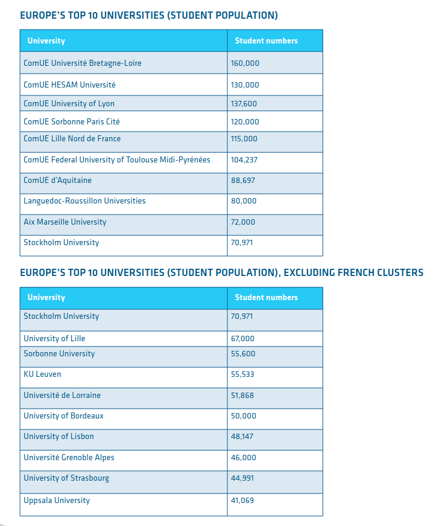

```{r setup, include=FALSE}
knitr::opts_chunk$set(echo = FALSE, warning = FALSE)
knitr::opts_chunk$set(pdf.options(encoding = "CP1250"))
options(dplyr.summarise.inform = FALSE)

knitr::opts_chunk$set(fig.width = 8, fig.height = 4)

source("pia-plot.R")

```

# Introduction

## PIA : Programme d’investissements d’avenir

:::::: {.cols data-latex=""}

::: {.col data-latex="{0.60\textwidth}"}

- Managed by the _Agence Nationale de la Recherche_ (ANR)
  - 22,5 B€ (over 35) for PIA 1 (2010)
  - 4,5 B€ (over 12) for PIA 2 (2014) 
  - 2,85 B€ (over 10) for PIA 3 (2017) 
  - PIA 4 is currently programmed for 20 B€

\  

- For universities: « Transforming » projects
  - Initiatives d'Excellence (IDEx) 
  - Initiatives – Science - Innovation - Territoires - Economie (ISITE)
  - Similiar to german _Exzellenzinitiative Zukunftskonzepte_ (Future concepts)
  - « 10 world-class comprehensive universities of excellence »
  - Closely linked to mergers
  - IGAENR: little benefit in terms of teaching or research [@philippe_bezagu_premier_2019]
    
    
:::

::: {.col data-latex="{0.01\textwidth}"}
\ 
<!-- an empty Div (with a white space), serving as
a column separator -->
:::

::: {.col data-latex="{0.4\textwidth}"}

:::

::::

## A PIA (short) story

- 2009 : Juppé-Rocard report
« ___Because we have stop the litany of bad news, with this
ugly laziness that is the acceptance of decline___ » [@alain_juppe_investir_2009].
  - Mid-term review committee [@philippe_maystadt_programme_2016]
  - PIA Supervisory Committee [@patricia_barbizet_evaluation_2019] 
  - _Cour des comptes_ [@cour_des_comptes_2018a; -@cour_des_comptes_2018a]
    - Can not conclude on the efficiency of the PIA.


- 2019 : Reports of the working groups for the Research Programming Law
  - LPPR [@berta_lppr_2019; @petit_lppr_2019; @chouat_lppr_2019]

\ 

### 2021 : Interview Juppé(AEF)
« ___We have been able to avoid sprinkling. [...] 
We have diversified the products, if I may say so, with idex and isites___ » [@julien_jankowiak_alain_2021]. 

<!-- ### More scientifically -->
<!-- - Remote government [@gally_entre_2018] -->
<!-- - Reform of scientific hierarchies and creation of new inequalities [@aust_se_2018] -->
<!-- - Competition policy to build "university empires" [@musselin_grande_2017] -->

<!-- ## (Caricatured) developments in university funding -->

<!-- - Context : reform of the distribution of SCSPs (Subsidies for Public Service Charge) -->
<!--   - 1994 - 2005 : SanREMO (_Système analytique de Répartition des Moyens_) -->
<!--   - 2007 : LRU et RCE (_Responsabilités et compétences élargies_ payroll) [@pacale_aime_etude_2012]  -->
<!--   - 2009 : SYMPA (_SYstème de répartition des Moyens à l'Activité et à la Performance_)  -->
<!--   - SYMPA 2 -->
<!--   - _Dialogue de gestion_ -->
<!--   - _Dialogue « stratégique » et de gestion_ [@julien_gossa_quel_2019]. -->


### IDEX and ISITE = Money + Label ?
- More money, or one more way to differentiate establishments?

# A glimpse at the data

## Open data sets

https://data.enseignementsup-recherche.gouv.fr

- `Financial indicators of French higher education operators`
- `Tenured teachers in public higher education establishments`
- `Number of students enrolled in public establishments under the supervision of the Ministry in charge of Higher Education`
- `Main higher education institutions`


### Traitements 
- R [@r_core_team_r_2013] 
- ggplot [@wickham_ggplot2_2009]
- Fundamentals of data visualization [@wilke_fundamentals_2019] 
- RMarkdown workflow [@xie_r_2019].

### Open science
\centering
https://github.com/juliengossa/pia


## Evolution of the PIA over the whole dataset

`Financial indicators of French higher education operators`
^[https://data.enseignementsup-recherche.gouv.fr/explore/dataset/fr-esr-operateurs-indicateurs-financiers/information/] 


```{r total.pia, fig.height=3}
pia.total
```

## Universities (2019) > PIA 

```{r vue.pia, fig.height=3.5}
pia.univ
```

## Universities (2019) > All of the fundings

- Own resources (_ressources propres_ `RP`)
- Subsidies for public service charges (_subventions pour charge de service public_ `SCSP`)
- Cashable operating income (_produit de fonctionnement encaissable_ `PFE`)


```{r all.univ, fig.height=3}
all.univ
```

# Cashable operating income (_produits de fonctionnement encaissables_ PFE)

## Universities (2019) > PFE

```{r pfe.univ}
pfe.univ
```

## Universities (2019) > PFE 

```{r pfe.univ.sort}
pfe.univ.sort
```

## Universities (2019) > PFE > Size of institutions

```{r pfe.univ.etu.ens}
pfe.univ.etu.ens
```


## Universities (2019) > PFE > per student

```{r pfe.univ.size}
pfe.univ.size
```

## Universities (2019) > PFE > par student

```{r pfe.univ.size.sort}
pfe.univ.size.sort
```

## Universities (2019) > PFE > par tenured teacher

```{r pfe.univ.size.tit.sort}
pfe.univ.size.tit.sort
```


# Subsidies for public service charges (_subventions pour charge de service public_ `SCSP`)

## Universities (2019) > SCSP

```{r scsp.univ}
scsp.univ
```


## Universities (2019) > SCSP > per tenured teacher

```{r scsp.univ.size.tit.sort}
scsp.univ.size.tit.sort
```

## Universities (2019) > SCSP > per student

```{r scsp.univ.size.etu.sort}
scsp.univ.size.etu.sort
```


## Universities (2019) > SCSP > per student > Evolution (since 2013)

```{r scsp.univ.evol}
scsp.univ.evol
```

## Universities (2019) > SCSP > per student > Evolution (since 2013)

```{r scsp.univ.evol.sort}
scsp.univ.evol.sort
```


# Labeling of a policy?

## Universities (2019) > Tenured teachers > Evolution (since 2010)

```{r tit.univ.diff.sort}
tit.univ.diff.sort
```

## Universities (2019) > Tenured teacher per student > Evolution (since 2013)

```{r tde.univ.diff.sort}
tde.univ.diff.sort
```


## Universities (2019) > Scholar fees and taxes > Evolution (since 2013)

```{r rpf.univ.diff.sort}
rpf.univ.diff.sort
```


## Conclusion

### IDEX and ISITE = Money + Label ?
- ~~More money~~
- __one more way to differentiate institutions__
  - But not really visible from the outside

### Necessary caution
- Work on the open data
  - Obviously caricatural
- Need for field surveys
  - Distribution of resources between establishments
  - Distribution of IDEX within institutions


### Two things to remember
- IDEX / ISITE are much more labels than additional resources
- The differentiation is probably much more internal than external

## References {.allowframebreaks}

\tiny

