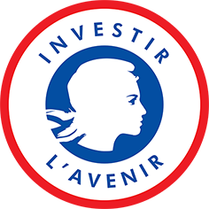

```{r setup, include=FALSE}
knitr::opts_chunk$set(echo = FALSE, warning = FALSE)
knitr::opts_chunk$set(pdf.options(encoding = "CP1250"))
options(dplyr.summarise.inform = FALSE)

knitr::opts_chunk$set(fig.width = 8, fig.height = 4)

source("pia-plot.R")

```

# Introduction

## PIA : Programme d’investissements d’avenir, IDEX/ISITE

:::::: {.cols data-latex=""}

::: {.col data-latex="{0.7\textwidth}"}

- Opéré pour l'ESR par l'Agence Nationale de la Recherche (ANR)
  - 22,5 Md€ sur les 35 du PIA 1 (2010)
  - 4,5 Md€ sur les 12 du PIA 2 (2014) 
  - 2,85 Md€ sur les 10 du PIA 3 (2017) 
  - PIA 4 est en cours de programmation pour 20 Md€

\  

- Différents projets « transformants »
  - par exemple : Ecoles universitaires de recherche (EUR)
  - mais surtout : IDEX / ISITE
    - Initiatives d'Excellence (IDEx) 
    - Initiatives – Science - Innovation - Territoires - Economie (ISITE)
    - « 10 pôles pluridisciplinaires d’excellence de rang mondial »
    - Très liés aux fusions
    - IGAENR : peu d'avantages en termes d'enseignement ou de recherche [@philippe_bezagu_premier_2019]
:::

::: {.col data-latex="{0.05\textwidth}"}
\ 
<!-- an empty Div (with a white space), serving as
a column separator -->
:::

::: {.col data-latex="{0.25\textwidth}"}

:::

::::

## Petit histoire du PIA

- 2009 : Rapport Juppé-Rocard 
« ___Parce qu’il faut en finir avec la litanie des mauvaises nouvelles, avec cette 
vilaine paresse qu’est l’acceptation du déclin___ » [@alain_juppe_investir_2009].
  - Comité d'examen à mi-parcours [@philippe_maystadt_programme_2016]
  - Comité de surveillance des investissements d’avenir [@patricia_barbizet_evaluation_2019] 
  - Cour des comptes [@cour_des_comptes_2018a; -@cour_des_comptes_2018a]
    - Aucun ne peut conclure en une réelle efficacité du PIA


- 2019 : Rapports des groupes de travail pour la Loi de programmation de la recherche
  - LPPR [@berta_lppr_2019; @petit_lppr_2019; @chouat_lppr_2019]

\ 

- 2021 : Interview AEF Juppé : « ___Nous avons su 
éviter le saupoudrage. [...] Nous avons diversifié les produits, si j’ose dire, 
avec les idex et les isite___ » [@julien_jankowiak_alain_2021]. 

### Plus scientifiquement
- Gouvernement à distance [@gally_entre_2018]
- Réforme des hiérarchies scientifiques et création de nouvelles inégalités [@aust_se_2018]
- Politique de mise en compétition pour bâtir des « empires universitaires » [@musselin_grande_2017]

## Evolutions (caricaturées) du financement des universités

- Contexte : réforme de la distribution des SCSP (Subventions pour Charge de Service Public) [@pacale_aime_etude_2012] 
  - 1994 - 2005 : SanREMO (Système analytique de Répartition des Moyens)
  - 2007 : LRU et RCE (Responsabilités et compétences élargies) 
  - 2009 : SYMPA (SYstème de répartition des Moyens à l'Activité et à la Performance) 
  - SYMPA 2
  - Dialogue de gestion
  - Dialogue « stratégique » et de gestion [@julien_gossa_quel_2019].

\ 

### IDEX et ISITE = Ressources additionnelles + Labellisation des établissements ?
- Des moyens en plus, ou un moyen de plus de différencier les établissements ?

# Exploration des données du PIA

## Jeux de données ouvertes

https://data.enseignementsup-recherche.gouv.fr

- `Indicateurs financiers des opérateurs de l’enseignement supérieur français`
- `Les enseignants titulaires dans les établissements publics de l'enseignement supérieur`
- `Effectifs d'étudiants inscrits dans les établissements publics sous tutelle du ministère en charge de l'Enseignement supérieur`
- `Principaux établissements d'enseignement supérieur`

### Traitements 
- R [@r_core_team_r_2013] 
- ggplot [@wickham_ggplot2_2009]
- principes fondamentaux établis dans [@wilke_fundamentals_2019] 
- procédures de production et publication RMarkdown [@xie_r_2019].

### Science ouverte
\centering
https://github.com/juliengossa/pia


## Evolution du PIA sur tout le jeu de données

`Indicateurs financiers des opérateurs de l’enseignement supérieur français`
^[https://data.enseignementsup-recherche.gouv.fr/explore/dataset/fr-esr-operateurs-indicateurs-financiers/information/] 


```{r total.pia, fig.height=3}
pia.total
```

## Universités (2019) > PIA 

```{r vue.pia, fig.height=3.5}
pia.univ
```

## Universités (2019) > Toutes les ressources

- ressources propres (`RP`)
- subventions pour charge de service public (`SCSP`)
- produit de fonctionnement encaissable (`PFE`)


```{r all.univ, fig.height=3}
all.univ
```

# Produits de fonctionnement encaissables (PFE)

## Universités (2019) > PFE

```{r pfe.univ}
pfe.univ
```

## Universités (2019) > PFE 

```{r pfe.univ.sort}
pfe.univ.sort
```

## Universités (2019) > PFE > Taille d'établissement

```{r pfe.univ.etu.ens}
pfe.univ.etu.ens
```


## Universités (2019) > PFE > par étudiant

```{r pfe.univ.size}
pfe.univ.size
```

## Universités (2019) > PFE > par étudiant

```{r pfe.univ.size.sort}
pfe.univ.size.sort
```

## Universités (2019) > PFE > par titulaire

```{r pfe.univ.size.tit.sort}
pfe.univ.size.tit.sort
```


# Subventions pour charges de service public (SCSP)

## Universités (2019) > SCSP

```{r scsp.univ}
scsp.univ
```


## Universités (2019) > SCSP > par titulaire

```{r scsp.univ.size.tit.sort}
scsp.univ.size.tit.sort
```

## Universités (2019) > SCSP > par étudiant

```{r scsp.univ.size.etu.sort}
scsp.univ.size.etu.sort
```


## Universités (2019) > SCSP > par étudiant > Evolution

```{r scsp.univ.evol}
scsp.univ.evol
```

## Universités (2019) > SCSP > par étudiant > Evolution (depuis 2013)

```{r scsp.univ.evol.sort}
scsp.univ.evol.sort
```


# Labelisation d'une politique ?

## Universités (2019) > Titulaires > Evolution (depuis 2010)

```{r tit.univ.diff.sort}
tit.univ.diff.sort
```

## Universités (2019) > Taux d'encadrement > Evolution (depuis 2013)

```{r tde.univ.diff.sort}
tde.univ.diff.sort
```


## Universités (2019) > RP formation > Evolution (depuis 2013)

```{r rpf.univ.diff.sort}
rpf.univ.diff.sort
```


## Conclusion

### IDEX et ISITE = Ressources additionnelles + Labellisation des établissements ?
- ~~Des moyens en plus~~
- __Un moyen de plus de différencier ~~les établissements~~ (?)__
  - Pas très visible de l'extérieur (dès lors qu'on neutralise la taille)

### Nécessaire prudence
- Travail sur les données ouvertes
  - Forcément caricatural
- Nécessité d'enquêtes terrain
  - Répartition des moyens entre les établissements
  - Répartition des IDEX au sein des établissements

### Deux choses à retenir 
- Les IDEX/ISITE sont beaucoup plus des labels que des moyens supplémentaires
- Différenciation interne sans doute beaucoup plus qu'externe

## Références {.allowframebreaks}

\tiny

