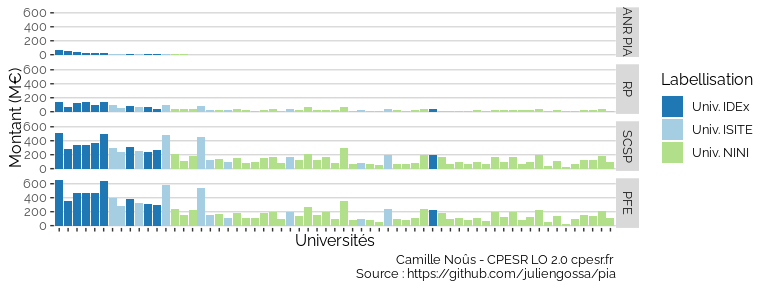
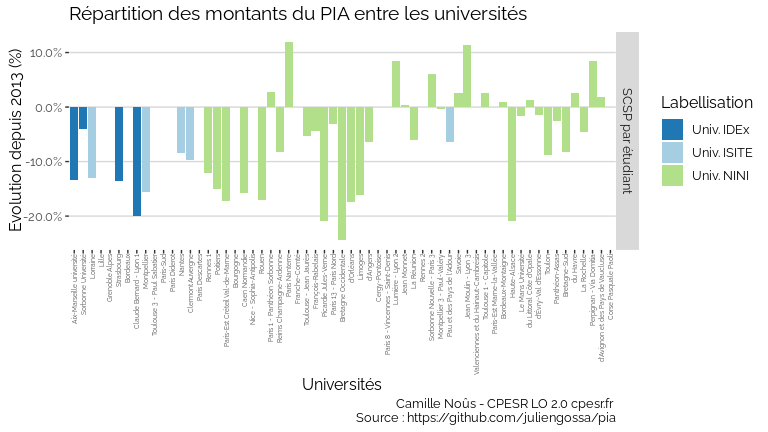

DataESR : Etude de la distribution du PIA parmi les établissements de
l’ESR
================

## Figures principales

## Evolution du PIA sur tout le jeu de données

`Indicateurs financiers des opérateurs de l’enseignement supérieur français`
[1]

<!-- -->

## Universités (2019) &gt; PIA

<!-- -->

## Universités (2019) &gt; Toutes les ressources

-   ressources propres (`RP`)
-   subventions pour charge de service public (`SCSP`)
-   produit de fonctionnement encaissable (`PFE`)

<!-- -->

# Produits de fonctionnement encaissables (PFE)

## Universités (2019) &gt; PFE

<!-- -->

## Universités (2019) &gt; PFE

<!-- -->

## Universités (2019) &gt; PFE &gt; Taille d’établissement

<!-- -->

## Universités (2019) &gt; PFE &gt; par étudiant

<!-- -->

## Universités (2019) &gt; PFE &gt; par étudiant

<!-- -->

## Universités (2019) &gt; PFE &gt; par titulaire

<!-- -->

# Subventions pour charges de service public (SCSP)

## Universités (2019) &gt; SCSP

<!-- -->

## Universités (2019) &gt; SCSP &gt; par titulaire

<!-- -->

## Universités (2019) &gt; SCSP &gt; par étudiant

<!-- -->

## Universités (2019) &gt; SCSP &gt; par étudiant &gt; Evolution

<!-- -->

## Universités (2019) &gt; SCSP &gt; par étudiant &gt; Evolution (depuis 2013)

<!-- -->

# Labelisation d’une politique ?

## Universités (2019) &gt; Titulaires &gt; Evolution (depuis 2010)

<!-- -->

## Universités (2019) &gt; Taux d’encadrement &gt; Evolution (depuis 2013)

<!-- -->

## Universités (2019) &gt; RP formation &gt; Evolution (depuis 2013)

<!-- -->

## check

### IDEx

    ## Joining, by = c("UAI", "étiquettes")

<!-- -->

### ISITE

    ## Joining, by = c("UAI", "étiquettes")

<!-- -->

## Vues

<!-- -->

<!-- -->

<!-- -->

## Vues rapides

<!-- -->

<!-- -->

[1] <https://data.enseignementsup-recherche.gouv.fr/explore/dataset/fr-esr-operateurs-indicateurs-financiers/information/>
