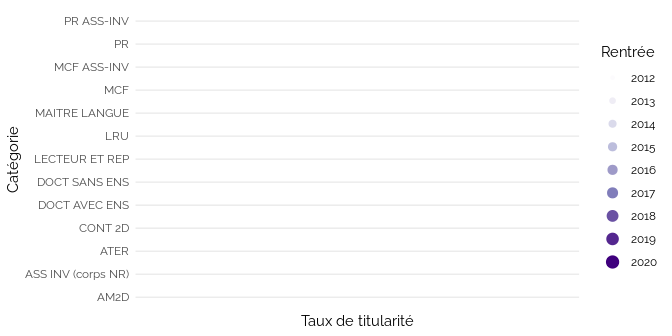

Mesurer la precarité de l’ESR par les données ouvertes
================
Julien Gossa Université de Strasbourg
[@JulienGossa](https://twitter.com/JulienGossa)     <gossa@unistra.fr>
12-10-2022

## Mesurer la precarité de l’ESR par les données ouvertes

**Avertissement général sur le travail par les données**

-   Source principale : SIES
    -   <https://data.enseignementsup-recherche.gouv.fr>
    -   [https://github.com/juliengossa/presentations \>
        precarite](https://github.com/juliengossa/presentations/blob/main/precarite/precarite.md)
-   Possibilités d’erreur techniques ou matérielles dans les données et
    traitements
-   Même sans erreur, vision partielle et partiale

**Grandes difficultés à mesurer la précarité**

-   Définition de la précarité (ex: vacataires et contractuels)
-   A la frontière des connaissances de l’administration (ex: vacataires
    et filliales)
-   Très instable : date, périmètre et type de mesures (ex: doctorants)

### Pas la réalité, mais **la réalité perçue par une techno-bureaucratie**

-   Contrats et statuts : grande distance aux réalités de vie
-   Nombreux angles morts (et aveuglements)

# Quelques représentations sur les personnels

## ONR : Permanents vs. Non permanents

## ONR : Permanents vs. Non permanents, valeur 100

## ONR : Taux de permanence par organisation

## ONR : Effectifs par statut/contrat

## BIATSS : Titulaires vs. Contractuels

## BIATSS : Titulaires vs. Contractuels, valeur 100

## BIATSS : Taux de titularité par groupe d’établissement

## E-EC : Titulaires vs. Non permanents

## E-EC : Titulaires vs. Non permanents, valeur 100

## E-EC : Taux de titularité par groupe d’établissement

## BIATSS et E-EC : Taux de titularité

# Quelques représentations sur les heures d’enseignement Précarité des missions

## Heures d’enseignement (Université de Strasbourg)

## Heures d’enseignement (Université de Strasbourg), valeur 100

# Quelques considérations budgétaires / managériales

## Budget des établissements : « fongibilité asymétrique »

## Budget des établissements : « fongibilité asymétrique », valeur 100

## Budget des établissements : SCSP vs. Titularité

## Budget des établissements : SCSP vs. Titularité

## Investissement vs. Productivité : SCSP par étudiant

## Investissement vs. Productivité : étudiants par SCSP

## Investissement vs. Productivité : indicateurs de pilotage officiels

-   Taux de rémunération des permanents
    -   *« Interprétation : Un ratio élevé est un indicateur de
        rigidité. Plus l’indicateur se rapproche de 100% et moins
        l’établissement dispose de marges de manœuvre. »*
-   Ressources Propres / Produits encaissables
    -   *« Interprétation : Degré de dépendance de l’établissement aux
        subventions de charge de service public versées par l’Etat »*
-   Charges de personnel / Produits encaissables
    -   *« Interprétation : Le poids relatif des charges de personnel
        dans les ressources encaissables, ainsi que son évolution, est
        significatif. Plus le ratio augmente, moins l’établissement
        dispose de marge de manœuvre. »*

Source :
<https://data.esr.gouv.fr/FR/E810/P844/tableau_de_bord_financier_-_universite>

## Conclusion

-   Qualifier la précarité dans les données ouvertes est difficile
    -   Titulaires vs. contractuels vs. permanents vs. non permanents
-   Une très grande diversités selon les
    -   statuts, corps, organismes, établissements…
-   Mais quand même trois profils différents
    -   ONR, BIATSS, E-EC

### Point de vue managérial

Pas de précarité, mais de la « souplesse » et des « marges de manœuvre »

-   *Dégat collatéral malheureux*
-   Indirectement encouragé par des outils techno-bureaucratiques

### Point de vue politique / stratégique

« *La précarité est bonne pour la recherche* » - un DG

# Annexes

## BIATSS : etablissement_type

## BIATSS : Catégorie

## BIATSS : Corps

## BIATSS : code_corps

## BIATSS : Filière

## BIATSS : Sexe

## Enseignants : Sexe

## Enseignants : Catégorie

## Enseignants : Grandes.disciplines

## Enseignants : classe_age3

## Enseignants : statuts

