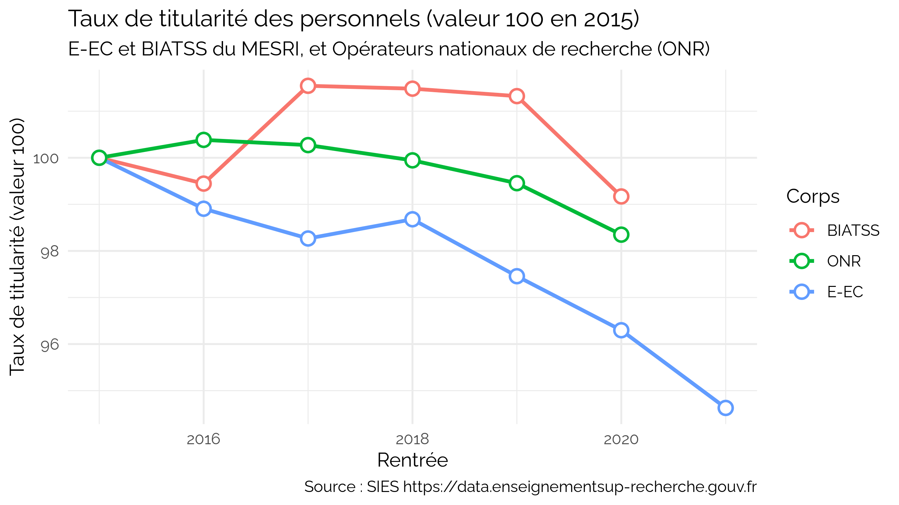

Mesurer la précarité dans l’ESR par les données ouvertes
================

| Method          | koRpus      | stringi       |
|:----------------|:------------|:--------------|
| Word count      | 686         | 664           |
| Character count | 4334        | 4333          |
| Sentence count  | 33          | Not available |
| Reading time    | 3.4 minutes | 3.3 minutes   |

Depuis plusieurs années, l’Enseignement supérieur et la recherche (ESR)
voient leurs professions se précariser. Les personnels eux-mêmes sont
contraints de recourir à des collègues contractuels ou vacataires pour
faire fonctionner leurs enseignements, recherches et services. Mais
comment peut-on mesurer cette précariser ?

## Des efforts de transparence considérables, une mesure difficile

Malgré des efforts remarquables, sans doute de niveau international,
pour consolider et publier les données de l’ESR, la précarité reste dans
une zone d’ombre. En raison, deux difficultés majeures.

La première est que la précarité se situe à la frontière de ce que
connait l’administration, en particulier centrale : alors que chaque
fonctionnaire titulaire est compté et catégorisé avec diligence, les
contractuels s’éparpillent entre les contrats et structures. Compter les
vacataires est difficile, puisque leur gestion est au niveau le plus
local. Compter les contractuels est en partie impossible, lorsque leur
gestion relève d’une structure de droit privé, comme les filiales des
universités.

La seconde difficulté tient à la diversité des situations des personnels
contractuels, dans lesquels on peut trouver les collègues les plus
précaires, comme les collègues les mieux payés.

Les mesures présentées ici doivent donc être prise avec la plus grande
des prudences.

## Des situations contrastées

Si on s’en tient aux données ouvertes (donc à l’exclusion notable des
vacataires et doctorants non finances), nous pouvons obtenir une mesure
basse du taux de titularité, pour différentes catégorie de personnel,
BIATSS, E-EC et dans les ONR. On observe ainsi que, dans la majorité des
cas, entre 50% et 25% des personnels références sont contractuels : plus
de 50% dans les ONR, environ 40% des BIATSS et 30% des E-EC.

 *Le
taux de titularité qu’on peut percevoir au travers des données ouvertes
(donc à l’exclusion notable des vacataires et doctorants non financés)
montre un nombre de contractuels allant généralement de 50% à 25% de
tous les personnels.*

## Des évolutions également contrastées

Les données ouvertes permettent également d’observer l’évolution dans le
temps des taux de titularité. On constate ainsi que, sur 5 ans, la
titularité dans les ONR a baissé d’un point et demi, celle des BIATSS
d’un point et celle des E-EC de près de 3 points. On constate également
des trajectoire assez différentes, même si toutes rejoignent la même
pente dans cette période.

*L’évolution des taux de titularité montre une baisse dans tous les
grands corps de personnel sur 5 ans : -1 point pour les BIATSS, -1,7
points pour les ONR, et -2,7 points pour les E-EC.*

## Une mesure plus fine : la précarité de la mission d’enseignement

Une autre façon de mesurer la précarité est de ne pas s’intéresser aux
personnels mais à leurs missions. C’est notamment possible avec les
heures d’enseignement, répertoriées dans les rapports sociaux uniques
(ex bilans sociaux) des établissements.

Si l’on prend l’exemple de l’Université de Strasbourg, entre 2013 et
2020, nous pouvons observer une relative stagnation des heures en
service (-4%), une hausse notable des heures de vacations (+10%) et une
explosion des heures complémentaires (+40%). On peut y voir une
politique de bonne gestion budgétaire, les heures complémentaires étant
les moins chères disponibles. On peut également y lire la mise en œuvre
d’une politique de modulation des services volontaire.

 *Depuis
2013, les heures d’enseignement à l’Université de Strasbourg ont suivi
trois trajectoire différentes : baisse des heures de service (-4%),
hausse des heures de vacations (+10%) et explosion des heures
complémentaires (+40%).*

## conclusion

Si la précarité dans l’ESR est difficile à mesurer par les données
ouvertes, un calcul imparfait des taux de titularité indique tout de
même une baisse différenciée mais généralisée. Des mesures de politiques
locales sont également possible en s’intéressant aux missions.

Ces mesures nécessitent un travail de fourmis pour collecter les
données. Pourtant, la loi de 2016 pour une république numérique oblige
les établissement à « publier en ligne » ces données « dans un standard
ouvert, aisément réutilisable et exploitable par un système de
traitement automatisé ». Il est peut-être temps que nos élus dans les
Conseils fassent respecter cette obligation.
