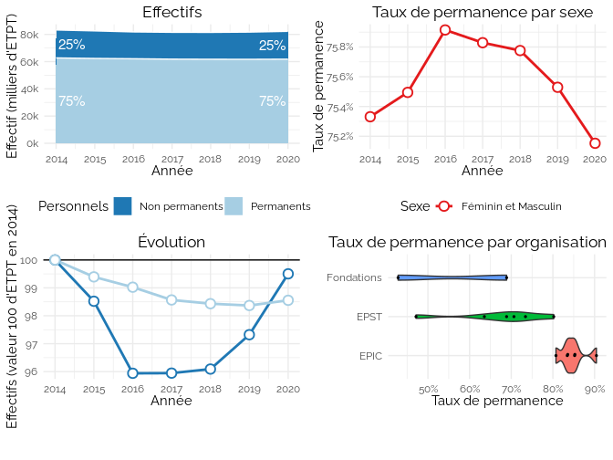
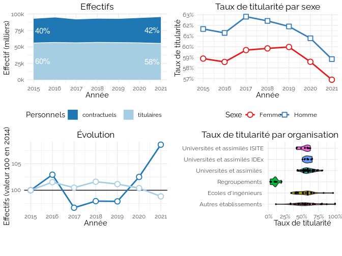
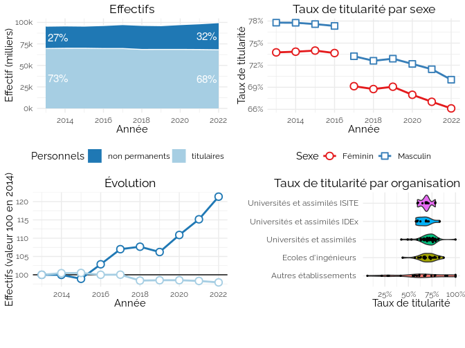
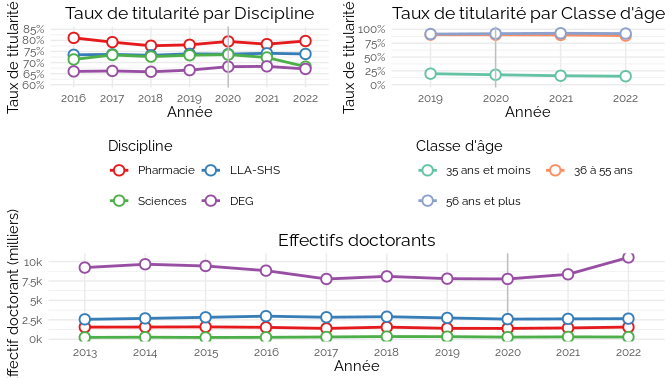
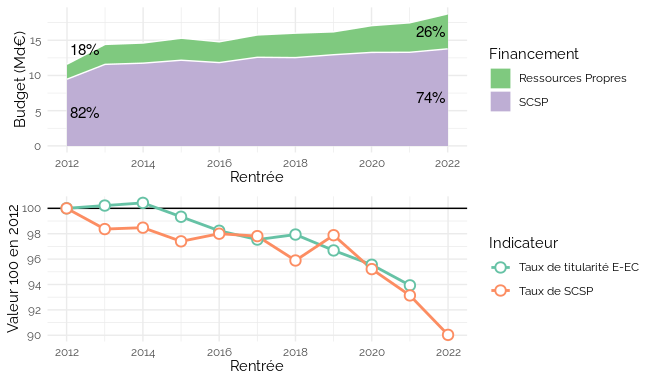
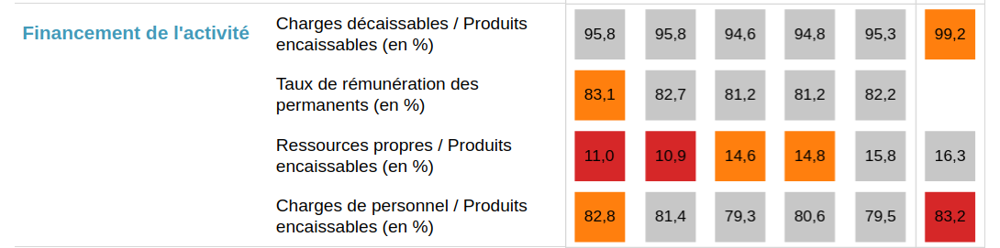
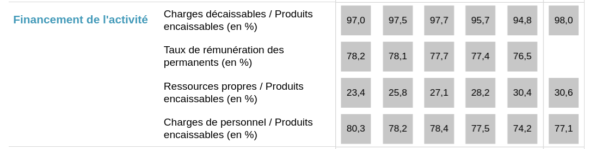
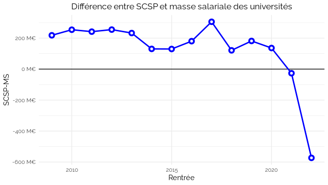

Ce que les données administratives ouvertes nous apprennent sur la
précarité statutaire dans l’ESR
================
Julien Gossa Université de Strasbourg <gossa@unistra.fr>
31-01-202

| Method          | koRpus       | stringi       |
|:----------------|:-------------|:--------------|
| Word count      | 3768         | 3774          |
| Character count | 24289        | 26246         |
| Sentence count  | 152          | Not available |
| Reading time    | 18.8 minutes | 18.9 minutes  |

Dans ce chapitre, nous allons nous intéresser, en utilisant les données
administratives ouvertes, à la précarité statutaire des personnels du
Ministère de l’enseignement supérieur et de la recherche (MESR). Cette
précarité peut se mesurer aux modalités d’embauche des travailleuse et
travailleurs de l’ESR, qui varient en pérennité : d’un poste de
fonctionnaires encore assimilés à une forme d’« emploi à vie » ; à des
contrats de vacation payés de l’heure, généralement avec plusieurs mois
de retard ; en passant par les contrats à durée indéterminée (CDI) ou
déterminée (CDD).

Comme le notait Mme. Parisot, alors présidente du MEDEF[^1], la
précarité est un phénomène polymorphe : « *La vie, la santé, l’amour
sont précaires, pourquoi le travail échapperait-il à cette loi ?* ».
Même si elle n’est pas sans rapport, la précarité statutaire ne saurait
être strictement assimilée à la précarité économique : dans les
universités, les fonctionnaires les plus mal payés sont économiquement
beaucoup plus précaires que les contractuels les mieux payés. Comme la
précarité économique touche aux conditions de vie, elle intéresse le
plus souvent les organisations de défense des travailleurs (CJC 2019;
ANCMSP 2020), et fait plus rarement l’objet de travaux scientifiques
(Bataille, Mariage, and Mercklé 2022).

La précarité statutaire, quant à elle, touche à la question des statuts,
donc à l’organisation de la profession. Cette question se pose depuis
que les universités existent (Emmanuelle Picard 2020) et dans tous les
pays où elles existent (Musselin 2008), y compris pour les organismes
nationaux de recherche (Picard and Pradoura 2009), avec en son cœur la
question des libertés académiques (Beaud 2010).

La question des statuts fait partie des nombreux points irrémédiablement
débattus à chaque moment de réforme (Louvel 2010), tels que le deuxième
colloque de Caen en 1966 (Zuckerkandl 1966), à partir duquel on cherche
à « *assurer au chercheur une sécurité qui assurera son indépendance
d’esprit* » (Baruch and Bloch 1966). S’en suit une période caractérisée
par une vague de titularisation, adossée au Décret de 1984, et qui remet
en cause la hiérarchie universitaire (Merindol 2010). Le XXIe siècle est
caractérisé par un renversement de cette orientation. La Commission
Attali propose par exemple de remplacer les concours de titularisation
des enseignants-chercheurs par 3 CDD de 4 ans avant un éventuel CDI
(Attali 2008). Ce reversement est notamment mis en œuvre par la loi
Libertés et Responsabilité des Université (LRU, 2007), qui ouvre des
possibilités nouvelles en terme de gestion des personnels (Cytermann and
Aimé 2019), puis par la loi de programmation de la recherche (LPR/LPPR,
2019) qui en accélère les principes relatifs à la contractualisation
(Harari-Kermadec et al. 2020).

Globalement, on constate une fragmentation croissante de la profession
universitaire au cours des trente dernières années (Barrier and Picard
2020), un accroissement de la précarité des carrières (Milojević,
Radicchi, and Walsh 2018) et un déclin du niveau socio-économique des
personnels académiques, qui confine à la crise (Enders and Musselin
2008), et peut être relié à une forme de marchandisation des études
supérieures (Harari-Kermadec 2019).

Ce mouvement est intimement lié à la massification éducative (Gossa
2023a), et touche d’ailleurs également l’Éducation Nationale (Cour des
Comptes 2018), et aux personnels administratifs, bien qu’il « *se heurte
à la persistance d’une conception historique de la fonction publique* »
(Pierronnet 2018). Ainsi, l’Inspection Générale constate un trop faible
recours aux contractuels par les présidences d’université, qui ratent
ainsi - d’après l’inspection - une opportunité de « *dégager des marges
de manœuvre budgétaires au service de leur projet d’établissement* »
(Boissier et al. 2019), ce que ne manquent pas de critiquer des
universitaires (Academia 2020). Ironiquement, les personnels chargés de
développer ces projets d’établissement sont eux-mêmes bien souvent
précaires (Harroche 2019). En 2023, le Président de la République, M.
Macron déclare même « *Les statuts ne sont pas des protections
aujourd’hui, ce sont devenus des éléments de complexité* » (Gossa
2023b).

Finalement, si la précarité statutaire ne mesure que très indirectement
la précarité économique, elle renseigne plus précisément l’évolution des
libertés académiques, et le développement d’une « gestion de la masse
salariale » qui s’éloigne des principes de la fonction publique.

Dans la suite de ce chapitre, nous présenterons notre méthodologie, puis
l’évolution de la précarité statutaire dans les trois grands secteurs de
l’ESR : Organismes Nationaux de Recherche (ONR), personnels non
enseignants, et personnels enseignants des universités. Nous montrerons
ensuite comment le pilotage des financements peut servir d’instrument de
gouvernement à distance (Gally 2018) de cette précarité.

# 1 Méthodologie

La méthodologie utilisée dans ce travail s’inscrit à la croisée des
sciences des données et des sciences sociales, en s’appuyant sur une
vision de l’ESR au prisme de ses données (AMUE 2021) et sur la
gouvernance par les indicateurs (Salais 2022). Nous considérons que «
*la construction de l’information chiffrée sur le monde peut contribuer
à orienter l’action publique* » (Eyraud, Miri, and Perez 2011) et que «
*les coulisses de l’open data* » (Goeta 2016) éclairent ainsi cette
action publique.

Ces travaux s’appuient sur l’étude des données administratives ouvertes
par le Ministère de l’enseignement supérieur et de la recherche (MESR),
au travers de la plateforme data.enseignementsup-recherche.gouv.fr,
alimentée par la sous-direction des Systèmes d’Information et des Études
Statistiques (SIES). Nous verrons que les conventions d’équivalence
(Desrosières 2008) ne sont pas uniformisées en ce qui concerne les
statuts, ce qui peut ouvrir à des interprétations.

Les données sont traitées par le logiciel R (R Core Team 2013), en
utilisant le formalisme RMarkdown (Xie, Allaire, and Grolemund 2019).
Les visualisations sont conçues avec la libraire ggplot2 (Wickham 2016)
en respectant les préconisations de (Wilke 2019).

Les données exploitées ont fait l’objet d’une exploration désordonnées
disponible en ligne[^2], puis d’une mise en forme pour les besoins du
chapitre. Tous les traitements sont librement accessibles en ligne[^3].

Dans chaque jeu de données, nous classons les statuts en deux
catégories, en fonction de leur pérennité. Pour chacune de ces
catégories, on représente les effectifs absolus, leur évolution en
valeur 100 pour une année de référence, le taux du statut le plus
pérenne en fonction du sexe, et en fonction de l’organisation.

Malgré le soin apporté au contrôle des données et visualisations, il est
impossible de complètement écarter la possibilité d’erreurs techniques
ou matérielles dans les données et traitements. Même sans erreur, le
travail par les données ne fournit jamais qu’une vision partielle et
partiale, qui sera débattue à la fin du chapitre.

# 2 L’évolution de la précarité statutaire dans les trois grands secteurs de l’ESR

## 2.1 ONR : Permanents vs. Non permanents

Les Organismes Nationaux de Recherche (ONR) sont, avec les universités,
les organisations publiques qui font fonctionner la recherche. Ils se
répartissent en trois catégories : les Établissements publics à
caractère scientifique et technologique (EPST : CNRS, INED, INRA, INRIA,
INSERM, IRD, IRSTEA et INRAE) ; les Établissements publics à caractère
scientifique et technologique (EPIC : CEA, CIRAD, Ifremer, CNES, ONERA
et IFPEN) ; et les fondations (Instituts Pasteur et Curie).

Seuls les EPST peuvent recruter des fonctionnaires. Le jeu de données
ouverte
`Les personnels des principaux organismes publics de recherche, par type de contrat et type d’emploi`[^4]
fait donc la distinction entre “Permanents” (fonctionnaires ou CDI) et
“Non permanents” (sous divers contrats temporaires). Elles renseignent
la période 2014-2020, avec une grande précision sur le type de contrat,
le métier, et l’organisme. Les données ne permettent cependant pas de
faire une différence par sexe[^5].

La figure 1 montre que les ONR emploient environ 80 000 personnels, dont
un quart est sur contrat non-permanent. Les effectifs permanents ont
baissé régulièrement, jusqu’à perdre 1,5 %, pendant que les effectifs
non-permanents baissaient dans un premier temps de 4 % avant de
remonter. Le taux de permanence n’a donc que très peu varié, malgré des
dynamiques différentes. La comparaison entre les différents types
d’organismes montre une très grande hétérogénéité, les EPIC ayant entre
80 % et 90 % de taux de permanence, quand les EPST varient de 80 % à
moins de 50 %. Les dynamiques sont également différentes, avec par
exemple un taux de permanence qui augmente de 10 points à l’Institut
Curie, et baisse de 5 points à l’ONERA.

Les données montre donc une baisse des effectifs dans les ONR plutôt
qu’un véritable développement de la précarité. Les contrats temporaires
semblent y être, *pour l’instant*, utilisés comme variable d’ajustement
budgétaire plus que comme support contractuel de prédilection.

## 2.2 BIATSS : Titulaires vs. Contractuels

Les personnels bibliothécaires, ingénieurs, administratifs, techniciens,
personnels sociaux et de santé (BIATSS) font l’objet d’un jeu de données
relative récent :
`Les personnels non-enseignants (BIATSS) dans les établissements publics de l'enseignement supérieur`[^6].
Ces données couvrent la période 2015-2021 et le périmètre du MESR. Elles
font la distinction entre titulaires (fonctionnaires) et contractuels
(CDI ou CDD).

Si les données font la différence entre les catégories, corps, filières,
branches d’activité professionnelle (BAP), Sexe et classes d’âge, elles
n’indiquent pas le type de contrat. Il est ainsi probable qu’elles
n’incluent pas les travailleur⋅se⋅e les plus précaires : apprentis,
services civiques et vacataires.

La figure 2 montre que, sur environ 95 000 personnels BIATSS, 40 000
sont contractuels, avec une part en légère progression de 40 % à 42 %
sur la période. L’évolution des effectifs montre un changement de
dynamique à partir de 2019, avec le début d’une baisse des titulaires et
une hausse spectaculaire des contractuels (+ 10 % en 2 ans). Le taux de
titularité par sexe montre que les femmes sont 2 à 3 points plus
contractualisées que les hommes, mais avec une dynamique semblable et un
écart qui tend à se réduire. L’analyse par organisation ne montre pas de
différente entre les universités en fonction du « périmètre d’excellence
». En revanche, les regroupements (COMUEs) présentent des taux de
titularité très faibles (\< 20 %), et les écoles d’ingénieur mais
surtout les autres établissements (dont les Grands Etablissements)
présentent une très grande hétérogénéité, allant de 11 % (École
nationale supérieure Louis Lumière) à 100 % (École des hautes études en
santé publique).

Notons que ces extrêmes emploient très peu de personnels (moins de 10),
qui n’ont peut-être pas été bien déclarés : si l’hétérogénéité est
réelle, les indicateurs individuels de chaque organisation sont toujours
sujets à caution.

Comme pour les ONR, il est probable que les contractuels aient servi de
variable d’ajustement à partir de 2016. Cependant, contrairement aux
ONR, on observe à partir de 2019 deux dynamiques inverses, les
titulaires baissant pendant que les contractuels augmentent. Il est
possible qu’il s’agisse d’une transformation dans la manière d’employer
les personnels BIATSS, qui s’installera peut-être dans la durée.

## 2.3 E-EC : Titulaires vs. Non permanents

Les personnels d’enseignement et de recherche (E-EC), dans le périmètre
du Ministère de l’enseignement supérieur et de la recherche, font
l’objet de deux jeux de données disctincts :
`Les enseignants titulaires dans les établissements publics de l'enseignement supérieur`[^7],
qui couvre la période 2010-2021 ; et
`Les enseignants non permanents des établissements publics de l'enseignement supérieur`[^8],
qui couvre la période 2012-2021.

Les personnels y sont ventilés par catégorie, discipline, sexe et classe
d’âge. Les données font la différence entre « titulaires » et « non
permanents ». Cependant, les données ne présentent pas les effectifs
vacataires, qui assurent pourtant environ un quart des heures
d’enseignement, ni les doctorants non contractuels, lesquels ne se
retrouvent que dans les jeux de données sur les étudiant⋅e⋅s.

Par ailleurs, le jeu de données sur les titulaires comporte deux
ruptures de séries. La première concerne la ventilation par sexe, avec
près de 5 000 personnels non titulaires dont le sexe n’est pas
renseignés jusqu’à 2016 (Figure . La seconde est plus modeste, avec un
changement de la date des mesures, qui explique la légère baisse
d’effectifs titulaires en 2018.

La figure 3 montre qu’il existe près de 100 000 personnels
d’enseignement et de recherche, qui passent progressivement de plus
qu’un quart de contractuels à près d’un tiers. L’évolution montre une
dynamique claire, caractérisée par l’érosion des effectifs titulaires au
gré des départs à la retraite non remplacés, et une hausse constante et
spectaculaire des effectifs contractuels, qui augmentent de près de 25%
entre 2013 et 2022. Tout comme pour les personnels BIATSS, il n’y a pas
de différence entre les universités en raison de leur « périmètre
d’excellence », mais une grande hétérogénéité avec des taux de
titularité qui vont de 42 % (Pathéon-Assas) à 83% (Université de Paris)
et 100 % (Centre universitaire de Mayotte). Contrairement à pour
personnels BIATSS, les écoles d’ingénieur sont plus homogènes. Les
autres établissements restent caractérisés par une très grande
hétérogénité de pratiques.

Les personnels d’enseignement et de recherche se détachent donc des
personnels des ONR et BIATSS par une dynamique claire, enclenchée juste
après le passage aux Responsabilités et Compétences Élargies (RCE),
d’érosion des effectifs titulaires et de développement des effectifs
contractuels.

### 2.3.1 Les E-EC plus en détails

Concernant les personnels d’enseignement et de recherche, il est
possible d’aller plus en détail, en regardant les taux de titularité par
disciplines et par classe d’âge.

Avec une ventilation par grand secteur disciplinaire, on constate sur la
figure 4 que Pharmacie présente un taux de titularité d’environ 80 %,
Lettres et sciences humaines et Sciences (LLA-SHS) d’environ 74 %, et
Droit, économie et gestion (DEG) d’environ 67 %. On constate ainsi que
la dynamique de contractualisation est essentiellement portée par le
secteur Sciences, qui passe en deux ans du niveau de LLA-SHS à celui de
DEG.

Même si le secteur science est celui qui perd le plus de postes
titulaires (-963 entre 2016 et 2022, soit environ 3 %, contre
respectivement +177, -609 et -65 en DEG, LLA-SHS et Pharmacie), sa
dynamique de contractualisation s’explique essentiellement par la
croissance du nombre de doctorants (entre 2020 et 2022 : + 2772 en
sciences (+35 %), contre respectivement +175, +59 et +12 en DEG, LLA-SHS
et Pharmacie). La barre verticale grise de la figure 4 marque le vote de
la Loi de Programmation de la Recherche, dont un des volets est
l’augmentation du nombre de doctorants, et une des promesses de ne pas
concentrer cette hausse seulement sur les Sciences.

Avec une ventilation par classe d’âge, on constate (sans grande
surprise) que ce sont les jeunes qui pâtissent le plus de la
contractualisation. Alors que les 56 ans et plus sont à plus de 90 % de
taux de titularité, les 36 à 55 ans baissent légèrement et passent sous
la barre des 90%, et les moins de 35 ans passent de 20 % à 15 % de taux
de titularité en 4 ans seulement.

Il est important de noter que les jeunes sont « naturellement » plus
précaires, bien sûr parce que certains n’ont pas encore passé les
concours de titularisation, mais surtout parce qu’ils incluent des
personnes qui ne se destinent pas forcément à des carrières académiques,
et sont simplement en train de se former à la recherche.

Ainsi, on constate d’une part une réduction du nombre de postes (Gossa
and Figon 2023) augmentant l’âge moyen de la titularisation, à 35 ans en
2022 contre 33 10 ans auparavant[^9] ; et d’autres part la mise en place
de politiques favorisant l’embauche de jeunes contractuels, comme nous
allons le voir dans la section suivante.

# 3 Le financement comme outil de gouvernement à distance

Depuis le passage aux Responsabilités et compétences élargies (RCE),
instauré par la loi LRU, caricaturalement, le gouvernement décide de
l’allocation des moyens et les établissements décident de leur usage.
Les moyens se distinguent en deux grandes masses : la Subvention pour
charge de service public (SCSP, aussi appelée « dotation récurrente »),
et les « ressources propres ».

Les SCSP sont beaucoup plus stables dans le temps que les ressources
propres, qui dépendent de l’obtention de financements ponctuels. De
plus, le principe dit de « fongibilité asymétrique » dispose que la SCSP
peut être utilisée pour rémunérer les fonctionnaires ou toutes autres
dépenses, notamment rémunérer des contractuels ; mais que les ressources
propres ne peuvent pas servir à la rémunération des fonctionnaires.
L’équilibre entre SCSP et ressources propres peut donc servir d’outil de
gouvernement à distance des taux de titularité.

Entre 2012 et 2022, la part des ressources propres dans le budget des
établissements du MESR est passée de 18 % à 26 %. Sur la période, la
dynamique du taux de titularité des E-EC est tout à fait identique à la
dynamique du taux de SCSP (figure 5, bas), ce qui peut être un témoin de
l’efficacité de cet outil de gouvernement à distance.

Si la prudence impose de rappeler que corrélation n’est pas causalité,
il faut noter qu’une grande part des ressources propres est abondée par
les financements de projet, notamment de l’Agence nationale de la
recherche (ANR) et du Programme d’investissement d’avenir (PIA), qui
sont pour la plupart de nature temporaire, donc impropres à la
rémunération de postes pérennes. Il faut ensuite ajouter que la Loi de
programmation de la recherche (LPR/LPPR) écarte la possibilité d’une
augmentation structurelle des SCSP, et prévoit seulement une
augmentation des budgets temporaires. Ainsi, cette loi dispose d’une
augmentation des moyens pour recruter des effectifs temporaires, au
détriment des moyens pour recruter des effectifs pérennes. Si ce n’était
pas l’object, au moins est-ce une conséquence prévisible et maîtrisable.

Peut-on, pour autant, parler de défiance envers les fonctionnaires dans
l’enseignement supérieur et la recherche ?

## 3.1 Les indicateurs officiels de pilotage

Le gouvernement met en ligne des tableaux de bord financier des
universités[^10], qui proposent, individuellement pour chaque
établissement, un ensemble d’indicateurs accompagnés d’un « seuil de
vigilance » et d’un « seuil d’alerte ». Lorsque ces derniers sont
atteints, l’indicateur est surligné respectivement en orange puis rouge,
indiquant un problème qu’il convient de résoudre.

Dans ce très grand ensemble d’indicateurs, trois s’intéressent à la
titularité, à la part de SCSP et aux rémunérations, donc voici les
interprétations officielles :

- Taux de rémunération des permanents : *« Interprétation : Un ratio
  élevé est un indicateur de rigidité. Plus l’indicateur se rapproche de
  100% et moins l’établissement dispose de marges de manœuvre. »*
- Ressources Propres / Produits encaissables : *« Interprétation : Degré
  de dépendance de l’établissement aux subventions de charge de service
  public versées par l’Etat »*
- Charges de personnel / Produits encaissables : *« Interprétation : Le
  poids relatif des charges de personnel dans les ressources
  encaissables, ainsi que son évolution, est significatif. Plus le ratio
  augmente, moins l’établissement dispose de marge de manœuvre. »*

On constate ainsi que la rémunération des personnels permanents est
considérée comme un facteur de « *rigidité* », que les SCSP qui
permettent de les rémunérer constituent une « *dépendance* » et que les
rémunérations des personnels diminuent la « *marge de manœuvre* ». Dans
ces définitions, qui sont celles retenues par l’État pour gouverner les
établissements, les personnels permanents et leur rémunérations font
ainsi l’objet d’une défiance explicite, s’opposant aux valeurs promues
par le discours public : « agilité » et « autonomie ».

# 4 Conclusion

Nous avons vu, dans ce chapitre, comment les données administratives
ouvertes pouvaient informer l’évolution de la précarité dans les métiers
de l’enseignement et de la recherche publics. Nous avons d’abord vu que
les dynamiques était très différentes selon les secteurs : stabilité
dans les ONR, progression récente pour les personnels BIATSS, et
progression constante pour les personnels d’enseignement et/ou de
recherche. L’étude selon le sexe montre des différences, les femmes
étant plus précaires que les hommes, mais des dynamiques équivalentes.
Nous avons également vu que les situations et dynamiques étaient très
hétérogènes selon les statuts, corps, métiers, organismes et
établissements.

Nous avons ensuite vu comment les outils de pilotage du financement
pouvait servir d’instrument de gouvernement à distance des équilibres
entre recrutement pérennes et temporaires. D’un point de vu managérial,
on parle rarement de « précarité », auquel on préfère les termes «
agilité » et « autonomie ».

Il convient maintenant d’identifier les limites de cette étude. En
premier lieu, on a vu la grande difficulté de catégoriser les
personnels, tantôt distingués entre « permanents » et « non permanents
», tantôt en « titulaires » et « contractuels », ou encore en «
titulaires » et « non permanents ». On remarque une certaine pudeur dans
l’usage de termes comme « non permanents » plutôt que « temporaires ».
Cette difficulté à nommer, et plus encore à définir et mesurer la
précarité dans les conventions d’équivalences peut illustrer la
difficulté de mettre la précarité en données. Notamment, il faut se
garder de comparer les taux de titularité observé sur les différents
jeux de données, car ils ne sont certainement pas comparables.
Typiquement, un CDI sera comptabilisé comme « permanent » dans les ONR,
mais « contractuel » dans les BIATSS, et n’existe pas dans les E-EC. Ces
données étant de plus en plus utiles au pilotage, il devient désormais
nécessaire de les fiabiliser (Pauline Boyer 2023).

Enfin, les statuts les plus temporaires ne sont tout simplement pas
comptabilisés : apprentis, services civiques, stagiaires, et bien sûr
vacataires… Plus les statuts sont précaires, plus la qualité des données
administratives ouvertes se dégrade, jusqu’à disparaître totalement.
Selon la DGRH, les vacataires d’enseignement sont pourtant environ 152
000, soit presque trois fois plus nombreux que les E-EC titulaires[^11].

Ces insuffisances des données administratives ouvertes renseignent
peut-être où se place le souci des gouvernements. Un contrat permanent
ou un fonctionnaire engage beaucoup plus l’État qu’un contrat temporaire
passé entre un établissement dit « autonome » et une personne que rien
ne lit directement à l’État. Il est donc légitime que les gouvernements
se dotent d’outil de suivi et de pilotage des personnels permanents.

L’esprit de l’autonomie, telle qu’elle a été définie par la loi LRU,
prend alors tout son sens lorsque la Ministre déclare « *En 2024, nous
compenserons aux établissements au moins 50 % des surcoûts liés aux
mesures qui portent sur le point d’indice.* ». En d’autres termes, elle
assume que l’État ne prendra plus en charge les rémunérations des
fonctionnaires décidées par le gouvernement. Cette décision apparaît
clairement lorsqu’on compare les subventions pour charge de service
public (SCSP) et la masse salariales (MS) des universités.

La figure 7 monre qu’en 10 ans, les ressources propres sont passées de
18 % à 26 % des ressources des universités, faisant baisser le taux de
SCSP de 10%. Le taux de titularité des E-EC suit presque exactement la
même trajectoire.

Désormais confrontées volontairement à un état de déficit budgétaire,
sinon de faillite, l’avenir nous dira quelles « marges de manœuvre » les
présidences d’université décideront d’utiliser avec « agilité », entre
vider leurs réserves, ne pas remplacer les départs à la retraite des
fonctionnaires, ou diminuer les rémunérations et effectifs de
contractuels. Les trois seront peut-être nécessaires.

# 5 Références

Academia. 2020.“ Les universités n’utilisent pas encore assez de
contractuels : une lecture du dernier rapport des inspections générales
sur l’emploi universitaire.” {Billet}. *Academia*.

AMUE. 2021. “L’ESR Vu Par Le Prisme de La Donnée Universitaire.” *La
Collection Numérique*, no. 18 (December).

ANCMSP. 2020. “LPPR : 2 SMIC Pour Les Titulaires, Des Cacahuètes Pour
Les Précaires ?” Site d'association Militante. *ANCMSP*.
https://ancmsp.com/lppr-2-smic-pour-les-titulaires-des-cacahuetes-pour.

Attali, Jacques. 2008. “Rapport de la Commission pour la libération de
la croissance française : 300 décisions pour changer la France.”
{Rapport public}. Présidence de la République.

Barrier, Julien, and Emmanuelle Picard. 2020. “Les universitaires,
combien de divisions ? Lignes de fracture et transformations de la
profession académique en France depuis les années 1990.” *Revue
française de pédagogie. Recherches en éducation*, no. 207 (June): 19–28.
<https://doi.org/10.4000/rfp.9146>.

Baruch, P., and C. Bloch. 1966. “Éfficacité de La Recherche
Fondamentale,” Revue de l’enseignement supérieur, II - L’avenir et la
réforme des structures. (4): 165–67.

Bataille, Pierre, Ange Mariage, and Pierre Mercklé. 2022. “Étude
scientifique sur la précarité financière des doctorants UGA.” Université
Grenoble Alpes.

Beaud, Olivier. 2010. “Les libertés universitaires (I).” *Commentaire*
Numéro 129 (1): 175–96. <https://doi.org/gg5v7k>.

Boissier, Pierre, Céline Kerenflec’H, Louis Stroymeyt, Aleth Vennin,
Philippe Dulbecco, and Jean-François Picq. 2019. “Le pilotage et la
maîtrise de la masse salariale des universités.” IGAENR, IGF.

CJC. 2019. “Depuis le 1er janvier 2019, les vacations d’enseignement du
supérieur sont payées 17 centimes sous le SMIC.” {Site d'association
militante}. *Confédération des Jeunes Chercheurs*.
https://cjc.jeunes-chercheurs.org/positions/communique-2019-05-23.pdf.

Cour des Comptes. 2018. “Le Recours Croissant Aux Personnels
Contractuels Un Enjeu désormais Significatif Pour l’éducation
Nationale.” Cour des comptes.

Cytermann, Jean-Richard, and Pascal Aimé. 2019. “La loi  libertés et
responsabilités des universités  : origines, apports et bilan de la mise
en œuvre.” *Revue française d’administration publique* 169 (1): 21–36.
<https://doi.org/gf7jvd>.

Desrosières, Alain. 2008. *Pour une sociologie historique de la
quantification : L’Argument statistique I*. *Pour une sociologie
historique de la quantification : L’Argument statistique I*. Sciences
sociales. Paris: Presses des Mines.

Emmanuelle Picard. 2020. “La Profession Introuvable ? Les Universitaires
Français de l’Université Impériale Aux Universités Contemporaines.”
Habilitation {\\a} Diriger Des Recherches, Université Paris 1 - Panthéon
Sorbonne.

Enders, Jürgen, and Christine Musselin. 2008. “Back to the Future? The
Academic Professions in the 21st Century.” In *Higher Education to 2030,
Volume 1, Demography*, 125–50. OECD.
<https://doi.org/10.1787/9789264040663-5-en>.

Eyraud, Corine, Mustapha El Miri, and Patrick Perez. 2011. “Les enjeux
de quantification dans la LOLF. Le cas de l’enseignement supérieur.”
*Revue Francaise de Socio-Economie* n 7 (1): 147–68.

Gally, Natacha. 2018. “Entre executive shift et gouvernement à
distance.” *Revue francaise de science politique* Vol. 68 (4): 691–715.
<https://doi.org/ggqsgh>.

Goeta, Samuel. 2016. “Instaurer des données, instaurer des publics : une
enquête sociologique dans les coulisses de l’open data.” PhD thesis,
Télécom ParisTech.

Gossa, Julien. 2023a. “L’université à son tournant. Une vue par les
données.” *Esprit* Juillet-Août (7-8): 41–52.
<https://doi.org/10.3917/espri.2307.0041>.

———. 2023b. “Réception pour l’avenir de la recherche française.” *Docs
en stock : dans les coulisses de la démocratie universitaire*.

Gossa, Julien, and Florent Figon. 2023. “L’entrée dans la carrière des
enseignants-chercheurs Edition 2023.” CPESR.

Harari-Kermadec, Hugo. 2019. *Le Classement de Shanghai. L’université
Marchandisée*. L’économie Encastrée. Le Bord de l’eau.

Harari-Kermadec, Hugo, Nicolas Pinsard, Raphaël Porcherot, and Emma
Tyrou. 2020. “Loi de programmation de la recherche : une loi de
précarisation,” September, 15.

Harroche, Audrey. 2019. “Les petites mains de l’excellence. Place et
rôle des chargées de projet dans la mise en œuvre d’une Initiative
d’excellence.” *Revue francaise d’administration publique* N 169 (1):
151–67.

Louvel, Séverine. 2010. “Les Personnels de l’enseignement Supérieur :
Débats Historiques Et Perspectives Européennes.” In *Politique, Science
Et Action Publique - La référence à
Pierre Mendès
France Et Les débats Actuels*, 197–209. Presses de l’université
de Grenoble.

Merindol, Jean-Yves. 2010. “Les universitaires et leurs statuts depuis
1968.” *Le Mouvement Social* n 233 (4): 69–91.

Milojević, Staša, Filippo Radicchi, and John P. Walsh. 2018. “Changing
Demographics of Scientific Careers: The Rise of the Temporary
Workforce.” *Proceedings of the National Academy of Sciences* 115 (50):
12616–23. <https://doi.org/10.1073/pnas.1800478115>.

Musselin, Christine. 2008. *Les universitaires*. Paris: La decouverte.

Pauline Boyer. 2023. “Pourquoi s’engager Dans Une démarche Open Data ?”
*La Collection Numérique*, AMUE, no. 25 (February): 52.

Picard, Jean François, and Elisabeth Pradoura. 2009. “La Longue Marche
Vers Le CNRS (1901 1945),” Cahiers pour l’histoire du CNRS (1988 - 1),.

Pierronnet, Romain. 2018. “Les Universités gèrent-Elles Leurs Personnels
BIATSS? : L’entretien Professionnel Comme révélateur Des Pratiques.” PhD
thesis.

R Core Team. 2013. *R: A Language and Environment for Statistical
Computing*. Vienna, Austria: R Foundation for Statistical Computing.

Salais, Robert. 2022. “‘La Donnée n’est Pas Un Donné’: Statistics,
Quantification and Democratic Choice.” In *The New Politics of Numbers:
Utopia, Evidence and Democracy*, edited by Andrea Mennicken and Robert
Salais, 379–415. Executive Politics and Governance. Cham: Springer
International Publishing.
<https://doi.org/10.1007/978-3-030-78201-6_12>.

Wickham, Hadley. 2016. *Ggplot2: Elegant Graphics for Data Analysis*.
2nd ed. 2016. Use R! Cham: Springer International Publishing : Imprint:
Springer. <https://doi.org/10.1007/978-3-319-24277-4>.

Wilke, C. 2019. *Fundamentals of Data Visualization: A Primer on Making
Informative and Compelling Figures*. First edition. Sebastopol, CA:
O’Reilly Media.

Xie, Yihui, Joseph J. Allaire, and Garrett Grolemund. 2019. *R Markdown:
The Definitive Guide*. Chapman & Hall/CRC, the R Series. Boca Raton
London New York: CRC Press, Taylor & Francis Group.

Zuckerkandl, Emile. 1966. “Les conditions d’éfficacité de la recherche
fondamentale.” ASSOCIATION D’ÉTUDE POUR L’EXPANSION DE LA RECHERCHE
SCIENTIFIQUE.

[^1]: Mouvement des entreprises de France, Interview au Figaro, 30 aout
    2005

[^2]: <https://github.com/cpesr/RFC/>

[^3]: <https://github.com/juliengossa/presentations/tree/main/precarite>

[^4]: <https://data.enseignementsup-recherche.gouv.fr/explore/dataset/fr-esr-tbes-personnels-epst-epic-fondation-par-type-contrat-emploi/>

[^5]: Un autre jeu de données ouvertes fait la différence par sexe, mais
    ne s’intéresse qu’aux permanents :
    <https://data.enseignementsup-recherche.gouv.fr/explore/dataset/fr_esr_tbes_titulaires_epst/>

[^6]: <https://data.enseignementsup-recherche.gouv.fr/explore/dataset/fr-esr-personnels-biatss-etablissements-publics/>

[^7]: <https://data.enseignementsup-recherche.gouv.fr/explore/dataset/fr-esr-enseignants-titulaires-esr-public/>

[^8]: <https://data.enseignementsup-recherche.gouv.fr/explore/dataset/fr-esr-enseignants-nonpermanents-esr-public/>

[^9]: Note DGRH n°7, 2023
    <https://www.enseignementsup-recherche.gouv.fr/sites/default/files/2023-11/note-dgrh-n-7-septembre-2023---trajectoire-professionnelle-des-enseignants-chercheurs-recrut-s-en-2022-pdf-30093.pdf>

[^10]: <a
    href="https://data.esr.gouv.fr/FR/E810/P844/tableau_de_bord_financier\_-\_universite"
    class="uri">https://data.esr.gouv.fr/FR/E810/P844/tableau_de_bord_financier\_-\_universite</a>

[^11]: Note DGRH n°4, 2023
    <https://www.enseignementsup-recherche.gouv.fr/fr/les-enseignants-contractuels-affectes-dans-l-enseignement-superieur-annee-2021-2022-92589>
