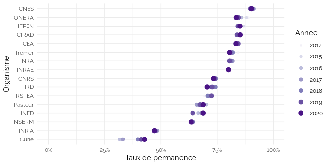
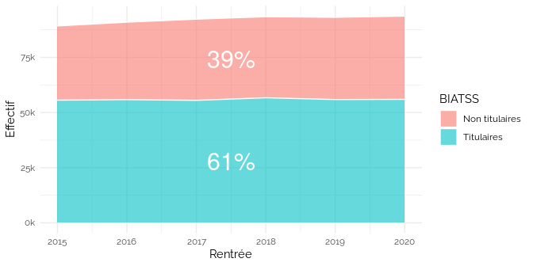
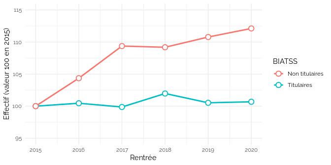
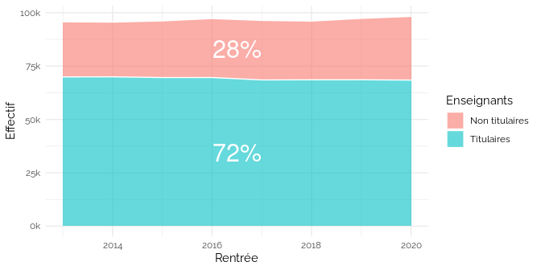
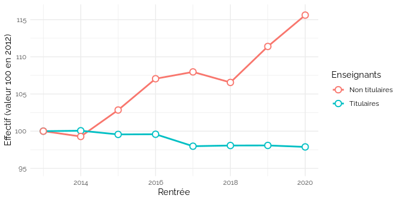
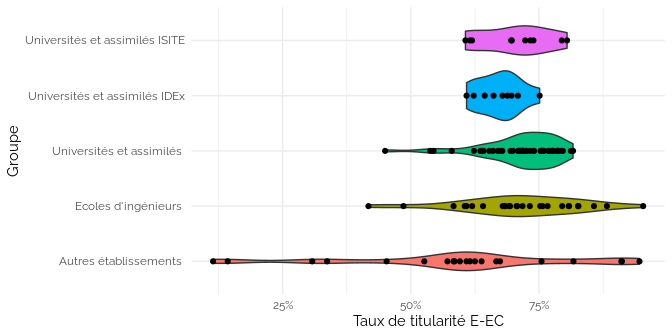
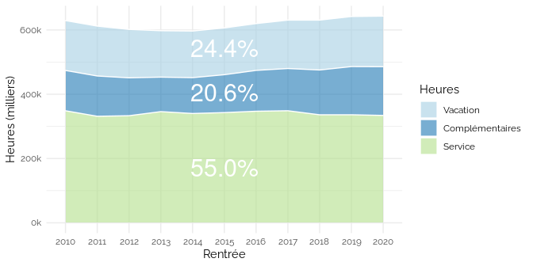

Mesuret la precarité par les données ouvertes
================
Julien Gossa Université de Strasbourg
[@JulienGossa](https://twitter.com/JulienGossa)     <gossa@unistra.fr>
12-10-2022

## ONR

<!-- -->

<!-- -->

<!-- -->

<!-- -->

## Personnels biatss

<!-- -->

<!-- -->

<!-- -->

## Personnels enseignants

<!-- -->

<!-- -->

<!-- -->

## Heures complémentaires

<!-- -->

<!-- -->

## Fongibilité asymétrique

<!-- -->

<!-- -->

## Investissement vs. Productivité

<!-- -->

<!-- -->
