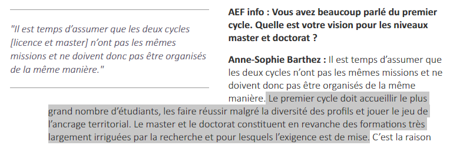
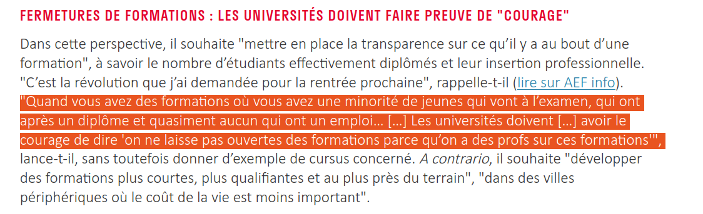

```{r setup, include=FALSE}
knitr::opts_chunk$set(echo = FALSE, warning = FALSE, message = FALSE)
options(dplyr.summarise.inform = FALSE)

knitr::opts_chunk$set(fig.asp=7.5/16, fig.width = 8)

library(tidyverse)
library(ggcpesrthemes)
library(kpiESR)
library(cowplot)

theme_set(theme_cpesr() + theme(legend.position = "right", plot.title = element_text(hjust = 0.5)))

#source("tdbesr-plots.R")
source("../ressources/data/BL/BLViz-map.R",chdir = TRUE)
load("../ressources/data/plots.RData")
```


## Budget : Dotation vs. dépenses de personnel

```{r, fig.asp=7.5/16, out.width="100%"}
plot_SCSPvsMS
```

## Budget : L'hypothèse de la pénurie de moyens

```{r, out.width="65%", fig.align="center"}
knitr::include_graphics("../ressources/img/OFCE-apprentissage.png")
```

\tiny

Source : OFCE, Apprentissage : quatre leviers pour reprendre le contrôle 
https://www.ofce.sciences-po.fr/pdf/pbrief/2024/OFCEpbrief135.pdf


## Objectifs de la nation : « Excellence scientifique »


```{r, out.width="100%", fig.align="center", fig.show='hold'}
  knitr::include_graphics("../ressources/img/PAP-172-2025.jpeg")
```

\tiny
Source : Projet annuel de performances PLF 2025 https://www.budget.gouv.fr/documentation/documents-budgetaires/exercice-2025


## Objectifs de la nation : Massification éducative

- 80% d'une classe d'âge au Bac
- 50% d'une classe d'âge diplômée du supérieur


```{r, out.width="100%", fig.align="center"}
knitr::include_graphics("../ressources/img/PAP-150-2025-parcoursup.png")
```

\tiny

Source : Projet annuel de performances PLF 2025 https://www.budget.gouv.fr/documentation/documents-budgetaires/exercice-2025/projet-loi-finances-les/budget-general-plf-13


## Stagnation éducative / Déclin éducatif : illusion démographique

```{r}
plot_MassificationRecent
```


## Stagnation éducative / Déclin éducatif : illusion démographique

```{r}
plot_MassificationLong
```

## Stagnation éducative / Déclin éducatif : illusion démographique

```{r, out.width="40%", fig.align="center"}
knitr::include_graphics("../ressources/img/INSEE-naissances.png")
```

Source : INSEE https://www.insee.fr/fr/statistiques/2381380


## Stagnation éducative / Déclin éducatif : illusion démographique

```{r, fig.align="center"}
load("../ressources/data/predictions.RData")
predictions
```

## Développement du secteur privé (lucratif)

```{r, out.width="80%", fig.align="center"}
knitr::include_graphics("../ressources/img/EESR-effectifs.png")
```

\tiny
Source : EERS 
https://publication.enseignementsup-recherche.gouv.fr/eesr/FR/EESR17_ES_10/les_etudiants_dans_les_filieres_de_formation_depuis_1960_croissance_et_diversification/


## Développement du secteur privé (lucratif) (prédateur)

```{r, out.width="65%", fig.align="center"}
knitr::include_graphics("../ressources/img/OFCE-apprentissage.png")
```

\tiny

Source : OFCE, Apprentissage : quatre leviers pour reprendre le contrôle 
https://www.ofce.sciences-po.fr/pdf/pbrief/2024/OFCEpbrief135.pdf


## Internalisation des valeurs du secteur privé

```{r, fig.asp=7/16, fig.width=7, out.width="100%", fig.align='center'}
plot_RecettesFormation
```


## Au final : Le mystère de l'investissement dans l'ESR - investissement

```{r, out.width="70%", fig.align="center"}
knitr::include_graphics("../ressources/img/budgetparetu.png")
```


## Au final : Le mystère de l'investissement dans l'ESR - productivité

```{r, out.width="70%", fig.align="center"}
knitr::include_graphics("../ressources/img/budgetparetu-flip.png")
```

## Au final : Le mystère de l'investissement dans l'ESR - « ressources propres »

```{r, fig.asp=7.5/16, out.width="100%"}
plot_SCSPvsMS
```

## La valeur des diplômes en question

« Réussite » vs. « exigence » / Capital humain vs. Signal 

```{r, fig.asp=7/16, fig.width=7, out.width="100%", fig.align='center'}
plot_LvsM
```


## Conclusion : A quoi sert l'enseignement supérieur ?

- La crise budgétaire cache une crise de vocation de l'Université.
  - Le rôle historique défini après-guerre (massification + production scientifique) est révolu.
  - Le rôle défini au tournant du XXIe (insertion pro + Excellence) peine à faire sens.
- Réactivation de la question historique sur l'éducation :
  - Au service de toute la société ? $\rightarrow$ Service public / étudiants
  - Au service de chaque individu ? $\rightarrow$ Service privé / consommateurs
  
### Besoin urgent d'une refondation

\centering
Remise à plat et hiérarchisation des missions, avec mise en question de la production scientifique et de l'insertion professionnelle.

### Possible question centrale

\centering
Comment centrer la production et la diffusion des connaissances universitaires sur les grandes crises, notamment écologiques ?


## Discours : Réussite vs. Exigence


:::::: {.cols data-latex=""}

::: {.col data-latex="{0.60\textwidth}"}

```{r, out.width = "100%"}

``` 

- Anne-Sophie Bartez, DGESIP, 2019
- Frédérique Vidal, MESR, 2021
\vfill

\tiny
https://www.aefinfo.fr/depeche/616359

https://www.lefigaro.fr/actualite-france/frederique-vidal-l-enjeu-est-de-preserver-le-taux-d-insertion-professionnelle-20210921

:::
::: {.col data-latex="{0.40\textwidth}"}

```{r, out.width = "100%"}
knitr::include_graphics("../ressources/img/Presse-LM-FVidal.png")
``` 

:::
::::::


## Discours : Insertion professionnelle et Offre de formation

```{r, out.width = "90%", fig.align='center'}

``` 

- Emmanuel Macron, Présidence de la République, 4/09/2023

\tiny
https://www.aefinfo.fr/depeche/698571-pour-etre-plus-efficace-l-universite-doit-faire-davantage-contribuer-ceux-qui-ont-le-plus-de-moyens-emmanuel-macron


## Discours : Public/Privé - Qualité

```{r, out.width = "70%", fig.align='center'}
knitr::include_graphics("../ressources/img/Presse-Privé-TCoulhon.png")
``` 

- Thierry Coulhon, Hcéres et Anne-Sophie Barthez, DGESIP, 31/03/2023

\tiny
https://www.aefinfo.fr/depeche/690094-prive-lucratif-nous-n-opposons-aucune-categorie-d-etablissement-a-s-barthez-dgesip


## Discours : Rémunérations vs. dotation

```{r, out.width = "75%", fig.align='center'}
knitr::include_graphics("../ressources/img/SR-SCSPMS.png")
``` 

- Sylvie Retailleau, Ministre ESR en 2023

\tiny
Question orale n°0915S « Situation budgétaire des universités et particulièrement de Le Mans Université »

https://www.senat.fr/questions/base/2023/qSEQ23110915S.html


