CPESR
================
CPESR
2025-05-17

## plot_RecettesFormation

    ## Warning: remplacement de l'importation précédente 'ggthemes::theme_map' par
    ## 'cowplot::theme_map' lors du chargement de 'kpiESR'

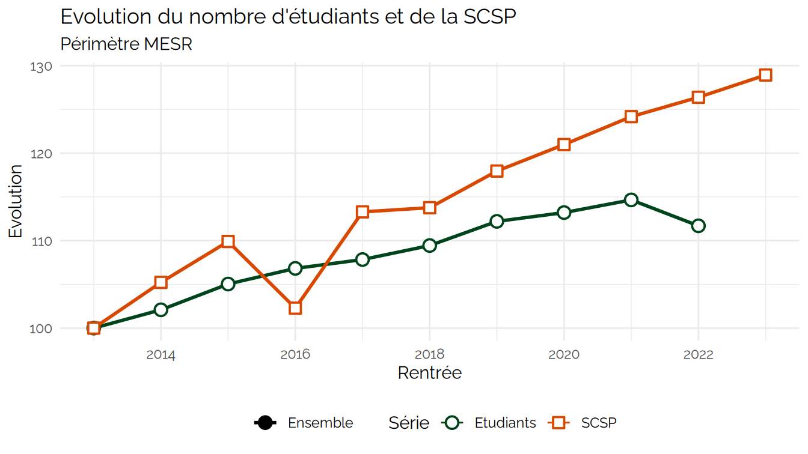

RecettesFormation ( 18 lignes)

| Rentrée | Groupe   | kpi.FIN.S.recettesFormation | kpi.K.forPetu |
|--------:|:---------|----------------------------:|--------------:|
|    2006 | Ensemble |                          NA |            NA |
|    2007 | Ensemble |                          NA |            NA |
|    2008 | Ensemble |                          NA |            NA |
|    2009 | Ensemble |                   392011544 |      257.7436 |
|    2010 | Ensemble |                   503252984 |      332.0748 |
|    2011 | Ensemble |                   618575129 |      404.9809 |
|    2012 | Ensemble |                   612211414 |      396.7325 |
|    2013 | Ensemble |                   581119495 |      367.3821 |
|    2014 | Ensemble |                   485880945 |      300.5871 |
|    2015 | Ensemble |                          NA |            NA |
|    2016 | Ensemble |                          NA |            NA |
|    2017 | Ensemble |                   904344796 |      532.8800 |
|    2018 | Ensemble |                   901532642 |      521.9465 |
|    2019 | Ensemble |                   829077063 |      470.7557 |
|    2020 | Ensemble |                  1089319927 |      610.8238 |
|    2021 | Ensemble |                  1212679498 |      674.8247 |
|    2022 | Ensemble |                  1266241841 |      727.9963 |
|    2023 | Ensemble |                  1333497501 |            NA |

## plot_RessourcesPropres

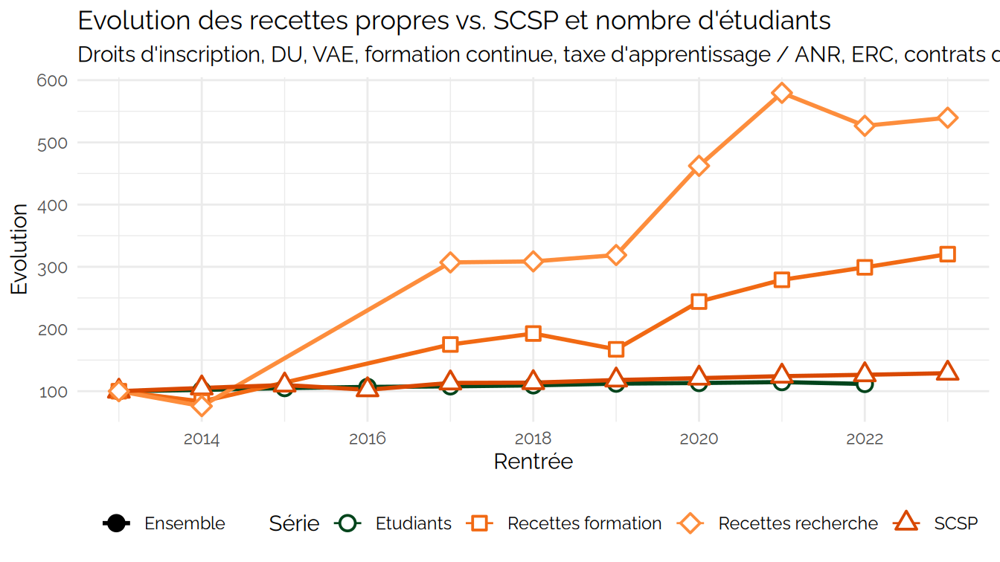

RecettesFormation ( 18 lignes)

| Rentrée | Groupe | kpi.FIN.S.recettesFormation | kpi.K.forPetu | kpi.FIN.S.recettesRecherche | kpi.K.recPect |
|---:|:---|---:|---:|---:|---:|
| 2006 | Ensemble | NA | NA | NA | NA |
| 2007 | Ensemble | NA | NA | NA | NA |
| 2008 | Ensemble | NA | NA | NA | NA |
| 2009 | Ensemble | 392011544 | 257.7436 | 190953825 | NA |
| 2010 | Ensemble | 503252984 | 332.0748 | 187313691 | NA |
| 2011 | Ensemble | 618575129 | 404.9809 | 208217135 | NA |
| 2012 | Ensemble | 612211414 | 396.7325 | 267461556 | 4319.260 |
| 2013 | Ensemble | 581119495 | 367.3821 | 361283727 | 5819.366 |
| 2014 | Ensemble | 485880945 | 300.5871 | 308079763 | 4995.456 |
| 2015 | Ensemble | NA | NA | NA | NA |
| 2016 | Ensemble | NA | NA | NA | NA |
| 2017 | Ensemble | 904344796 | 532.8800 | 779748422 | 13656.557 |
| 2018 | Ensemble | 901532642 | 521.9465 | 822054735 | 13529.093 |
| 2019 | Ensemble | 829077063 | 470.7557 | 857827343 | 14131.781 |
| 2020 | Ensemble | 1089319927 | 610.8238 | 1020214117 | 16869.735 |
| 2021 | Ensemble | 1212679498 | 674.8247 | 1227104285 | 20123.391 |
| 2022 | Ensemble | 1266241841 | 727.9963 | 1237630338 | NA |
| 2023 | Ensemble | 1333497501 | NA | 1303008483 | NA |

## plot_SCSPvsMS

    ## Warning: Using `size` aesthetic for lines was deprecated in ggplot2 3.4.0.
    ## ℹ Please use `linewidth` instead.
    ## This warning is displayed once every 8 hours.
    ## Call `lifecycle::last_lifecycle_warnings()` to see where this warning was
    ## generated.

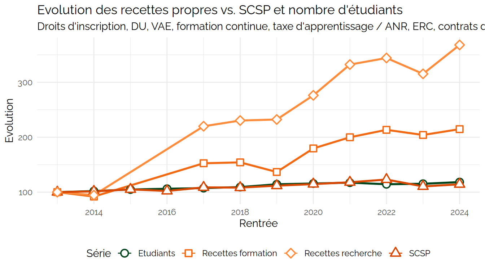

## plot_MassificationRecent

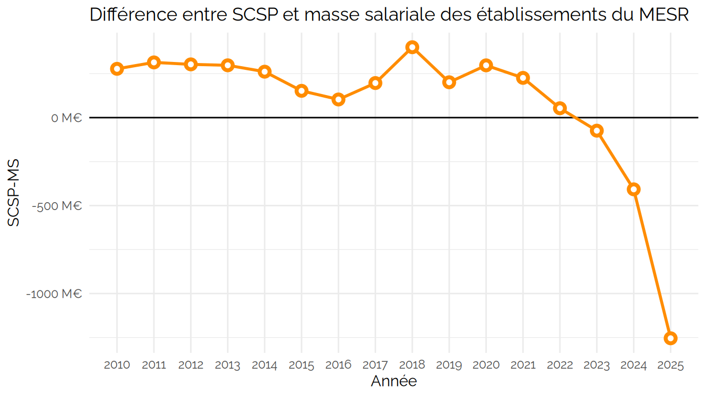

## plot_MassificationLong

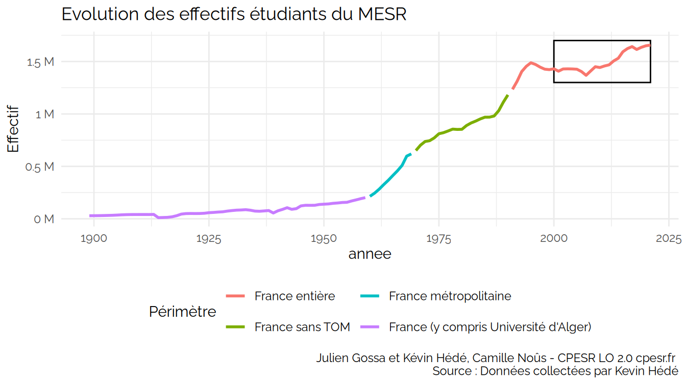

## plot_LvsM

## plot_postesMCF

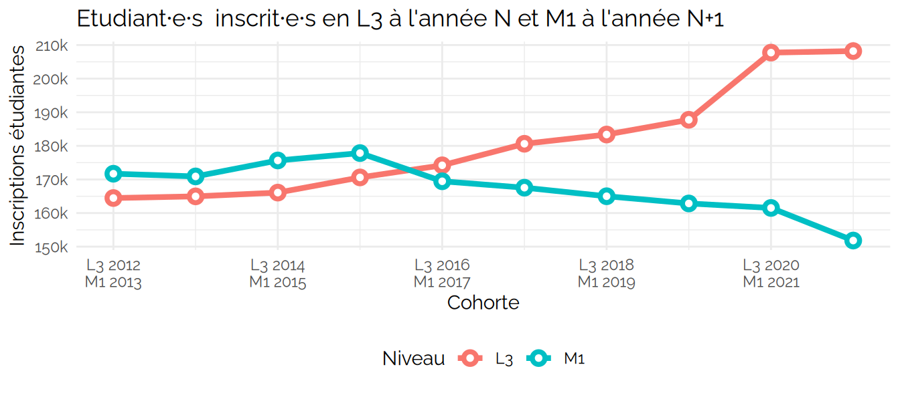

## plot_postesMCFvsCandidats

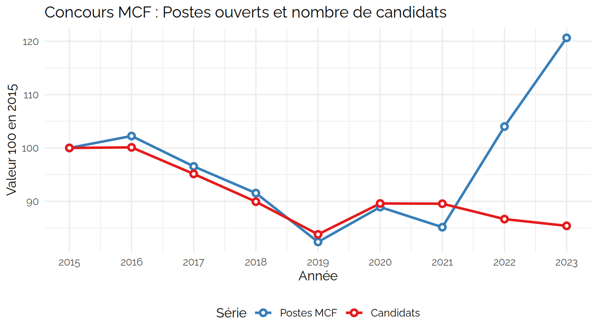

## plot_postesMCFnonPourvus

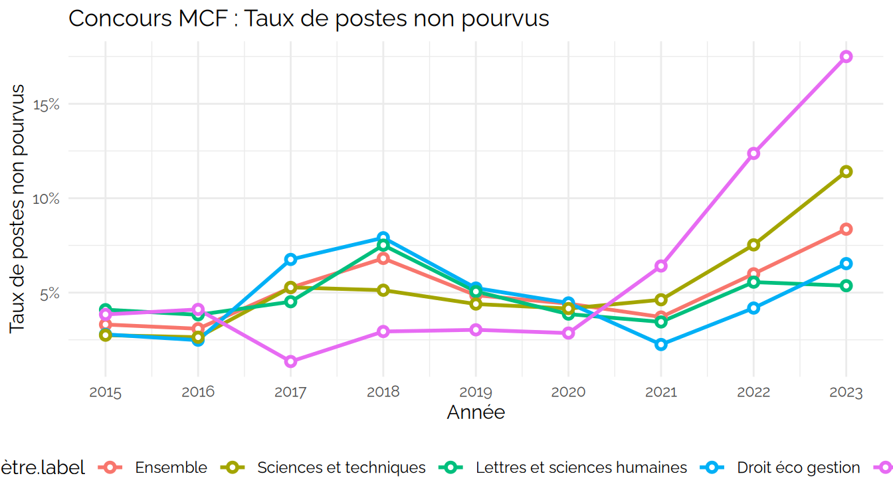

## plot_BMO

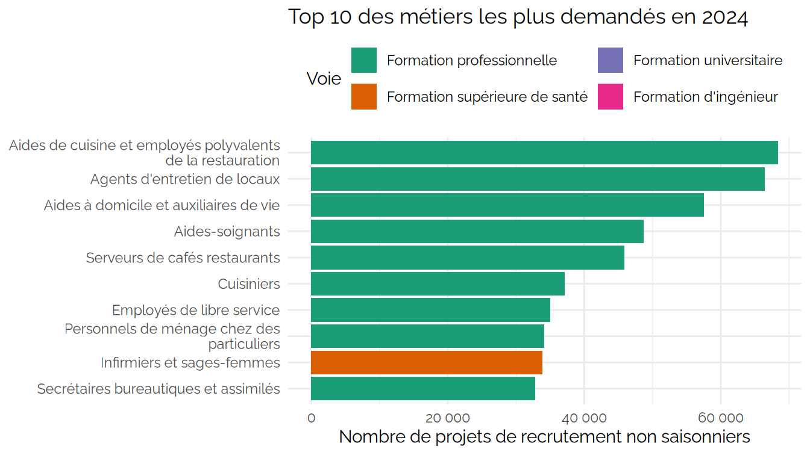

### Massification (1960-2000) : Investissements massifs dans l’éducation

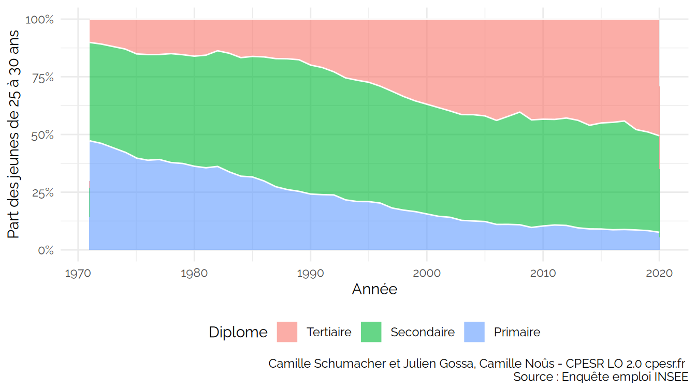

### Massification (1960-2000) : Investissements massifs dans l’éducation

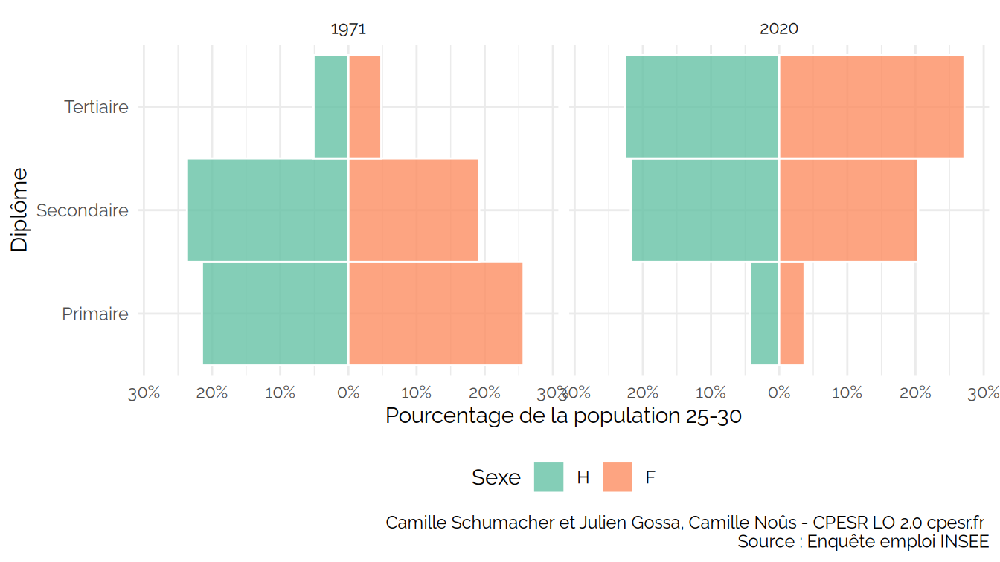

## Save
