CPESR
================
CPESR
2026-08-31

## plot_SCSPvsEtu

    ## Warning: Using `size` aesthetic for lines was deprecated in ggplot2 3.4.0.
    ## ℹ Please use `linewidth` instead.
    ## ℹ The deprecated feature was likely used in the kpiESR package.
    ##   Please report the issue to the authors.
    ## This warning is displayed once every 8 hours.
    ## Call `lifecycle::last_lifecycle_warnings()` to see where this warning was
    ## generated.

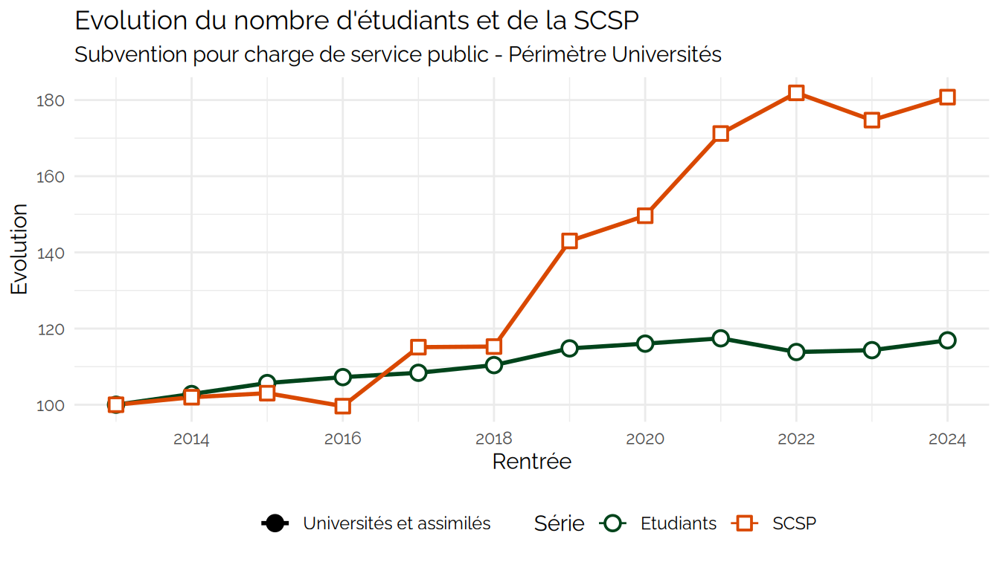

## plot_RecettesFormation

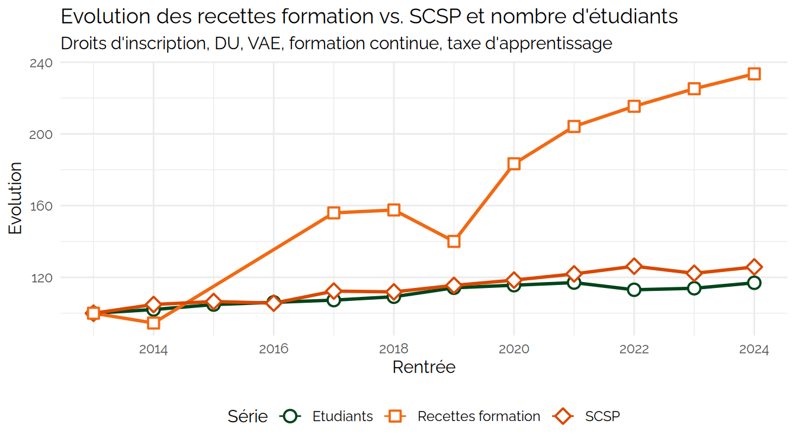

RecettesFormation ( 20 lignes)

| Rentrée | Groupe   | kpi.FIN.S.recettesFormation | kpi.K.forPetu |
|--------:|:---------|----------------------------:|--------------:|
|    2006 | Ensemble |                          NA |            NA |
|    2007 | Ensemble |                          NA |            NA |
|    2008 | Ensemble |                          NA |            NA |
|    2009 | Ensemble |                   422349410 |      277.3363 |
|    2010 | Ensemble |                   525880929 |      346.4997 |
|    2011 | Ensemble |                   634633680 |      414.8572 |
|    2012 | Ensemble |                   675544503 |      431.7610 |
|    2013 | Ensemble |                   601104364 |      374.9392 |
|    2014 | Ensemble |                   568254152 |      347.2396 |
|    2015 | Ensemble |                          NA |            NA |
|    2016 | Ensemble |                          NA |            NA |
|    2017 | Ensemble |                   937437623 |      544.8920 |
|    2018 | Ensemble |                   947226972 |      541.0620 |
|    2019 | Ensemble |                   841910373 |      459.8628 |
|    2020 | Ensemble |                  1102088575 |      594.5393 |
|    2021 | Ensemble |                  1227183821 |      653.7972 |
|    2022 | Ensemble |                  1294733608 |      714.2239 |
|    2023 | Ensemble |                  1353554399 |      741.1579 |
|    2024 | Ensemble |                  1403459220 |      748.4278 |
|      NA | Ensemble |                          NA |            NA |

## plot_RessourcesPropres

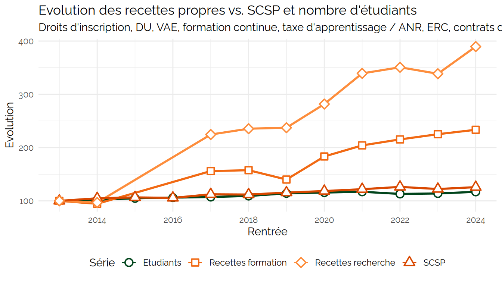

RecettesFormation ( 20 lignes)

| Rentrée | Groupe | kpi.FIN.S.recettesFormation | kpi.K.forPetu | kpi.FIN.S.recettesRecherche | kpi.K.recPect |
|---:|:---|---:|---:|---:|---:|
| 2006 | Ensemble | NA | NA | NA | NA |
| 2007 | Ensemble | NA | NA | NA | NA |
| 2008 | Ensemble | NA | NA | NA | NA |
| 2009 | Ensemble | 422349410 | 277.3363 | 191768186 | NA |
| 2010 | Ensemble | 525880929 | 346.4997 | 190838455 | 3395.038 |
| 2011 | Ensemble | 634633680 | 414.8572 | 209175045 | 3707.594 |
| 2012 | Ensemble | 675544503 | 431.7610 | 284090574 | 4584.028 |
| 2013 | Ensemble | 601104364 | 374.9392 | 362437854 | 5829.412 |
| 2014 | Ensemble | 568254152 | 347.2396 | 350914574 | 5685.774 |
| 2015 | Ensemble | NA | NA | NA | NA |
| 2016 | Ensemble | NA | NA | NA | NA |
| 2017 | Ensemble | 937437623 | 544.8920 | 813822708 | 14241.862 |
| 2018 | Ensemble | 947226972 | 541.0620 | 853558932 | 14039.953 |
| 2019 | Ensemble | 841910373 | 459.8628 | 860324823 | 14169.422 |
| 2020 | Ensemble | 1102088575 | 594.5393 | 1021069323 | 16879.411 |
| 2021 | Ensemble | 1227183821 | 653.7972 | 1229844673 | 20154.119 |
| 2022 | Ensemble | 1294733608 | 714.2239 | 1271338222 | 20746.042 |
| 2023 | Ensemble | 1353554399 | 741.1579 | 1227224191 | 20863.708 |
| 2024 | Ensemble | 1403459220 | 748.4278 | 1412054069 | NA |
| NA | Ensemble | NA | NA | NA | NA |

## plot_SCSPvsMS

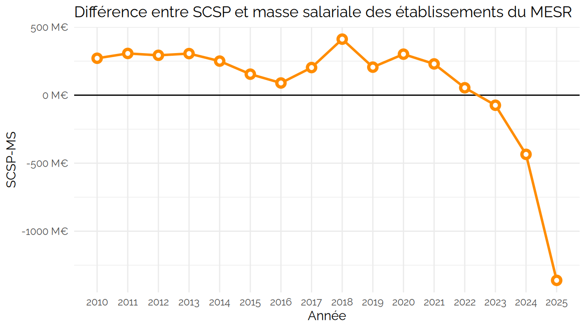

## plot_depensesreformes

    ## Warning: Removed 8 rows containing missing values or values outside the scale range
    ## (`geom_line()`).

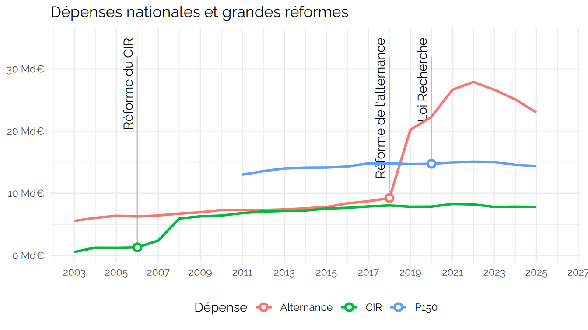

    ## Warning: Removed 11 rows containing missing values or values outside the scale range
    ## (`geom_line()`).

## plot_MassificationRecent

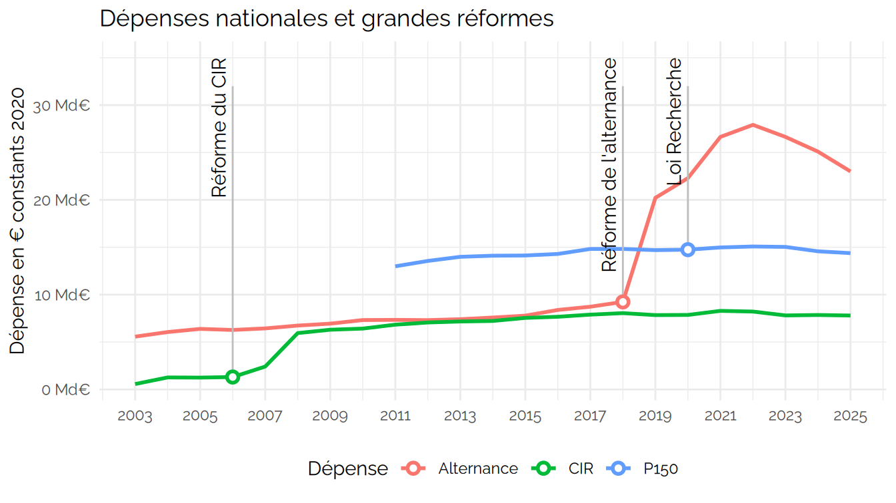

## plot_MassificationLong

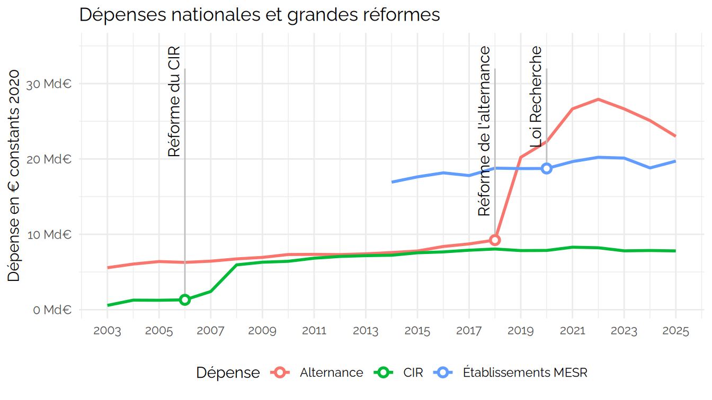

## plot_LvsM

## plot_postesMCF

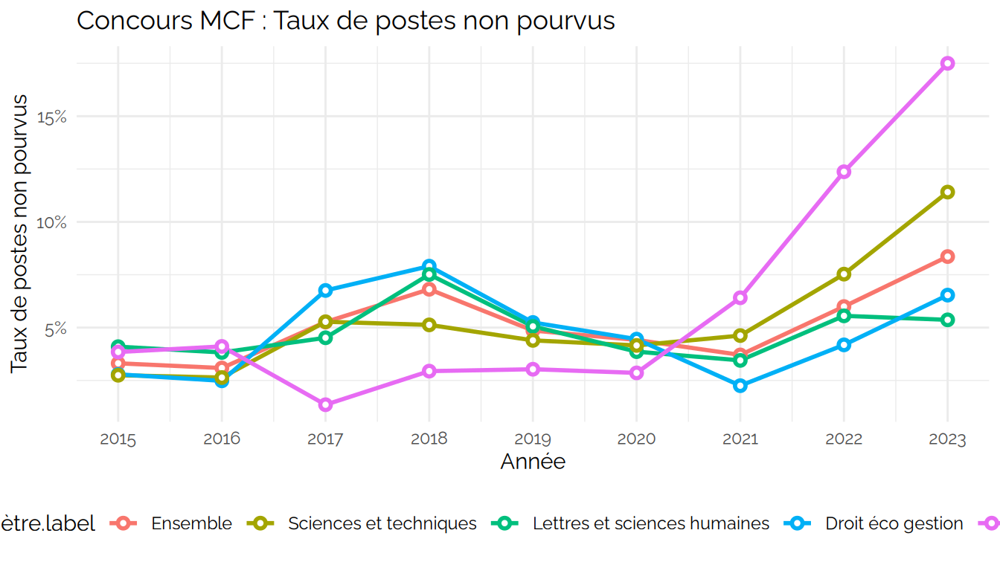

## plot_postesMCFvsCandidats

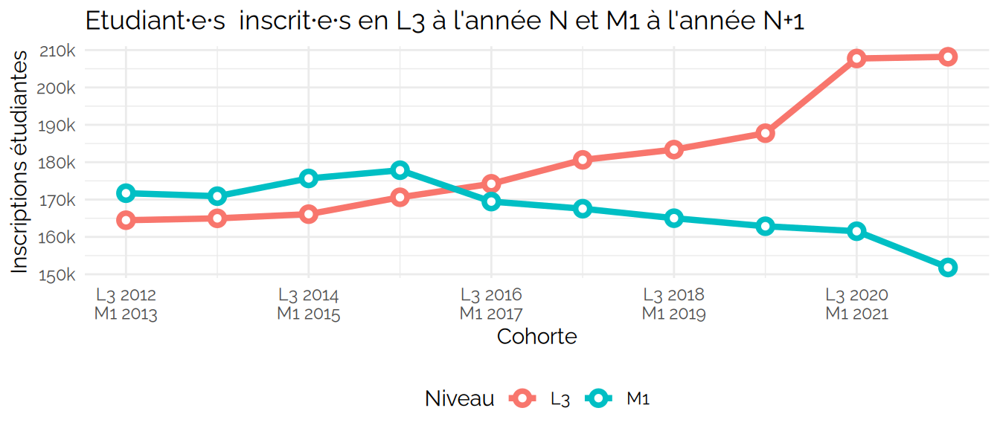

## plot_postesMCFnonPourvus

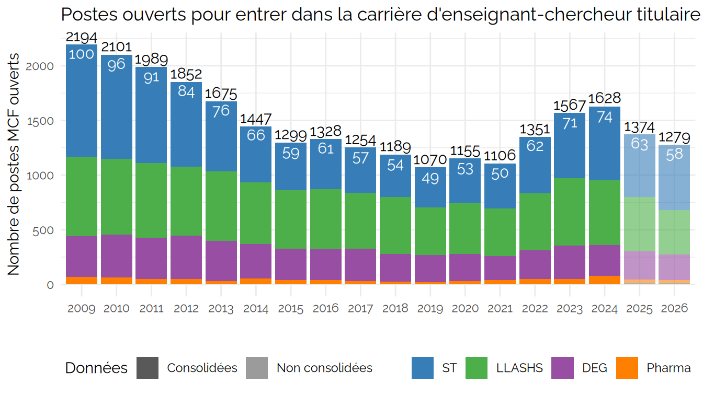

## plot_BMO

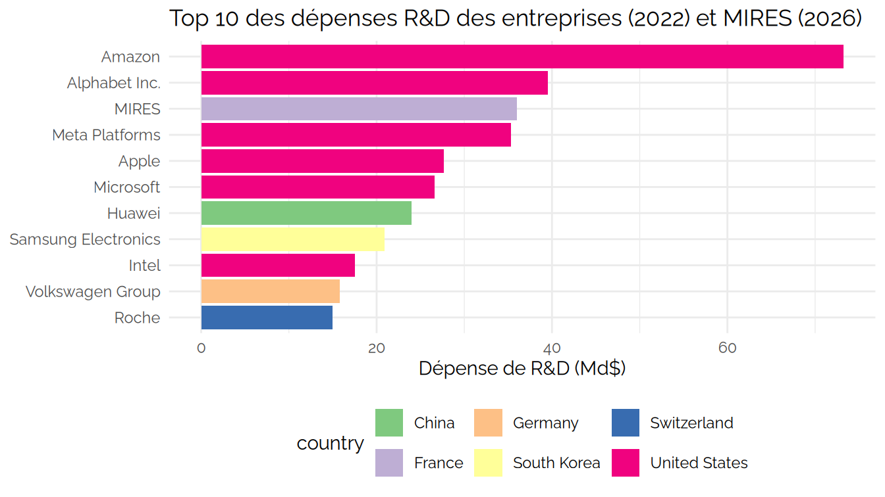

### Massification (1960-2000) : Investissements massifs dans l’éducation

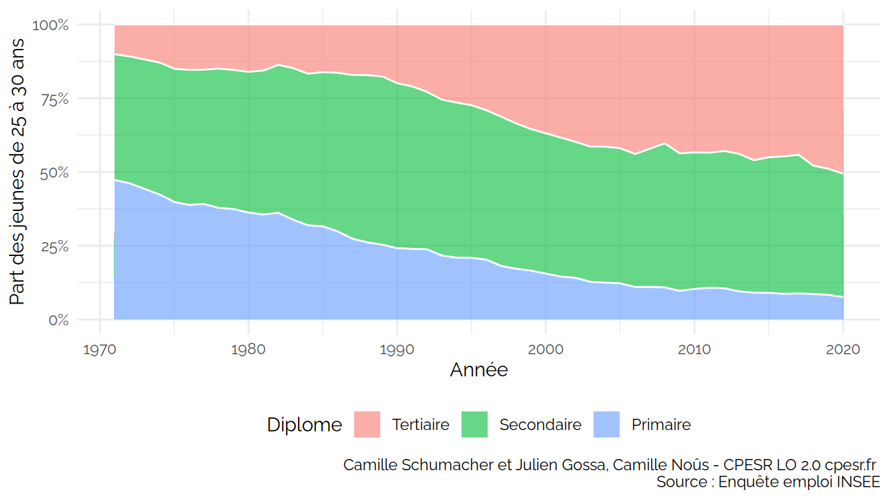

### Massification (1960-2000) : Investissements massifs dans l’éducation

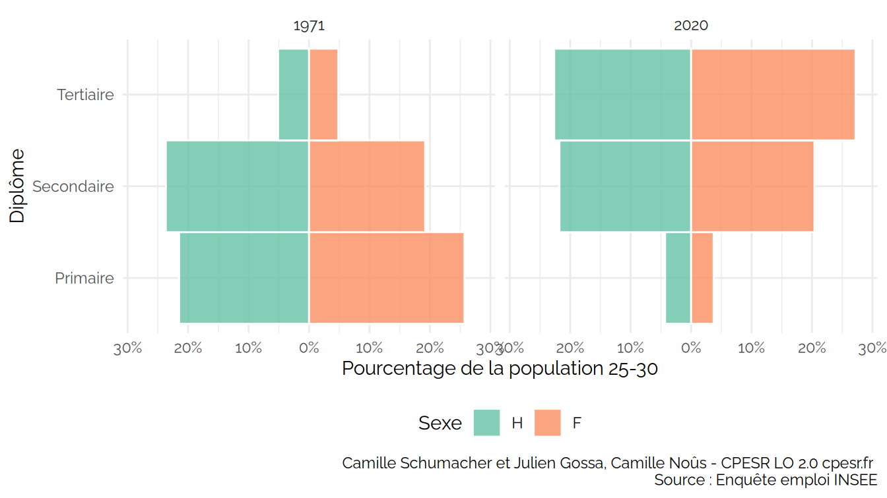

## Emplois

    ## Warning in geom_label(aes(label = lab), size = 5 * sizemult, fontface = "bold", : Ignoring unknown parameters: `direction`
    ## Ignoring unknown parameters: `direction`
    ## Ignoring unknown parameters: `direction`
    ## Ignoring unknown parameters: `direction`
    ## Ignoring unknown parameters: `direction`
    ## Ignoring unknown parameters: `direction`
    ## Ignoring unknown parameters: `direction`
    ## Ignoring unknown parameters: `direction`

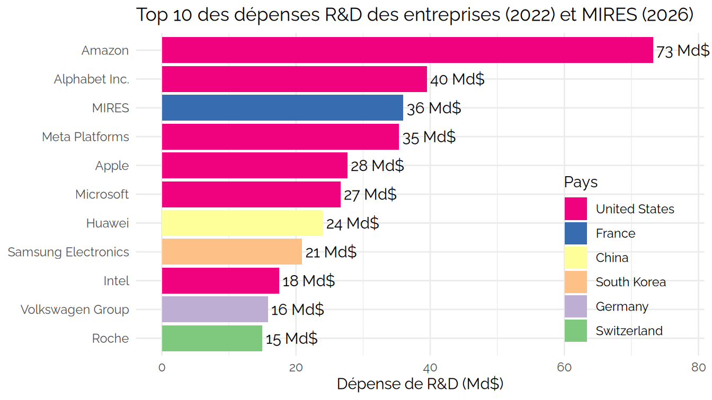

## R&D

Source :
<https://en.wikipedia.org/wiki/List_of_companies_by_research_and_development_spending>

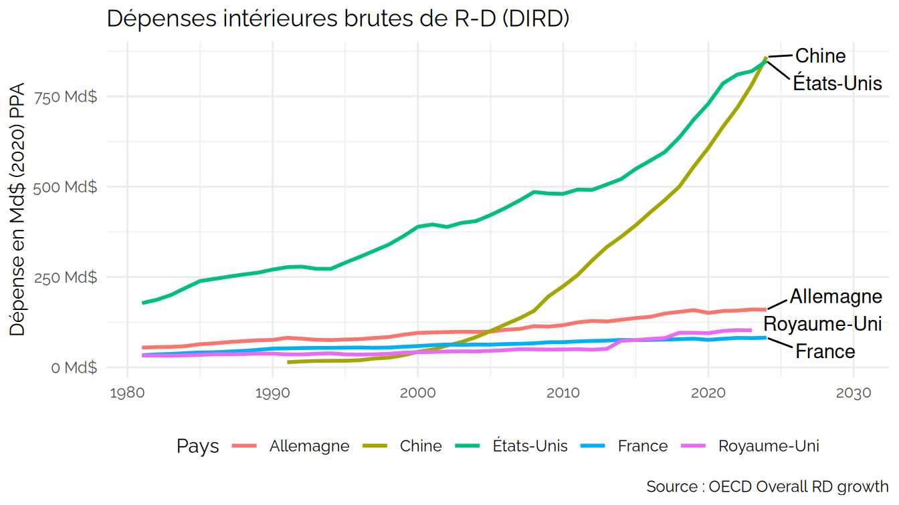

## Budget RD

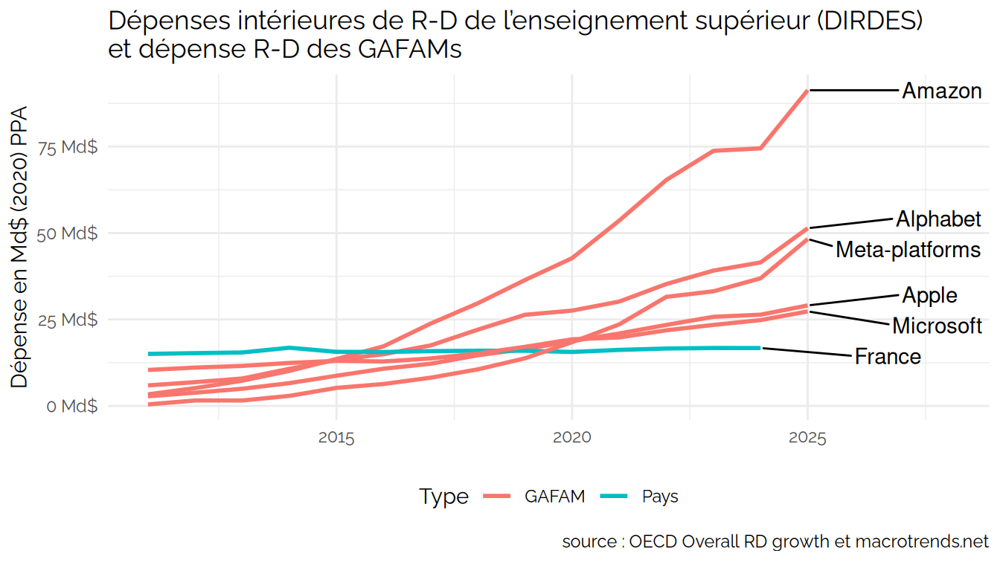

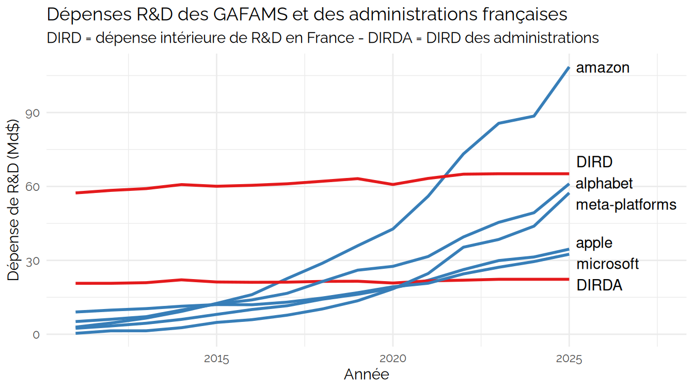

## Save
