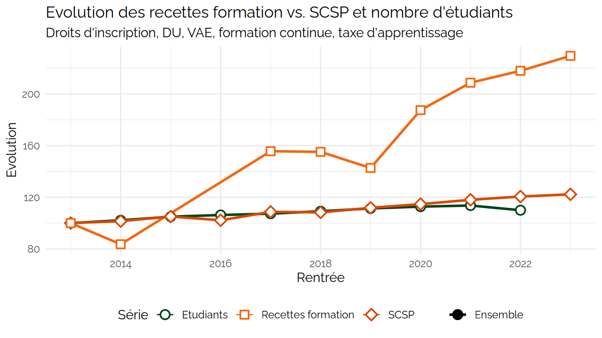
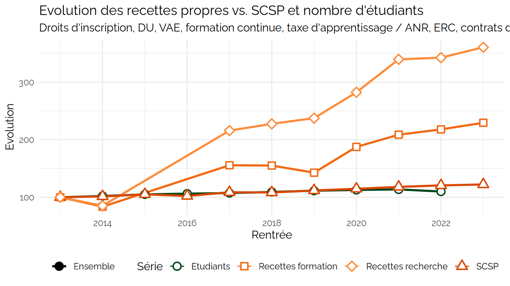
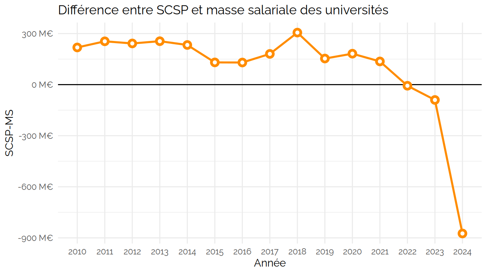
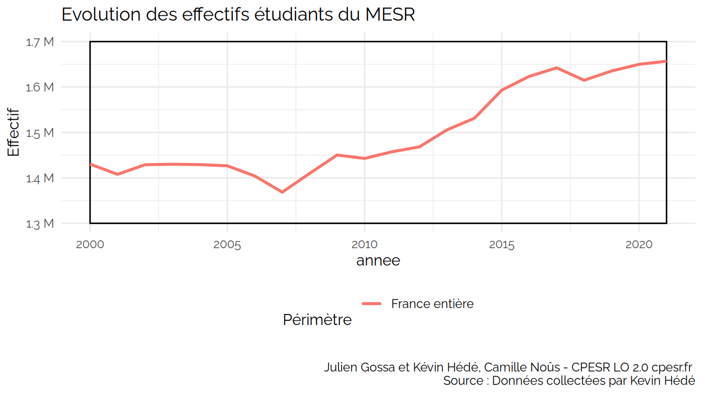
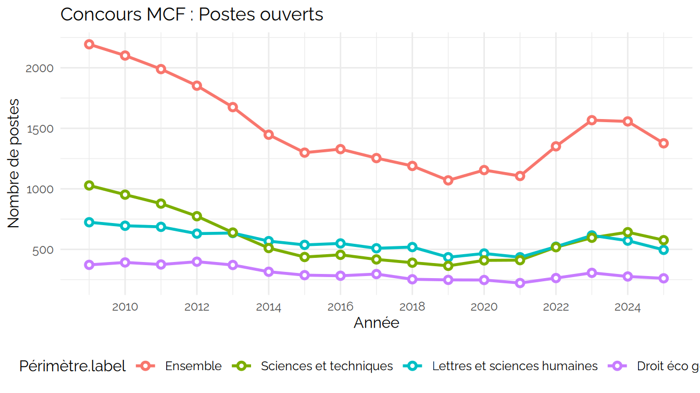

CPESR
================
CPESR
2026-01-22

## plot_SCSPvsEtu

    ## Warning: Using `size` aesthetic for lines was deprecated in ggplot2 3.4.0.
    ## ℹ Please use `linewidth` instead.
    ## ℹ The deprecated feature was likely used in the kpiESR package.
    ##   Please report the issue to the authors.
    ## This warning is displayed once every 8 hours.
    ## Call `lifecycle::last_lifecycle_warnings()` to see where this warning was
    ## generated.

## plot_RecettesFormation

RecettesFormation ( 20 lignes)

| Rentrée | Groupe   | kpi.FIN.S.recettesFormation | kpi.K.forPetu |
|--------:|:---------|----------------------------:|--------------:|
|    2006 | Ensemble |                          NA |            NA |
|    2007 | Ensemble |                          NA |            NA |
|    2008 | Ensemble |                          NA |            NA |
|    2009 | Ensemble |                   424744458 |      278.9091 |
|    2010 | Ensemble |                   528719945 |      348.3704 |
|    2011 | Ensemble |                   637818439 |      416.9391 |
|    2012 | Ensemble |                   667052017 |      431.6511 |
|    2013 | Ensemble |                   606558942 |      382.8535 |
|    2014 | Ensemble |                   558007131 |      345.1171 |
|    2015 | Ensemble |                          NA |            NA |
|    2016 | Ensemble |                          NA |            NA |
|    2017 | Ensemble |                   925695623 |      544.1546 |
|    2018 | Ensemble |                   935526451 |      540.3460 |
|    2019 | Ensemble |                   829077063 |      457.6910 |
|    2020 | Ensemble |                  1089319927 |      593.9705 |
|    2021 | Ensemble |                  1212679498 |      652.2788 |
|    2022 | Ensemble |                  1294733608 |      714.2239 |
|    2023 | Ensemble |                  1237902370 |      677.8310 |
|    2024 | Ensemble |                  1302241656 |      694.4511 |
|      NA | Ensemble |                          NA |            NA |

## plot_RessourcesPropres

RecettesFormation ( 20 lignes)

| Rentrée | Groupe | kpi.FIN.S.recettesFormation | kpi.K.forPetu | kpi.FIN.S.recettesRecherche | kpi.K.recPect |
|---:|:---|---:|---:|---:|---:|
| 2006 | Ensemble | NA | NA | NA | NA |
| 2007 | Ensemble | NA | NA | NA | NA |
| 2008 | Ensemble | NA | NA | NA | NA |
| 2009 | Ensemble | 424744458 | 278.9091 | 191880286 | NA |
| 2010 | Ensemble | 528719945 | 348.3704 | 191228399 | 3401.975 |
| 2011 | Ensemble | 637818439 | 416.9391 | 209353252 | 3710.753 |
| 2012 | Ensemble | 667052017 | 431.6511 | 283306955 | 4571.384 |
| 2013 | Ensemble | 606558942 | 382.8535 | 369365453 | 5940.835 |
| 2014 | Ensemble | 558007131 | 345.1171 | 349290283 | 5659.456 |
| 2015 | Ensemble | NA | NA | NA | NA |
| 2016 | Ensemble | NA | NA | NA | NA |
| 2017 | Ensemble | 925695623 | 544.1546 | 812503084 | 14218.768 |
| 2018 | Ensemble | 935526451 | 540.3460 | 850948467 | 13997.014 |
| 2019 | Ensemble | 829077063 | 457.6910 | 857827343 | 14128.289 |
| 2020 | Ensemble | 1089319927 | 593.9705 | 1020214117 | 16865.273 |
| 2021 | Ensemble | 1212679498 | 652.2788 | 1227104285 | 20109.211 |
| 2022 | Ensemble | 1294733608 | 714.2239 | 1271338222 | 20746.042 |
| 2023 | Ensemble | 1237902370 | 677.8310 | 1164642146 | 19799.768 |
| 2024 | Ensemble | 1302241656 | 694.4511 | 1359052878 | NA |
| NA | Ensemble | NA | NA | NA | NA |

## plot_SCSPvsMS

## plot_MassificationRecent

## plot_MassificationLong

## plot_LvsM

## plot_postesMCF

## plot_postesMCFvsCandidats

## plot_postesMCFnonPourvus

## plot_BMO

### Massification (1960-2000) : Investissements massifs dans l’éducation

### Massification (1960-2000) : Investissements massifs dans l’éducation

## Save
