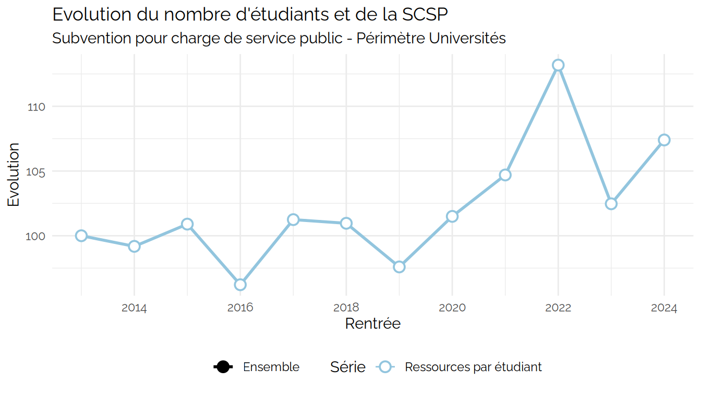
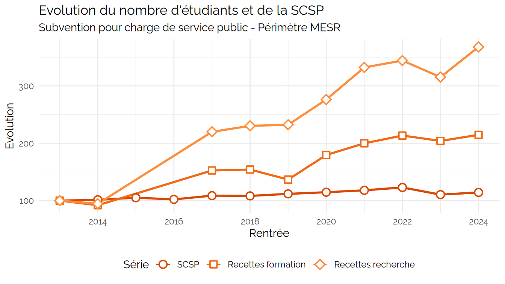

Démonstration PMP
================
Julien Gossa
2026-01-15

    ## Warning: Using `size` aesthetic for lines was deprecated in ggplot2 3.4.0.
    ## ℹ Please use `linewidth` instead.
    ## ℹ The deprecated feature was likely used in the kpiESR package.
    ##   Please report the issue to the authors.
    ## This warning is displayed once every 8 hours.
    ## Call `lifecycle::last_lifecycle_warnings()` to see where this warning was
    ## generated.

    ## Scale for x is already present.
    ## Adding another scale for x, which will replace the existing scale.

    ## Warning: Removed 4 rows containing missing values or values outside the scale range
    ## (`geom_line()`).

    ## Warning: Removed 4 rows containing missing values or values outside the scale range
    ## (`geom_point()`).

    ## Joining with `by = join_by(Groupe, pid, Etablissement, Groupe.détaillé,
    ## Comparable)`

    ## Warning: Removed 16 rows containing missing values or values outside the scale range
    ## (`geom_text_repel()`).

    ## Warning: Removed 8 rows containing missing values or values outside the scale range
    ## (`geom_point()`).

    ## Warning: ggrepel: 27 unlabeled data points (too many overlaps). Consider
    ## increasing max.overlaps

    ## Joining with `by = join_by(Groupe, pid, Etablissement, Groupe.détaillé,
    ## Comparable)`

    ## Warning: Removed 1 row containing missing values or values outside the scale range
    ## (`geom_point()`).

    ## Warning: Removed 8 rows containing missing values or values outside the scale range
    ## (`geom_text_repel()`).

    ## Warning: ggrepel: 4 unlabeled data points (too many overlaps). Consider
    ## increasing max.overlaps

    ## Joining with `by = join_by(Groupe, pid, Etablissement, Groupe.détaillé,
    ## Comparable)`

    ## Warning: Removed 13 rows containing missing values or values outside the scale range
    ## (`geom_text_repel()`).

    ## Warning: Removed 9 rows containing missing values or values outside the scale range
    ## (`geom_point()`).

