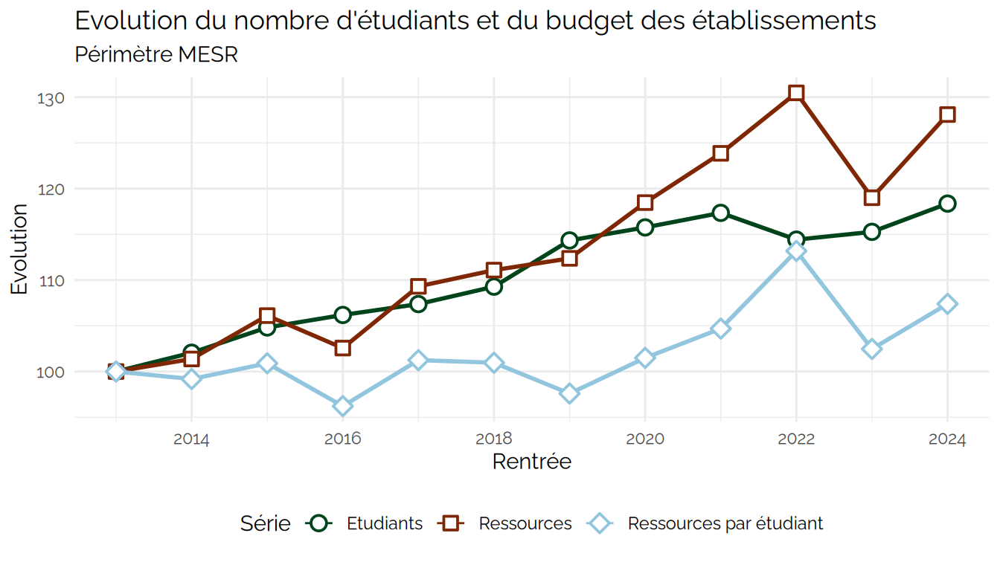
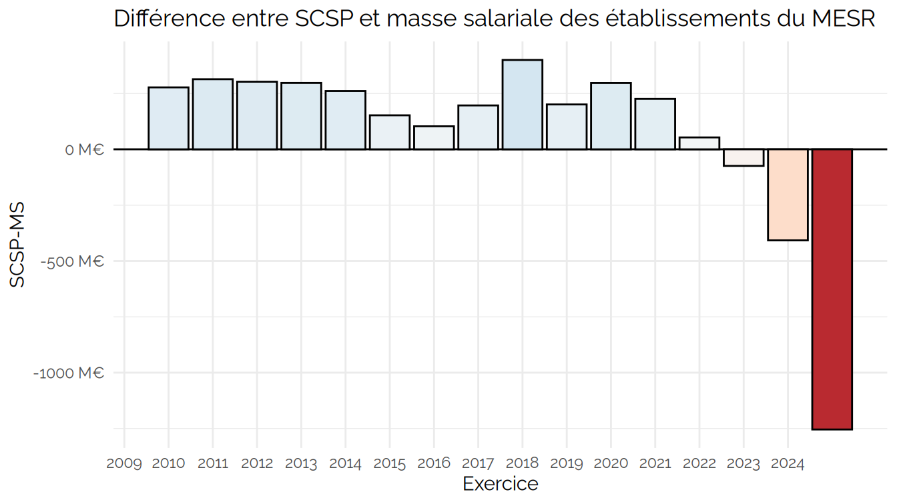
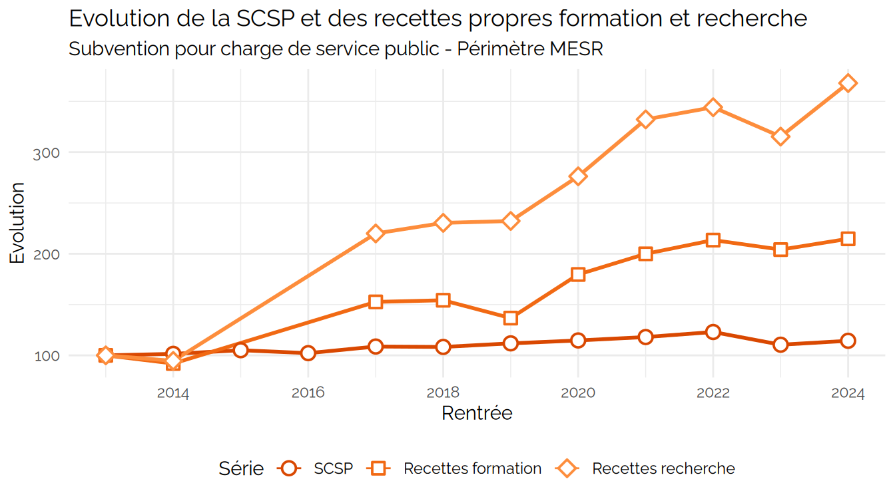
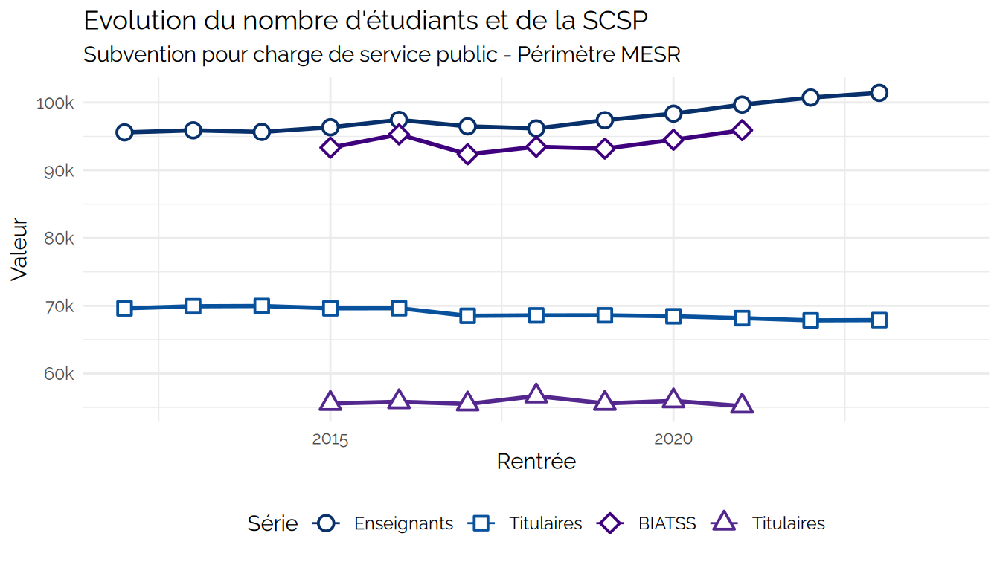
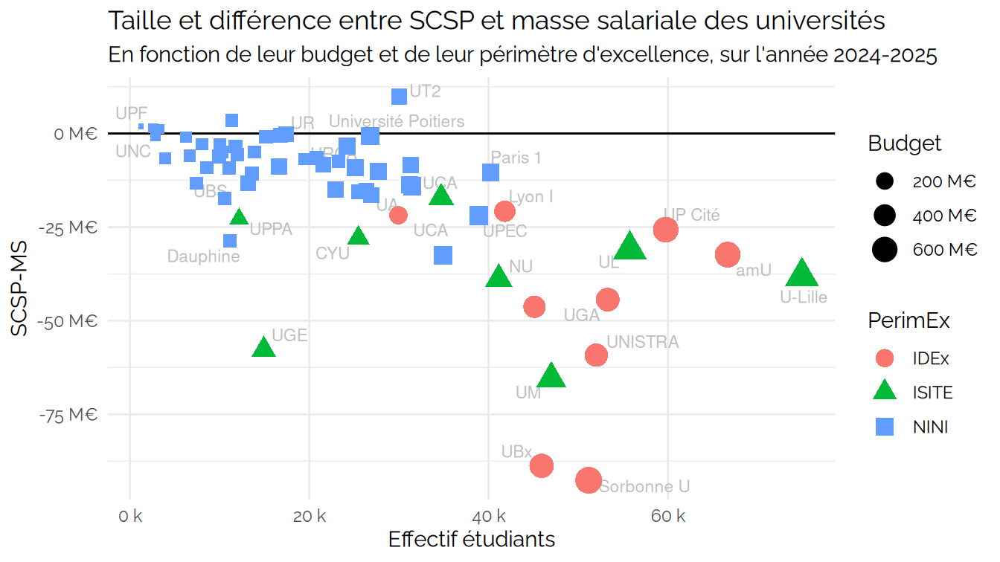
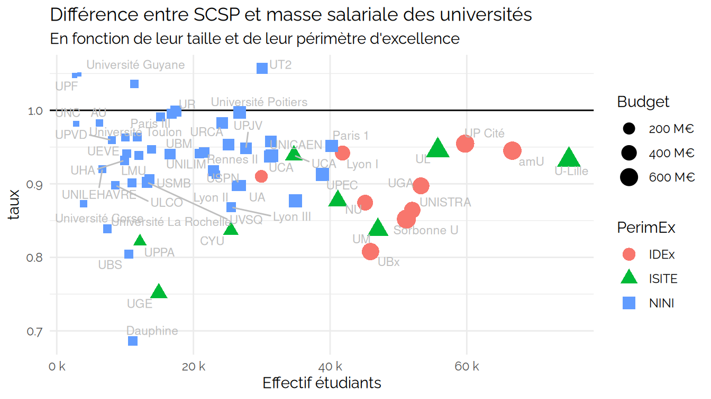
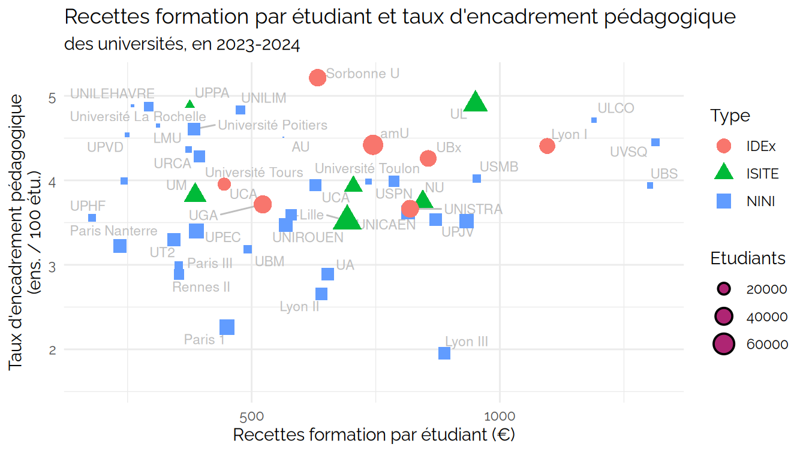

Démonstration PMP
================
Julien Gossa
2026-01-16

``` r
kpiesr_plot_line("Ensemble", c("kpi.ETU.P.effectif","kpi.FIN.P.ressources","kpi.K.resPetu"), val="evolution") +
  ggtitle("Evolution du nombre d'étudiants et du budget des établissements", subtitle="Périmètre MESR") +
  guides(linetype = "none", alpha = "none", size="none")
```



``` r
kpiESR::esr %>%
  filter(Groupe == "Ensemble") %>%
  select(Groupe,Rentrée,kpi.ETU.P.effectif,kpi.FIN.P.ressources,kpi.K.resPetu) %>%
  spoiler_table(trim = Inf)
```

<details>

<summary>

Voir les données ( 20 lignes)
</summary>

| Groupe   | Rentrée | kpi.ETU.P.effectif | kpi.FIN.P.ressources | kpi.K.resPetu |
|:---------|--------:|-------------------:|---------------------:|--------------:|
| Ensemble |    2006 |            1529623 |                   NA |            NA |
| Ensemble |    2007 |            1493175 |                   NA |            NA |
| Ensemble |    2008 |            1478905 |                   NA |            NA |
| Ensemble |    2009 |            1522878 |           7776497414 |      5363.035 |
| Ensemble |    2010 |            1517695 |           9627196714 |      6661.175 |
| Ensemble |    2011 |            1529764 |          12040180034 |      8257.382 |
| Ensemble |    2012 |            1545350 |          12003657040 |      8137.190 |
| Ensemble |    2013 |            1584311 |          14410079364 |      9513.437 |
| Ensemble |    2014 |            1616863 |          14607836728 |      9435.338 |
| Ensemble |    2015 |            1660689 |          15291056234 |      9598.863 |
| Ensemble |    2016 |            1682300 |          14779878750 |      9153.470 |
| Ensemble |    2017 |            1701163 |          15751952410 |      9631.895 |
| Ensemble |    2018 |            1731347 |          16007825595 |      9604.987 |
| Ensemble |    2019 |            1811434 |          16192943523 |      9284.327 |
| Ensemble |    2020 |            1833963 |          17071925117 |      9655.673 |
| Ensemble |    2021 |            1859143 |          17847631972 |      9959.983 |
| Ensemble |    2022 |            1812784 |          18800680913 |     10767.445 |
| Ensemble |    2023 |            1826270 |          17147802463 |      9748.138 |
| Ensemble |    2024 |            1875210 |          18458815209 |     10217.281 |
| Ensemble |      NA |                 NA |                   NA |            NA |

</details>

``` r
kpiESR::esr %>%
  filter(pid=="Ensemble", Rentrée > 2008) %>%
  #filter(pid=="Ensemble", Rentrée > 2008) %>%
  mutate(diff = kpi.FIN.S.SCSP-kpi.FIN.S.masseSalariale) %>% 
  mutate(Exercice = Rentrée + 1) %>%
  ggplot(aes(x=Exercice,y=diff, fill=diff)) +
  geom_hline(yintercept = 0) +
  geom_col(color="black") +
  scale_x_continuous(breaks = seq(2010,2025)) +
  scale_y_continuous(labels = ~ paste(.x/1e6,"M€"), name = "SCSP-MS") +
  scale_fill_distiller(palette="RdBu", direction = 0, limits = c(-1.3e9,1.3e9)) +
  ggtitle("Différence entre SCSP et masse salariale des établissements du MESR") +
  theme(legend.position = "None", panel.grid.minor.x = element_blank())
```



``` r
kpiESR::esr %>%
  filter(pid=="Ensemble", Rentrée > 2008) %>%
  mutate(Exercice = Rentrée + 1) %>%
  select(Exercice, kpi.FIN.S.SCSP, kpi.FIN.S.masseSalariale) %>%
  mutate(diff = kpi.FIN.S.SCSP-kpi.FIN.S.masseSalariale) %>% 
  spoiler_table(trim = Inf)
```

<details>

<summary>

Voir les données ( 16 lignes)
</summary>

| Exercice | kpi.FIN.S.SCSP | kpi.FIN.S.masseSalariale |        diff |
|---------:|---------------:|-------------------------:|------------:|
|     2010 |     5871026841 |               5593631473 |   277395369 |
|     2011 |     7742360328 |               7428452179 |   313908149 |
|     2012 |     9702971521 |               9400228002 |   302743519 |
|     2013 |     9803321536 |               9505940729 |   297380808 |
|     2014 |    11575908623 |              11314788154 |   261120469 |
|     2015 |    11748000800 |              11595678507 |   152322293 |
|     2016 |    12163040998 |              12059890872 |   103150126 |
|     2017 |    11828924354 |              11632354401 |   196569953 |
|     2018 |    12582413749 |              12182245411 |   400168339 |
|     2019 |    12535720776 |              12334753530 |   200967246 |
|     2020 |    12944160082 |              12646990206 |   297169876 |
|     2021 |    13275114697 |              13049162840 |   225951857 |
|     2022 |    13664169867 |              13610855650 |    53314217 |
|     2023 |    14237173831 |              14311329773 |   -74155942 |
|     2024 |    12788776042 |              13196411788 |  -407635746 |
|     2025 |    13236050100 |              14490528793 | -1254478693 |

</details>

``` r
kpiesr_plot_line("Ensemble", c("kpi.FIN.S.SCSP","kpi.FIN.S.recettesFormation","kpi.FIN.S.recettesRecherche"), val="evolution") +
  ggtitle("Evolution de la SCSP et des recettes propres formation et recherche", subtitle="Subvention pour charge de service public - Périmètre MESR") +
  guides(linetype = "none", alpha = "none", size="none")
```



``` r
kpiESR::esr %>%
  filter(Groupe == "Ensemble") %>%
  select(Groupe,Rentrée,kpi.FIN.S.SCSP,kpi.FIN.S.recettesRecherche,kpi.FIN.S.recettesFormation, kpi.K.forPetu) %>%
  spoiler_table(trim = Inf)
```

<details>

<summary>

Voir les données ( 20 lignes)
</summary>

| Groupe | Rentrée | kpi.FIN.S.SCSP | kpi.FIN.S.recettesRecherche | kpi.FIN.S.recettesFormation | kpi.K.forPetu |
|:---|---:|---:|---:|---:|---:|
| Ensemble | 2006 | NA | NA | NA | NA |
| Ensemble | 2007 | NA | NA | NA | NA |
| Ensemble | 2008 | NA | NA | NA | NA |
| Ensemble | 2009 | 5871026841 | 191880286 | 424744458 | 278.9091 |
| Ensemble | 2010 | 7742360328 | 191228399 | 528719945 | 348.3704 |
| Ensemble | 2011 | 9702971521 | 209353252 | 637818439 | 416.9391 |
| Ensemble | 2012 | 9803321536 | 283306955 | 667052017 | 431.6511 |
| Ensemble | 2013 | 11575908623 | 369365453 | 606558942 | 382.8535 |
| Ensemble | 2014 | 11748000800 | 349290283 | 558007131 | 345.1171 |
| Ensemble | 2015 | 12163040998 | NA | NA | NA |
| Ensemble | 2016 | 11828924354 | NA | NA | NA |
| Ensemble | 2017 | 12582413749 | 812503084 | 925695623 | 544.1546 |
| Ensemble | 2018 | 12535720776 | 850948467 | 935526451 | 540.3460 |
| Ensemble | 2019 | 12944160082 | 857827343 | 829077063 | 457.6910 |
| Ensemble | 2020 | 13275114697 | 1020214117 | 1089319927 | 593.9705 |
| Ensemble | 2021 | 13664169867 | 1227104285 | 1212679498 | 652.2788 |
| Ensemble | 2022 | 14237173831 | 1271338222 | 1294733608 | 714.2239 |
| Ensemble | 2023 | 12788776042 | 1164642146 | 1237902370 | 677.8310 |
| Ensemble | 2024 | 13236050100 | 1359052878 | 1302241656 | 694.4511 |
| Ensemble | NA | NA | NA | NA | NA |

</details>

``` r
kpiesr_plot_line("Ensemble", c("kpi.ENS.P.effectif","kpi.ENS.S.titulaires", "kpi.BIA.P.effectif","kpi.BIA.S.titulaires"), val="valeur") +
  ggtitle("Evolution du nombre d'étudiants et de la SCSP", subtitle="Subvention pour charge de service public - Périmètre MESR") +
  guides(linetype = "none", alpha = "none", size="none") +
  xlim(2012,2024)
```

    ## Scale for x is already present.
    ## Adding another scale for x, which will replace the existing scale.



``` r
kpiesr_plot_line("Ensemble", c("kpi.ENS.P.effectif","kpi.ENS.S.titulaires", "kpi.BIA.P.effectif","kpi.BIA.S.titulaires"), val="evolution") +
  ggtitle("Evolution du nombre d'étudiants et de la SCSP", subtitle="Subvention pour charge de service public - Périmètre MESR") +
  guides(linetype = "none", alpha = "none", size="none") 
```


``` r
esr.pnl %>% 
  filter(pid == "Ensemble") %>%
  filter(kpi %in% c("kpi.ENS.P.effectif","kpi.ENS.S.titulaires", "kpi.ENS.S.contractuels", "kpi.BIA.P.effectif","kpi.BIA.S.titulaires")) %>%
  select(kpi, Rentrée, valeur, evolution) %>%
  filter(!is.na(valeur)) %>%
  arrange(kpi, Rentrée) %>%
  spoiler_table(trim=Inf)
```

<details>

<summary>

Voir les données ( 54 lignes)
</summary>

| kpi                    | Rentrée | valeur | evolution |
|:-----------------------|--------:|-------:|----------:|
| kpi.BIA.P.effectif     |    2015 |  93330 | 100.00000 |
| kpi.BIA.P.effectif     |    2016 |  95283 | 102.09257 |
| kpi.BIA.P.effectif     |    2017 |  92357 |  98.95746 |
| kpi.BIA.P.effectif     |    2018 |  93460 | 100.13929 |
| kpi.BIA.P.effectif     |    2019 |  93188 |  99.84785 |
| kpi.BIA.P.effectif     |    2020 |  94492 | 101.24504 |
| kpi.BIA.P.effectif     |    2021 |  95907 | 102.76117 |
| kpi.BIA.S.titulaires   |    2015 |  55586 | 100.00000 |
| kpi.BIA.S.titulaires   |    2016 |  55838 | 100.45335 |
| kpi.BIA.S.titulaires   |    2017 |  55511 |  99.86507 |
| kpi.BIA.S.titulaires   |    2018 |  56682 | 101.97172 |
| kpi.BIA.S.titulaires   |    2019 |  55597 | 100.01979 |
| kpi.BIA.S.titulaires   |    2020 |  55964 | 100.68003 |
| kpi.BIA.S.titulaires   |    2021 |  55192 |  99.29119 |
| kpi.ENS.P.effectif     |    2010 |  69086 |        NA |
| kpi.ENS.P.effectif     |    2011 |  69541 |        NA |
| kpi.ENS.P.effectif     |    2012 |  95587 |        NA |
| kpi.ENS.P.effectif     |    2013 |  95892 | 100.00000 |
| kpi.ENS.P.effectif     |    2014 |  95654 |  99.75180 |
| kpi.ENS.P.effectif     |    2015 |  96338 | 100.46511 |
| kpi.ENS.P.effectif     |    2016 |  97425 | 101.59867 |
| kpi.ENS.P.effectif     |    2017 |  96477 | 100.61006 |
| kpi.ENS.P.effectif     |    2018 |  96165 | 100.28470 |
| kpi.ENS.P.effectif     |    2019 |  97381 | 101.55279 |
| kpi.ENS.P.effectif     |    2020 |  98353 | 102.56643 |
| kpi.ENS.P.effectif     |    2021 |  99682 | 103.95236 |
| kpi.ENS.P.effectif     |    2022 | 100727 | 105.04213 |
| kpi.ENS.P.effectif     |    2023 | 101420 | 105.76482 |
| kpi.ENS.S.contractuels |    2012 |   5995 |        NA |
| kpi.ENS.S.contractuels |    2013 |   5893 | 100.00000 |
| kpi.ENS.S.contractuels |    2014 |   5567 |  94.46801 |
| kpi.ENS.S.contractuels |    2015 |   1813 |  30.76531 |
| kpi.ENS.S.contractuels |    2016 |   2176 |  36.92517 |
| kpi.ENS.S.contractuels |    2017 |   2455 |  41.65960 |
| kpi.ENS.S.contractuels |    2018 |   6586 | 111.75971 |
| kpi.ENS.S.contractuels |    2019 |   6548 | 111.11488 |
| kpi.ENS.S.contractuels |    2020 |   6712 | 113.89784 |
| kpi.ENS.S.contractuels |    2021 |   7405 | 125.65756 |
| kpi.ENS.S.contractuels |    2022 |   8010 | 135.92398 |
| kpi.ENS.S.contractuels |    2023 |   3629 |  61.58154 |
| kpi.ENS.S.titulaires   |    2010 |  69086 |        NA |
| kpi.ENS.S.titulaires   |    2011 |  69541 |        NA |
| kpi.ENS.S.titulaires   |    2012 |  69622 |        NA |
| kpi.ENS.S.titulaires   |    2013 |  69934 | 100.00000 |
| kpi.ENS.S.titulaires   |    2014 |  69973 | 100.05577 |
| kpi.ENS.S.titulaires   |    2015 |  69628 |  99.56244 |
| kpi.ENS.S.titulaires   |    2016 |  69643 |  99.58389 |
| kpi.ENS.S.titulaires   |    2017 |  68520 |  97.97809 |
| kpi.ENS.S.titulaires   |    2018 |  68585 |  98.07104 |
| kpi.ENS.S.titulaires   |    2019 |  68592 |  98.08105 |
| kpi.ENS.S.titulaires   |    2020 |  68452 |  97.88086 |
| kpi.ENS.S.titulaires   |    2021 |  68175 |  97.48477 |
| kpi.ENS.S.titulaires   |    2022 |  67845 |  97.01290 |
| kpi.ENS.S.titulaires   |    2023 |  67886 |  97.07152 |

</details>

``` r
kpiesr_plot_line("Ensemble", c("kpi.ENS.S.titulaires","kpi.ETU.P.effectif","kpi.K.ensPetu"), val="evolution") +
  ggtitle("Evolution du nombre d'étudiants et de la SCSP", subtitle="Subvention pour charge de service public - Périmètre MESR") +
  guides(linetype = "none", alpha = "none", size="none") 
```


``` r
kpiESR::esr %>%
  filter(Groupe=="Universités et assimilés", Rentrée == 2024) %>%
  left_join(kpiESR::esr.etab) %>%
  mutate(PerimEx = ifelse(PerimEx=="","NINI", PerimEx)) %>%
  mutate(diff = kpi.FIN.S.SCSP-kpi.FIN.S.masseSalariale) %>% 
  mutate(Exercice = Rentrée + 1) %>%
  ggplot(aes(x=kpi.ETU.P.effectif, y=diff, size=kpi.FIN.P.ressources, color=PerimEx, shape=PerimEx)) +
  geom_hline(yintercept = 0) +
  ggrepel::geom_text_repel(aes(label=Sigle), 
                           size=3, color="grey") +
  geom_point() +
  scale_x_continuous(labels = ~ paste(.x/1e3,"k"), name = "Effectif étudiants") +
  scale_y_continuous(labels = ~ paste(.x/1e6,"M€"), name = "SCSP-MS") +
  scale_size_continuous(labels = ~ paste(.x/1e6,"M€"), name = "Budget") +
  ggtitle("Taille et différence entre SCSP et masse salariale des universités", subtitle="En fonction de leur budget et de leur périmètre d'excellence, sur l'année 2024-2025") +
  theme(legend.position = "right", panel.grid.minor.x = element_blank()) +
  guides(color = guide_legend(override.aes = list(size = 4)))
```

    ## Joining with `by = join_by(Groupe, pid, Etablissement, Groupe.détaillé,
    ## Comparable)`



``` r
kpiESR::esr %>%
  filter(Groupe=="Universités et assimilés", Rentrée == 2024) %>%
  left_join(kpiESR::esr.etab) %>%
  mutate(PerimEx = ifelse(PerimEx=="","NINI", PerimEx)) %>%
  mutate(taux = kpi.FIN.S.SCSP/kpi.FIN.S.masseSalariale) %>% 
  filter(taux < 1.5, taux > 0.6) %>%
  mutate(Exercice = Rentrée + 1) %>%
  ggplot(aes(x=kpi.ETU.P.effectif, y=taux, size=kpi.FIN.P.ressources, color=PerimEx, shape=PerimEx)) +
  geom_hline(yintercept = 1) +
  geom_point() +
  ggrepel::geom_text_repel(aes(label=Sigle), 
                           size=3, color="grey") +
  scale_x_continuous(labels = ~ paste(.x/1e3,"k"), name = "Effectif étudiants") +
  #scale_y_continuous(labels = ~ paste(.x/1e6,"M€"), name = "SCSP-MS") +
  scale_size_continuous(labels = ~ paste(.x/1e6,"M€"), name = "Budget") +
  ggtitle("Différence entre SCSP et masse salariale des universités", subtitle="En fonction de leur taille et de leur périmètre d'excellence") +
  theme(legend.position = "right", panel.grid.minor.x = element_blank()) +
  guides(color = guide_legend(override.aes = list(size = 4)))
```

    ## Joining with `by = join_by(Groupe, pid, Etablissement, Groupe.détaillé,
    ## Comparable)`



``` r
kpiesr_plot_map(rentrée = 2023, id = "None", groupe = "Universités et assimilés", xvar = "kpi.K.forPetu", yvar = "kpi.K.ensPetu") +
  labs(
    title = "Recettes formation par étudiant et taux d'encadrement pédagogique",
    subtitle = "des universités, en 2023-2024",
    x = "Recettes formation par étudiant (€)",
    y = "Taux d'encadrement pédagogique\n(ens. / 100 étu.)"
  ) +
  theme(legend.position="right")
```

    ## Joining with `by = join_by(Groupe, pid, Etablissement, Groupe.détaillé,
    ## Comparable)`


