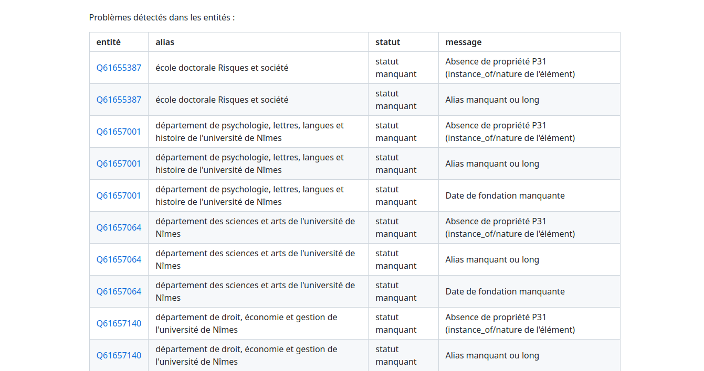

```{r setup, include=FALSE}
knitr::opts_chunk$set(echo = FALSE, warning = FALSE, message = FALSE)
options(dplyr.summarise.inform = FALSE)
knitr::opts_chunk$set(fig.asp = 7/16, fig.width = 12, fig.retina = 2, out.width = "100%")
knitr::opts_chunk$set(cache = TRUE)

library(tidyverse)
library(ggcpesrthemes)
library(wikidataESR)
library(kableExtra)
theme_set(theme_cpesr())
theme_cpesr_setup(authors = "Julien Gossa", source = "https://github.com/cpesr/RFC/")

wikidataESR::wdesr_load_cache()
```

## Les limites de #DataESR

- Portail de données administratives ouvertes très fourni
  - #DataESR https://data.enseignementsup-recherche.gouv.fr
  - kpiESR : https://github.com/cpesr/kpiESR
  
- Mais seulement des csv, et pas fait pour connaitre les établissements
- Limités pour trois usages en particulier 

### L'histoire des établissements
Complexe et travail d'historien

### Les relations entre établissements
Polymorphes et éphémères

### La composition interne des établissements
Granularité fine


## L'histoire des établissements : Université de Grenoble

```{r hist.uga}
wdesr_load_and_plot("Q945876",props = c('séparé_de', 'absorbé_par', 'successeur', 'prédécesseur'), depth=10,
               node_label = "alias_date", node_size = 35, label_wrap = 10, label_size = 4,
               edge_label = TRUE)
```
  

## L'histoire des établissements : Unistra

```{r hist.unistra}
wdesr_load_and_plot("Q20808141",props = c('séparé_de', 'absorbé_par', 'successeur'), depth=10,
               node_label = "alias_date", node_size = 35, label_wrap = 10, label_size=4,
               edge_label = TRUE)
```


## L'histoire des établissements : Université de Paris

```{r hist.paris}
wdesr_load_and_plot("Q209842",props = c('séparé_de', 'absorbé_par', 'successeur', 'prédécesseur'), depth=10,
               node_label = "alias_date", node_size = 15, label_wrap = 10, label_size = 2,
               edge_label = TRUE)
```


## Les relations entre établissements : Unistra (profondeur 1)

```{r rel.unistra.1}
wdesr_load_and_plot("Q157575",props = c('affilié_à','associé','associé_de','membre_de'), depth=1,
               node_label = "alias_date", node_size = c(10,30), label_wrap = 10, label_size=c(2,4),
               edge_label = TRUE)
```

## Les relations entre établissements : Unistra (profondeur 2)

```{r rel.unistra.2}
wdesr_load_and_plot("Q157575",props = c('affilié_à','associé','associé_de','membre_de'), depth=2,
               node_label = "alias_date", node_size = c(5,30), label_wrap = 10, label_size=c(0.5,4),
               edge_label = TRUE)
```


## La composition interne des établissements : Unistra

```{r comp.unistra}
wdesr_load_and_plot("Q157575", props = c('composante'), depth=10,
               node_label = "alias_date", node_size = c(15,30), label_wrap = 10, label_size=c(2,4),
               edge_label = TRUE)
```

## La composition interne des établissements : AMU

```{r comp.amu}
wdesr_load_and_plot("Q2302586", props = c('composante'), depth=10,
               node_label = "alias_date", node_size = c(15,30), label_wrap = 10, label_size=c(2,4),
               edge_label = TRUE)
```


## La composition interne des établissements : Nîmes

```{r comp.nimes}
wdesr_load_and_plot("Q2496121", props = c('composante'), depth=10,
               node_label = "alias_date", node_size = c(15,30), label_wrap = 10, label_size=c(3,4),
               edge_label = TRUE)
```

## WikidataESR : librairie R

\footnotesize

```{r comp.nimes.echo, echo=TRUE, out.width = "80%"}
wdesr_load_and_plot(wdid = "Q2496121", props = c('composante'), depth=10,
               node_label = "alias_date", node_size = c(15,30), label_wrap = 10, 
               label_size=c(3,4), edge_label = TRUE)
```


## WikidataESR : correspondances des propriétés

```{r wikidataesr.guider}
props <- read.table("proprietes.csv", sep=";", header=TRUE, quote="") %>%
  mutate(id = gsub("\\[(.*)\\].*","\\1",id)) %>%
  select(-qualificatif)
props %>% kable(booktabs = T) %>%
  kable_styling(latex_options = c("striped", "scale_down"), stripe_color = "lightgray") %>%
  column_spec(4, width = "40em")
```

## WikidataESR : rapport d'erreur

```{r erreur}

```


## WikidataESR : bot tweeter

```{r twitter, fig.asp=NULL, out.width="40%", fig.align='center'}

```


## WikidataESR : application web (shiny)

```{r shiny, fig.asp=NULL, out.width="100%", fig.align='center'}

```


## WikidataESR : conclusion

:::::: {.cols data-latex=""}

::: {.col data-latex="{0.55\textwidth}"}


- Projet fonctionnel 
  - Mais vieillissant
- Beaucoup de différences entre établissement
  - Déséquilibre UFR/UMR
- Peu (pas) d'appropriation par la communauté
  - Inversion de la relation de « service »

\ 

- Problème fondamental 
  - A quoi et qui ça sert ?

\ 

- Liens :
  - https://github.com/cpesr/wikidataESR/
  - https://data.cpesr.fr/wikidataesr/
  - https://twitter.com/CPESR_

:::

::: {.col data-latex="{0.001\textwidth}"}
\ 
:::

::: {.col data-latex="{0.44\textwidth}"}
```{r final, fig.asp=3/4}
wdesr_load_and_plot("Q209842",props = c('séparé_de', 'absorbé_par', 'successeur', 'prédécesseur'), depth=10,
               node_label = "alias_date", node_size = 15, label_wrap = 10, label_size = 2,
               edge_label = TRUE)
```

- Remerciements :
  - Bastien Tagliana et Pierre Zoschke
  - IEP Strasbourg, Labo SAGE

:::

::::::


```{r save}
wdesr_save_cache()
```